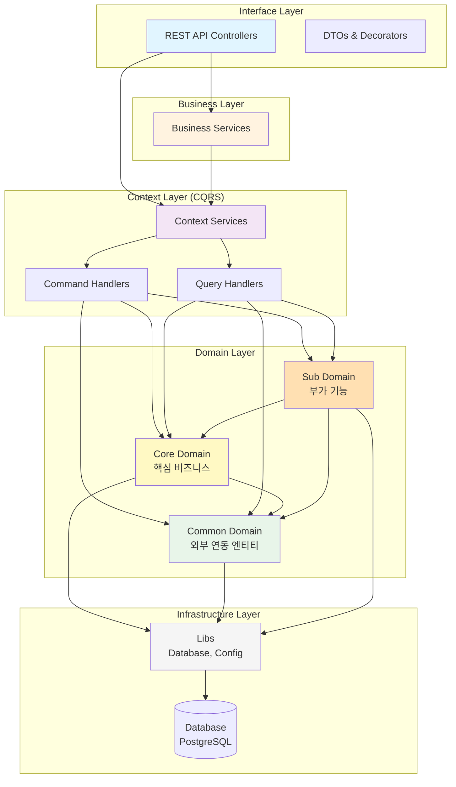

# 루미르 컨텐츠 관리 시스템 (Lumir Contents Management System)

> NestJS 기반의 사내 컨텐츠 관리 시스템

## 📋 프로젝트 소개

루미르 컨텐츠 관리 시스템은 사내 공지사항, 주주총회, 전자공시, 교육 등 회사에서 발생하는 이벤트들의 콘텐츠를 관리하는 시스템입니다. Domain-Driven Design과 CQRS 패턴을 적용하여 확장 가능하고 유지보수가 용이한 구조로 설계되었습니다.

### 🎯 핵심 기능

#### 투자자 관계 (IR)
- **주주총회 관리** (다국어 지원)
  - 주주총회 정보 및 의결 결과
  - 가결/부결 상태 관리
- **전자공시** (다국어 지원)
  - DART 시스템 연동
  - 자동 번역 동기화
- **IR 자료** (다국어 지원)
  - 투자자 정보 제공
  - 카테고리별 분류
- **브로슈어** (다국어 지원)
  - 회사 소개 및 제품 브로슈어
  - 번역 동기화 스케줄러

#### 내부 커뮤니케이션
- **공지사항**
  - 세밀한 권한 관리 (직원, 직급, 직책, 부서)
  - Lazy Creation 패턴 (읽음 표시)
  - 권한 스케줄러 (자동 무효화 감지)
  - 마감일 관리
- **설문조사**
  - 공지사항 통합 설문
  - 9가지 질문 타입 지원
  - 타입별 응답 테이블 분리 (성능 최적화)
  - 완료 추적 시스템
- **위키 시스템**
  - 계층형 파일/폴더 구조
  - Closure Table 패턴 (조회 성능 최적화)
  - 권한 관리 및 스케줄러
  - 경로 기반 탐색

#### 정보 관리
- **뉴스 관리** - 언론 보도 관리
- **루미르 스토리** - 회사 스토리 콘텐츠
- **비디오 갤러리** - 비디오 콘텐츠 관리
- **메인 팝업** (다국어 지원) - 메인 페이지 팝업
- **교육 관리** - 직원 교육 및 수강 관리

#### 시스템 기능
- **다국어 지원** - 한국어, 영어, 일본어, 중국어
- **통합 카테고리** - 모든 도메인 통합 관리
- **SSO 연동** - 외부 인증 시스템 통합
- **조직도 연동** - 부서/직급/직책 실시간 동기화
- **S3 파일 업로드** - AWS S3 기반 파일 관리
- **권한 스케줄러** - 자동 권한 무효화 감지 및 처리
- **번역 동기화** - 다국어 콘텐츠 자동 동기화
- **자동 백업** - GFS 백업 전략 (TypeORM 기반, gzip 압축 70-90% 절감)

## 🐳 Docker 실행

### 1. PostgreSQL만 실행 (개발 모드)

```bash
# PostgreSQL 컨테이너만 실행
docker-compose up postgres -d

# 로컬에서 NestJS 개발 서버 실행
npm run start:dev
```

### 2. 전체 스택 실행 (프로덕션 모드)

```bash
# Docker 이미지 빌드 및 전체 스택 실행
docker-compose up --build -d

# 로그 확인
docker-compose logs -f

# 서비스 중지
docker-compose down

# 볼륨까지 삭제
docker-compose down -v
```

### 3. Docker 이미지 빌드 및 푸시

```bash
# 이미지 빌드
docker build -t corejong/lumir-cms-backend:latest .

# Docker Hub에 푸시
docker push corejong/lumir-cms-backend:latest
```


## 🏗️ 아키텍처

### 레이어드 아키텍처



### 의존성 규칙

```
Interface → Business → Context → Domain → Infrastructure
    ↓          ↓          ↓          ↓
   DTO      조합 로직   CQRS      엔티티      Database
```

**도메인 간 의존성:**

- ✅ Core Domain → Common Domain
- ✅ Sub Domain → Core Domain, Common Domain
- ❌ Common Domain → Core/Sub Domain

## 📁 프로젝트 구조

```
lumir-cms-backend/
├── src/
│   ├── domain/                    # Domain Layer - 비즈니스 엔티티 및 도메인 로직
│   │   ├── common/                # 공통 도메인 (Language, Category, DismissedPermissionLog)
│   │   │   ├── category/          # 통합 카테고리 관리
│   │   │   ├── language/          # 다국어 지원 (ko, en, ja, zh)
│   │   │   ├── dismissed-permission-log/  # 권한 로그 무시 관리
│   │   │   └── sso/               # SSO 외부 연동
│   │   ├── core/                  # 핵심 비즈니스 도메인
│   │   │   ├── announcement/      # 공지사항 (Lazy Creation)
│   │   │   ├── brochure/          # 브로슈어 (다국어)
│   │   │   ├── electronic-disclosure/  # 전자공시 (다국어, DART 연동)
│   │   │   ├── ir/                # 투자자 정보 (다국어)
│   │   │   ├── news/              # 뉴스
│   │   │   └── shareholders-meeting/  # 주주총회 (다국어, 의결 결과)
│   │   └── sub/                   # 부가 기능 도메인
│   │       ├── education-management/  # 교육 관리
│   │       ├── lumir-story/       # 회사 스토리
│   │       ├── main-popup/        # 메인 팝업 (다국어)
│   │       ├── survey/            # 설문조사 (7개 응답 테이블)
│   │       ├── video-gallery/     # 비디오 갤러리
│   │       └── wiki-file-system/  # 위키 (Closure Table, 권한 관리)
│   │
│   ├── context/                   # Context Layer - CQRS 패턴
│   │   ├── announcement-context/  # 공지사항 Context (권한 스케줄러)
│   │   ├── auth-context/          # 인증/인가 Context (SSO, JWT)
│   │   ├── backup-context/        # 백업 Context (GFS 백업 전략)
│   │   ├── brochure-context/      # 브로슈어 Context (번역 동기화)
│   │   ├── company-context/       # 조직도 Context (외부 SSO 연동)
│   │   ├── electronic-disclosure-context/  # 전자공시 Context
│   │   ├── ir-context/            # IR Context
│   │   ├── language-context/      # 언어 관리 Context
│   │   ├── lumir-story-context/   # 루미르 스토리 Context
│   │   ├── main-popup-context/    # 메인 팝업 Context
│   │   ├── news-context/          # 뉴스 Context
│   │   ├── seed-data-context/     # 초기 데이터 Context
│   │   ├── shareholders-meeting-context/  # 주주총회 Context
│   │   ├── survey-context/        # 설문조사 Context
│   │   ├── video-gallery-context/ # 비디오 갤러리 Context
│   │   └── wiki-context/          # 위키 Context (권한 스케줄러)
│   │   └── */handlers/            # 각 Context별 핸들러
│   │       ├── commands/          # Command Handlers (상태 변경)
│   │       ├── queries/           # Query Handlers (조회)
│   │       └── jobs/              # Job Handlers (배치, 동기화)
│   │
│   ├── business/                  # Business Layer - 비즈니스 오케스트레이션
│   │   ├── announcement-business/
│   │   ├── brochure-business/
│   │   ├── electronic-disclosure-business/
│   │   ├── ir-business/
│   │   ├── language-business/
│   │   ├── lumir-story-business/
│   │   ├── main-popup-business/
│   │   ├── news-business/
│   │   ├── shareholders-meeting-business/
│   │   ├── survey-business/
│   │   ├── video-gallery-business/
│   │   └── wiki-business/
│   │
│   ├── interface/                 # Interface Layer - REST API
│   │   ├── admin/                 # 관리자 API
│   │   │   ├── announcement/      # 공지사항 API
│   │   │   ├── auth/              # 인증 API
│   │   │   ├── brochure/          # 브로슈어 API
│   │   │   ├── electronic-disclosure/  # 전자공시 API
│   │   │   ├── ir/                # IR API
│   │   │   ├── language/          # 언어 관리 API
│   │   │   ├── lumir-story/       # 루미르 스토리 API
│   │   │   ├── main-popup/        # 메인 팝업 API
│   │   │   ├── news/              # 뉴스 API
│   │   │   ├── permission-validation/  # 권한 검증 API
│   │   │   ├── backup/            # 백업 관리 API
│   │   │   ├── seed-data/         # 초기 데이터 API
│   │   │   ├── shareholders-meeting/   # 주주총회 API
│   │   │   ├── survey/            # 설문조사 API
│   │   │   ├── video-gallery/     # 비디오 갤러리 API
│   │   │   └── wiki/              # 위키 API
│   │   └── common/                # 공통 API
│   │       ├── company/           # 조직도 조회 API
│   │       ├── decorators/        # 커스텀 데코레이터
│   │       ├── dto/               # Data Transfer Objects
│   │       ├── filters/           # Exception Filters
│   │       ├── guards/            # Auth Guards
│   │       └── health/            # Health Check API
│   │
│   ├── libs/                      # Infrastructure Layer
│   │   ├── database/              # Database 설정
│   │   └── config/                # 환경 설정
│   │
│   ├── app.module.ts              # Root Module
│   └── main.ts                    # Application Entry Point
│
├── test/                          # 테스트 코드
│   ├── domain/                    # Domain Layer 테스트
│   ├── business/                  # Business Layer 테스트
│   ├── context/                   # Context Layer 테스트
│   └── interface/                 # E2E 테스트
│       └── admin/
│           ├── announcement/
│           ├── brochure/
│           ├── electronic-disclosure/
│           ├── ir/
│           ├── lumir-story/
│           ├── main-popup/
│           ├── news/
│           ├── shareholders-meeting/
│           ├── survey/
│           ├── video-gallery/
│           └── wiki/
│
├── docs/                          # 프로젝트 문서
│   ├── erd/                       # ERD 다이어그램
│   │   ├── er-diagram.md          # 전체 ERD
│   │   ├── er-diagram-entities.md # 엔티티 상세
│   │   ├── er-diagram-database.md # 데이터베이스 구현
│   │   └── scenario-validation/   # 시나리오별 ERD 검증
│   ├── state-flow/                # 데이터 상태 흐름 설계
│   │   ├── data-state-flow.md     # 아키텍처 설계 문서
│   │   └── context-flows/         # Context별 상세 흐름
│   ├── policies/                  # 정책 문서
│   ├── scheduler/                 # 스케줄러 가이드
│   ├── backup/                    # 백업 시스템 가이드
│   └── tests/                     # 테스트 보고서
│
├── migrations/                    # TypeORM 마이그레이션
├── docker-compose.yml             # Docker 설정
├── Dockerfile                     # Docker 이미지 빌드
└── .env                          # 환경 변수
```

### 레이어별 책임

#### Domain Layer (`src/domain/`)
- 비즈니스 엔티티 및 도메인 로직
- TypeORM 엔티티 정의
- Domain Service (Repository 패턴)
- **도메인 분류**: Common → Core → Sub (단방향 의존성)

#### Context Layer (`src/context/`)
- CQRS 패턴 구현 (Command/Query 분리)
- Command Handlers: 상태 변경 (Create, Update, Delete)
- Query Handlers: 조회 (Get, List, Search)
- Job Handlers: 배치 작업 및 스케줄러
- 트랜잭션 관리

#### Business Layer (`src/business/`)
- 여러 Context 오케스트레이션
- 외부 시스템 연동 (SSO, DART 등)
- 복잡한 비즈니스 로직 조합
- 보상 트랜잭션 처리

#### Interface Layer (`src/interface/`)
- REST API Controllers
- DTO 정의 및 검증 (class-validator)
- Swagger 문서화
- Auth Guards 및 Decorators
- Exception Filters

## 🚀 빠른 시작

### 1. 환경 변수 설정

`.env` 파일 생성:

```bash
cp .env.sample .env
```

`.env` 파일 내용 (주요 항목):
```env
# Node 환경
NODE_ENV=development
PORT=4000

# 데이터베이스 설정 (Docker PostgreSQL)
DATABASE_HOST=localhost
DATABASE_PORT=5434
DATABASE_USERNAME=lumir_admin
DATABASE_PASSWORD=lumir_password_2024
DATABASE_NAME=lumir_cms
DB_SYNCHRONIZE=true  # 개발 환경에서만 true
DB_LOGGING=true

# 기본 언어 설정
# 백엔드 어플리케이션의 기본 언어 코드 (ko, en, ja, zh 중 선택)
# 이 설정은 번역 동기화, 기본 표시 언어, 테스트 환경에서 사용됩니다
DEFAULT_LANGUAGE_CODE=en

# 백업 설정
BACKUP_ENABLED=true
BACKUP_PATH=./backups/database
BACKUP_COMPRESS=true          # gzip 압축 (70-90% 용량 절감)
BACKUP_MAX_RETRIES=3
BACKUP_RETRY_DELAY_MS=5000

# SSO 설정
SSO_BASE_URL=https://lsso.vercel.app
```

### 2. 데이터베이스 실행 (Docker)

```bash
# PostgreSQL 컨테이너만 시작 (개발 모드)
docker compose up postgres -d

# 로그 확인
docker compose logs -f postgres

# 전체 스택 실행 (NestJS 앱 포함)
docker compose up --build -d

# 서비스 중지
docker compose down

# 볼륨까지 삭제
docker compose down -v
```

> 📖 상세한 데이터베이스 관리는 [DATABASE.md](./docs/DATABASE.md) 참고

### 3. 의존성 설치 (이미 완료됨)

```bash
npm install
```

### 4. 개발 서버 실행

```bash
npm run start:dev
```

### 5. API 문서 확인

브라우저에서 접속:
```
http://localhost:4000/api/admin/api-docs
```

## 🐳 Docker 배포

### Docker 이미지 빌드

```bash
# 이미지 빌드
docker build -t corejong/lumir-cms-backend:latest .

# 이미지 테스트
docker run -p 4000:4000 \
  -e DATABASE_HOST=host.docker.internal \
  -e DATABASE_PORT=5434 \
  -e DATABASE_USERNAME=lumir_admin \
  -e DATABASE_PASSWORD=lumir_password_2024 \
  -e DATABASE_NAME=lumir_cms \
  corejong/lumir-cms-backend:latest

# Docker Hub에 푸시
docker push corejong/lumir-cms-backend:latest
```

### Docker Compose로 전체 스택 실행

```bash
# 빌드 및 실행
docker compose up --build -d

# 로그 확인
docker compose logs -f app

# 헬스체크 확인
docker compose ps
```

### 프로덕션 환경 변수

프로덕션 환경에서는 다음 환경 변수를 반드시 설정해야 합니다:

```bash
NODE_ENV=production
DB_SYNCHRONIZE=false  # 프로덕션에서는 반드시 false!
DB_LOGGING=false
JWT_SECRET=강력한-시크릿-키
SSO_BASE_URL=https://sso.lumir.space
```

## 🛠️ 기술 스택

### 핵심 프레임워크
- **[NestJS](https://nestjs.com/)** `v11.0.1` - Progressive Node.js Framework
- **[TypeScript](https://www.typescriptlang.org/)** `v5.7.3` - 타입 안정성
- **[TypeORM](https://typeorm.io/)** `v0.3.28` - ORM

### 데이터베이스
- **[PostgreSQL](https://www.postgresql.org/)** - 관계형 데이터베이스
- **Docker** - 컨테이너화된 개발 환경

### 아키텍처 패턴
- **[CQRS](https://docs.nestjs.com/recipes/cqrs)** `@nestjs/cqrs v11.0.3` - Command/Query 분리
- **Domain-Driven Design (DDD)** - 도메인 중심 설계
- **Layered Architecture** - 계층형 아키텍처
- **Repository Pattern** - 데이터 접근 추상화

### 인증 & 보안
- **[JWT](https://jwt.io/)** `@nestjs/jwt v11.0.2` - 토큰 기반 인증
- **SSO 연동** - 외부 인증 시스템 통합

### API 문서화
- **[Swagger](https://swagger.io/)** `@nestjs/swagger v11.2.3` - OpenAPI 자동 생성
- API 문서: `http://localhost:4000/api/admin/api-docs`

### 스케줄링
- **[@nestjs/schedule](https://docs.nestjs.com/techniques/task-scheduling)** `v6.1.0` - Cron 작업
  - 공지사항 권한 스케줄러
  - 위키 권한 스케줄러
  - 다국어 번역 동기화 스케줄러
  - 데이터베이스 자동 백업 (GFS 전략)

### 파일 업로드
- **[AWS S3](https://aws.amazon.com/s3/)** `@aws-sdk/client-s3 v3.965.0` - 파일 저장소
- **[Multer](https://github.com/expressjs/multer)** `v2.0.2` - 파일 업로드 미들웨어

### 외부 API 연동
- **[@nestjs/axios](https://docs.nestjs.com/techniques/http-module)** `v4.0.1` - HTTP 클라이언트
  - SSO 시스템 연동 (조직도, 직원 정보)
  - DART 전자공시 연동

### 테스트
- **[Jest](https://jestjs.io/)** `v30.0.0` - 테스트 프레임워크
- **[@testcontainers/postgresql](https://testcontainers.com/)** `v11.11.0` - E2E 테스트용 격리 DB
- **[SuperTest](https://github.com/ladjs/supertest)** `v7.0.0` - HTTP 테스트
- **[@faker-js/faker](https://fakerjs.dev/)** `v10.2.0` - 테스트 데이터 생성

### 코드 품질
- **[ESLint](https://eslint.org/)** `v9.18.0` - 코드 린팅
- **[Prettier](https://prettier.io/)** `v3.4.2` - 코드 포맷팅
- **[TypeScript ESLint](https://typescript-eslint.io/)** `v8.20.0` - TS 전용 린트

### 유틸리티
- **[class-validator](https://github.com/typestack/class-validator)** `v0.14.3` - DTO 검증
- **[class-transformer](https://github.com/typestack/class-transformer)** `v0.5.1` - 객체 변환
- **[uuid](https://github.com/uuidjs/uuid)** `v13.0.0` - UUID 생성

## 📚 문서

### 시작하기
- [빠른 시작 가이드](./docs/QUICKSTART.md) - 프로젝트 첫 실행
- [설치 가이드](./docs/INSTALLATION.md) - 상세 설치 과정
- [데이터베이스 관리 가이드](./docs/DATABASE.md) - DB 설정 및 마이그레이션
- [Docker 배포 가이드](./docs/DOCKER.md) - 컨테이너 배포

### 아키텍처
- **[데이터 상태 흐름 설계](./docs/state-flow/data-state-flow.md)** ⭐ - 핵심 아키텍처 문서
- **[Context별 상세 흐름](./docs/state-flow/context-flows/)** - 각 Context 상세 가이드
  - [Announcement Context](./docs/state-flow/context-flows/announcement-context-flow.md) - 공지사항 (권한, Lazy Creation)
  - [Wiki Context](./docs/state-flow/context-flows/wiki-context-flow.md) - 위키 (Closure Table, 권한)
  - [Survey Context](./docs/state-flow/context-flows/survey-context-flow.md) - 설문조사 (타입별 응답)
  - [Brochure Context](./docs/state-flow/context-flows/brochure-context-flow.md) - 다국어 번역 동기화
  - [Electronic Disclosure Context](./docs/state-flow/context-flows/electronic-disclosure-context-flow.md) - DART 연동
  - [Shareholders Meeting Context](./docs/state-flow/context-flows/shareholders-meeting-context-flow.md) - 주주총회
  - [Auth Context](./docs/state-flow/context-flows/auth-context-flow.md) - SSO, JWT
  - [기타 Context](./docs/state-flow/context-flows/other-contexts-flow.md) - 팝업, 비디오 등

### Domain Layer
- **[Domain Layer README](./src/domain/README.md)** ⭐ - 도메인 레이어 종합 가이드
- [Common Domain](./src/domain/common/README.md) - 공통 도메인 (Language, Category)
- [Core Domain](./src/domain/core/README.md) - 핵심 비즈니스 도메인
- [Sub Domain](./src/domain/sub/README.md) - 부가 기능 도메인

### 데이터베이스
- **[ER 다이어그램](./docs/erd/er-diagram.md)** - 전체 ERD
- [엔티티 상세](./docs/erd/er-diagram-entities.md) - 각 엔티티별 상세 정보
- [데이터베이스 구현](./docs/erd/er-diagram-database.md) - JSONB, 인덱스, 제약조건
- [시나리오별 ERD 검증](./docs/erd/scenario-validation/) - 도메인별 ERD 검증 문서

### 정책 및 전략
- [권한 로그 모달 제어 정책](./docs/policies/permission-log-modal-control-policy.md)
- [Public 상태 관리 정책](./docs/policies/public-state-management-policy.md)
- [권한 스케줄러 가이드](./docs/scheduler/permission-scheduler-guide.md)
- **[데이터베이스 백업 가이드](./docs/backup/database-backup-guide.md)** ⭐ - GFS 백업 전략 및 압축
- **[백업 압축 가이드](./docs/backup/compression-guide.md)** - 용량 최적화 전략
- [SQL 복구 가이드](./docs/backup/sql-restore-guide.md) - 백업 복구 방법
- [다국어 전략](./.cursor/multilingual-strategy.mdc)
- [위키 권한 전략](./.cursor/wiki-permission-strategy.mdc)

### 코딩 규칙
- [Interface Layer 코딩 규칙](./src/interface/AGENTS.md)
- [프로젝트 상세 요약](./docs/PROJECT_SUMMARY.md)

## 🛠️ 개발 스크립트

### 애플리케이션 실행

```bash
# 개발 서버 실행 (Hot Reload)
npm run start:dev

# 프로덕션 빌드
npm run build

# 프로덕션 실행
npm run start:prod
```

### 데이터베이스 관리

```bash
# Docker PostgreSQL 시작
docker compose up -d

# 마이그레이션 생성 (dev/prod 환경)
npm run migration:generate -- migrations/YourMigrationName

# 마이그레이션 실행
npm run migration:run

# 마이그레이션 되돌리기
npm run migration:revert

# 마이그레이션 상태 확인
npm run migration:show
```

> 📖 자세한 내용은 [DATABASE.md](./docs/DATABASE.md) 참고

### 백업 관리

```bash
# 모든 타입 백업 실행
npm run backup

# 특정 타입 백업 실행
npm run backup daily            # 일간 백업
npm run backup weekly           # 주간 백업
npm run backup monthly          # 월간 백업

# 백업 목록 조회
npm run backup:list             # 모든 백업
npm run backup:list daily       # 특정 타입만
npm run backup:list -- --stats  # 통계 포함

# 만료된 백업 정리
npm run backup:cleanup
```

> 📖 자세한 내용은 [백업 가이드](./docs/backup/database-backup-guide.md) 및 [스크립트 가이드](./scripts/backup/README.md) 참고

### 테스트 및 코드 품질

```bash
# 린트 검사
npm run lint

# 테스트 실행
npm run test

# E2E 테스트
npm run test:e2e
```

## 📝 코드 품질 및 베스트 프랙티스

### 타입 안정성
- ✅ **TypeScript** 엄격 모드 사용
- ✅ **class-validator** DTO 유효성 검증
- ✅ **class-transformer** 객체 변환
- ✅ UUID 타입 명시

### 아키텍처 원칙
- ✅ **레이어드 아키텍처** - 명확한 계층 분리
- ✅ **Domain-Driven Design** - 도메인 중심 설계
- ✅ **CQRS 패턴** - Command/Query 분리
- ✅ **Repository 패턴** - 데이터 접근 추상화
- ✅ **의존성 역전** - 하위 레이어에 의존하지 않음

### 코딩 컨벤션
- ✅ **한글 함수명** (Context/Domain Service)
  ```typescript
  async 공지사항을_생성한다(data: CreateAnnouncementDto) { ... }
  async 공지사항_목록을_조회한다(options: ListOptions) { ... }
  ```
- ✅ **영문 함수명** (Controller/Business Service)
  ```typescript
  async createAnnouncement(dto: CreateAnnouncementDto) { ... }
  async getAnnouncementList(query: QueryDto) { ... }
  ```
- ✅ **명시적 타입 선언** - 반환 타입 명시
- ✅ **단일 책임 원칙** - 각 레이어의 명확한 책임

### 문서화
- ✅ **Swagger** 자동 API 문서 생성
- ✅ **JSDoc** 주요 함수 주석
- ✅ **README** 각 도메인별 상세 문서
- ✅ **ERD** 시각적 데이터베이스 다이어그램
- ✅ **상태 흐름도** Context별 데이터 흐름

### 테스트
- ✅ **E2E 테스트** - TestContainers 기반 격리 환경
- ✅ **단위 테스트** - Jest 프레임워크
- ✅ **테스트 데이터** - Faker.js 활용
- ✅ **트랜잭션 테스트** - 동시성 제어 검증
- ✅ **성능 테스트** - 스케줄러 성능 측정

### 보안
- ✅ **JWT 인증** - 토큰 기반 인증
- ✅ **Guards** - 엔드포인트 보호
- ✅ **환경 변수** - 민감 정보 분리
- ✅ **Soft Delete** - 데이터 논리 삭제
- ✅ **Optimistic Locking** - 동시성 제어

### 성능 최적화
- ✅ **Lazy Creation** - 필요 시점에만 레코드 생성
- ✅ **Closure Table** - 계층 구조 조회 최적화
- ✅ **타입별 응답 테이블** - 설문 통계 쿼리 최적화
- ✅ **인덱스 전략** - 복합 인덱스 활용
- ✅ **배치 처리** - 대량 데이터 효율적 처리

### 에러 처리
- ✅ **Exception Filters** - 일관된 에러 응답
- ✅ **트랜잭션 롤백** - 데이터 일관성 보장
- ✅ **스케줄러 예외 처리** - 배치 작업 안정성
- ✅ **로깅** - 에러 추적 및 디버깅

## 📄 라이센스

UNLICENSED

## 👥 기여

내부 프로젝트

---

## 📊 프로젝트 상태

### 구현 완료 레이어
- ✅ **Domain Layer** (100%) - 33개 엔티티, 3개 도메인
- ✅ **Context Layer** (100%) - 15개 Context, CQRS 패턴
- ✅ **Business Layer** (100%) - 12개 Business Service
- ✅ **Interface Layer** (100%) - 관리자 API 전체

### 주요 도메인 구현 현황

#### 투자자 관계 (IR)
- ✅ 주주총회 (다국어, 의결 결과)
- ✅ 전자공시 (다국어, DART 연동, 자동 동기화)
- ✅ IR 자료 (다국어, 번역 동기화)
- ✅ 브로슈어 (다국어, 번역 동기화)
- ✅ 뉴스

#### 내부 커뮤니케이션
- ✅ 공지사항 (권한 관리, Lazy Creation, 스케줄러)
- ✅ 설문조사 (9가지 타입, 7개 응답 테이블)
- ✅ 위키 (Closure Table, 권한 관리, 스케줄러)

#### 정보 관리
- ✅ 메인 팝업 (다국어)
- ✅ 루미르 스토리
- ✅ 비디오 갤러리
- ✅ 교육 관리

#### 시스템
- ✅ 인증/인가 (SSO, JWT)
- ✅ 다국어 관리 (4개 언어)
- ✅ 통합 카테고리
- ✅ 조직도 연동
- ✅ S3 파일 업로드
- ✅ 권한 스케줄러 (공지사항, 위키)
- ✅ 번역 동기화 스케줄러
- ✅ 자동 백업 시스템 (GFS 백업 전략, gzip 압축 70-90% 절감)

### 테스트 현황
- ✅ E2E 테스트 (TestContainers 기반)
- ✅ 공지사항 권한 스케줄러 성능 테스트
- ✅ 위키 권한 스케줄러 성능 테스트
- ✅ 트랜잭션 동시성 테스트

### 문서화
- ✅ 전체 아키텍처 문서
- ✅ Context별 상세 흐름도
- ✅ Domain Layer README
- ✅ ER 다이어그램 (전체 + 시나리오별)
- ✅ 정책 및 전략 문서
- ✅ Swagger API 문서

### 다음 단계
- 🔄 프론트엔드 연동 테스트
- 🔄 성능 모니터링 및 최적화
- 🔄 프로덕션 배포 준비
- 🔄 CI/CD 파이프라인 구축

---

**최종 업데이트**: 2026년 1월 21일  
**버전**: v1.0.0  
**상태**: ✅ 프로덕션 준비 완료
