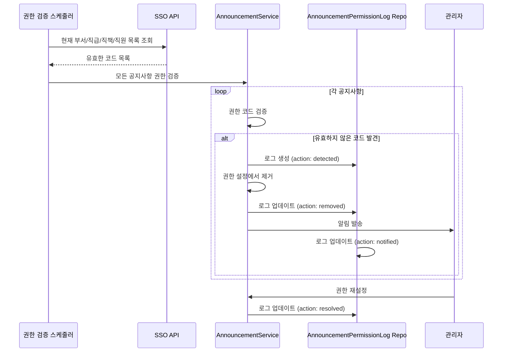

# 공지사항 권한 로그 가이드 (AnnouncementPermissionLog)

## 개요

이 문서는 공지사항에서 SSO 시스템의 조직 정보(부서, 직급, 직책, 직원)가 삭제되거나 변경되었을 때, 해당 공지사항의 권한 정보를 추적하고 로그를 남기는 방법을 설명합니다.

위키 시스템의 `WikiPermissionLog`와 동일한 패턴을 적용하여 구현되었습니다.

## 엔티티 구조

### AnnouncementPermissionLog

공지사항 권한 무효화를 추적하는 로그 엔티티입니다.

**위치**: `src/domain/core/announcement/announcement-permission-log.entity.ts`

**주요 필드**:
- `announcementId`: 공지사항 ID
- `invalidDepartmentCodes`: 무효화된 부서 코드 목록
- `invalidRankCodes`: 무효화된 직급 코드 목록
- `invalidPositionCodes`: 무효화된 직책 코드 목록
- `invalidEmployeeIds`: 무효화된 직원 ID 목록
- `snapshotPermissions`: 권한 설정 스냅샷 (변경 전)
- `action`: 처리 상태 (detected | removed | notified | resolved)
- `note`: 추가 메모
- `detectedAt`: 감지 일시
- `resolvedAt`: 해결 일시
- `resolvedBy`: 해결한 관리자 ID

### AnnouncementPermissionAction

권한 로그의 처리 상태를 나타내는 Enum입니다.

**위치**: `src/domain/core/announcement/announcement-permission-action.types.ts`

```typescript
export enum AnnouncementPermissionAction {
  DETECTED = 'detected',    // 감지됨 (무효한 코드 발견)
  REMOVED = 'removed',      // 무효한 코드 자동 제거됨
  NOTIFIED = 'notified',    // 관리자에게 통보됨
  RESOLVED = 'resolved',    // 관리자가 수동으로 해결함
}
```

## 권한 무효화 추적 흐름

### 시나리오

1. 공지사항에 "개발팀" 부서 권한 설정
2. SSO 시스템에서 "개발팀" 부서 코드 삭제
3. 스케줄러가 자동으로 감지 및 권한 제거
4. 관리자에게 통보
5. 관리자가 수동으로 권한 재설정 또는 문제 해결

### 시퀀스 다이어그램



## 구현 가이드

### 1. 스케줄러 구현 (향후 구현 필요)

위치: `src/context/announcement-context/announcement-context.service.ts` 또는 별도 스케줄러 서비스

```typescript
import { Cron, CronExpression } from '@nestjs/schedule';
import { Injectable, Logger } from '@nestjs/common';
import { InjectRepository } from '@nestjs/typeorm';
import { Repository } from 'typeorm';
import { Announcement } from '@domain/core/announcement/announcement.entity';
import { AnnouncementPermissionLog } from '@domain/core/announcement/announcement-permission-log.entity';
import { AnnouncementPermissionAction } from '@domain/core/announcement/announcement-permission-action.types';

@Injectable()
export class AnnouncementPermissionScheduler {
  private readonly logger = new Logger(AnnouncementPermissionScheduler.name);

  constructor(
    @InjectRepository(Announcement)
    private readonly announcementRepository: Repository<Announcement>,
    @InjectRepository(AnnouncementPermissionLog)
    private readonly permissionLogRepository: Repository<AnnouncementPermissionLog>,
    // private readonly ssoService: SsoService, // SSO 서비스 주입 필요
  ) {}

  /**
   * 매일 새벽 2시에 모든 공지사항의 권한을 검증한다
   */
  @Cron('0 2 * * *') // 매일 새벽 2시
  async 모든_공지사항_권한을_검증한다() {
    this.logger.log('공지사항 권한 검증 시작');

    try {
      // 1. SSO에서 현재 유효한 코드 조회
      const validCodes = await this.SSO에서_유효한_코드를_조회한다();

      // 2. 모든 공지사항 조회 (Soft Delete되지 않은 것만)
      const announcements = await this.announcementRepository.find({
        where: { deletedAt: null },
      });

      this.logger.log(`검증 대상 공지사항: ${announcements.length}개`);

      // 3. 각 공지사항의 권한 검증
      for (const announcement of announcements) {
        await this.공지사항_권한을_검증한다(announcement, validCodes);
      }

      this.logger.log('공지사항 권한 검증 완료');
    } catch (error) {
      this.logger.error('공지사항 권한 검증 중 오류 발생', error);
    }
  }

  /**
   * SSO에서 유효한 코드 목록을 조회한다
   */
  private async SSO에서_유효한_코드를_조회한다(): Promise<{
    departmentCodes: string[];
    rankCodes: string[];
    positionCodes: string[];
    employeeIds: string[];
  }> {
    // TODO: 실제 SSO 서비스 연동 구현
    // return this.ssoService.getValidCodes();
    
    // 임시 구현 (실제로는 SSO API를 호출해야 함)
    return {
      departmentCodes: [],
      rankCodes: [],
      positionCodes: [],
      employeeIds: [],
    };
  }

  /**
   * 개별 공지사항의 권한을 검증한다
   */
  private async 공지사항_권한을_검증한다(
    announcement: Announcement,
    validCodes: {
      departmentCodes: string[];
      rankCodes: string[];
      positionCodes: string[];
      employeeIds: string[];
    },
  ) {
    let hasInvalidCodes = false;
    const invalidData: {
      invalidDepartmentCodes: string[];
      invalidRankCodes: string[];
      invalidPositionCodes: string[];
      invalidEmployeeIds: string[];
    } = {
      invalidDepartmentCodes: [],
      invalidRankCodes: [],
      invalidPositionCodes: [],
      invalidEmployeeIds: [],
    };

    // 1. 부서 코드 검증
    if (announcement.permissionDepartmentCodes?.length > 0) {
      const invalid = announcement.permissionDepartmentCodes.filter(
        (code) => !validCodes.departmentCodes.includes(code),
      );
      if (invalid.length > 0) {
        hasInvalidCodes = true;
        invalidData.invalidDepartmentCodes = invalid;
        announcement.permissionDepartmentCodes = 
          announcement.permissionDepartmentCodes.filter(
            (code) => !invalid.includes(code),
          );
      }
    }

    // 2. 직급 코드 검증
    if (announcement.permissionRankCodes?.length > 0) {
      const invalid = announcement.permissionRankCodes.filter(
        (code) => !validCodes.rankCodes.includes(code),
      );
      if (invalid.length > 0) {
        hasInvalidCodes = true;
        invalidData.invalidRankCodes = invalid;
        announcement.permissionRankCodes = 
          announcement.permissionRankCodes.filter(
            (code) => !invalid.includes(code),
          );
      }
    }

    // 3. 직책 코드 검증
    if (announcement.permissionPositionCodes?.length > 0) {
      const invalid = announcement.permissionPositionCodes.filter(
        (code) => !validCodes.positionCodes.includes(code),
      );
      if (invalid.length > 0) {
        hasInvalidCodes = true;
        invalidData.invalidPositionCodes = invalid;
        announcement.permissionPositionCodes = 
          announcement.permissionPositionCodes.filter(
            (code) => !invalid.includes(code),
          );
      }
    }

    // 4. 직원 ID 검증
    if (announcement.permissionEmployeeIds?.length > 0) {
      const invalid = announcement.permissionEmployeeIds.filter(
        (id) => !validCodes.employeeIds.includes(id),
      );
      if (invalid.length > 0) {
        hasInvalidCodes = true;
        invalidData.invalidEmployeeIds = invalid;
        announcement.permissionEmployeeIds = 
          announcement.permissionEmployeeIds.filter(
            (id) => !invalid.includes(id),
          );
      }
    }

    // 5. 무효한 코드가 발견된 경우 로그 생성 및 권한 업데이트
    if (hasInvalidCodes) {
      this.logger.warn(
        `공지사항 ID ${announcement.id}에서 무효한 권한 코드 발견`,
      );

      // 5-1. 스냅샷 저장
      const snapshot = {
        permissionRankCodes: announcement.permissionRankCodes,
        permissionPositionCodes: announcement.permissionPositionCodes,
        permissionDepartmentCodes: announcement.permissionDepartmentCodes,
        permissionEmployeeIds: announcement.permissionEmployeeIds,
      };

      // 5-2. DETECTED 로그 생성
      const detectedLog = await this.permissionLogRepository.save({
        announcementId: announcement.id,
        invalidDepartmentCodes: invalidData.invalidDepartmentCodes.length > 0 
          ? invalidData.invalidDepartmentCodes 
          : null,
        invalidRankCodes: invalidData.invalidRankCodes.length > 0 
          ? invalidData.invalidRankCodes 
          : null,
        invalidPositionCodes: invalidData.invalidPositionCodes.length > 0 
          ? invalidData.invalidPositionCodes 
          : null,
        invalidEmployeeIds: invalidData.invalidEmployeeIds.length > 0 
          ? invalidData.invalidEmployeeIds 
          : null,
        snapshotPermissions: snapshot,
        action: AnnouncementPermissionAction.DETECTED,
        note: 'SSO 시스템에서 조직 정보 변경 감지',
        detectedAt: new Date(),
      });

      // 5-3. 공지사항 권한 업데이트 (무효한 코드 제거)
      await this.announcementRepository.save(announcement);

      // 5-4. REMOVED 로그 생성
      await this.permissionLogRepository.save({
        announcementId: announcement.id,
        invalidDepartmentCodes: invalidData.invalidDepartmentCodes.length > 0 
          ? invalidData.invalidDepartmentCodes 
          : null,
        invalidRankCodes: invalidData.invalidRankCodes.length > 0 
          ? invalidData.invalidRankCodes 
          : null,
        invalidPositionCodes: invalidData.invalidPositionCodes.length > 0 
          ? invalidData.invalidPositionCodes 
          : null,
        invalidEmployeeIds: invalidData.invalidEmployeeIds.length > 0 
          ? invalidData.invalidEmployeeIds 
          : null,
        snapshotPermissions: snapshot,
        action: AnnouncementPermissionAction.REMOVED,
        note: '무효한 권한 코드 자동 제거 완료',
        detectedAt: new Date(),
      });

      // 5-5. 관리자에게 알림 (TODO: 알림 서비스 구현 필요)
      await this.관리자에게_알림을_전송한다(announcement, invalidData);

      // 5-6. NOTIFIED 로그 생성
      await this.permissionLogRepository.save({
        announcementId: announcement.id,
        invalidDepartmentCodes: invalidData.invalidDepartmentCodes.length > 0 
          ? invalidData.invalidDepartmentCodes 
          : null,
        invalidRankCodes: invalidData.invalidRankCodes.length > 0 
          ? invalidData.invalidRankCodes 
          : null,
        invalidPositionCodes: invalidData.invalidPositionCodes.length > 0 
          ? invalidData.invalidPositionCodes 
          : null,
        invalidEmployeeIds: invalidData.invalidEmployeeIds.length > 0 
          ? invalidData.invalidEmployeeIds 
          : null,
        snapshotPermissions: snapshot,
        action: AnnouncementPermissionAction.NOTIFIED,
        note: '관리자에게 알림 전송 완료',
        detectedAt: new Date(),
      });
    }
  }

  /**
   * 관리자에게 권한 변경 알림을 전송한다
   */
  private async 관리자에게_알림을_전송한다(
    announcement: Announcement,
    invalidData: {
      invalidDepartmentCodes: string[];
      invalidRankCodes: string[];
      invalidPositionCodes: string[];
      invalidEmployeeIds: string[];
    },
  ) {
    // TODO: 알림 서비스 구현 필요
    // 이메일, 슬랙, 시스템 알림 등
    this.logger.log(
      `공지사항 "${announcement.title}" (ID: ${announcement.id})의 권한 코드가 무효화되었습니다.`,
    );
    
    if (invalidData.invalidDepartmentCodes.length > 0) {
      this.logger.log(`- 무효 부서: ${invalidData.invalidDepartmentCodes.join(', ')}`);
    }
    if (invalidData.invalidRankCodes.length > 0) {
      this.logger.log(`- 무효 직급: ${invalidData.invalidRankCodes.join(', ')}`);
    }
    if (invalidData.invalidPositionCodes.length > 0) {
      this.logger.log(`- 무효 직책: ${invalidData.invalidPositionCodes.join(', ')}`);
    }
    if (invalidData.invalidEmployeeIds.length > 0) {
      this.logger.log(`- 무효 직원: ${invalidData.invalidEmployeeIds.join(', ')}`);
    }
  }
}
```

### 2. 관리자 권한 해결 API (향후 구현 필요)

위치: `src/interface/admin/announcement/announcement.controller.ts`

```typescript
/**
 * 공지사항 권한 로그를 해결 상태로 업데이트한다
 */
@Patch('announcements/permission-logs/:logId/resolve')
async resolvePermissionLog(
  @Param('logId') logId: string,
  @GetEmployee() employee: EmployeeDto,
  @Body() dto: { note?: string },
) {
  await this.announcementPermissionLogRepository.update(logId, {
    action: AnnouncementPermissionAction.RESOLVED,
    resolvedAt: new Date(),
    resolvedBy: employee.id,
    note: dto.note || '관리자가 수동으로 해결함',
  });

  return {
    message: '권한 로그가 해결되었습니다.',
  };
}

/**
 * 공지사항의 권한 로그 목록을 조회한다
 */
@Get('announcements/:id/permission-logs')
async getPermissionLogs(@Param('id') announcementId: string) {
  const logs = await this.announcementPermissionLogRepository.find({
    where: { announcementId },
    order: { detectedAt: 'DESC' },
  });

  return logs;
}
```

## 데이터베이스 마이그레이션

새로운 엔티티가 추가되었으므로 마이그레이션이 필요합니다:

```bash
# 마이그레이션 생성
npm run migration:generate -- AddAnnouncementPermissionLog

# 마이그레이션 실행
npm run migration:run
```

## 관련 파일

- `src/domain/core/announcement/announcement-permission-log.entity.ts` - 권한 로그 엔티티
- `src/domain/core/announcement/announcement-permission-action.types.ts` - 액션 Enum
- `src/domain/core/announcement/announcement.entity.ts` - 공지사항 엔티티 (permissionLogs 관계 추가)
- `src/domain/core/announcement/announcement.module.ts` - 모듈 설정 (AnnouncementPermissionLog 등록)

## 참고

위키 시스템의 동일한 패턴을 참고하세요:
- `src/domain/sub/wiki-file-system/wiki-permission-log.entity.ts`
- `docs/state-flow/context-flows/wiki-context-flow.md` (권한 무효화 추적 섹션)
