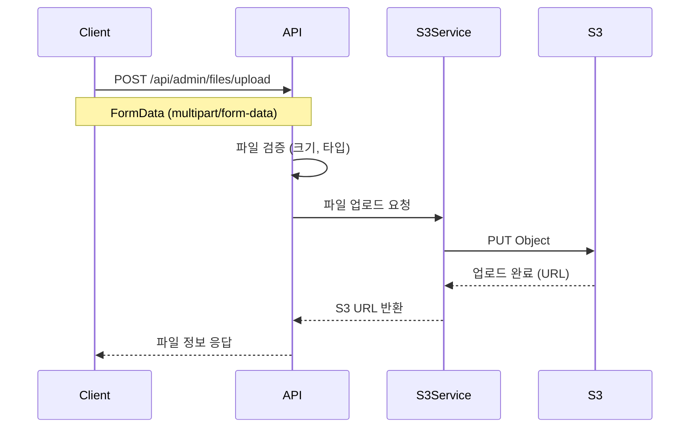
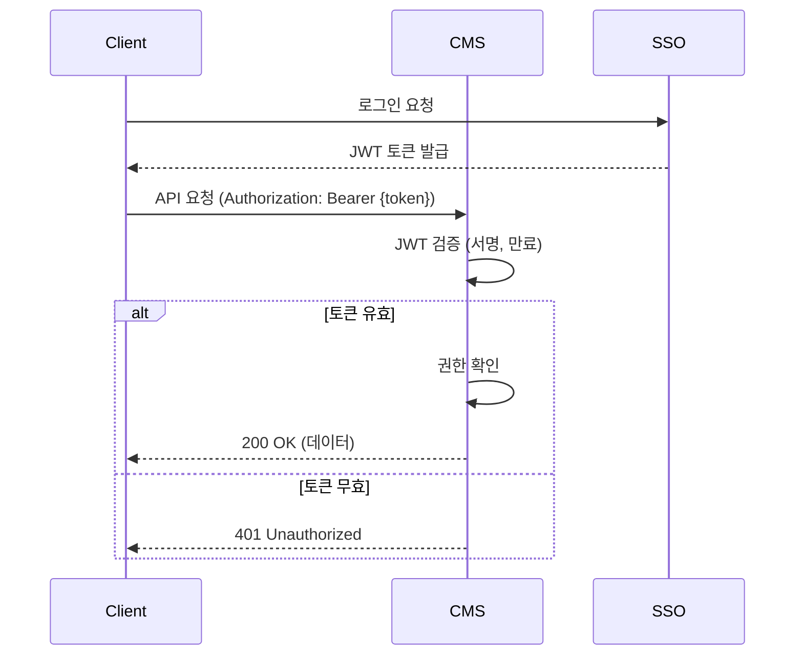
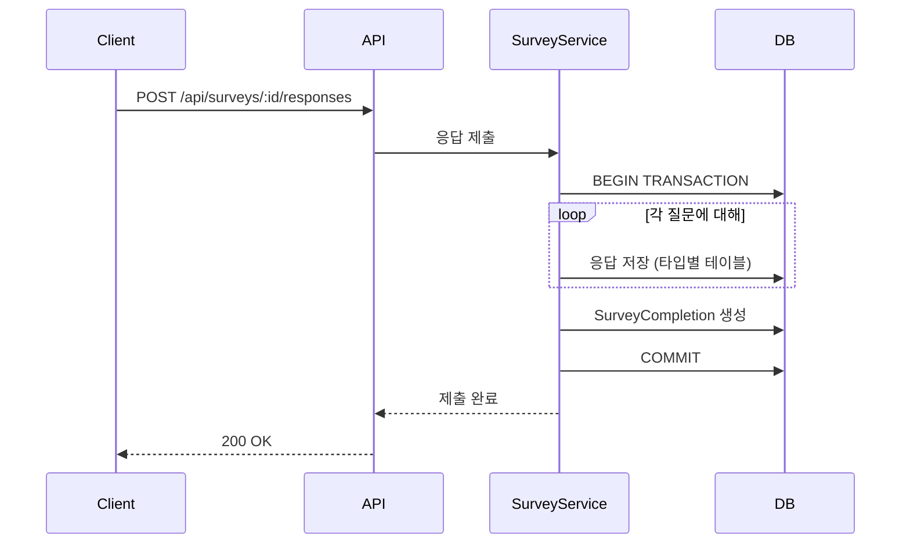

# 기능 설계 문서

> **목적**: 루미르 CMS의 주요 기능별 설계 의도와 구현 전략을 설명합니다.

## 📋 목차

1. [권한 관리 시스템](#1-권한-관리-시스템)
2. [다국어 지원 메커니즘](#2-다국어-지원-메커니즘)
3. [스케줄러 시스템](#3-스케줄러-시스템)
4. [파일 업로드 및 S3 연동](#4-파일-업로드-및-s3-연동)
5. [SSO 및 인증/인가](#5-sso-및-인증인가)
6. [읽음 표시 시스템](#6-읽음-표시-시스템)
7. [설문조사 시스템](#7-설문조사-시스템)
8. [위키 시스템](#8-위키-시스템)

---

## 1. 권한 관리 시스템

### 1.1 권한 모델 설계

#### 4가지 권한 레벨
```typescript
interface Permission {
  permissionEmployeeIds?: string[];      // 직원 단위 (최우선)
  permissionDepartmentIds?: string[];    // 부서 단위
  permissionRankIds?: string[];          // 직급 단위
  permissionPositionIds?: string[];      // 직책 단위
}
```

**조합 규칙**:
- ✅ **OR 조건**: 여러 권한 타입 조합 시 OR 조건으로 동작
  - 예: `permissionEmployeeIds: [E1, E2]` + `permissionDepartmentIds: [D1]`
  - → 직원 E1, E2 **또는** 부서 D1 소속 직원이면 접근 가능
- ✅ **동일 타입 내 OR**: 같은 권한 타입 내 여러 값 지정 시 OR 조건
  - 예: `permissionDepartmentIds: [D1, D2]` → 부서 D1 **또는** D2
  - 예: `permissionRankIds: [R1, R2]` → 직급 R1 **또는** R2

### 1.2 권한 체크 로직 (OR 조건)

#### 대상 직원 추출 알고리즘
```typescript
async 공지사항_대상_직원_목록을_추출한다(announcement: Announcement): Promise<string[]> {
  const employeeIds = new Set<string>();
  const orgInfo = await this.companyContextService.조직_정보를_가져온다();

  // 1. 특정 직원 ID 추가
  if (announcement.permissionEmployeeIds?.length > 0) {
    announcement.permissionEmployeeIds.forEach(id => employeeIds.add(id));
  }

  // 2. 직급별 직원 추가 (OR)
  if (announcement.permissionRankIds?.length > 0) {
    const employees = this.조직에서_직급별_직원ID를_추출한다(orgInfo, announcement.permissionRankIds);
    employees.forEach(id => employeeIds.add(id));
  }

  // 3. 직책별 직원 추가 (OR)
  if (announcement.permissionPositionIds?.length > 0) {
    const employees = this.조직에서_직책별_직원ID를_추출한다(orgInfo, announcement.permissionPositionIds);
    employees.forEach(id => employeeIds.add(id));
  }

  // 4. 부서별 직원 추가 (OR)
  if (announcement.permissionDepartmentIds?.length > 0) {
    const employees = this.조직에서_부서별_직원ID를_추출한다(orgInfo, announcement.permissionDepartmentIds);
    employees.forEach(id => employeeIds.add(id));
  }

  return Array.from(employeeIds);
}
```

**핵심 포인트**:
- ✅ `Set` 자료구조를 사용하여 중복 제거
- ✅ 각 권한 타입에서 추출한 직원 ID를 모두 `Set`에 추가 → **OR 조건**
- ✅ 권한이 하나라도 있으면 접근 가능

**예시**:
```typescript
// 예시 1: 직원 + 부서
{
  permissionEmployeeIds: ['E1', 'E2'],
  permissionDepartmentIds: ['D1']
}
// → 결과: E1, E2 또는 D1 부서의 모든 직원 (예: E1, E2, E3, E4, E5)

// 예시 2: 직급 + 직책
{
  permissionRankIds: ['R1', 'R2'],
  permissionPositionIds: ['P1']
}
// → 결과: R1 직급 또는 R2 직급 또는 P1 직책의 모든 직원
```

### 1.3 권한 검증 스케줄러

#### 문제 상황
SSO 시스템에서 부서가 비활성화(`isActive: false`)되면, 해당 부서 권한이 무효화됨

#### 해결 방안
**자동 감지 스케줄러**:
- 매일 새벽 2시 (위키), 3시 (공지사항) 자동 실행
- 비활성화된 권한 감지 → 로그 생성 (`DETECTED`)

**권한 로그 엔티티**:
```typescript
@Entity()
export class AnnouncementPermissionLog {
  @Column('uuid')
  announcementId: string;

  @Column('jsonb', { nullable: true })
  invalidDepartments: Array<{ id: string; name: string | null }> | null;

  @Column('jsonb')
  snapshotPermissions: {
    permissionDepartments: Array<{ id: string; name: string | null }> | null;
  };

  @Column({ type: 'enum', enum: AnnouncementPermissionAction })
  action: AnnouncementPermissionAction;  // DETECTED | RESOLVED

  @Column('timestamp')
  detectedAt: Date;

  @Column('timestamp', { nullable: true })
  resolvedAt: Date | null;

  @Column('uuid', { nullable: true })
  resolvedBy: string | null;  // 관리자 ID 또는 "system"
}
```

#### 자동 해결 메커니즘
**부서 재활성화 시**:
- 스케줄러가 기존 미해결 로그 재검증
- 모든 부서가 `isActive: true`로 복구되었으면 자동으로 `RESOLVED` 처리
- `resolvedBy: "system"`, `note: "부서가 다시 활성화되어 자동으로 해결됨"`

#### 수동 해결 프로세스
**관리자 권한 교체 API**:
```http
PATCH /api/admin/announcements/:id/replace-permissions

Body:
{
  "departments": [
    { "oldId": "DEPT_OLD", "newId": "DEPT_NEW" }
  ],
  "note": "구 마케팅팀을 신 마케팅팀으로 교체"
}
```

**효과**:
- ✅ 권한 교체와 동시에 자동으로 `RESOLVED` 로그 생성
- ✅ 변경 이력 추적 가능
- ✅ 여러 부서 ID 일괄 교체 가능

### 1.4 권한 로그 모달 제어

#### DismissedPermissionLog (무시 로그)
**문제**: 여러 관리자가 동일한 권한 로그 알림을 받으면 중복 처리

**해결**: 관리자별 독립적인 "다시 보지 않기" 기능

```typescript
@Entity()
export class DismissedPermissionLog {
  @Column({ type: 'enum', enum: DismissedPermissionLogType })
  logType: DismissedPermissionLogType;  // 'announcement' | 'wiki'

  @Column('uuid')
  permissionLogId: string;  // AnnouncementPermissionLog.id 등

  @Column('uuid')
  dismissedBy: string;  // 무시한 관리자 ID

  @CreateDateColumn()
  dismissedAt: Date;
}
```

**UNIQUE 제약**:
```sql
CREATE UNIQUE INDEX idx_dismissed_permission_log_unique
ON dismissed_permission_logs(log_type, permission_log_id, dismissed_by);
```

**효과**:
- ✅ 관리자 A가 무시해도 관리자 B에게는 계속 표시
- ✅ 중복 무시 요청 방지 (UNIQUE 제약)
- ✅ 관리 페이지에서는 무시 여부와 관계없이 모든 로그 조회 가능

---

## 2. 다국어 지원 메커니즘

### 2.1 번역 테이블 패턴

#### 설계 전략
- 메인 엔티티 + Translation 엔티티 (1:N)
- Translation 엔티티는 Language 외래키 보유

**예시**: ShareholdersMeeting
```typescript
@Entity()
export class ShareholdersMeeting {
  // 언어 무관 필드
  @Column('boolean')
  isPublic: boolean;

  @Column('timestamp')
  meetingDate: Date;

  // 다국어 필드는 별도 엔티티
  @OneToMany(() => ShareholdersMeetingTranslation, t => t.shareholdersMeeting)
  translations: ShareholdersMeetingTranslation[];
}

@Entity()
export class ShareholdersMeetingTranslation {
  @ManyToOne(() => ShareholdersMeeting)
  shareholdersMeeting: ShareholdersMeeting;

  @ManyToOne(() => Language)
  language: Language;

  @Column()
  title: string;

  @Column('text')
  content: string;
}
```

#### UNIQUE 제약
```sql
UNIQUE (shareholders_meeting_id, language_id)
```

**효과**:
- ✅ 한 언어당 하나의 번역만 존재
- ✅ 번역 누락 감지 가능 (언어 수 vs 번역 수 비교)

### 2.2 Fallback 조회 전략

#### 4단계 Fallback
```typescript
async 번역을_조회한다(entityId: string, languageCode: string) {
  // 1순위: 요청 언어
  let translation = await this.findByLanguageCode(entityId, languageCode);
  if (translation) return translation;

  // 2순위: 한국어 (기본 언어)
  translation = await this.findByLanguageCode(entityId, 'ko');
  if (translation) return translation;

  // 3순위: 영어
  translation = await this.findByLanguageCode(entityId, 'en');
  if (translation) return translation;

  // 4순위: 첫 번째 사용 가능한 번역
  return await this.findFirstAvailable(entityId);
}
```

**설계 의도**:
- ✅ 번역이 없어도 서비스 중단 없음
- ✅ 사용자는 항상 콘텐츠를 볼 수 있음
- ✅ 관리자는 번역 누락 파악 가능

### 2.3 번역 동기화 스케줄러

#### 다국어 콘텐츠 번역 동기화 (백업용)
**문제**: 한국어 콘텐츠 업데이트 후 다른 언어 번역이 지연됨

**해결**: 자동 번역 동기화 스케줄러
- **실행 주기**: 매 시간 10분 (00:10, 01:10, 02:10, ...)
- **대상**: IR, Brochure, MainPopup, ShareholdersMeeting, ElectronicDisclosure
- **동작 방식**: 
  - 실시간 동기화는 이벤트 핸들러에서 처리 (메인)
  - 스케줄러는 백업용으로 실시간 동기화 실패 시 보완
- **로깅**: 번역 누락 감지 및 로그 기록

---

## 3. 스케줄러 시스템

### 3.1 스케줄러 목록

| 스케줄러 | 실행 주기 | 설명 |
|---------|----------|------|
| 백업 (4시간) | 4시간마다 (00:00, 04:00, 08:00, 12:00, 16:00, 20:00) | GFS 백업 전략 - 4시간 보관 |
| 백업 (일간) | 매일 01:00 | GFS 백업 전략 - 1일 보관 |
| 위키 권한 검증 | 매일 02:00 | 비활성화된 권한 감지 |
| 공지사항 권한 검증 | 매일 03:00 | 비활성화된 권한 감지 |
| 번역 동기화 (백업용) | 매 시간 10분 (00:10, 01:10, ...) | IR, Brochure, MainPopup, ShareholdersMeeting, ElectronicDisclosure 번역 동기화 (실시간 동기화 실패 시 백업) |

### 3.2 스케줄러 구현 패턴

#### @nestjs/schedule 활용
```typescript
import { Cron, CronExpression } from '@nestjs/schedule';

@Injectable()
export class AnnouncementPermissionScheduler {
  private readonly logger = new Logger(AnnouncementPermissionScheduler.name);

  constructor(
    private readonly announcementService: AnnouncementService,
    private readonly permissionLogService: AnnouncementPermissionLogService,
    private readonly ssoService: SsoService,
  ) {}

  @Cron('0 3 * * *')  // 매일 새벽 3시
  async 공지사항_권한을_검증한다() {
    this.logger.log('공지사항 권한 검증 스케줄러 시작');

    try {
      // 1. 기존 미해결 로그 재검증 (부서 재활성화 확인)
      await this.resolveReactivatedPermissions();

      // 2. 모든 공지사항 조회
      const announcements = await this.announcementService.모든_공지사항을_조회한다();

      let invalidCount = 0;

      // 3. 각 공지사항의 권한 검증
      for (const announcement of announcements) {
        const invalidDepts = await this.비활성_부서를_확인한다(
          announcement.permissionDepartmentIds,
        );

        if (invalidDepts.length > 0) {
          await this.permissionLogService.로그를_생성한다({
            announcementId: announcement.id,
            invalidDepartments: invalidDepts,
            snapshotPermissions: { ... },
          });
          invalidCount++;
        }
      }

      this.logger.log(`공지사항 권한 검증 완료 - 무효 발견: ${invalidCount}개`);
    } catch (error) {
      this.logger.error('공지사항 권한 검증 실패', error.stack);
    }
  }

  private async resolveReactivatedPermissions() {
    // 미해결 로그 조회
    const unresolvedLogs = await this.permissionLogService.미해결_로그를_조회한다();

    for (const log of unresolvedLogs) {
      // 부서 정보 재조회
      const departments = await this.ssoService.부서_정보_목록을_조회한다(
        log.invalidDepartments.map(d => d.id),
      );

      // 모든 부서가 활성화되었는지 확인
      const allActive = Array.from(departments.values()).every(
        dept => dept && dept.isActive,
      );

      if (allActive) {
        // 자동 해결
        await this.permissionLogService.로그를_해결한다({
          logId: log.id,
          resolvedBy: 'system',
          note: '부서가 다시 활성화되어 자동으로 해결됨',
        });
      }
    }
  }
}
```

### 3.3 수동 트리거 API

#### 관리자 즉시 실행
```http
POST /api/admin/permission-validation/announcement  # 공지사항 권한 검증
POST /api/admin/permission-validation/wiki          # 위키 권한 검증
POST /api/admin/permission-validation/all           # 모든 권한 검증 (병렬)
```

**응답 예시**:
```json
{
  "success": true,
  "message": "공지사항 권한 검증이 완료되었습니다.",
  "timestamp": "2026-01-22T10:30:00.000Z"
}
```

---

## 4. 파일 업로드 및 S3 연동

### 4.1 파일 업로드 플로우



### 4.2 파일 저장 구조

#### S3 버킷 구조
```
lumir-cms/
├── announcements/
│   ├── {announcement-id}/
│   │   ├── file1.pdf
│   │   └── image1.jpg
├── brochures/
│   ├── {brochure-id}/
│   │   └── brochure.pdf
├── wiki/
│   ├── {wiki-id}/
│   │   └── document.docx
└── surveys/
    ├── {survey-id}/
    │   └── uploaded-file.xlsx
```

#### 파일명 생성 전략
```typescript
function generateS3Key(entityType: string, entityId: string, originalName: string): string {
  const timestamp = Date.now();
  const sanitizedName = sanitizeFileName(originalName);
  return `${entityType}/${entityId}/${timestamp}_${sanitizedName}`;
}

// 예시: announcements/uuid-123/1706000000000_report.pdf
```

### 4.3 파일 메타데이터 저장

#### JSONB 컬럼 활용
```typescript
@Column('jsonb', { nullable: true })
attachments: Array<{
  id: string;          // UUID
  name: string;        // 원본 파일명
  url: string;         // S3 URL
  size: number;        // 파일 크기 (bytes)
  mimeType: string;    // MIME Type
  uploadedAt: Date;    // 업로드 일시
  uploadedBy: string;  // 업로더 ID
}> | null;
```

**설계 의도**:
- ✅ 별도 테이블 불필요 (간단한 구조)
- ✅ 엔티티 삭제 시 파일 정보도 자동 삭제
- ✅ 파일 수가 제한적 (10개 이하)

### 4.4 파일 삭제 전략

#### Soft Delete 적용
- 엔티티가 Soft Delete되면 파일은 유지
- 복구 시 파일도 함께 복구 가능

#### 실제 삭제 시
```typescript
async 공지사항을_완전_삭제한다(id: string) {
  const announcement = await this.findOne(id);
  
  // 1. S3 파일 삭제
  if (announcement.attachments) {
    for (const file of announcement.attachments) {
      await this.s3Service.deleteFile(file.url);
    }
  }
  
  // 2. DB 레코드 삭제
  await this.announcementRepository.delete(id);
}
```

---

## 5. SSO 및 인증/인가

### 5.1 SSO 연동 구조

#### 외부 SSO 시스템
- 직원 정보 관리
- 부서/직급/직책 조직도 관리
- 인증 (로그인/로그아웃)

#### CMS 시스템 역할
- SSO 토큰 검증
- 권한 기반 접근 제어
- 조직도 정보 조회 (실시간)

### 5.2 JWT 토큰 구조

```json
{
  "sub": "employee-uuid",
  "name": "홍길동",
  "email": "hong@example.com",
  "departmentId": "DEPT_001",
  "rankId": "RANK_001",
  "positionId": "POS_001",
  "roles": ["user", "admin"],
  "iat": 1706000000,
  "exp": 1706086400
}
```

### 5.3 인증 플로우



### 5.4 권한 검증 Guard

```typescript
@Injectable()
export class JwtAuthGuard extends AuthGuard('jwt') {
  canActivate(context: ExecutionContext) {
    return super.canActivate(context);
  }

  handleRequest(err, user, info) {
    if (err || !user) {
      throw new UnauthorizedException('인증이 필요합니다');
    }
    return user;
  }
}

// 사용 예시
@Controller('admin/announcements')
@UseGuards(JwtAuthGuard)  // 인증 필수
export class AnnouncementController {
  @Get()
  async getList(@CurrentUser() user: AuthenticatedUser) {
    // user 정보 자동 주입
  }
}
```

---

## 6. 읽음 표시 시스템

### 6.1 Lazy Creation 패턴

#### 설계 의도
- 읽은 사람만 레코드 생성
- 대규모 공지사항 대응 (1,000명 이상)

#### 구현
```typescript
async 공지사항을_읽음_처리한다(announcementId: string, employeeId: string) {
  // 1. 읽음 레코드 존재 확인
  const existingRead = await this.readRepository.findOne({
    where: { announcementId, employeeId },
  });

  // 2. 없으면 생성 (Lazy Creation)
  if (!existingRead) {
    await this.readRepository.save({
      id: uuidv4(),
      announcementId,
      employeeId,
      readAt: new Date(),
    });
  }
}
```

### 6.2 미열람자 조회

#### 쿼리 전략
```sql
-- 권한 있는 사람 중 읽지 않은 사람 조회
SELECT e.id, e.name
FROM employees e
WHERE e.id IN (:permissionEmployeeIds)  -- 권한 있는 사람
  AND NOT EXISTS (
    SELECT 1 FROM announcement_read ar
    WHERE ar.announcement_id = :announcementId
      AND ar.employee_id = e.id
  );
```

### 6.3 읽음률 통계

```typescript
async 읽음률을_계산한다(announcementId: string) {
  // 1. 권한 있는 직원 수 (외부 SSO 조회)
  const totalCount = await this.getTotalTargetCount(announcementId);

  // 2. 읽은 직원 수
  const readCount = await this.readRepository.count({
    where: { announcementId },
  });

  // 3. 읽음률 계산
  const readRate = totalCount > 0 ? (readCount / totalCount) * 100 : 0;

  return {
    totalCount,
    readCount,
    unreadCount: totalCount - readCount,
    readRate: Math.round(readRate * 100) / 100,  // 소수점 2자리
  };
}
```

---

## 7. 설문조사 시스템

### 7.1 질문 타입별 응답 테이블

#### 7개 응답 테이블
```typescript
SurveyResponseText          // 단답형, 장문형
SurveyResponseChoice        // 객관식, 드롭다운
SurveyResponseCheckbox      // 체크박스
SurveyResponseScale         // 선형 척도
SurveyResponseGrid          // 그리드
SurveyResponseFile          // 파일 업로드
SurveyResponseDatetime      // 날짜/시간
```

### 7.2 응답 제출 플로우



### 7.3 통계 쿼리 최적화

#### 객관식 선택지별 통계
```sql
-- 타입별 테이블 사용으로 빠른 집계
SELECT 
  src.choice_id,
  c.text as choice_text,
  COUNT(*) as count,
  COUNT(*) * 100.0 / (SELECT COUNT(*) FROM survey_response_choice WHERE question_id = :questionId) as percentage
FROM survey_response_choice src
JOIN survey_choices c ON src.choice_id = c.id
WHERE src.question_id = :questionId
GROUP BY src.choice_id, c.text
ORDER BY count DESC;
```

**효과**:
- ✅ JSONB 파싱 불필요
- ✅ 인덱스 활용 최적화
- ✅ 쿼리 성능 10배 이상 향상

---

## 8. 위키 시스템

### 8.1 Closure Table 패턴

#### 계층 구조 조회
```sql
-- 전체 하위 항목 조회 (단일 쿼리)
SELECT wfs.*
FROM wiki_file_system wfs
JOIN wiki_file_system_closure c ON wfs.id = c.descendant
WHERE c.ancestor = :parentId
ORDER BY c.depth, wfs.order;
```

#### 경로 조회
```sql
-- 루트부터 현재 노드까지 경로 조회
SELECT wfs.id, wfs.name, c.depth
FROM wiki_file_system wfs
JOIN wiki_file_system_closure c ON wfs.id = c.ancestor
WHERE c.descendant = :currentId
ORDER BY c.depth;
```

### 8.2 위키 이동 처리

#### Closure 테이블 업데이트
```typescript
async 위키를_이동한다(wikiId: string, newParentId: string) {
  await this.dataSource.transaction(async (manager) => {
    // 1. 기존 Closure 레코드 삭제 (자기 자신 제외)
    await manager.delete(WikiFileSystemClosure, {
      descendant: wikiId,
      depth: MoreThan(0),
    });

    // 2. 새 부모의 조상 조회
    const ancestors = await manager.find(WikiFileSystemClosure, {
      where: { descendant: newParentId },
    });

    // 3. 새 Closure 레코드 생성
    for (const ancestor of ancestors) {
      await manager.save(WikiFileSystemClosure, {
        ancestor: ancestor.ancestor,
        descendant: wikiId,
        depth: ancestor.depth + 1,
      });
    }

    // 4. 부모 ID 업데이트
    await manager.update(WikiFileSystem, wikiId, {
      parentId: newParentId,
    });
  });
}
```

---

**문서 작성일**: 2026년 1월 22일  
**버전**: v1.0  
**작성자**: Development Team
