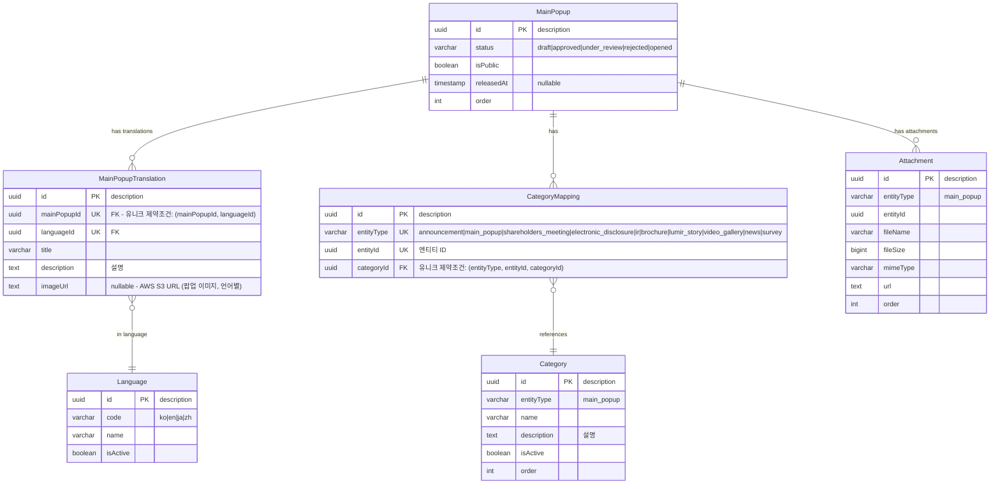
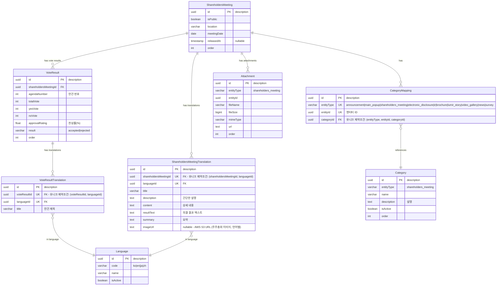
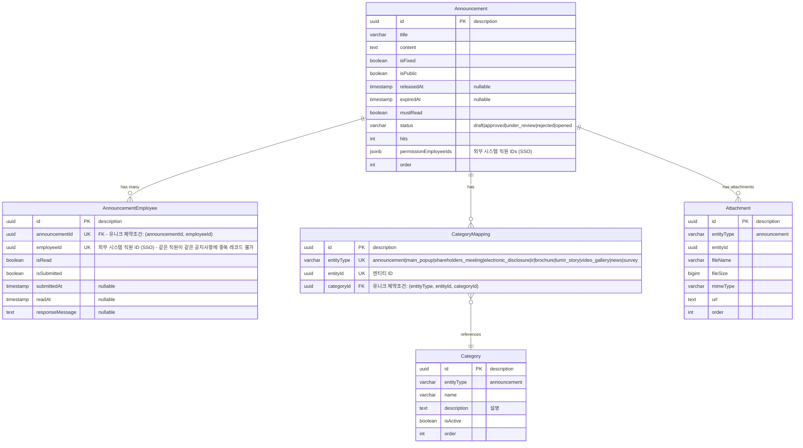
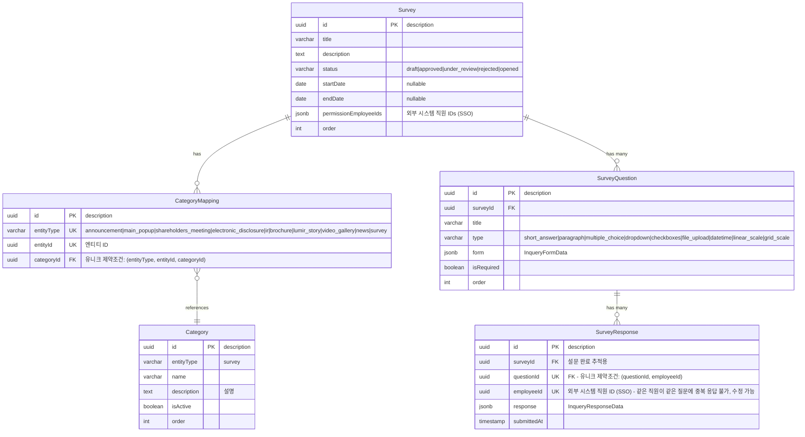
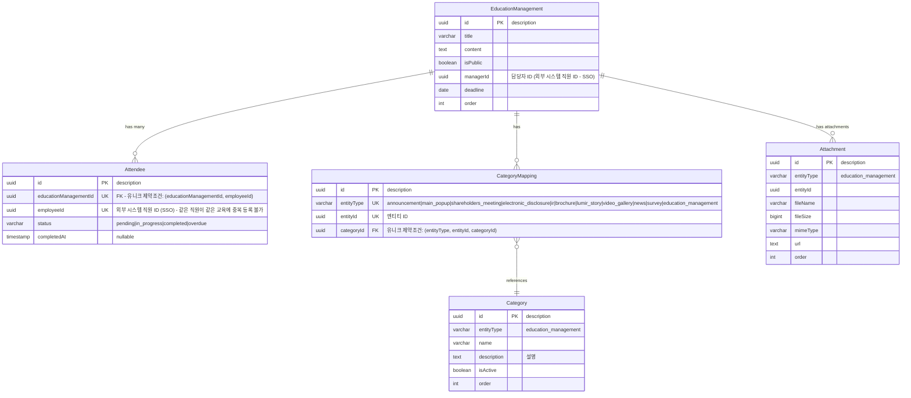
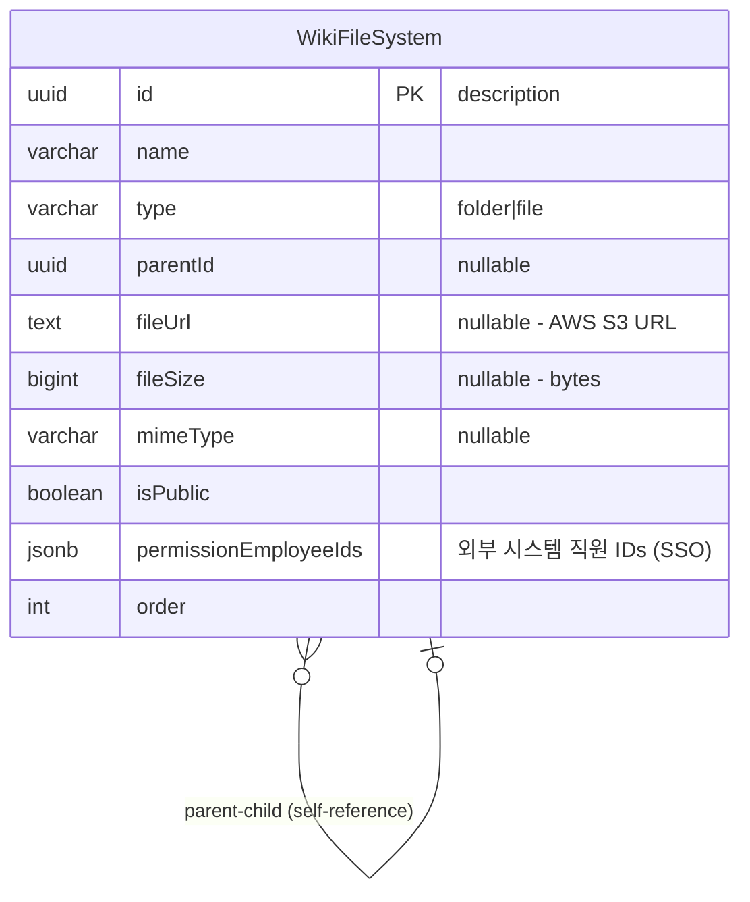
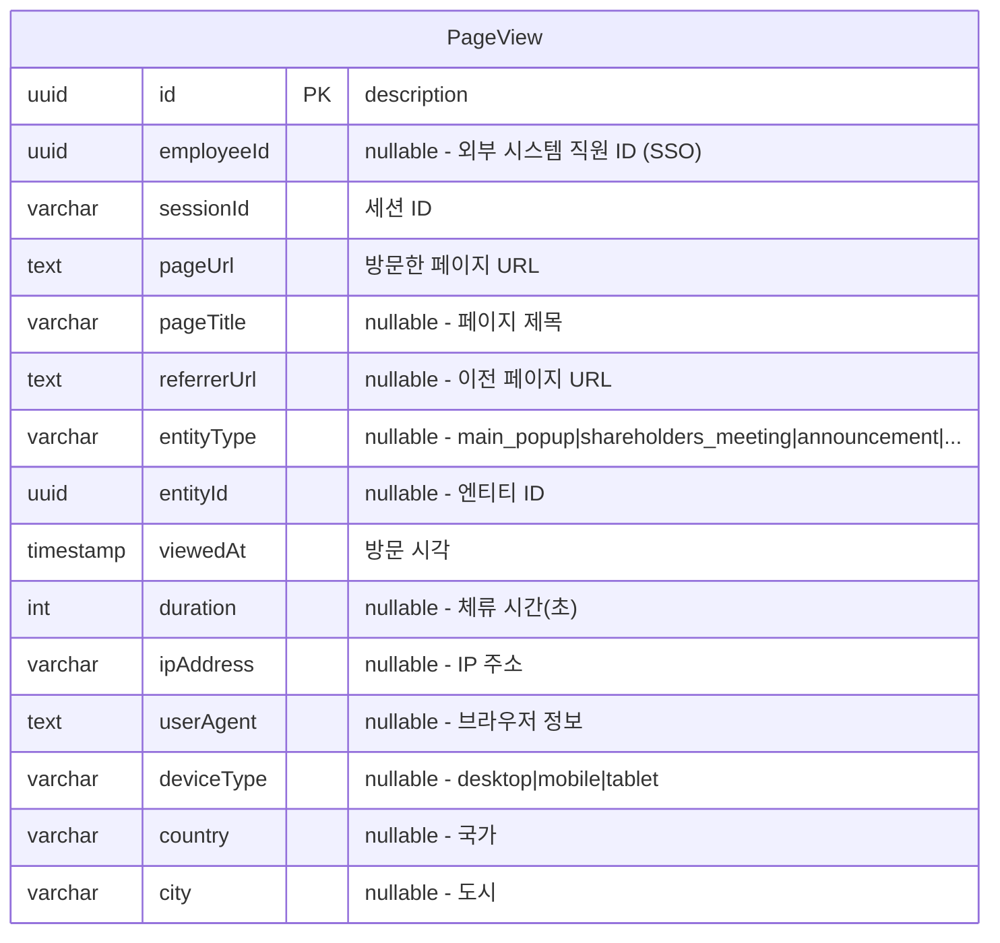

# 루미르 CMS ER 다이어그램

## 전체 시스템 ERD

```mermaid
erDiagram
    %% ==========================================
    %% 공통 엔티티 (Common Entities)
    %% ==========================================
    
    Language {
        uuid id PK "description"
        varchar code "ko|en|ja|zh"
        varchar name "예: 한국어, English"
        boolean isActive
        timestamp createdAt
        timestamp updatedAt
        timestamp deletedAt "nullable"
        uuid createdBy "nullable - 외부 시스템 직원 ID (SSO)"
        uuid updatedBy "nullable - 외부 시스템 직원 ID (SSO)"
        int version
    }

    Attachment {
        uuid id PK "description"
        varchar entityType "main_popup|shareholders_meeting|announcement|education_management|electronic_disclosure|ir|brochure|lumir_story|video_gallery|news|survey"
        uuid entityId "참조할 엔티티 ID"
        varchar fileName "원본 파일명"
        bigint fileSize "파일 크기(bytes)"
        varchar mimeType "MIME 타입"
        text url "AWS S3 URL"
        int order "순서"
        timestamp createdAt
        timestamp updatedAt
        timestamp deletedAt "nullable"
        uuid createdBy "nullable - 외부 시스템 직원 ID (SSO)"
        uuid updatedBy "nullable - 외부 시스템 직원 ID (SSO)"
        int version
    }

    Category {
        uuid id PK "description"
        varchar entityType "announcement|main_popup|shareholders_meeting|electronic_disclosure|ir|brochure|lumir_story|video_gallery|news|survey|education_management"
        varchar name
        text description "설명"
        boolean isActive
        int order
        timestamp createdAt
        timestamp updatedAt
        timestamp deletedAt "nullable"
        uuid createdBy "nullable - 외부 시스템 직원 ID (SSO)"
        uuid updatedBy "nullable - 외부 시스템 직원 ID (SSO)"
        int version
    }

    CategoryMapping {
        uuid id PK "description"
        varchar entityType UK "announcement|main_popup|shareholders_meeting|electronic_disclosure|ir|brochure|lumir_story|video_gallery|news|survey"
        uuid entityId UK "엔티티 ID"
        uuid categoryId FK "유니크 제약조건: (entityType, entityId, categoryId)"
        timestamp createdAt
        timestamp updatedAt
        timestamp deletedAt "nullable"
        uuid createdBy "nullable - 외부 시스템 직원 ID (SSO)"
        uuid updatedBy "nullable - 외부 시스템 직원 ID (SSO)"
        int version
    }

    %% ==========================================
    %% Core Domain (핵심 비즈니스 로직)
    %% - ShareholdersMeeting, ElectronicDisclosure, IR
    %% - Brochure, News, Announcement
    %% ==========================================
    
    ShareholdersMeeting {
        uuid id PK "description"
        boolean isPublic
        varchar location
        date meetingDate
        timestamp releasedAt "nullable"
        int order
        timestamp createdAt
        timestamp updatedAt
        timestamp deletedAt "nullable"
        uuid createdBy "nullable - 외부 시스템 직원 ID (SSO)"
        uuid updatedBy "nullable - 외부 시스템 직원 ID (SSO)"
        int version
    }

    VoteResult {
        uuid id PK "description"
        uuid shareholdersMeetingId FK
        int agendaNumber "안건 번호"
        int totalVote
        int yesVote
        int noVote
        float approvalRating "찬성률(%)"
        varchar result "accepted|rejected"
        int order
        timestamp createdAt
        timestamp updatedAt
        timestamp deletedAt "nullable"
        uuid createdBy "nullable - 외부 시스템 직원 ID (SSO)"
        uuid updatedBy "nullable - 외부 시스템 직원 ID (SSO)"
        int version
    }

    VoteResultTranslation {
        uuid id PK "description"
        uuid voteResultId UK "FK - 유니크 제약조건: (voteResultId, languageId)"
        uuid languageId UK "FK"
        varchar title "안건 제목"
        timestamp createdAt
        timestamp updatedAt
        timestamp deletedAt "nullable"
        uuid createdBy "nullable - 외부 시스템 직원 ID (SSO)"
        uuid updatedBy "nullable - 외부 시스템 직원 ID (SSO)"
        int version
    }

    ShareholdersMeetingTranslation {
        uuid id PK "description"
        uuid shareholdersMeetingId UK "FK - 유니크 제약조건: (shareholdersMeetingId, languageId)"
        uuid languageId UK "FK"
        varchar title
        text description "간단한 설명"
        text content "상세 내용"
        text resultText "의결 결과 텍스트"
        text summary "요약"
        text imageUrl "nullable - AWS S3 URL (주주총회 이미지, 언어별)"
        timestamp createdAt
        timestamp updatedAt
        timestamp deletedAt "nullable"
        uuid createdBy "nullable - 외부 시스템 직원 ID (SSO)"
        uuid updatedBy "nullable - 외부 시스템 직원 ID (SSO)"
        int version
    }

    ElectronicDisclosure {
        uuid id PK "description"
        boolean isPublic
        varchar status "draft|approved|under_review|rejected|opened"
        int order
        timestamp createdAt
        timestamp updatedAt
        timestamp deletedAt "nullable"
        uuid createdBy "nullable - 외부 시스템 직원 ID (SSO)"
        uuid updatedBy "nullable - 외부 시스템 직원 ID (SSO)"
        int version
    }

    ElectronicDisclosureTranslation {
        uuid id PK "description"
        uuid electronicDisclosureId UK "FK - 유니크 제약조건: (electronicDisclosureId, languageId)"
        uuid languageId UK "FK"
        varchar title
        text description "간단한 설명"
        timestamp createdAt
        timestamp updatedAt
        timestamp deletedAt "nullable"
        uuid createdBy "nullable - 외부 시스템 직원 ID (SSO)"
        uuid updatedBy "nullable - 외부 시스템 직원 ID (SSO)"
        int version
    }

    IR {
        uuid id PK "description"
        boolean isPublic
        varchar status "draft|approved|under_review|rejected|opened"
        int order
        timestamp createdAt
        timestamp updatedAt
        timestamp deletedAt "nullable"
        uuid createdBy "nullable - 외부 시스템 직원 ID (SSO)"
        uuid updatedBy "nullable - 외부 시스템 직원 ID (SSO)"
        int version
    }

    IRTranslation {
        uuid id PK "description"
        uuid irId UK "FK - 유니크 제약조건: (irId, languageId)"
        uuid languageId UK "FK"
        varchar title
        text description "간단한 설명"
        text fileUrl "nullable - AWS S3 URL (IR 자료 파일, 언어별)"
        timestamp createdAt
        timestamp updatedAt
        timestamp deletedAt "nullable"
        uuid createdBy "nullable - 외부 시스템 직원 ID (SSO)"
        uuid updatedBy "nullable - 외부 시스템 직원 ID (SSO)"
        int version
    }

    Brochure {
        uuid id PK "description"
        boolean isPublic
        varchar status "draft|approved|under_review|rejected|opened"
        int order
        timestamp createdAt
        timestamp updatedAt
        timestamp deletedAt "nullable"
        uuid createdBy "nullable - 외부 시스템 직원 ID (SSO)"
        uuid updatedBy "nullable - 외부 시스템 직원 ID (SSO)"
        int version
    }

    BrochureTranslation {
        uuid id PK "description"
        uuid brochureId UK "FK - 유니크 제약조건: (brochureId, languageId)"
        uuid languageId UK "FK"
        varchar title
        text description "간단한 설명"
        text fileUrl "nullable - AWS S3 URL (브로슈어 파일, 언어별)"
        timestamp createdAt
        timestamp updatedAt
        timestamp deletedAt "nullable"
        uuid createdBy "nullable - 외부 시스템 직원 ID (SSO)"
        uuid updatedBy "nullable - 외부 시스템 직원 ID (SSO)"
        int version
    }

    News {
        uuid id PK "description"
        varchar title
        text description "설명"
        text url "외부 링크 또는 상세 페이지 URL"
        boolean isPublic
        varchar status "draft|approved|under_review|rejected|opened"
        int order
        timestamp createdAt
        timestamp updatedAt
        timestamp deletedAt "nullable"
        uuid createdBy "nullable - 외부 시스템 직원 ID (SSO)"
        uuid updatedBy "nullable - 외부 시스템 직원 ID (SSO)"
        int version
    }

    Announcement {
        uuid id PK "description"
        varchar title
        text content
        boolean isFixed
        boolean isPublic
        timestamp releasedAt "nullable"
        timestamp expiredAt "nullable"
        boolean mustRead
        varchar status "draft|approved|under_review|rejected|opened"
        int hits
        jsonb permissionEmployeeIds "외부 시스템 직원 IDs (SSO)"
        int order
        timestamp createdAt
        timestamp updatedAt
        timestamp deletedAt "nullable"
        uuid createdBy "nullable - 외부 시스템 직원 ID (SSO)"
        uuid updatedBy "nullable - 외부 시스템 직원 ID (SSO)"
        int version
    }

    AnnouncementEmployee {
        uuid id PK "description"
        uuid announcementId UK "FK - 유니크 제약조건: (announcementId, employeeId)"
        uuid employeeId UK "외부 시스템 직원 ID (SSO) - 같은 직원이 같은 공지사항에 중복 레코드 불가"
        boolean isRead
        boolean isSubmitted
        timestamp submittedAt "nullable"
        timestamp readAt "nullable"
        text responseMessage "nullable"
        timestamp createdAt
        timestamp updatedAt
        timestamp deletedAt "nullable"
        uuid createdBy "nullable - 외부 시스템 직원 ID (SSO)"
        uuid updatedBy "nullable - 외부 시스템 직원 ID (SSO)"
        int version
    }

    %% ==========================================
    %% Sub Domain (부가 지원 기능)
    %% - MainPopup, LumirStory, VideoGallery, Survey
    %% - EducationManagement, WikiFileSystem, PageView
    %% ==========================================
    
    MainPopup {
        uuid id PK "description"
        varchar status "draft|approved|under_review|rejected|opened"
        boolean isPublic
        timestamp releasedAt "nullable"
        int order
        timestamp createdAt
        timestamp updatedAt
        timestamp deletedAt "nullable"
        uuid createdBy "nullable - 외부 시스템 직원 ID (SSO)"
        uuid updatedBy "nullable - 외부 시스템 직원 ID (SSO)"
        int version
    }

    MainPopupTranslation {
        uuid id PK "description"
        uuid mainPopupId UK "FK - 유니크 제약조건: (mainPopupId, languageId)"
        uuid languageId UK "FK"
        varchar title
        text description "설명"
        text imageUrl "nullable - AWS S3 URL (팝업 이미지, 언어별)"
        timestamp createdAt
        timestamp updatedAt
        timestamp deletedAt "nullable"
        uuid createdBy "nullable - 외부 시스템 직원 ID (SSO)"
        uuid updatedBy "nullable - 외부 시스템 직원 ID (SSO)"
        int version
    }

    LumirStory {
        uuid id PK "description"
        varchar title
        text content
        text imageUrl "nullable - AWS S3 URL (썸네일/대표 이미지)"
        boolean isPublic
        varchar status "draft|approved|under_review|rejected|opened"
        int order
        timestamp createdAt
        timestamp updatedAt
        timestamp deletedAt "nullable"
        uuid createdBy "nullable - 외부 시스템 직원 ID (SSO)"
        uuid updatedBy "nullable - 외부 시스템 직원 ID (SSO)"
        int version
    }

    VideoGallery {
        uuid id PK "description"
        varchar title
        text description
        boolean isPublic
        varchar status "draft|approved|under_review|rejected|opened"
        int order
        timestamp createdAt
        timestamp updatedAt
        timestamp deletedAt "nullable"
        uuid createdBy "nullable - 외부 시스템 직원 ID (SSO)"
        uuid updatedBy "nullable - 외부 시스템 직원 ID (SSO)"
        int version
    }

    Survey {
        uuid id PK "description"
        varchar title
        text description
        varchar status "draft|approved|under_review|rejected|opened"
        date startDate "nullable"
        date endDate "nullable"
        jsonb permissionEmployeeIds "외부 시스템 직원 IDs (SSO)"
        int order
        timestamp createdAt
        timestamp updatedAt
        timestamp deletedAt "nullable"
        uuid createdBy "nullable - 외부 시스템 직원 ID (SSO)"
        uuid updatedBy "nullable - 외부 시스템 직원 ID (SSO)"
        int version
    }

    SurveyQuestion {
        uuid id PK "description"
        uuid surveyId FK
        varchar title
        varchar type "short_answer|paragraph|multiple_choice|dropdown|checkboxes|file_upload|datetime|linear_scale|grid_scale"
        jsonb form "InqueryFormData"
        boolean isRequired
        int order
        timestamp createdAt
        timestamp updatedAt
        timestamp deletedAt "nullable"
        uuid createdBy "nullable - 외부 시스템 직원 ID (SSO)"
        uuid updatedBy "nullable - 외부 시스템 직원 ID (SSO)"
        int version
    }

    SurveyResponse {
        uuid id PK "description"
        uuid surveyId FK "설문 완료 추적용"
        uuid questionId UK "FK - 유니크 제약조건: (questionId, employeeId)"
        uuid employeeId UK "외부 시스템 직원 ID (SSO) - 같은 직원이 같은 질문에 중복 응답 불가, 수정 가능"
        jsonb response "InqueryResponseData"
        timestamp submittedAt
        timestamp createdAt
        timestamp updatedAt
        timestamp deletedAt "nullable"
        uuid createdBy "nullable - 외부 시스템 직원 ID (SSO)"
        uuid updatedBy "nullable - 외부 시스템 직원 ID (SSO)"
        int version
    }

    EducationManagement {
        uuid id PK "description"
        varchar title
        text content
        boolean isPublic
        uuid managerId "담당자 ID (외부 시스템 직원 ID - SSO)"
        date deadline
        int order
        timestamp createdAt
        timestamp updatedAt
        timestamp deletedAt "nullable"
        uuid createdBy "nullable - 외부 시스템 직원 ID (SSO)"
        uuid updatedBy "nullable - 외부 시스템 직원 ID (SSO)"
        int version
    }

    Attendee {
        uuid id PK "description"
        uuid educationManagementId UK "FK - 유니크 제약조건: (educationManagementId, employeeId)"
        uuid employeeId UK "외부 시스템 직원 ID (SSO) - 같은 직원이 같은 교육에 중복 등록 불가"
        varchar status "pending|in_progress|completed|overdue"
        timestamp completedAt "nullable"
        timestamp createdAt
        timestamp updatedAt
        timestamp deletedAt "nullable"
        uuid createdBy "nullable - 외부 시스템 직원 ID (SSO)"
        uuid updatedBy "nullable - 외부 시스템 직원 ID (SSO)"
        int version
    }

    WikiFileSystem {
        uuid id PK "description"
        varchar name
        varchar type "folder|file"
        uuid parentId "nullable, self-reference"
        text fileUrl "nullable - AWS S3 URL"
        bigint fileSize "nullable - 파일 크기(bytes)"
        varchar mimeType "nullable - MIME 타입"
        boolean isPublic
        jsonb permissionEmployeeIds "외부 시스템 직원 IDs (SSO)"
        int order
        timestamp createdAt
        timestamp updatedAt
        timestamp deletedAt "nullable"
        uuid createdBy "nullable - 외부 시스템 직원 ID (SSO)"
        uuid updatedBy "nullable - 외부 시스템 직원 ID (SSO)"
        int version
    }

    PageView {
        uuid id PK "description"
        uuid employeeId "nullable - 외부 시스템 직원 ID (SSO)"
        varchar sessionId "세션 ID"
        text pageUrl "방문한 페이지 URL"
        varchar pageTitle "nullable - 페이지 제목"
        text referrerUrl "nullable - 이전 페이지 URL"
        varchar entityType "nullable - main_popup|shareholders_meeting|announcement|electronic_disclosure|ir|brochure|lumir_story|video_gallery|news|survey|education_management|wiki_file_system"
        uuid entityId "nullable - 엔티티 ID"
        timestamp viewedAt "방문 시각"
        int duration "nullable - 체류 시간(초)"
        varchar ipAddress "nullable - IP 주소"
        text userAgent "nullable - 브라우저/디바이스 정보"
        varchar deviceType "nullable - desktop|mobile|tablet"
        varchar country "nullable - 국가"
        varchar city "nullable - 도시"
        timestamp createdAt
        timestamp updatedAt
        timestamp deletedAt "nullable"
        uuid createdBy "nullable - 외부 시스템 직원 ID (SSO)"
        uuid updatedBy "nullable - 외부 시스템 직원 ID (SSO)"
        int version
    }

    %% ==========================================
    %% Relationships - Core Domain
    %% ==========================================
    
    ShareholdersMeeting ||--o{ CategoryMapping : "has"
    CategoryMapping }o--|| Category : "references"
    ShareholdersMeeting ||--o{ VoteResult : "has vote results"
    VoteResult ||--o{ VoteResultTranslation : "has translations"
    VoteResultTranslation }o--|| Language : "in language"
    ShareholdersMeeting ||--o{ ShareholdersMeetingTranslation : "has translations"
    ShareholdersMeetingTranslation }o--|| Language : "in language"
    ShareholdersMeeting ||--o{ Attachment : "has attachments"
    
    ElectronicDisclosure ||--o{ CategoryMapping : "has"
    ElectronicDisclosure ||--o{ ElectronicDisclosureTranslation : "has translations"
    ElectronicDisclosureTranslation }o--|| Language : "in language"
    
    IR ||--o{ CategoryMapping : "has"
    IR ||--o{ IRTranslation : "has translations"
    IRTranslation }o--|| Language : "in language"
    IR ||--o{ Attachment : "has attachments"
    
    Brochure ||--o{ CategoryMapping : "has"
    Brochure ||--o{ BrochureTranslation : "has translations"
    BrochureTranslation }o--|| Language : "in language"
    
    News ||--o{ CategoryMapping : "has"
    News ||--o{ Attachment : "has attachments"
    
    Announcement ||--o{ CategoryMapping : "has"
    Announcement ||--o{ AnnouncementEmployee : "has many"
    Announcement ||--o{ Attachment : "has attachments"
    
    %% ==========================================
    %% Relationships - Sub Domain
    %% ==========================================
    
    MainPopup ||--o{ CategoryMapping : "has"
    MainPopup ||--o{ MainPopupTranslation : "has translations"
    MainPopupTranslation }o--|| Language : "in language"
    MainPopup ||--o{ Attachment : "has attachments"
    
    LumirStory ||--o{ CategoryMapping : "has"
    LumirStory ||--o{ Attachment : "has attachments"
    
    VideoGallery ||--o{ CategoryMapping : "has"
    VideoGallery ||--o{ Attachment : "has attachments"
    
    Survey ||--o{ CategoryMapping : "has"
    Survey ||--o{ SurveyQuestion : "has many"
    
    SurveyQuestion ||--o{ SurveyResponse : "has many"
    
    EducationManagement ||--o{ CategoryMapping : "has"
    EducationManagement ||--o{ Attendee : "has many"
    EducationManagement ||--o{ Attachment : "has attachments"
    
    WikiFileSystem }o--o| WikiFileSystem : "parentId (self-reference)"
```

## Core Domain 상세

### 메인 팝업 (MainPopup)


### 주주총회 (ShareholdersMeeting)


### 공지사항 (Announcement)


## Sub Domain 상세

### 설문조사 (Survey)


### 교육 관리 (EducationManagement)


### 위키 파일 시스템 (WikiFileSystem)


**파일 저장 전략**:
- **folder**: 디렉토리 구조만, 파일 관련 필드는 모두 null
- **file**: AWS S3에 업로드 후 `fileUrl`, `fileSize`, `mimeType` 저장 (모든 파일 타입)

### 페이지 조회 통계 (PageView)


**통계 쿼리 예시**:
```sql
-- 총 방문자 수 (30일)
SELECT COUNT(DISTINCT COALESCE(employee_id, session_id)) as unique_visitors
FROM page_view
WHERE viewed_at >= NOW() - INTERVAL '30 days';

-- 총 방문 기록 수
SELECT COUNT(*) as total_views
FROM page_view
WHERE viewed_at >= NOW() - INTERVAL '30 days';

-- 최근 방문 기록 (20건)
SELECT *
FROM page_view
ORDER BY viewed_at DESC
LIMIT 20;

-- 페이지별 방문 수
SELECT entity_type, COUNT(*) as view_count
FROM page_view
WHERE viewed_at >= NOW() - INTERVAL '30 days'
  AND entity_type IS NOT NULL
GROUP BY entity_type
ORDER BY view_count DESC;

-- 평균 체류 시간
SELECT entity_type, AVG(duration) as avg_duration
FROM page_view
WHERE duration IS NOT NULL
GROUP BY entity_type;
```

**인덱스 권장사항**:
```sql
-- 성능 최적화를 위한 인덱스
CREATE INDEX idx_pageview_viewed_at ON page_view(viewed_at DESC);
CREATE INDEX idx_pageview_employee_id ON page_view(employee_id) WHERE employee_id IS NOT NULL;
CREATE INDEX idx_pageview_session_id ON page_view(session_id);
CREATE INDEX idx_pageview_entity ON page_view(entity_type, entity_id) WHERE entity_type IS NOT NULL;
CREATE INDEX idx_pageview_page_url ON page_view(page_url);
CREATE INDEX idx_pageview_employee_viewed ON page_view(employee_id, viewed_at DESC) WHERE employee_id IS NOT NULL;
CREATE INDEX idx_pageview_session_viewed ON page_view(session_id, viewed_at DESC);
```

**인덱스 설명**:
- `idx_pageview_viewed_at`: 시간대별 조회 (최신순 정렬 최적화)
- `idx_pageview_employee_id`: 로그인 사용자 필터링 (부분 인덱스)
- `idx_pageview_session_id`: 세션별 추적
- `idx_pageview_entity`: 특정 엔티티의 조회수 집계 (부분 인덱스)
- `idx_pageview_page_url`: URL별 통계
- `idx_pageview_employee_viewed`: 직원별 방문 기록 조회 (복합 인덱스)
- `idx_pageview_session_viewed`: 세션별 방문 기록 조회 (복합 인덱스)

## JSONB 필드 구조

### InqueryFormData (설문 질문 폼)
```json
// 객관식/드롭다운
{
  "options": ["옵션1", "옵션2", "옵션3"]
}

// 선형 척도
{
  "min": 1,
  "max": 5,
  "minLabel": "매우 불만족",
  "maxLabel": "매우 만족"
}

// 그리드
{
  "rows": ["항목1", "항목2"],
  "columns": ["열1", "열2", "열3"]
}
```

### InqueryResponseData (설문 응답 데이터)
```json
// 단답형/장문형/객관식/드롭다운
"응답 텍스트"

// 체크박스
["선택1", "선택2"]

// 선형 척도
3

// 그리드
{
  "항목1": "열1",
  "항목2": "열2"
}
```

### permissionEmployeeIds (권한 직원 목록)
```json
// Announcement, Survey, WikiFileSystem에 적용
[
  "employee-uuid-1",
  "employee-uuid-2",
  "employee-uuid-3"
]
```
**참고**: 이 필드는 `Announcement`, `Survey`, `WikiFileSystem` 엔티티에 존재하며, 외부 시스템(SSO)의 직원 ID 목록을 저장합니다.

## Enum 타입

### LanguageCode
- `ko` - 한국어
- `en` - 영어
- `ja` - 일본어
- `zh` - 중국어

### CategoryEntityType
- `announcement` - 공지사항
- `main_popup` - 메인 팝업
- `shareholders_meeting` - 주주총회
- `electronic_disclosure` - 전자공시
- `ir` - IR
- `brochure` - 브로슈어
- `lumir_story` - 루미르 스토리
- `video_gallery` - 비디오 갤러리
- `news` - 뉴스
- `survey` - 설문조사
- `education_management` - 교육 관리

### ContentStatus
- `draft` - 초안
- `approved` - 승인됨
- `under_review` - 검토중
- `rejected` - 거부됨
- `opened` - 공개됨

### InqueryType
- `short_answer` - 단답형
- `paragraph` - 장문형
- `multiple_choice` - 객관식
- `dropdown` - 드롭다운
- `checkboxes` - 체크박스
- `file_upload` - 파일 업로드
- `datetime` - 날짜/시간
- `linear_scale` - 선형 척도
- `grid_scale` - 그리드 척도

### AttendeeStatus
- `pending` - 대기중
- `in_progress` - 진행중
- `completed` - 완료
- `overdue` - 기한 초과

### WikiFileSystemType
- `folder` - 폴더
- `file` - 파일

### DeviceType
- `desktop` - 데스크톱
- `mobile` - 모바일
- `tablet` - 태블릿

### PageViewEntityType
- `main_popup` - 메인 팝업
- `shareholders_meeting` - 주주총회
- `announcement` - 공지사항
- `electronic_disclosure` - 전자공시
- `ir` - IR
- `brochure` - 브로슈어
- `lumir_story` - 루미르 스토리
- `video_gallery` - 비디오 갤러리
- `news` - 뉴스
- `survey` - 설문조사
- `education_management` - 교육 관리
- `wiki_file_system` - 위키 파일 시스템

### AttachmentEntityType
- `main_popup` - 메인 팝업
- `shareholders_meeting` - 주주총회
- `announcement` - 공지사항
- `education_management` - 교육 관리
- `electronic_disclosure` - 전자공시
- `ir` - IR
- `brochure` - 브로슈어
- `lumir_story` - 루미르 스토리
- `video_gallery` - 비디오 갤러리
- `news` - 뉴스
- `survey` - 설문조사

## 외부 시스템 참조

다음 필드들은 외부 직원 관리 시스템(SSO)의 ID를 참조합니다:
- `employeeId` - 공지사항/설문/교육 대상 직원 ID
- `permissionEmployeeIds` - 엔티티 접근 권한이 있는 직원 ID 목록 (JSONB 배열, Announcement/Survey/WikiFileSystem에 적용)
- `createdBy` - 생성자 ID (BaseEntity, uuid 타입)
- `updatedBy` - 수정자 ID (BaseEntity, uuid 타입)

## 데이터베이스 특징

### 카테고리 테이블 구조
**통합 Category 테이블**:
- 모든 도메인의 카테고리를 하나의 테이블로 관리
- `entityType` 필드로 도메인 구분 (announcement, main_popup, shareholders_meeting, etc.)
- 동일한 구조(`name`, `description`, `isActive`, `order`)를 공유
- 복합 인덱스: `(entityType, order)`, `(entityType, isActive)`

**지원 도메인**:
- MainPopup
- ShareholdersMeeting
- ElectronicDisclosure
- IR
- Brochure
- News
- Announcement
- LumirStory
- VideoGallery
- Survey
- EducationManagement

### 독립 테이블로 분리된 구조
다음 엔티티들은 JSONB에서 독립 테이블로 분리되었습니다:
- **AnnouncementEmployee**: 공지사항 직원 응답 관리
  - 개별 직원의 읽음/제출 상태 추적
  - 공지사항과 1:N 관계
  - **생성 시점**: 공지사항 생성 시 `permissionEmployeeIds`에 해당하는 모든 직원 레코드 자동 생성
- **Attendee**: 교육 수강 직원 관리
  - 개별 직원의 수강 진행 상태 추적
  - 교육 관리와 1:N 관계
  - 마감일은 `EducationManagement.deadline`을 사용 (개별 마감일 없음)
- **VoteResult**: 주주총회 의결 결과 관리
  - 개별 안건의 의결 결과 추적
  - 주주총회와 1:N 관계
  - 안건 번호, 찬성/반대 투표수, 결과 등 관리
- **WikiFileSystem**: 파일/폴더 계층 구조
  - 자기 참조(Self-reference)를 통한 트리 구조
  - 폴더와 파일을 하나의 테이블로 통합 관리
  - 모든 파일은 AWS S3에 업로드 후 URL 참조 (`fileUrl`, `fileSize`, `mimeType`)
- **SurveyQuestion**: 설문 질문 관리
  - 개별 질문의 속성 및 순서 관리
  - 설문과 1:N 관계
- **SurveyResponse**: 설문 응답 관리
  - 개별 직원의 질문별 응답 추적
  - 설문과 질문 모두 참조 (`surveyId`, `questionId`)
  - 설문 완료 여부 추적 가능 (같은 `surveyId`와 `employeeId`의 응답 개수로 판단)
  - **유니크 제약조건**: `(questionId, employeeId)` - 같은 직원이 같은 질문에 중복 응답 불가, 수정 가능
- **Attachment**: 첨부파일 메타데이터 관리
  - 파일명, 크기, MIME 타입 등의 메타데이터
  - 여러 엔티티와 다형성 관계 (Polymorphic Association)
- **CategoryMapping**: 카테고리 매핑 중간 테이블
  - 엔티티와 카테고리 간의 다대다 관계를 정규화
  - `entityType`, `entityId`, `categoryId`로 관계 관리
  - `entityType`은 성능 최적화를 위한 비정규화 필드 (Category에도 존재하지만 JOIN 없이 필터링 가능)
  - **유니크 제약조건**: `(entityType, entityId, categoryId)` - 같은 엔티티가 같은 카테고리를 중복으로 가질 수 없음
  - 애플리케이션 레벨에서 `Category.entityType`과 일치 여부 확인 필요
- **번역 테이블**: 다국어 지원 엔티티용 번역 테이블 (MainPopup, ShareholdersMeeting, VoteResult, ElectronicDisclosure, IR, Brochure)
  - 각 엔티티의 언어별 콘텐츠를 별도 테이블로 관리
  - `entityId`, `languageId`로 엔티티 및 언어 참조

### 엔티티 정렬 기능
모든 콘텐츠 엔티티는 `order` 필드를 가집니다:
- **목적**: 관리자가 임의로 엔티티 표시 순서 변경 가능
- **범위**: 동일 도메인 내에서 정렬
- **타입**: `integer`
- **기본값**: 생성 순서에 따라 자동 할당
- **사용 예시**: 
  - 중요 공지사항을 상단에 고정
  - 인기 비디오를 먼저 표시
  - 시즌별 브로슈어 순서 조정

**order 필드 적용 엔티티**:
- MainPopup
- ShareholdersMeeting
- ElectronicDisclosure
- IR
- Brochure
- News
- Announcement
- LumirStory
- VideoGallery
- Survey
- EducationManagement
- WikiFileSystem

### Many-to-Many 관계
엔티티와 카테고리는 **CategoryMapping 중간 테이블**을 통한 정규화된 다대다 관계입니다:
- 하나의 엔티티는 여러 개의 카테고리에 속할 수 있습니다
- 하나의 카테고리는 여러 개의 엔티티를 포함할 수 있습니다
- `CategoryMapping` 테이블이 `entityType`, `entityId`, `categoryId`를 저장
- `entityType`은 성능 최적화를 위한 비정규화 필드 (Category에도 존재하지만 JOIN 없이 필터링 가능)
- **유니크 제약조건**: `(entityType, entityId, categoryId)` - 같은 엔티티가 같은 카테고리를 중복으로 가질 수 없음
- **장점**: 
  - 데이터 정규화 및 무결성 보장
  - 복잡한 쿼리 성능 향상 (JOIN 없이 entityType으로 필터링)
  - 카테고리별 엔티티 조회 용이
  - 복합 인덱스 활용 가능
  - DB 레벨에서 중복 방지
- **복합 인덱스**: `(entityType, entityId)`, `(categoryId)`
- **무결성 체크**: 애플리케이션 레벨에서 `Category.entityType`과 `CategoryMapping.entityType` 일치 여부 확인 필요
- 예: 하나의 공지사항이 "인사", "복지", "교육" 카테고리에 동시에 속할 수 있습니다

### 다국어 지원 (Translation Tables)
**다국어를 지원하는 엔티티들은 별도의 번역 테이블을 사용합니다**:

**번역 테이블 구조**:
- 각 엔티티의 기본 테이블은 언어 독립적인 데이터(ID, 상태, 공개 여부 등)만 포함
- 언어별 번역 테이블(`[Entity]Translation`)이 번역 가능한 필드(title, content, description 등)를 저장
- 번역 테이블은 `entityId`, `languageId`로 엔티티 및 언어 참조
- 하나의 엔티티는 여러 언어로 번역될 수 있음 (1:N 관계)

**번역 테이블이 있는 엔티티들**:
- **MainPopup** ↔ `MainPopupTranslation` (title, description, imageUrl)
- **ShareholdersMeeting** ↔ `ShareholdersMeetingTranslation` (title, description, content, resultText, summary, imageUrl)
- **VoteResult** ↔ `VoteResultTranslation` (title)
- **ElectronicDisclosure** ↔ `ElectronicDisclosureTranslation` (title, description)
- **IR** ↔ `IRTranslation` (title, description, fileUrl)
- **Brochure** ↔ `BrochureTranslation` (title, description, fileUrl)

**단일 언어 엔티티들** (번역 테이블 없음):
- **Announcement**: 내부 공지사항으로 단일 언어만 사용
- **Survey**: 설문조사는 단일 언어로만 작성
- **News**: 뉴스는 단일 언어로만 작성
- **LumirStory**: 루미르 스토리는 단일 언어로만 작성
- **VideoGallery**: 비디오 갤러리는 단일 언어로만 작성

**장점**:
- 언어별 데이터 완전 분리 (정규화)
- 번역 누락 시 쉽게 감지 가능
- 언어별 필드 개별 관리 가능 (예: 영어 제목만 수정)
- 외래 키 제약조건으로 데이터 무결성 보장

**사용 예시**:
```sql
-- 한국어 메인 팝업 조회
SELECT mp.*, mpt.title
FROM main_popup mp
JOIN main_popup_translation mpt ON mp.id = mpt.main_popup_id
JOIN language l ON mpt.language_id = l.id
WHERE l.code = 'ko' AND mp.is_public = true;
```

### 엔티티별 접근 권한 관리
**permissionEmployeeIds 필드**를 통한 간단한 접근 제어 (Announcement, Survey, WikiFileSystem에 적용):
- **저장 방식**: 직원 ID의 JSONB 배열 (예: `["emp1", "emp2", "emp3"]`)
- **적용 대상**: Announcement, Survey, WikiFileSystem
  - Announcement: 특정 팀/부서만 볼 수 있는 내부 공지
  - Survey: 특정 그룹만 응답 가능한 설문조사
  - WikiFileSystem: 특정 직원/그룹만 접근 가능한 파일/폴더
- **권한 체크**: 
  ```typescript
  if (entity.permissionEmployeeIds.includes(currentEmployeeId)) {
    // 접근 허용
  }
  ```
- **사용 시나리오**:
  - 특정 부서만 볼 수 있는 공지사항 (예: 인사팀 전용 공지)
  - 특정 직급 이상만 응답 가능한 설문조사 (예: 관리자 대상 설문)
  - 특정 팀만 접근 가능한 위키 문서 (예: 개발팀 전용 기술 문서)
- **향후 확장**: 필요 시 권한 레벨(read/write/delete/manage)을 포함하는 구조로 쉽게 확장 가능
  ```typescript
  // 현재: ["emp1", "emp2"]
  // 향후: [{"employeeId": "emp1", "level": "read"}, {"employeeId": "emp2", "level": "write"}]
  ```

### Soft Delete
모든 엔티티는 `deletedAt` 필드를 가지며, 삭제 시 물리적으로 삭제되지 않고 `deletedAt` 타임스탬프가 기록됩니다.

### Optimistic Locking
모든 엔티티는 `version` 필드를 가지며, 동시성 제어를 위해 낙관적 락을 사용합니다.

### Audit Fields
모든 엔티티는 다음 감사 필드를 포함합니다:
- `createdAt` - 생성 일시
- `updatedAt` - 수정 일시
- `createdBy` - 생성자 ID
- `updatedBy` - 수정자 ID

---

**문서 생성일**: 2026년 1월 6일  
**버전**: v5.1  
**기반 문서**: `.cursor/rules/entity.mdc`  
**주요 변경**: 
- Category 통합 테이블로 변경 (10개 → 1개, entityType으로 도메인 구분)
- CategoryMapping 중간 테이블 추가 (EntityCategory에서 이름 변경, 정규화된 다대다 관계)
- CategoryMapping의 entityType 추가 (성능 최적화용 비정규화 필드, JOIN 없이 필터링 가능)
- 다국어 지원: 언어별 번역 테이블 추가 (MainPopup, ShareholdersMeeting, VoteResult, ElectronicDisclosure, IR, Brochure)
- VoteResult 다국어 지원 추가 (VoteResultTranslation)
- ElectronicDisclosure Translation에 description 필드 추가
- 단일 언어 유지: Announcement, Survey, News, LumirStory, VideoGallery는 번역 테이블 없이 단일 언어만 지원
- 모든 콘텐츠 엔티티 및 WikiFileSystem에 order 필드 추가 (정렬 기능)
- JSONB → 독립 테이블 분리 (AnnouncementEmployee, Attendee, VoteResult, SurveyQuestion, SurveyResponse, Attachment, CategoryMapping)
- VoteResult 독립 테이블로 분리 (주주총회당 여러 안건 지원)
- Wiki 제거, WikiFileSystem으로 통합 (파일/폴더 탐색기 구조, AWS S3 저장 지원)
- WikiFileSystem content 필드 제거 (모든 파일은 AWS S3 저장)
- 접근 권한 관리를 Announcement, Survey, WikiFileSystem에 적용 (permissionEmployeeIds 필드 - JSONB 배열)
- managerId, ownerId 필드 제거 (모든 엔티티에서 제거, createdBy/updatedBy로 대체)
- createdBy, updatedBy를 uuid 타입으로 변경 (외부 시스템 직원 ID - SSO)
- AnnouncementPopup을 MainPopup으로 이름 변경
- AWS S3 URL 필드 추가: MainPopup(imageUrl), IR(fileUrl), Brochure(fileUrl)
- Announcement에 isPublic 필드 추가
- EducationManagement에 managerId 필드 추가 (담당자 ID)
- PageView 엔티티 추가 (페이지 조회 통계 수집)
