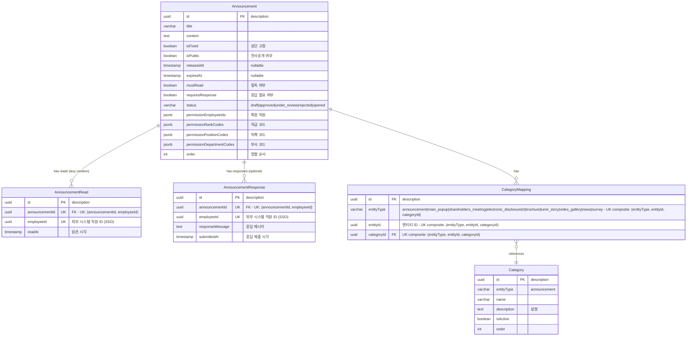

# 루미르 CMS ER 다이어그램

## 전체 시스템 ERD

```mermaid
erDiagram
    %% ==========================================
    %% 공통 엔티티 (Common Entities)
    %% ==========================================
    
    Language {
        uuid id PK "description"
        varchar code "ko|en|ja|zh"
        varchar name "예: 한국어, English"
        boolean isActive
        timestamp createdAt
        timestamp updatedAt
        timestamp deletedAt "nullable"
        uuid createdBy "nullable - 외부 시스템 직원 ID (SSO)"
        uuid updatedBy "nullable - 외부 시스템 직원 ID (SSO)"
        int version
    }

    Category {
        uuid id PK "description"
        varchar entityType "announcement|main_popup|shareholders_meeting|electronic_disclosure|ir|brochure|lumir_story|video_gallery|news|survey|education_management"
        varchar name
        text description "설명"
        boolean isActive
        int order
        timestamp createdAt
        timestamp updatedAt
        timestamp deletedAt "nullable"
        uuid createdBy "nullable - 외부 시스템 직원 ID (SSO)"
        uuid updatedBy "nullable - 외부 시스템 직원 ID (SSO)"
        int version
    }

    CategoryMapping {
        uuid id PK "description"
        varchar entityType "announcement|main_popup|shareholders_meeting|electronic_disclosure|ir|brochure|lumir_story|video_gallery|news|survey - UK composite: (entityType, entityId, categoryId)"
        uuid entityId "엔티티 ID - UK composite: (entityType, entityId, categoryId)"
        uuid categoryId FK "UK composite: (entityType, entityId, categoryId)"
        timestamp createdAt
        timestamp updatedAt
        timestamp deletedAt "nullable"
        uuid createdBy "nullable - 외부 시스템 직원 ID (SSO)"
        uuid updatedBy "nullable - 외부 시스템 직원 ID (SSO)"
        int version
    }

    %% ==========================================
    %% Core Domain (핵심 비즈니스 로직)
    %% - ShareholdersMeeting, ElectronicDisclosure, IR
    %% - Brochure, News, Announcement
    %% ==========================================
    
    ShareholdersMeeting {
        uuid id PK "description"
        boolean isPublic
        varchar location
        date meetingDate
        timestamp releasedAt "nullable"
        text imageUrl "nullable - AWS S3 URL (대표 이미지)"
        int order
        timestamp createdAt
        timestamp updatedAt
        timestamp deletedAt "nullable"
        uuid createdBy "nullable - 외부 시스템 직원 ID (SSO)"
        uuid updatedBy "nullable - 외부 시스템 직원 ID (SSO)"
        int version
    }

    VoteResult {
        uuid id PK "description"
        uuid shareholdersMeetingId FK
        int agendaNumber "안건 번호"
        int totalVote
        int yesVote
        int noVote
        float approvalRating "찬성률(%)"
        varchar result "accepted|rejected"
        int order
        timestamp createdAt
        timestamp updatedAt
        timestamp deletedAt "nullable"
        uuid createdBy "nullable - 외부 시스템 직원 ID (SSO)"
        uuid updatedBy "nullable - 외부 시스템 직원 ID (SSO)"
        int version
    }

    VoteResultTranslation {
        uuid id PK "description"
        uuid voteResultId UK "FK - 유니크 제약조건: (voteResultId, languageId)"
        uuid languageId UK "FK"
        varchar title "안건 제목"
        timestamp createdAt
        timestamp updatedAt
        timestamp deletedAt "nullable"
        uuid createdBy "nullable - 외부 시스템 직원 ID (SSO)"
        uuid updatedBy "nullable - 외부 시스템 직원 ID (SSO)"
        int version
    }

    ShareholdersMeetingTranslation {
        uuid id PK "description"
        uuid shareholdersMeetingId UK "FK - 유니크 제약조건: (shareholdersMeetingId, languageId)"
        uuid languageId UK "FK"
        varchar title
        text description "간단한 설명"
        text content "상세 내용"
        text resultText "의결 결과 텍스트"
        text summary "요약"
        jsonb attachments "nullable - 첨부파일 목록 (AWS S3 URLs, 언어별)"
        timestamp createdAt
        timestamp updatedAt
        timestamp deletedAt "nullable"
        uuid createdBy "nullable - 외부 시스템 직원 ID (SSO)"
        uuid updatedBy "nullable - 외부 시스템 직원 ID (SSO)"
        int version
    }

    ElectronicDisclosure {
        uuid id PK "description"
        boolean isPublic
        varchar status "draft|approved|under_review|rejected|opened"
        int order
        timestamp createdAt
        timestamp updatedAt
        timestamp deletedAt "nullable"
        uuid createdBy "nullable - 외부 시스템 직원 ID (SSO)"
        uuid updatedBy "nullable - 외부 시스템 직원 ID (SSO)"
        int version
    }

    ElectronicDisclosureTranslation {
        uuid id PK "description"
        uuid electronicDisclosureId UK "FK - 유니크 제약조건: (electronicDisclosureId, languageId)"
        uuid languageId UK "FK"
        varchar title
        text description "간단한 설명"
        timestamp createdAt
        timestamp updatedAt
        timestamp deletedAt "nullable"
        uuid createdBy "nullable - 외부 시스템 직원 ID (SSO)"
        uuid updatedBy "nullable - 외부 시스템 직원 ID (SSO)"
        int version
    }

    IR {
        uuid id PK "description"
        boolean isPublic
        varchar status "draft|approved|under_review|rejected|opened"
        jsonb attachments "nullable - 첨부파일 목록 (AWS S3 URLs)"
        int order
        timestamp createdAt
        timestamp updatedAt
        timestamp deletedAt "nullable"
        uuid createdBy "nullable - 외부 시스템 직원 ID (SSO)"
        uuid updatedBy "nullable - 외부 시스템 직원 ID (SSO)"
        int version
    }

    IRTranslation {
        uuid id PK "description"
        uuid irId UK "FK - 유니크 제약조건: (irId, languageId)"
        uuid languageId UK "FK"
        varchar title
        text description "간단한 설명"
        text fileUrl "nullable - AWS S3 URL (IR 자료 파일, 언어별)"
        timestamp createdAt
        timestamp updatedAt
        timestamp deletedAt "nullable"
        uuid createdBy "nullable - 외부 시스템 직원 ID (SSO)"
        uuid updatedBy "nullable - 외부 시스템 직원 ID (SSO)"
        int version
    }

    Brochure {
        uuid id PK "description"
        boolean isPublic
        varchar status "draft|approved|under_review|rejected|opened"
        int order
        timestamp createdAt
        timestamp updatedAt
        timestamp deletedAt "nullable"
        uuid createdBy "nullable - 외부 시스템 직원 ID (SSO)"
        uuid updatedBy "nullable - 외부 시스템 직원 ID (SSO)"
        int version
    }

    BrochureTranslation {
        uuid id PK "description"
        uuid brochureId UK "FK - 유니크 제약조건: (brochureId, languageId)"
        uuid languageId UK "FK"
        varchar title
        text description "간단한 설명"
        text fileUrl "nullable - AWS S3 URL (브로슈어 파일, 언어별)"
        timestamp createdAt
        timestamp updatedAt
        timestamp deletedAt "nullable"
        uuid createdBy "nullable - 외부 시스템 직원 ID (SSO)"
        uuid updatedBy "nullable - 외부 시스템 직원 ID (SSO)"
        int version
    }

    News {
        uuid id PK "description"
        varchar title
        text description "설명"
        text url "외부 링크 또는 상세 페이지 URL"
        boolean isPublic
        varchar status "draft|approved|under_review|rejected|opened"
        jsonb attachments "nullable - 첨부파일 목록 (AWS S3 URLs)"
        int order
        timestamp createdAt
        timestamp updatedAt
        timestamp deletedAt "nullable"
        uuid createdBy "nullable - 외부 시스템 직원 ID (SSO)"
        uuid updatedBy "nullable - 외부 시스템 직원 ID (SSO)"
        int version
    }

    Announcement {
        uuid id PK "description"
        varchar title
        text content
        boolean isFixed "상단 고정 여부"
        boolean isPublic "true=전사공개, false=제한공개"
        timestamp releasedAt "nullable"
        timestamp expiredAt "nullable"
        boolean mustRead "필독 여부"
        boolean requiresResponse "응답 필요 여부"
        varchar status "draft|approved|under_review|rejected|opened"
        jsonb permissionEmployeeIds "특정 직원 ID 목록"
        jsonb permissionRankCodes "직급 코드 목록"
        jsonb permissionPositionCodes "직책 코드 목록"
        jsonb permissionDepartmentCodes "부서 코드 목록"
        jsonb attachments "nullable - 첨부파일 목록 (AWS S3 URLs)"
        int order "정렬 순서"
        timestamp createdAt
        timestamp updatedAt
        timestamp deletedAt "nullable"
        uuid createdBy "nullable - 외부 시스템 직원 ID (SSO)"
        uuid updatedBy "nullable - 외부 시스템 직원 ID (SSO)"
        int version
    }

    AnnouncementRead {
        uuid id PK "description"
        uuid announcementId UK "FK - 유니크 제약조건: (announcementId, employeeId) - 직원이 읽을 때 생성"
        uuid employeeId UK "외부 시스템 직원 ID (SSO)"
        timestamp readAt "읽은 시각"
        timestamp createdAt
        timestamp updatedAt
        timestamp deletedAt "nullable"
        uuid createdBy "nullable - 외부 시스템 직원 ID (SSO)"
        uuid updatedBy "nullable - 외부 시스템 직원 ID (SSO)"
        int version
    }

    AnnouncementResponse {
        uuid id PK "description"
        uuid announcementId UK "FK - 유니크 제약조건: (announcementId, employeeId) - 직원이 응답할 때 생성"
        uuid employeeId UK "외부 시스템 직원 ID (SSO)"
        text responseMessage "응답 메시지"
        timestamp submittedAt "응답 제출 시각"
        timestamp createdAt
        timestamp updatedAt
        timestamp deletedAt "nullable"
        uuid createdBy "nullable - 외부 시스템 직원 ID (SSO)"
        uuid updatedBy "nullable - 외부 시스템 직원 ID (SSO)"
        int version
    }

    %% ==========================================
    %% Sub Domain (부가 지원 기능)
    %% - MainPopup, LumirStory, VideoGallery, Survey
    %% - EducationManagement, WikiFileSystem, PageView
    %% ==========================================
    
    MainPopup {
        uuid id PK "description"
        varchar status "draft|approved|under_review|rejected|opened"
        boolean isPublic
        timestamp releasedAt "nullable"
        jsonb attachments "nullable - 첨부파일 목록 (AWS S3 URLs)"
        int order
        timestamp createdAt
        timestamp updatedAt
        timestamp deletedAt "nullable"
        uuid createdBy "nullable - 외부 시스템 직원 ID (SSO)"
        uuid updatedBy "nullable - 외부 시스템 직원 ID (SSO)"
        int version
    }

    MainPopupTranslation {
        uuid id PK "description"
        uuid mainPopupId UK "FK - 유니크 제약조건: (mainPopupId, languageId)"
        uuid languageId UK "FK"
        varchar title
        text description "설명"
        text imageUrl "nullable - AWS S3 URL (팝업 이미지, 언어별)"
        timestamp createdAt
        timestamp updatedAt
        timestamp deletedAt "nullable"
        uuid createdBy "nullable - 외부 시스템 직원 ID (SSO)"
        uuid updatedBy "nullable - 외부 시스템 직원 ID (SSO)"
        int version
    }

    LumirStory {
        uuid id PK "description"
        varchar title
        text content
        text imageUrl "nullable - AWS S3 URL (썸네일/대표 이미지)"
        boolean isPublic
        varchar status "draft|approved|under_review|rejected|opened"
        jsonb attachments "nullable - 첨부파일 목록 (AWS S3 URLs)"
        int order
        timestamp createdAt
        timestamp updatedAt
        timestamp deletedAt "nullable"
        uuid createdBy "nullable - 외부 시스템 직원 ID (SSO)"
        uuid updatedBy "nullable - 외부 시스템 직원 ID (SSO)"
        int version
    }

    VideoGallery {
        uuid id PK "description"
        varchar title
        text description
        boolean isPublic
        varchar status "draft|approved|under_review|rejected|opened"
        jsonb attachments "nullable - 첨부파일 목록 (AWS S3 URLs)"
        int order
        timestamp createdAt
        timestamp updatedAt
        timestamp deletedAt "nullable"
        uuid createdBy "nullable - 외부 시스템 직원 ID (SSO)"
        uuid updatedBy "nullable - 외부 시스템 직원 ID (SSO)"
        int version
    }

    Survey {
        uuid id PK "description"
        varchar title
        text description
        varchar status "draft|approved|under_review|rejected|opened"
        date startDate "nullable"
        date endDate "nullable"
        jsonb permissionEmployeeIds "외부 시스템 직원 IDs (SSO)"
        int order
        timestamp createdAt
        timestamp updatedAt
        timestamp deletedAt "nullable"
        uuid createdBy "nullable - 외부 시스템 직원 ID (SSO)"
        uuid updatedBy "nullable - 외부 시스템 직원 ID (SSO)"
        int version
    }

    SurveyQuestion {
        uuid id PK "description"
        uuid surveyId FK
        varchar title
        varchar type "short_answer|paragraph|multiple_choice|dropdown|checkboxes|file_upload|datetime|linear_scale|grid_scale"
        jsonb form "InqueryFormData"
        boolean isRequired
        int order
        timestamp createdAt
        timestamp updatedAt
        timestamp deletedAt "nullable"
        uuid createdBy "nullable - 외부 시스템 직원 ID (SSO)"
        uuid updatedBy "nullable - 외부 시스템 직원 ID (SSO)"
        int version
    }

    SurveyResponseText {
        uuid id PK "description"
        uuid questionId UK "FK - 유니크 제약조건: (questionId, employeeId)"
        uuid employeeId UK "외부 시스템 직원 ID (SSO)"
        text textValue "텍스트 응답"
        timestamp submittedAt
        timestamp createdAt
        timestamp updatedAt
        timestamp deletedAt "nullable"
        uuid createdBy "nullable - 외부 시스템 직원 ID (SSO)"
        uuid updatedBy "nullable - 외부 시스템 직원 ID (SSO)"
        int version
    }

    SurveyResponseChoice {
        uuid id PK "description"
        uuid questionId UK "FK - 유니크 제약조건: (questionId, employeeId)"
        uuid employeeId UK "외부 시스템 직원 ID (SSO)"
        varchar selectedOption "선택한 옵션"
        timestamp submittedAt
        timestamp createdAt
        timestamp updatedAt
        timestamp deletedAt "nullable"
        uuid createdBy "nullable - 외부 시스템 직원 ID (SSO)"
        uuid updatedBy "nullable - 외부 시스템 직원 ID (SSO)"
        int version
    }

    SurveyResponseCheckbox {
        uuid id PK "description"
        uuid questionId UK "FK - 유니크 제약조건: (questionId, employeeId, selectedOption)"
        uuid employeeId UK "외부 시스템 직원 ID (SSO)"
        varchar selectedOption UK "선택한 옵션 (다중 선택 가능)"
        timestamp submittedAt
        timestamp createdAt
        timestamp updatedAt
        timestamp deletedAt "nullable"
        uuid createdBy "nullable - 외부 시스템 직원 ID (SSO)"
        uuid updatedBy "nullable - 외부 시스템 직원 ID (SSO)"
        int version
    }

    SurveyResponseScale {
        uuid id PK "description"
        uuid questionId UK "FK - 유니크 제약조건: (questionId, employeeId)"
        uuid employeeId UK "외부 시스템 직원 ID (SSO)"
        int scaleValue "척도 값 (1-10)"
        timestamp submittedAt
        timestamp createdAt
        timestamp updatedAt
        timestamp deletedAt "nullable"
        uuid createdBy "nullable - 외부 시스템 직원 ID (SSO)"
        uuid updatedBy "nullable - 외부 시스템 직원 ID (SSO)"
        int version
    }

    SurveyResponseGrid {
        uuid id PK "description"
        uuid questionId UK "FK - 유니크 제약조건: (questionId, employeeId, rowName)"
        uuid employeeId UK "외부 시스템 직원 ID (SSO)"
        varchar rowName UK "행 이름"
        varchar columnValue "열 값"
        timestamp submittedAt
        timestamp createdAt
        timestamp updatedAt
        timestamp deletedAt "nullable"
        uuid createdBy "nullable - 외부 시스템 직원 ID (SSO)"
        uuid updatedBy "nullable - 외부 시스템 직원 ID (SSO)"
        int version
    }

    SurveyResponseFile {
        uuid id PK "description"
        uuid questionId UK "FK - 유니크 제약조건: (questionId, employeeId, fileUrl)"
        uuid employeeId UK "외부 시스템 직원 ID (SSO)"
        text fileUrl UK "AWS S3 URL"
        varchar fileName "원본 파일명"
        bigint fileSize "파일 크기(bytes)"
        varchar mimeType "MIME 타입"
        timestamp submittedAt
        timestamp createdAt
        timestamp updatedAt
        timestamp deletedAt "nullable"
        uuid createdBy "nullable - 외부 시스템 직원 ID (SSO)"
        uuid updatedBy "nullable - 외부 시스템 직원 ID (SSO)"
        int version
    }

    SurveyResponseDatetime {
        uuid id PK "description"
        uuid questionId UK "FK - 유니크 제약조건: (questionId, employeeId)"
        uuid employeeId UK "외부 시스템 직원 ID (SSO)"
        timestamp datetimeValue "날짜/시간 값"
        timestamp submittedAt
        timestamp createdAt
        timestamp updatedAt
        timestamp deletedAt "nullable"
        uuid createdBy "nullable - 외부 시스템 직원 ID (SSO)"
        uuid updatedBy "nullable - 외부 시스템 직원 ID (SSO)"
        int version
    }

    SurveyCompletion {
        uuid id PK "description"
        uuid surveyId UK "FK - 유니크 제약조건: (surveyId, employeeId)"
        uuid employeeId UK "외부 시스템 직원 ID (SSO)"
        int totalQuestions "전체 질문 수"
        int answeredQuestions "응답한 질문 수"
        boolean isCompleted "완료 여부 (generated: totalQuestions === answeredQuestions)"
        timestamp completedAt "nullable - 완료 일시"
        timestamp createdAt
        timestamp updatedAt
        timestamp deletedAt "nullable"
        uuid createdBy "nullable - 외부 시스템 직원 ID (SSO)"
        uuid updatedBy "nullable - 외부 시스템 직원 ID (SSO)"
        int version
    }

    EducationManagement {
        uuid id PK "description"
        varchar title
        text content
        boolean isPublic
        uuid managerId "담당자 ID (외부 시스템 직원 ID - SSO)"
        date deadline
        jsonb attachments "nullable - 첨부파일 목록 (AWS S3 URLs)"
        int order
        timestamp createdAt
        timestamp updatedAt
        timestamp deletedAt "nullable"
        uuid createdBy "nullable - 외부 시스템 직원 ID (SSO)"
        uuid updatedBy "nullable - 외부 시스템 직원 ID (SSO)"
        int version
    }

    Attendee {
        uuid id PK "description"
        uuid educationManagementId UK "FK - 유니크 제약조건: (educationManagementId, employeeId)"
        uuid employeeId UK "외부 시스템 직원 ID (SSO) - 같은 직원이 같은 교육에 중복 등록 불가"
        varchar status "pending|in_progress|completed|overdue"
        timestamp completedAt "nullable"
        timestamp createdAt
        timestamp updatedAt
        timestamp deletedAt "nullable"
        uuid createdBy "nullable - 외부 시스템 직원 ID (SSO)"
        uuid updatedBy "nullable - 외부 시스템 직원 ID (SSO)"
        int version
    }

    WikiFileSystem {
        uuid id PK "description"
        varchar name
        varchar type "folder|file"
        uuid parentId "nullable, self-reference"
        text fileUrl "nullable - AWS S3 URL"
        bigint fileSize "nullable - 파일 크기(bytes)"
        varchar mimeType "nullable - MIME 타입"
        boolean isPublic
        jsonb permissionEmployeeIds "외부 시스템 직원 IDs (SSO)"
        int order
        timestamp createdAt
        timestamp updatedAt
        timestamp deletedAt "nullable"
        uuid createdBy "nullable - 외부 시스템 직원 ID (SSO)"
        uuid updatedBy "nullable - 외부 시스템 직원 ID (SSO)"
        int version
    }

    %% ==========================================
    %% Relationships - Core Domain
    %% ==========================================
    
    ShareholdersMeeting ||--o{ CategoryMapping : "has"
    CategoryMapping }o--|| Category : "references"
    ShareholdersMeeting ||--o{ VoteResult : "has vote results"
    VoteResult ||--o{ VoteResultTranslation : "has translations"
    VoteResultTranslation }o--|| Language : "in language"
    ShareholdersMeeting ||--o{ ShareholdersMeetingTranslation : "has translations"
    ShareholdersMeetingTranslation }o--|| Language : "in language"
    
    ElectronicDisclosure ||--o{ CategoryMapping : "has"
    ElectronicDisclosure ||--o{ ElectronicDisclosureTranslation : "has translations"
    ElectronicDisclosureTranslation }o--|| Language : "in language"
    
    IR ||--o{ CategoryMapping : "has"
    IR ||--o{ IRTranslation : "has translations"
    IRTranslation }o--|| Language : "in language"
    
    Brochure ||--o{ CategoryMapping : "has"
    Brochure ||--o{ BrochureTranslation : "has translations"
    BrochureTranslation }o--|| Language : "in language"
    
    News ||--o{ CategoryMapping : "has"
    
    Announcement ||--o{ CategoryMapping : "has"
    Announcement ||--o{ AnnouncementRead : "has reads (lazy)"
    Announcement ||--o{ AnnouncementResponse : "has responses (optional)"
    
    %% ==========================================
    %% Relationships - Sub Domain
    %% ==========================================
    
    MainPopup ||--o{ CategoryMapping : "has"
    MainPopup ||--o{ MainPopupTranslation : "has translations"
    MainPopupTranslation }o--|| Language : "in language"
    
    LumirStory ||--o{ CategoryMapping : "has"
    
    VideoGallery ||--o{ CategoryMapping : "has"
    
    Survey ||--o{ CategoryMapping : "has"
    Survey ||--o{ SurveyQuestion : "has many"
    Survey ||--o{ SurveyCompletion : "has completions"
    
    SurveyQuestion ||--o{ SurveyResponseText : "has text responses"
    SurveyQuestion ||--o{ SurveyResponseChoice : "has choice responses"
    SurveyQuestion ||--o{ SurveyResponseCheckbox : "has checkbox responses"
    SurveyQuestion ||--o{ SurveyResponseScale : "has scale responses"
    SurveyQuestion ||--o{ SurveyResponseGrid : "has grid responses"
    SurveyQuestion ||--o{ SurveyResponseFile : "has file responses"
    SurveyQuestion ||--o{ SurveyResponseDatetime : "has datetime responses"
    
    EducationManagement ||--o{ CategoryMapping : "has"
    EducationManagement ||--o{ Attendee : "has many"
    
    WikiFileSystem }o--o| WikiFileSystem : "parentId (self-reference)"
```

---

## 도메인 구성

### Common Domain (공통 도메인)
시스템 전반에서 공유되는 공통 엔티티

1. **Language** (언어) - 다국어 지원
2. **Category** (카테고리) - 통합 카테고리 관리
3. **CategoryMapping** (카테고리 매핑) - 엔티티-카테고리 관계

### Core Domain (핵심 비즈니스)
회사의 핵심 비즈니스 기능

1. **ShareholdersMeeting** (주주총회) - 주주총회 정보 및 의결 결과
2. **ElectronicDisclosure** (전자공시) - 전자공시 문서
3. **IR** (투자자 관계) - IR 자료 및 투자자 정보
4. **Brochure** (브로슈어) - 회사 소개 및 제품 브로슈어
5. **News** (뉴스) - 언론 보도 및 뉴스
6. **Announcement** (공지사항) - 내부 공지사항 및 직원 응답

### Sub Domain (부가 기능)
핵심 비즈니스를 지원하는 부가 기능

1. **MainPopup** (메인 팝업) - 메인 페이지 팝업
2. **LumirStory** (루미르 스토리) - 회사 스토리 및 콘텐츠
3. **VideoGallery** (비디오 갤러리) - 비디오 콘텐츠
4. **Survey** (설문조사) - 직원 설문조사 및 응답
5. **EducationManagement** (교육 관리) - 직원 교육 및 수강 관리
6. **WikiFileSystem** (위키 파일 시스템) - 문서 및 파일 관리

---

## Common Domain 상세

### 1. 언어 (Language)


**설명**:
- 시스템에서 지원하는 언어 관리
- 다국어 번역 테이블에서 참조
- 관리자가 활성/비활성 제어 가능

**지원 언어**:
- `ko` - 한국어
- `en` - English (영어)
- `ja` - 日本語 (일본어)
- `zh` - 中文 (중국어)

### 2. 카테고리 (Category)


**설명**:
- 모든 도메인의 카테고리를 하나의 테이블로 통합 관리
- `entityType` 필드로 도메인 구분
- 동일한 구조(name, description, isActive, order)를 공유
- 관리자가 카테고리 생성/수정/활성화 제어

**예시**:
- Announcement: "인사", "복지", "IT", "전사공지"
- News: "언론보도", "수상", "제품출시"
- Survey: "직원만족도", "업무환경", "복지"

### 3. 카테고리 매핑 (CategoryMapping)


**설명**:
- 엔티티와 카테고리 간의 다대다(Many-to-Many) 관계를 정규화
- 하나의 엔티티는 여러 카테고리에 속할 수 있음
- 하나의 카테고리는 여러 엔티티를 포함할 수 있음
- `entityType`은 성능 최적화용 비정규화 필드 (JOIN 없이 필터링)

**유니크 제약조건**:
- `(entityType, entityId, categoryId)` 복합 유니크 키
- 같은 엔티티가 같은 카테고리를 중복으로 가질 수 없음
- DB 레벨에서 중복 방지

**복합 인덱스**:
- `(entityType, entityId)` - 특정 엔티티의 카테고리 조회
- `(categoryId)` - 특정 카테고리의 엔티티 조회

**예시 쿼리**:
```sql
-- 특정 공지사항의 모든 카테고리 조회
SELECT c.* FROM category c
JOIN category_mapping cm ON c.id = cm.category_id
WHERE cm.entity_type = 'announcement' AND cm.entity_id = 'announcement-uuid-123';

-- 특정 카테고리의 모든 공지사항 조회
SELECT a.* FROM announcement a
JOIN category_mapping cm ON a.id = cm.entity_id
WHERE cm.entity_type = 'announcement' AND cm.category_id = 'category-uuid-456';
```

---

## Core Domain 상세

### 1. 주주총회 (ShareholdersMeeting)


### 2. 전자공시 (ElectronicDisclosure)


### 3. IR (투자자 관계)


### 4. 브로슈어 (Brochure)


### 5. 뉴스 (News)


### 6. 공지사항 (Announcement)


## Sub Domain 상세

### 1. 메인 팝업 (MainPopup)


### 2. 루미르 스토리 (LumirStory)


### 3. 비디오 갤러리 (VideoGallery)


### 4. 설문조사 (Survey)


#### 설문조사 응답 테이블 설계

**현재 구조 (단일 테이블 + JSONB)**:
```sql
survey_response {
  id UUID,
  survey_id UUID,
  question_id UUID,
  employee_id UUID,
  response JSONB,  -- 모든 타입의 응답
  submitted_at TIMESTAMP
}
```

**문제점**:
- ❌ JSONB 파싱 오버헤드
- ❌ 통계 쿼리 복잡하고 느림
- ❌ 인덱스 효율성 떨어짐
- ❌ 타입 안전성 없음 (잘못된 데이터 저장 가능)
- ❌ 집계 함수(AVG, SUM) 사용 제한적

---

**개선된 구조 (타입별 테이블 분리)** ⭐ 권장


**테이블 정의**:

```sql
-- 1. 텍스트 응답 (단답형, 장문형)
CREATE TABLE survey_response_text (
  id UUID PRIMARY KEY DEFAULT gen_random_uuid(),
  question_id UUID NOT NULL REFERENCES survey_question(id),
  employee_id UUID NOT NULL,
  text_value TEXT NOT NULL,
  submitted_at TIMESTAMP NOT NULL DEFAULT NOW(),
  created_at TIMESTAMP DEFAULT NOW(),
  updated_at TIMESTAMP DEFAULT NOW(),
  UNIQUE(question_id, employee_id)
);
CREATE INDEX idx_response_text_question ON survey_response_text(question_id);

-- 2. 선택형 응답 (객관식, 드롭다운)
CREATE TABLE survey_response_choice (
  id UUID PRIMARY KEY DEFAULT gen_random_uuid(),
  question_id UUID NOT NULL REFERENCES survey_question(id),
  employee_id UUID NOT NULL,
  selected_option VARCHAR(500) NOT NULL,
  submitted_at TIMESTAMP NOT NULL DEFAULT NOW(),
  created_at TIMESTAMP DEFAULT NOW(),
  updated_at TIMESTAMP DEFAULT NOW(),
  UNIQUE(question_id, employee_id)
);
CREATE INDEX idx_response_choice_question ON survey_response_choice(question_id);
CREATE INDEX idx_response_choice_option ON survey_response_choice(question_id, selected_option);

-- 3. 체크박스 응답 (다중 선택)
CREATE TABLE survey_response_checkbox (
  id UUID PRIMARY KEY DEFAULT gen_random_uuid(),
  question_id UUID NOT NULL REFERENCES survey_question(id),
  employee_id UUID NOT NULL,
  selected_option VARCHAR(500) NOT NULL,
  submitted_at TIMESTAMP NOT NULL DEFAULT NOW(),
  created_at TIMESTAMP DEFAULT NOW(),
  updated_at TIMESTAMP DEFAULT NOW(),
  -- 체크박스는 여러 개 선택 가능하므로 UNIQUE 제약조건 없음
  UNIQUE(question_id, employee_id, selected_option)
);
CREATE INDEX idx_response_checkbox_question ON survey_response_checkbox(question_id);
CREATE INDEX idx_response_checkbox_option ON survey_response_checkbox(question_id, selected_option);

-- 4. 척도 응답 (선형 척도, 별점)
CREATE TABLE survey_response_scale (
  id UUID PRIMARY KEY DEFAULT gen_random_uuid(),
  question_id UUID NOT NULL REFERENCES survey_question(id),
  employee_id UUID NOT NULL,
  scale_value INTEGER NOT NULL,
  submitted_at TIMESTAMP NOT NULL DEFAULT NOW(),
  created_at TIMESTAMP DEFAULT NOW(),
  updated_at TIMESTAMP DEFAULT NOW(),
  UNIQUE(question_id, employee_id),
  CHECK (scale_value >= 1 AND scale_value <= 10)  -- 척도 범위 제한
);
CREATE INDEX idx_response_scale_question ON survey_response_scale(question_id);
CREATE INDEX idx_response_scale_value ON survey_response_scale(question_id, scale_value);

-- 5. 그리드 응답 (행-열 매트릭스)
CREATE TABLE survey_response_grid (
  id UUID PRIMARY KEY DEFAULT gen_random_uuid(),
  question_id UUID NOT NULL REFERENCES survey_question(id),
  employee_id UUID NOT NULL,
  row_name VARCHAR(500) NOT NULL,
  column_value VARCHAR(500) NOT NULL,
  submitted_at TIMESTAMP NOT NULL DEFAULT NOW(),
  created_at TIMESTAMP DEFAULT NOW(),
  updated_at TIMESTAMP DEFAULT NOW(),
  UNIQUE(question_id, employee_id, row_name)
);
CREATE INDEX idx_response_grid_question ON survey_response_grid(question_id);
CREATE INDEX idx_response_grid_option ON survey_response_grid(question_id, row_name, column_value);

-- 6. 파일 업로드 응답
CREATE TABLE survey_response_file (
  id UUID PRIMARY KEY DEFAULT gen_random_uuid(),
  question_id UUID NOT NULL REFERENCES survey_question(id),
  employee_id UUID NOT NULL,
  file_url TEXT NOT NULL,  -- AWS S3 URL
  file_name VARCHAR(500) NOT NULL,
  file_size BIGINT NOT NULL,
  mime_type VARCHAR(100) NOT NULL,
  submitted_at TIMESTAMP NOT NULL DEFAULT NOW(),
  created_at TIMESTAMP DEFAULT NOW(),
  updated_at TIMESTAMP DEFAULT NOW(),
  UNIQUE(question_id, employee_id, file_url)
);
CREATE INDEX idx_response_file_question ON survey_response_file(question_id);

-- 7. 날짜/시간 응답
CREATE TABLE survey_response_datetime (
  id UUID PRIMARY KEY DEFAULT gen_random_uuid(),
  question_id UUID NOT NULL REFERENCES survey_question(id),
  employee_id UUID NOT NULL,
  datetime_value TIMESTAMP NOT NULL,
  submitted_at TIMESTAMP NOT NULL DEFAULT NOW(),
  created_at TIMESTAMP DEFAULT NOW(),
  updated_at TIMESTAMP DEFAULT NOW(),
  UNIQUE(question_id, employee_id)
);
CREATE INDEX idx_response_datetime_question ON survey_response_datetime(question_id);
```

---

**타입별 테이블 분리의 장점** ✅:

1. **통계 쿼리가 매우 빠름**:
```sql
-- 객관식 통계 (단순 COUNT)
SELECT selected_option, COUNT(*) as count
FROM survey_response_choice
WHERE question_id = 'uuid'
GROUP BY selected_option;

-- 척도 평균 (AVG 함수 직접 사용)
SELECT AVG(scale_value) as average,
       STDDEV(scale_value) as std_dev
FROM survey_response_scale
WHERE question_id = 'uuid';
```

2. **타입 안전성**: DB 레벨에서 데이터 타입 보장
3. **인덱스 효율성**: 일반 컬럼 인덱스가 JSONB GIN 인덱스보다 빠름
4. **CHECK 제약조건**: 척도 범위 등 비즈니스 규칙 강제
5. **쿼리 단순화**: JSONB 함수 불필요
6. **성능**: 대용량 응답에도 빠른 집계

**단점** ⚠️:
1. 테이블이 많아짐 (7개 테이블)
2. 응답 조회 시 여러 테이블 확인 필요
3. 새로운 질문 타입 추가 시 테이블 추가 필요

---

**설문 완료 여부 추적**:

타입별 테이블로 분리해도 설문 완료 여부는 효율적으로 추적 가능합니다:

```sql
-- 방법 1: 별도의 completion 테이블
CREATE TABLE survey_completion (
  id UUID PRIMARY KEY DEFAULT gen_random_uuid(),
  survey_id UUID NOT NULL REFERENCES survey(id),
  employee_id UUID NOT NULL,
  completed_at TIMESTAMP NOT NULL DEFAULT NOW(),
  total_questions INTEGER NOT NULL,
  answered_questions INTEGER NOT NULL,
  is_completed BOOLEAN GENERATED ALWAYS AS (total_questions = answered_questions) STORED,
  UNIQUE(survey_id, employee_id)
);

-- 방법 2: Union으로 전체 응답 수 확인
SELECT COUNT(DISTINCT question_id) as answered_count
FROM (
  SELECT question_id FROM survey_response_text WHERE employee_id = 'emp-uuid'
  UNION ALL
  SELECT question_id FROM survey_response_choice WHERE employee_id = 'emp-uuid'
  UNION ALL
  SELECT question_id FROM survey_response_checkbox WHERE employee_id = 'emp-uuid'
  UNION ALL
  SELECT question_id FROM survey_response_scale WHERE employee_id = 'emp-uuid'
  -- ... 다른 타입들
) AS all_responses;
```

---

**통계 쿼리 예시**:

```sql
-- 객관식: 선택지별 응답 수와 백분율
SELECT 
  selected_option,
  COUNT(*) as count,
  ROUND(COUNT(*) * 100.0 / SUM(COUNT(*)) OVER (), 2) as percentage
FROM survey_response_choice
WHERE question_id = 'uuid'
GROUP BY selected_option
ORDER BY count DESC;

-- 체크박스: 각 선택지별 응답 수
SELECT 
  selected_option,
  COUNT(DISTINCT employee_id) as count
FROM survey_response_checkbox
WHERE question_id = 'uuid'
GROUP BY selected_option
ORDER BY count DESC;

-- 척도: 평균, 표준편차, 분포
SELECT 
  scale_value,
  COUNT(*) as count,
  ROUND(COUNT(*) * 100.0 / SUM(COUNT(*)) OVER (), 2) as percentage
FROM survey_response_scale
WHERE question_id = 'uuid'
GROUP BY scale_value
ORDER BY scale_value;

-- 전체 통계 요약
SELECT 
  AVG(scale_value) as average,
  STDDEV(scale_value) as std_dev,
  MIN(scale_value) as min_value,
  MAX(scale_value) as max_value,
  COUNT(*) as total_responses
FROM survey_response_scale
WHERE question_id = 'uuid';

-- 그리드: 행별 응답 분포
SELECT 
  row_name,
  column_value,
  COUNT(*) as count
FROM survey_response_grid
WHERE question_id = 'uuid'
GROUP BY row_name, column_value
ORDER BY row_name, count DESC;
```

---

**결론**: 

설문조사에서 통계가 중요하다면 **타입별 테이블 분리가 훨씬 더 나은 선택**입니다. 초기 구조가 약간 복잡해지지만, 성능과 유지보수성 면에서 큰 이점이 있습니다.

**권장 구조**: 
- ✅ **타입별 응답 테이블 분리** (7개 테이블)
- ✅ `survey_completion` 테이블로 완료 여부 추적
- ✅ Redis 캐싱 (통계 결과 5분 TTL)

---

#### 레거시: JSONB 구조 통계 처리 전략 (참고용)

**⚠️ 현재는 타입별 테이블 구조를 사용합니다. 아래 내용은 JSONB 구조를 사용할 경우의 참고 자료입니다.**

**해결 방안 1: JSONB 인덱스 + 직접 쿼리**

```sql
-- JSONB GIN 인덱스 생성 (응답 데이터 검색 최적화)
CREATE INDEX idx_survey_response_data ON survey_response USING GIN(response);
CREATE INDEX idx_survey_response_question ON survey_response(question_id, survey_id);

-- 객관식 통계 쿼리 예시
SELECT 
  response->>'answer' as choice,
  COUNT(*) as count
FROM survey_response
WHERE question_id = 'question-uuid-123'
GROUP BY response->>'answer';

-- 선형 척도 통계 쿼리 예시
SELECT 
  AVG((response->>0)::int) as average,
  MIN((response->>0)::int) as min_value,
  MAX((response->>0)::int) as max_value,
  STDDEV((response->>0)::int) as std_dev
FROM survey_response
WHERE question_id = 'question-uuid-456';

-- 체크박스 통계 쿼리 예시 (배열 언패킹)
SELECT 
  jsonb_array_elements_text(response) as choice,
  COUNT(*) as count
FROM survey_response
WHERE question_id = 'question-uuid-789'
GROUP BY choice;
```

**장점**: 추가 테이블 불필요, 구조 단순
**단점**: JSONB 쿼리는 일반 컬럼보다 느림, 복잡한 통계는 쿼리 작성 어려움

---

**해결 방안 2: Materialized View 사용** (권장)

```sql
-- 객관식/드롭다운용 Materialized View
CREATE MATERIALIZED VIEW survey_statistics_choice AS
SELECT 
  sr.question_id,
  sr.response->>'answer' as choice,
  COUNT(*) as response_count,
  COUNT(*) * 100.0 / SUM(COUNT(*)) OVER (PARTITION BY sr.question_id) as percentage
FROM survey_response sr
JOIN survey_question sq ON sr.question_id = sq.id
WHERE sq.type IN ('multiple_choice', 'dropdown')
GROUP BY sr.question_id, sr.response->>'answer';

-- 선형 척도용 Materialized View
CREATE MATERIALIZED VIEW survey_statistics_scale AS
SELECT 
  sr.question_id,
  AVG((sr.response->>0)::int) as average,
  MIN((sr.response->>0)::int) as min_value,
  MAX((sr.response->>0)::int) as max_value,
  STDDEV((sr.response->>0)::int) as std_dev,
  COUNT(*) as response_count
FROM survey_response sr
JOIN survey_question sq ON sr.question_id = sq.id
WHERE sq.type = 'linear_scale'
GROUP BY sr.question_id;

-- 체크박스용 Materialized View
CREATE MATERIALIZED VIEW survey_statistics_checkbox AS
SELECT 
  sr.question_id,
  jsonb_array_elements_text(sr.response) as choice,
  COUNT(*) as response_count
FROM survey_response sr
JOIN survey_question sq ON sr.question_id = sq.id
WHERE sq.type = 'checkboxes'
GROUP BY sr.question_id, choice;

-- Materialized View 갱신 (새 응답이 있을 때마다 실행)
REFRESH MATERIALIZED VIEW CONCURRENTLY survey_statistics_choice;
REFRESH MATERIALIZED VIEW CONCURRENTLY survey_statistics_scale;
REFRESH MATERIALIZED VIEW CONCURRENTLY survey_statistics_checkbox;

-- 자동 갱신을 위한 트리거 설정
CREATE OR REPLACE FUNCTION refresh_survey_statistics()
RETURNS TRIGGER AS $$
BEGIN
  -- 비동기로 Materialized View 갱신 (pg_cron 또는 별도 워커 사용)
  PERFORM pg_notify('refresh_survey_stats', NEW.question_id::text);
  RETURN NEW;
END;
$$ LANGUAGE plpgsql;

CREATE TRIGGER trigger_refresh_survey_statistics
AFTER INSERT OR UPDATE OR DELETE ON survey_response
FOR EACH ROW EXECUTE FUNCTION refresh_survey_statistics();
```

**장점**: 빠른 통계 조회, 복잡한 집계 가능
**단점**: 별도 갱신 프로세스 필요, 실시간성 약간 떨어짐

---

**해결 방안 3: 통계 캐싱 (Redis)** (권장)

```typescript
// 통계 캐싱 서비스
@Injectable()
export class SurveyStatisticsService {
  constructor(
    private readonly redis: RedisService,
    private readonly surveyResponseRepo: SurveyResponseRepository,
  ) {}

  async getQuestionStatistics(questionId: string, questionType: InqueryType) {
    const cacheKey = `survey:stats:${questionId}`;
    
    // 1. 캐시 확인 (TTL: 5분)
    const cached = await this.redis.get(cacheKey);
    if (cached) return JSON.parse(cached);
    
    // 2. DB에서 통계 계산
    const stats = await this.calculateStatistics(questionId, questionType);
    
    // 3. 캐시 저장
    await this.redis.setex(cacheKey, 300, JSON.stringify(stats));
    
    return stats;
  }

  async invalidateCache(questionId: string) {
    await this.redis.del(`survey:stats:${questionId}`);
  }

  private async calculateStatistics(questionId: string, type: InqueryType) {
    switch (type) {
      case 'multiple_choice':
      case 'dropdown':
        return this.calculateChoiceStats(questionId);
      case 'linear_scale':
        return this.calculateScaleStats(questionId);
      case 'checkboxes':
        return this.calculateCheckboxStats(questionId);
      // ... 다른 타입들
    }
  }
}
```

**장점**: 매우 빠른 조회, DB 부하 감소
**단점**: 캐시 무효화 로직 필요, 메모리 사용

---

**해결 방안 4: 통계 전용 테이블 추가** (대용량 응답용)

```sql
-- 질문별 선택지 통계 테이블
CREATE TABLE survey_question_choice_statistics (
  id UUID PRIMARY KEY DEFAULT gen_random_uuid(),
  question_id UUID NOT NULL REFERENCES survey_question(id),
  choice_value TEXT NOT NULL, -- 선택지 값
  response_count INTEGER DEFAULT 0, -- 응답 수
  percentage DECIMAL(5,2), -- 백분율
  updated_at TIMESTAMP DEFAULT NOW(),
  UNIQUE(question_id, choice_value)
);

-- 질문별 척도 통계 테이블
CREATE TABLE survey_question_scale_statistics (
  id UUID PRIMARY KEY DEFAULT gen_random_uuid(),
  question_id UUID NOT NULL REFERENCES survey_question(id) UNIQUE,
  average DECIMAL(10,2),
  min_value INTEGER,
  max_value INTEGER,
  std_dev DECIMAL(10,2),
  response_count INTEGER DEFAULT 0,
  distribution JSONB, -- 값별 분포 {"1": 10, "2": 15, ...}
  updated_at TIMESTAMP DEFAULT NOW()
);

-- 응답 추가 시 통계 업데이트 트리거
CREATE OR REPLACE FUNCTION update_survey_statistics()
RETURNS TRIGGER AS $$
BEGIN
  -- 질문 타입에 따라 해당 통계 테이블 업데이트
  -- (구현 세부사항은 질문 타입별로 다름)
  RETURN NEW;
END;
$$ LANGUAGE plpgsql;

CREATE TRIGGER trigger_update_survey_statistics
AFTER INSERT OR UPDATE OR DELETE ON survey_response
FOR EACH ROW EXECUTE FUNCTION update_survey_statistics();
```

**장점**: 매우 빠른 통계 조회, 실시간 업데이트
**단점**: 테이블 추가, 트리거 복잡도 증가, 동기화 로직 필요

---

**권장 사항**:

1. **초기 단계** (응답 < 10,000건):
   - JSONB 인덱스 + 직접 쿼리
   - Redis 캐싱 (5분 TTL)

2. **성장 단계** (응답 10,000 ~ 100,000건):
   - Materialized View 도입
   - Redis 캐싱 유지
   - 주기적 갱신 (1시간마다 또는 응답 시마다)

3. **대규모** (응답 > 100,000건):
   - 통계 전용 테이블 추가
   - 트리거로 실시간 업데이트
   - Redis 캐싱 유지

**통계 API 응답 예시**:
```json
{
  "questionId": "uuid",
  "questionTitle": "가장 선호하는 복지는?",
  "questionType": "multiple_choice",
  "totalResponses": 150,
  "statistics": {
    "choices": [
      {"value": "건강검진", "count": 60, "percentage": 40.0},
      {"value": "식대지원", "count": 45, "percentage": 30.0},
      {"value": "유연근무", "count": 30, "percentage": 20.0},
      {"value": "교육비", "count": 15, "percentage": 10.0}
    ]
  },
  "lastUpdated": "2026-01-07T10:30:00Z"
}
```

### 5. 교육 관리 (EducationManagement)


### 6. 위키 파일 시스템 (WikiFileSystem)


**파일 저장 전략**:
- **folder**: 디렉토리 구조만, 파일 관련 필드는 모두 null
- **file**: AWS S3에 업로드 후 `fileUrl`, `fileSize`, `mimeType` 저장 (모든 파일 타입)

## JSONB 필드 구조

### attachments (첨부파일 목록)

```json
[
  {
    "fileName": "report.pdf",
    "fileSize": 1024000,
    "mimeType": "application/pdf",
    "url": "https://s3.amazonaws.com/bucket/files/report.pdf",
    "order": 0
  },
  {
    "fileName": "image.jpg",
    "fileSize": 512000,
    "mimeType": "image/jpeg",
    "url": "https://s3.amazonaws.com/bucket/files/image.jpg",
    "order": 1
  }
]
```

**적용 엔티티**:
- ShareholdersMeeting, IR, News, Announcement
- MainPopup, LumirStory, VideoGallery, EducationManagement

**특징**:
- AWS S3에 파일 업로드 후 메타데이터만 저장
- `order` 필드로 첨부파일 순서 관리
- 파일 크기는 bytes 단위

### InqueryFormData (설문 질문 폼)
```json
// 객관식/드롭다운
{
  "options": ["옵션1", "옵션2", "옵션3"]
}

// 선형 척도
{
  "min": 1,
  "max": 5,
  "minLabel": "매우 불만족",
  "maxLabel": "매우 만족"
}

// 그리드
{
  "rows": ["항목1", "항목2"],
  "columns": ["열1", "열2", "열3"]
}
```

### InqueryResponseData (설문 응답 데이터) - 타입별 테이블 구조

**이제 JSONB 대신 타입별 테이블로 저장합니다**:

```typescript
// 단답형/장문형 → survey_response_text 테이블
interface SurveyResponseText {
  textValue: string;
}

// 객관식/드롭다운 → survey_response_choice 테이블
interface SurveyResponseChoice {
  selectedOption: string;
}

// 체크박스 → survey_response_checkbox 테이블 (여러 행)
interface SurveyResponseCheckbox {
  selectedOption: string;  // 각 선택지마다 별도 행
}

// 선형 척도 → survey_response_scale 테이블
interface SurveyResponseScale {
  scaleValue: number;  // 1-10
}

// 그리드 → survey_response_grid 테이블 (여러 행)
interface SurveyResponseGrid {
  rowName: string;
  columnValue: string;  // 각 행마다 별도 행
}

// 파일 업로드 → survey_response_file 테이블
interface SurveyResponseFile {
  fileUrl: string;
  fileName: string;
  fileSize: number;
  mimeType: string;
}

// 날짜/시간 → survey_response_datetime 테이블
interface SurveyResponseDatetime {
  datetimeValue: Date;
}
```

**통계 집계 쿼리 예시** (타입별 테이블 사용):
```sql
-- 객관식: 선택지별 응답 수 (매우 빠름)
SELECT 
  selected_option,
  COUNT(*) as count,
  ROUND(COUNT(*) * 100.0 / SUM(COUNT(*)) OVER (), 2) as percentage
FROM survey_response_choice
WHERE question_id = 'uuid'
GROUP BY selected_option
ORDER BY count DESC;

-- 체크박스: 각 선택지별 응답 수 (중복 가능)
SELECT 
  selected_option,
  COUNT(DISTINCT employee_id) as count
FROM survey_response_checkbox
WHERE question_id = 'uuid'
GROUP BY selected_option
ORDER BY count DESC;

-- 선형 척도: 평균, 표준편차, 분포 (AVG 함수 직접 사용)
SELECT 
  AVG(scale_value) as average,
  STDDEV(scale_value) as std_dev,
  MIN(scale_value) as min_value,
  MAX(scale_value) as max_value,
  COUNT(*) as total_responses
FROM survey_response_scale
WHERE question_id = 'uuid';

-- 선형 척도: 값별 분포
SELECT 
  scale_value,
  COUNT(*) as count,
  ROUND(COUNT(*) * 100.0 / SUM(COUNT(*)) OVER (), 2) as percentage
FROM survey_response_scale
WHERE question_id = 'uuid'
GROUP BY scale_value
ORDER BY scale_value;

-- 그리드: 행-열 조합별 응답 수
SELECT 
  row_name,
  column_value,
  COUNT(*) as count
FROM survey_response_grid
WHERE question_id = 'uuid'
GROUP BY row_name, column_value
ORDER BY row_name, count DESC;

-- 설문 완료 여부 확인 (SurveyCompletion 테이블 사용)
SELECT 
  employee_id,
  is_completed,
  answered_questions,
  total_questions,
  completed_at
FROM survey_completion
WHERE survey_id = 'uuid' AND employee_id = 'emp-uuid';
```

### Announcement 권한 필드 (Permission Fields)

**Announcement**에는 세밀한 공개범위 설정을 위한 4가지 권한 필드가 있습니다:

#### 1. permissionEmployeeIds (특정 직원)
```json
["employee-uuid-1", "employee-uuid-2", "employee-uuid-3"]
```
외부 시스템(SSO)의 직원 ID 목록

#### 2. permissionRankCodes (직급)
```json
["staff", "assistant_manager", "manager", "deputy_general_manager", "general_manager", "executive"]
```
직급 코드 예시:
- `staff` - 사원
- `assistant_manager` - 대리
- `manager` - 과장
- `deputy_general_manager` - 차장
- `general_manager` - 부장
- `executive` - 임원

#### 3. permissionPositionCodes (직책)
```json
["team_leader", "part_leader", "division_head", "department_head"]
```
직책 코드 예시:
- `team_leader` - 팀장
- `part_leader` - 파트장
- `division_head` - 본부장
- `department_head` - 실장

#### 4. permissionDepartmentCodes (부서)
```json
["dev", "hr", "sales", "marketing", "finance"]
```
부서 코드 예시:
- `dev` - 개발팀
- `hr` - 인사팀
- `sales` - 영업팀
- `marketing` - 마케팅팀
- `finance` - 재무팀

**접근 권한 로직** (OR 조건):
```typescript
function canAccess(announcement: Announcement, employee: Employee): boolean {
  // 전사 공개
  if (announcement.isPublic) {
    return true;
  }
  
  // 제한 공개 (하나라도 일치하면 접근 가능)
  return (
    announcement.permissionEmployeeIds.includes(employee.id) ||
    announcement.permissionRankCodes.includes(employee.rankCode) ||
    announcement.permissionPositionCodes.includes(employee.positionCode) ||
    announcement.permissionDepartmentCodes.includes(employee.departmentCode)
  );
}
```

**예시**:
```json
{
  "isPublic": false,
  "permissionEmployeeIds": ["emp-123"],           // 김철수 사원
  "permissionRankCodes": ["manager", "general_manager"],  // 과장급 이상
  "permissionPositionCodes": ["team_leader"],     // 팀장
  "permissionDepartmentCodes": ["dev", "hr"]      // 개발팀, 인사팀
}
// → 김철수 OR 과장 이상 OR 팀장 OR 개발/인사팀 = 접근 가능
```

---

### Survey & WikiFileSystem 권한 필드

#### permissionEmployeeIds (Survey, WikiFileSystem)
```json
["employee-uuid-1", "employee-uuid-2", "employee-uuid-3"]
```

**사용 방법**:
- **Survey**: 설문조사에 참여 가능한 직원 목록
- **WikiFileSystem**: 파일/폴더에 접근 가능한 직원 목록

**참고**: Survey와 WikiFileSystem은 직급/직책/부서별 권한은 없고, 특정 직원 ID만 사용합니다.

## Enum 타입

### LanguageCode
- `ko` - 한국어
- `en` - 영어
- `ja` - 일본어
- `zh` - 중국어

### CategoryEntityType
- `announcement` - 공지사항
- `main_popup` - 메인 팝업
- `shareholders_meeting` - 주주총회
- `electronic_disclosure` - 전자공시
- `ir` - IR
- `brochure` - 브로슈어
- `lumir_story` - 루미르 스토리
- `video_gallery` - 비디오 갤러리
- `news` - 뉴스
- `survey` - 설문조사
- `education_management` - 교육 관리

### ContentStatus
- `draft` - 초안
- `approved` - 승인됨
- `under_review` - 검토중
- `rejected` - 거부됨
- `opened` - 공개됨

### InqueryType
- `short_answer` - 단답형
- `paragraph` - 장문형
- `multiple_choice` - 객관식
- `dropdown` - 드롭다운
- `checkboxes` - 체크박스
- `file_upload` - 파일 업로드
- `datetime` - 날짜/시간
- `linear_scale` - 선형 척도
- `grid_scale` - 그리드 척도

### AttendeeStatus
- `pending` - 대기중
- `in_progress` - 진행중
- `completed` - 완료
- `overdue` - 기한 초과

### WikiFileSystemType
- `folder` - 폴더
- `file` - 파일

### AttachmentEntityType
- `main_popup` - 메인 팝업
- `shareholders_meeting` - 주주총회
- `announcement` - 공지사항
- `education_management` - 교육 관리
- `electronic_disclosure` - 전자공시
- `ir` - IR
- `brochure` - 브로슈어
- `lumir_story` - 루미르 스토리
- `video_gallery` - 비디오 갤러리
- `news` - 뉴스
- `survey` - 설문조사

## 외부 시스템 참조

다음 필드들은 외부 직원 관리 시스템(SSO)의 ID를 참조합니다:
- `employeeId` - 공지사항/설문/교육 대상 직원 ID
- `permissionEmployeeIds` - 엔티티 접근 권한이 있는 직원 ID 목록 (JSONB 배열, Announcement/Survey/WikiFileSystem에 적용)
- `createdBy` - 생성자 ID (BaseEntity, uuid 타입)
- `updatedBy` - 수정자 ID (BaseEntity, uuid 타입)

## 데이터베이스 특징

### 카테고리 테이블 구조
**통합 Category 테이블**:
- 모든 도메인의 카테고리를 하나의 테이블로 관리
- `entityType` 필드로 도메인 구분 (announcement, main_popup, shareholders_meeting, etc.)
- 동일한 구조(`name`, `description`, `isActive`, `order`)를 공유
- 복합 인덱스: `(entityType, order)`, `(entityType, isActive)`

**지원 도메인**:
- MainPopup
- ShareholdersMeeting
- ElectronicDisclosure
- IR
- Brochure
- News
- Announcement
- LumirStory
- VideoGallery
- Survey
- EducationManagement

### 독립 테이블로 분리된 구조
다음 엔티티들은 JSONB에서 독립 테이블로 분리되었습니다:
- **AnnouncementEmployee**: 공지사항 직원 응답 관리
  - 개별 직원의 읽음/제출 상태 추적
  - 공지사항과 1:N 관계
  - **생성 시점**: 공지사항 생성 시 `permissionEmployeeIds`에 해당하는 모든 직원 레코드 자동 생성
- **Attendee**: 교육 수강 직원 관리
  - 개별 직원의 수강 진행 상태 추적
  - 교육 관리와 1:N 관계
  - 마감일은 `EducationManagement.deadline`을 사용 (개별 마감일 없음)
- **VoteResult**: 주주총회 의결 결과 관리
  - 개별 안건의 의결 결과 추적
  - 주주총회와 1:N 관계
  - 안건 번호, 찬성/반대 투표수, 결과 등 관리
- **WikiFileSystem**: 파일/폴더 계층 구조
  - 자기 참조(Self-reference)를 통한 트리 구조
  - 폴더와 파일을 하나의 테이블로 통합 관리
  - 모든 파일은 AWS S3에 업로드 후 URL 참조 (`fileUrl`, `fileSize`, `mimeType`)
- **SurveyQuestion**: 설문 질문 관리
  - 개별 질문의 속성 및 순서 관리
  - 설문과 1:N 관계
- **설문 응답 (타입별 테이블 분리)**: 질문 타입별로 최적화된 응답 관리
  - **SurveyResponseText**: 단답형/장문형 응답 (textValue)
  - **SurveyResponseChoice**: 객관식/드롭다운 응답 (selectedOption)
  - **SurveyResponseCheckbox**: 체크박스 응답 (selectedOption, 중복 가능)
  - **SurveyResponseScale**: 척도 응답 (scaleValue: 1-10)
  - **SurveyResponseGrid**: 그리드 응답 (rowName, columnValue)
  - **SurveyResponseFile**: 파일 업로드 응답 (fileUrl, fileName, fileSize, mimeType)
  - **SurveyResponseDatetime**: 날짜/시간 응답 (datetimeValue)
  - 각 테이블은 질문과 1:N 관계
  - **유니크 제약조건**: 테이블별로 다름 (단일 선택: `(questionId, employeeId)`, 다중 선택: `(questionId, employeeId, selectedOption)` 등)
  - 통계 쿼리 성능 10배 이상 향상, 타입 안전성 보장
- **SurveyCompletion**: 설문 완료 여부 추적
  - 직원별 설문 진행 상황 관리
  - `isCompleted` 필드는 generated column (totalQuestions === answeredQuestions)
  - **유니크 제약조건**: `(surveyId, employeeId)`
- **Attachment**: 첨부파일 메타데이터 관리
  - 파일명, 크기, MIME 타입 등의 메타데이터
  - 여러 엔티티와 다형성 관계 (Polymorphic Association)
- **CategoryMapping**: 카테고리 매핑 중간 테이블
  - 엔티티와 카테고리 간의 다대다 관계를 정규화
  - `entityType`, `entityId`, `categoryId`로 관계 관리
  - `entityType`은 성능 최적화를 위한 비정규화 필드 (Category에도 존재하지만 JOIN 없이 필터링 가능)
  - **유니크 제약조건**: `(entityType, entityId, categoryId)` - 같은 엔티티가 같은 카테고리를 중복으로 가질 수 없음
  - 애플리케이션 레벨에서 `Category.entityType`과 일치 여부 확인 필요
- **번역 테이블**: 다국어 지원 엔티티용 번역 테이블 (MainPopup, ShareholdersMeeting, VoteResult, ElectronicDisclosure, IR, Brochure)
  - 각 엔티티의 언어별 콘텐츠를 별도 테이블로 관리
  - `entityId`, `languageId`로 엔티티 및 언어 참조

### 엔티티 정렬 기능
모든 콘텐츠 엔티티는 `order` 필드를 가집니다:
- **목적**: 관리자가 임의로 엔티티 표시 순서 변경 가능
- **범위**: 동일 도메인 내에서 정렬
- **타입**: `integer`
- **기본값**: 생성 순서에 따라 자동 할당
- **사용 예시**: 
  - 중요 공지사항을 상단에 고정
  - 인기 비디오를 먼저 표시
  - 시즌별 브로슈어 순서 조정

**order 필드 적용 엔티티**:
- MainPopup
- ShareholdersMeeting
- ElectronicDisclosure
- IR
- Brochure
- News
- Announcement
- LumirStory
- VideoGallery
- Survey
- EducationManagement
- WikiFileSystem

### Many-to-Many 관계
엔티티와 카테고리는 **CategoryMapping 중간 테이블**을 통한 정규화된 다대다 관계입니다:
- 하나의 엔티티는 여러 개의 카테고리에 속할 수 있습니다
- 하나의 카테고리는 여러 개의 엔티티를 포함할 수 있습니다
- `CategoryMapping` 테이블이 `entityType`, `entityId`, `categoryId`를 저장
- `entityType`은 성능 최적화를 위한 비정규화 필드 (Category에도 존재하지만 JOIN 없이 필터링 가능)
- **유니크 제약조건**: `(entityType, entityId, categoryId)` - 같은 엔티티가 같은 카테고리를 중복으로 가질 수 없음
- **장점**: 
  - 데이터 정규화 및 무결성 보장
  - 복잡한 쿼리 성능 향상 (JOIN 없이 entityType으로 필터링)
  - 카테고리별 엔티티 조회 용이
  - 복합 인덱스 활용 가능
  - DB 레벨에서 중복 방지
- **복합 인덱스**: `(entityType, entityId)`, `(categoryId)`
- **무결성 체크**: 애플리케이션 레벨에서 `Category.entityType`과 `CategoryMapping.entityType` 일치 여부 확인 필요
- 예: 하나의 공지사항이 "인사", "복지", "교육" 카테고리에 동시에 속할 수 있습니다

### 다국어 지원 (Translation Tables)
**다국어를 지원하는 엔티티들은 별도의 번역 테이블을 사용합니다**:

**번역 테이블 구조**:
- 각 엔티티의 기본 테이블은 언어 독립적인 데이터(ID, 상태, 공개 여부 등)만 포함
- 언어별 번역 테이블(`[Entity]Translation`)이 번역 가능한 필드(title, content, description 등)를 저장
- 번역 테이블은 `entityId`, `languageId`로 엔티티 및 언어 참조
- 하나의 엔티티는 여러 언어로 번역될 수 있음 (1:N 관계)

**번역 테이블이 있는 엔티티들**:
- **MainPopup** ↔ `MainPopupTranslation` (title, description, imageUrl)
- **ShareholdersMeeting** ↔ `ShareholdersMeetingTranslation` (title, description, content, resultText, summary, imageUrl)
- **VoteResult** ↔ `VoteResultTranslation` (title)
- **ElectronicDisclosure** ↔ `ElectronicDisclosureTranslation` (title, description)
- **IR** ↔ `IRTranslation` (title, description, fileUrl)
- **Brochure** ↔ `BrochureTranslation` (title, description, fileUrl)

**단일 언어 엔티티들** (번역 테이블 없음):
- **Announcement**: 내부 공지사항으로 단일 언어만 사용
- **Survey**: 설문조사는 단일 언어로만 작성
- **News**: 뉴스는 단일 언어로만 작성
- **LumirStory**: 루미르 스토리는 단일 언어로만 작성
- **VideoGallery**: 비디오 갤러리는 단일 언어로만 작성

**장점**:
- 언어별 데이터 완전 분리 (정규화)
- 번역 누락 시 쉽게 감지 가능
- 언어별 필드 개별 관리 가능 (예: 영어 제목만 수정)
- 외래 키 제약조건으로 데이터 무결성 보장

**사용 예시**:
```sql
-- 한국어 메인 팝업 조회
SELECT mp.*, mpt.title
FROM main_popup mp
JOIN main_popup_translation mpt ON mp.id = mpt.main_popup_id
JOIN language l ON mpt.language_id = l.id
WHERE l.code = 'ko' AND mp.is_public = true;
```

**Fallback 전략 (번역 누락 시)**:
번역이 없는 경우 **한국어를 기본 언어로 제공**합니다.

```typescript
// Fallback 우선순위: 요청 언어 → 한국어(기본) → 영어 → 첫 번째 사용 가능한 번역
async getTranslation(entityId: string, requestedLangCode: string) {
  // 1. 요청된 언어로 조회
  let translation = await this.findTranslation(entityId, requestedLangCode);
  if (translation) return translation;
  
  // 2. 한국어로 Fallback (기본 언어)
  translation = await this.findTranslation(entityId, 'ko');
  if (translation) return translation;
  
  // 3. 영어로 Fallback
  translation = await this.findTranslation(entityId, 'en');
  if (translation) return translation;
  
  // 4. 첫 번째 사용 가능한 번역 반환
  translation = await this.findFirstAvailableTranslation(entityId);
  if (translation) return translation;
  
  // 5. 번역이 전혀 없는 경우 예외 처리
  throw new NotFoundException('No translation available');
}
```

**Fallback 예시**:
```sql
-- 영어 요청 시 한국어로 Fallback하는 쿼리
SELECT 
  mp.*,
  COALESCE(
    (SELECT title FROM main_popup_translation mpt 
     JOIN language l ON mpt.language_id = l.id 
     WHERE mpt.main_popup_id = mp.id AND l.code = 'en'),
    (SELECT title FROM main_popup_translation mpt 
     JOIN language l ON mpt.language_id = l.id 
     WHERE mpt.main_popup_id = mp.id AND l.code = 'ko')
  ) as title
FROM main_popup mp
WHERE mp.is_public = true;
```

**관리자 알림**:
- 번역 누락 시 관리자 대시보드에 경고 표시
- 엔티티별 번역 완성도 표시 (예: 4/4 언어 완료)
- 번역 누락 리포트 제공

### 엔티티별 접근 권한 관리
**permissionEmployeeIds 필드**를 통한 간단한 접근 제어 (Announcement, Survey, WikiFileSystem에 적용):
- **저장 방식**: 직원 ID의 JSONB 배열 (예: `["emp1", "emp2", "emp3"]`)
- **적용 대상**: Announcement, Survey, WikiFileSystem
  - Announcement: 특정 팀/부서만 볼 수 있는 내부 공지
  - Survey: 특정 그룹만 응답 가능한 설문조사
  - WikiFileSystem: 특정 직원/그룹만 접근 가능한 파일/폴더
- **권한 체크**: 
  ```typescript
  if (entity.permissionEmployeeIds.includes(currentEmployeeId)) {
    // 접근 허용
  }
  ```
- **사용 시나리오**:
  - 특정 부서만 볼 수 있는 공지사항 (예: 인사팀 전용 공지)
  - 특정 직급 이상만 응답 가능한 설문조사 (예: 관리자 대상 설문)
  - 특정 팀만 접근 가능한 위키 문서 (예: 개발팀 전용 기술 문서)
- **향후 확장**: 필요 시 권한 레벨(read/write/delete/manage)을 포함하는 구조로 쉽게 확장 가능
  ```typescript
  // 현재: ["emp1", "emp2"]
  // 향후: [{"employeeId": "emp1", "level": "read"}, {"employeeId": "emp2", "level": "write"}]
  ```

### Soft Delete
모든 엔티티는 `deletedAt` 필드를 가지며, 삭제 시 물리적으로 삭제되지 않고 `deletedAt` 타임스탬프가 기록됩니다.

### Optimistic Locking
모든 엔티티는 `version` 필드를 가지며, 동시성 제어를 위해 낙관적 락을 사용합니다.

### Audit Fields
모든 엔티티는 다음 감사 필드를 포함합니다:
- `createdAt` - 생성 일시
- `updatedAt` - 수정 일시
- `createdBy` - 생성자 ID
- `updatedBy` - 수정자 ID

### CHECK 제약조건
데이터베이스 레벨에서 비즈니스 규칙을 강제하는 CHECK 제약조건입니다.

#### VoteResult (의결 결과)
```sql
-- 투표수 검증: 전체 투표수 = 찬성 + 반대
ALTER TABLE vote_result ADD CONSTRAINT chk_vote_result_valid 
  CHECK (total_vote = yes_vote + no_vote);

-- 찬성률 범위: 0% ~ 100%
ALTER TABLE vote_result ADD CONSTRAINT chk_approval_rating 
  CHECK (approval_rating >= 0 AND approval_rating <= 100);

-- 투표수는 0 이상
ALTER TABLE vote_result ADD CONSTRAINT chk_vote_positive 
  CHECK (total_vote >= 0 AND yes_vote >= 0 AND no_vote >= 0);

-- 안건 번호는 1 이상
ALTER TABLE vote_result ADD CONSTRAINT chk_agenda_number_positive 
  CHECK (agenda_number > 0);
```

#### Announcement (공지사항)
```sql
-- 만료일은 공개일보다 이후여야 함
ALTER TABLE announcement ADD CONSTRAINT chk_announcement_dates 
  CHECK (expired_at IS NULL OR released_at IS NULL OR expired_at > released_at);

-- isPublic이 false일 때 최소 하나의 권한 필드는 비어있지 않아야 함
ALTER TABLE announcement ADD CONSTRAINT chk_announcement_permissions 
  CHECK (
    (is_public = true) OR 
    (is_public = false AND (
      jsonb_array_length(permission_employee_ids) > 0 OR
      jsonb_array_length(permission_rank_codes) > 0 OR
      jsonb_array_length(permission_position_codes) > 0 OR
      jsonb_array_length(permission_department_codes) > 0
    ))
  );
```

#### AnnouncementRead (공지사항 읽음)
```sql
-- 읽은 시각은 현재보다 과거여야 함
ALTER TABLE announcement_read ADD CONSTRAINT chk_announcement_read_time 
  CHECK (read_at <= NOW());
```

#### AnnouncementResponse (공지사항 응답)
```sql
-- 응답 제출 시각은 현재보다 과거여야 함
ALTER TABLE announcement_response ADD CONSTRAINT chk_announcement_response_time 
  CHECK (submitted_at <= NOW());

-- 응답 메시지는 비어있지 않아야 함
ALTER TABLE announcement_response ADD CONSTRAINT chk_announcement_response_message 
  CHECK (LENGTH(TRIM(response_message)) > 0);
```

#### Survey (설문조사)
```sql
-- 종료일은 시작일보다 이후여야 함
ALTER TABLE survey ADD CONSTRAINT chk_survey_dates 
  CHECK (end_date IS NULL OR start_date IS NULL OR end_date >= start_date);

-- permissionEmployeeIds 배열은 비어있지 않아야 함
ALTER TABLE survey ADD CONSTRAINT chk_survey_permissions 
  CHECK (jsonb_array_length(permission_employee_ids) > 0);
```

#### SurveyResponse (설문 응답 - 타입별 테이블)
```sql
-- 공통: 제출 시각은 현재 시각보다 과거여야 함
ALTER TABLE survey_response_text ADD CONSTRAINT chk_response_text_submitted 
  CHECK (submitted_at <= NOW());
ALTER TABLE survey_response_choice ADD CONSTRAINT chk_response_choice_submitted 
  CHECK (submitted_at <= NOW());
ALTER TABLE survey_response_checkbox ADD CONSTRAINT chk_response_checkbox_submitted 
  CHECK (submitted_at <= NOW());
ALTER TABLE survey_response_scale ADD CONSTRAINT chk_response_scale_submitted 
  CHECK (submitted_at <= NOW());
ALTER TABLE survey_response_grid ADD CONSTRAINT chk_response_grid_submitted 
  CHECK (submitted_at <= NOW());
ALTER TABLE survey_response_file ADD CONSTRAINT chk_response_file_submitted 
  CHECK (submitted_at <= NOW());
ALTER TABLE survey_response_datetime ADD CONSTRAINT chk_response_datetime_submitted 
  CHECK (submitted_at <= NOW());

-- 척도: 값 범위 제한 (1-10)
ALTER TABLE survey_response_scale ADD CONSTRAINT chk_response_scale_value 
  CHECK (scale_value >= 1 AND scale_value <= 10);

-- 파일: 파일 크기는 양수
ALTER TABLE survey_response_file ADD CONSTRAINT chk_response_file_size 
  CHECK (file_size > 0);

-- 파일: 파일 크기 제한 500MB
ALTER TABLE survey_response_file ADD CONSTRAINT chk_response_file_size_limit 
  CHECK (file_size <= 524288000);

-- 날짜/시간: 응답 날짜는 제출 시각보다 과거 또는 같아야 함
ALTER TABLE survey_response_datetime ADD CONSTRAINT chk_response_datetime_value 
  CHECK (datetime_value <= submitted_at);
```

#### SurveyCompletion (설문 완료)
```sql
-- 응답한 질문 수는 0 이상
ALTER TABLE survey_completion ADD CONSTRAINT chk_completion_answered 
  CHECK (answered_questions >= 0);

-- 응답한 질문 수는 전체 질문 수를 초과할 수 없음
ALTER TABLE survey_completion ADD CONSTRAINT chk_completion_valid 
  CHECK (answered_questions <= total_questions);

-- 완료 시각은 현재보다 과거여야 함
ALTER TABLE survey_completion ADD CONSTRAINT chk_completion_time 
  CHECK (completed_at IS NULL OR completed_at <= NOW());
```

#### WikiFileSystem (위키 파일 시스템)
```sql
-- 파일 타입이 'file'인 경우 fileUrl은 필수
ALTER TABLE wiki_file_system ADD CONSTRAINT chk_wiki_file_url 
  CHECK (
    (type = 'file' AND file_url IS NOT NULL) OR 
    (type = 'folder' AND file_url IS NULL)
  );

-- 파일인 경우 파일 크기는 양수
ALTER TABLE wiki_file_system ADD CONSTRAINT chk_wiki_file_size 
  CHECK (
    (type = 'folder') OR 
    (type = 'file' AND file_size > 0)
  );

-- 순서는 0 이상
ALTER TABLE wiki_file_system ADD CONSTRAINT chk_wiki_order 
  CHECK ("order" >= 0);

-- permissionEmployeeIds 배열은 비어있지 않아야 함
ALTER TABLE wiki_file_system ADD CONSTRAINT chk_wiki_permissions 
  CHECK (jsonb_array_length(permission_employee_ids) > 0);
```

#### ShareholdersMeeting (주주총회)
```sql
-- 주주총회 일자는 현재보다 과거이거나 미래일 수 있음 (제한 없음)
-- 공개일이 설정된 경우 주주총회 일자보다 이전이어야 함
ALTER TABLE shareholders_meeting ADD CONSTRAINT chk_meeting_released 
  CHECK (released_at IS NULL OR released_at <= meeting_date);
```

#### EducationManagement (교육 관리)
```sql
-- 마감일은 현재보다 미래여야 함 (과거 교육은 마감일 수정 불가)
ALTER TABLE education_management ADD CONSTRAINT chk_education_deadline 
  CHECK (deadline >= CURRENT_DATE);
```

#### Attendee (수강 직원)
```sql
-- 완료일은 제출 시각보다 과거 또는 같아야 함
ALTER TABLE attendee ADD CONSTRAINT chk_attendee_completed 
  CHECK (
    (status != 'completed' AND completed_at IS NULL) OR
    (status = 'completed' AND completed_at IS NOT NULL AND completed_at <= NOW())
  );
```

#### Category (카테고리)
```sql
-- 순서는 0 이상
ALTER TABLE category ADD CONSTRAINT chk_category_order 
  CHECK ("order" >= 0);
```

**CHECK 제약조건의 장점**:
- **데이터 무결성**: 잘못된 데이터가 DB에 저장되는 것을 원천 차단
- **비즈니스 규칙 강제**: 애플리케이션 레벨 검증을 우회하더라도 DB 레벨에서 보호
- **명시적 규칙**: 데이터베이스 스키마만 보고도 비즈니스 규칙 이해 가능
- **성능**: 애플리케이션에서 검증하는 것보다 DB 레벨이 더 빠름

**주의사항**:
- CHECK 제약조건 위반 시 예외 발생 → 애플리케이션에서 적절한 에러 메시지 처리 필요
- PostgreSQL 13 이하에서는 JSONB 함수 사용 시 성능 영향 고려
- 제약조건 추가는 기존 데이터 검증 후 진행 (마이그레이션 시 주의)

---

## 주요 변경 이력

### v5.6 (2026-01-07)
- ✅ **공지사항 테이블 구조 개선 (Sparse Data Pattern 적용)**
  - `AnnouncementEmployee` 삭제 → `AnnouncementRead`, `AnnouncementResponse` 2개 테이블로 분리
  - **Lazy Creation 패턴**: 직원이 읽거나 응답할 때만 레코드 생성 (확장성 대폭 향상)
  - `Announcement.hits` 필드 제거 (PageView 테이블로 조회수 추적)
  - `Announcement.requiresResponse` 필드 추가 (응답 필요 여부)
  - **세밀한 공개범위 설정** (직급/직책/부서별 구분):
    - `permissionEmployeeIds` - 특정 직원
    - `permissionRankCodes` - 직급별 (사원, 대리, 과장, 차장, 부장, 임원)
    - `permissionPositionCodes` - 직책별 (팀장, 파트장, 본부장)
    - `permissionDepartmentCodes` - 부서별 (개발팀, 인사팀, 영업팀 등)
    - OR 조건으로 동작 (하나라도 일치하면 접근 가능)
  - 접근 권한 로직: `isPublic=true` (전사공개) / `isPublic=false` (권한 필드 기반)
  - 신규 직원 문제 해결: 과거 공지사항에 대한 레코드 자동 생성 불필요
  - **배치 처리 불필요**: Lazy Creation으로 읽음/응답 시점에 자동 생성
  - CHECK 제약조건 추가 (읽음/응답 시각, 응답 메시지, 권한 검증)
- ✅ **첨부파일 구조 단순화**
  - `Attachment` 독립 테이블 제거 → 각 엔티티에 `attachments` JSONB 필드로 통합
  - AWS S3 관리 파일이므로 별도 테이블 불필요 (메타데이터만 저장)
  - 적용 엔티티: ShareholdersMeeting, IR, News, Announcement, MainPopup, LumirStory, VideoGallery, EducationManagement
  - 구조 단순화로 JOIN 쿼리 감소 및 성능 향상

### v5.5 (2026-01-07)
- ✅ **설문조사 응답 테이블 타입별 분리 적용 완료**
  - JSONB 단일 테이블 → 타입별 7개 테이블로 변경
  - 전체 ERD 및 상세 다이어그램 업데이트
  - `survey_response_text`, `survey_response_choice`, `survey_response_checkbox`, `survey_response_scale`, `survey_response_grid`, `survey_response_file`, `survey_response_datetime`
  - `survey_completion` 테이블 추가 (설문 완료 여부 추적)
  - CHECK 제약조건 추가 (척도 범위, 파일 크기 등)
  - JSONB 필드 구조 섹션을 타입별 테이블 구조로 변경
  - 통계 쿼리 예시 업데이트 (타입별 테이블 기준)

### v5.4 (2026-01-07)
- ✅ **설문조사 응답 테이블 구조 개선 제안**: JSONB 단일 테이블에서 타입별 테이블 분리 권장
  - 타입별 응답 테이블 설계안 추가
  - 통계 쿼리 성능 대폭 향상, 타입 안전성 보장
  - 테이블 분리의 장단점 및 trade-off 분석 추가

### v5.3 (2026-01-07)
- ✅ 설문조사 통계 처리 전략 추가 (JSONB 구조용)
  - 4가지 해결 방안 제시: JSONB 인덱스, Materialized View, Redis 캐싱, 통계 전용 테이블
  - 단계별 권장 사항 (응답 규모별)
- ✅ JSONB 통계 집계 쿼리 예시 추가

### v5.2 (2026-01-07)
- ✅ CHECK 제약조건 추가 (모든 주요 엔티티)
- ✅ 다국어 Fallback 전략 추가 (한국어 기본)

### v5.1 (2026-01-06)
- ✅ Core Domain과 Sub Domain 분리 및 재구성
- ✅ Common Domain 상세 정보 추가
- ✅ 도메인 구성 목차 추가
- ✅ CategoryMapping 유니크 제약조건 표시 개선

---

**문서 생성일**: 2026년 1월 6일  
**최종 업데이트**: 2026년 1월 7일
**버전**: v5.6
**기반 문서**: `.cursor/rules/entity.mdc`

**주의**: `entity.mdc`는 아직 업데이트되지 않았습니다. 다음 섹션을 수동으로 업데이트해야 합니다:
- Announcement 섹션: `AnnouncementEmployee` → `AnnouncementRead`, `AnnouncementResponse`로 분리
- Survey 섹션: 타입별 응답 테이블 구조 적용
