# 엔티티 상세 문서

> 📚 **문서 네비게이션**
> - **[메인 문서로 돌아가기](er-diagram.md)** - 전체 시스템 개요
> - **[데이터베이스 구현 가이드](er-diagram-database.md)** - JSONB 구조, 인덱스, CHECK 제약조건

---

## 목차

- [Common Domain 상세](#common-domain-상세)
  - [Language (언어)](#1-언어-language)
  - [Category (카테고리)](#2-카테고리-category)
  - [CategoryMapping (카테고리 매핑)](#3-카테고리-매핑-categorymapping)
- [Core Domain 상세](#core-domain-상세)
  - [ShareholdersMeeting (주주총회)](#1-주주총회-shareholdersmeeting)
  - [ElectronicDisclosure (전자공시)](#2-전자공시-electronicdisclosure)
  - [IR (투자자 관계)](#3-ir-투자자-관계)
  - [Brochure (브로슈어)](#4-브로슈어-brochure)
  - [News (뉴스)](#5-뉴스-news)
  - [Announcement (공지사항)](#6-공지사항-announcement)
- [Sub Domain 상세](#sub-domain-상세)
  - [MainPopup (메인 팝업)](#1-메인-팝업-mainpopup)
  - [LumirStory (루미르 스토리)](#2-루미르-스토리-lumirstory)
  - [VideoGallery (비디오 갤러리)](#3-비디오-갤러리-videogallery)
  - [Survey (설문조사)](#4-설문조사-survey)
  - [EducationManagement (교육 관리)](#5-교육-관리-educationmanagement)
  - [WikiFileSystem (위키 파일 시스템)](#6-위키-파일-시스템-wikifilesystem)

---

## Common Domain 상세

### 1. 언어 (Language)

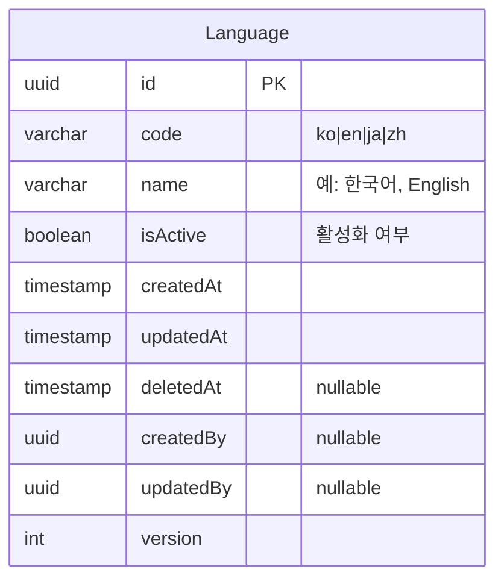

**설명**:
- 시스템에서 지원하는 언어 관리
- 다국어 번역 테이블에서 참조
- 관리자가 활성/비활성 제어 가능

**지원 언어**:
- `ko` - 한국어
- `en` - English (영어)
- `ja` - 日本語 (일본어)
- `zh` - 中文 (중국어)

---

### 2. 카테고리 (Category)

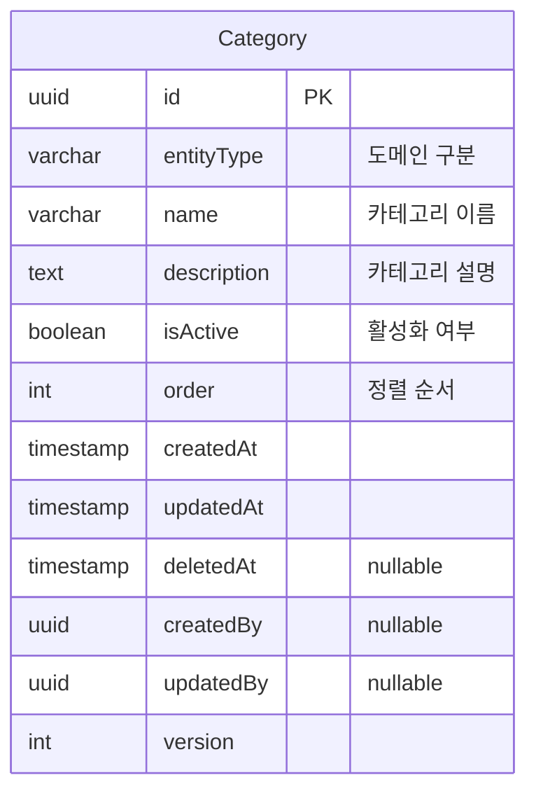

**설명**:
- 모든 도메인의 카테고리를 하나의 테이블로 통합 관리
- `entityType` 필드로 도메인 구분
- 동일한 구조를 공유하여 관리 효율성 향상

**지원 도메인**:
- `announcement`, `main_popup`, `shareholders_meeting`
- `electronic_disclosure`, `ir`, `brochure`
- `lumir_story`, `video_gallery`, `news`
- `survey`, `education_management`

**예시 데이터**:
```json
// Announcement 카테고리
{ "entityType": "announcement", "name": "인사", "isActive": true, "order": 1 }
{ "entityType": "announcement", "name": "복지", "isActive": true, "order": 2 }

// News 카테고리
{ "entityType": "news", "name": "언론보도", "isActive": true, "order": 1 }
{ "entityType": "news", "name": "수상", "isActive": true, "order": 2 }
```

---

### 3. 카테고리 매핑 (CategoryMapping)

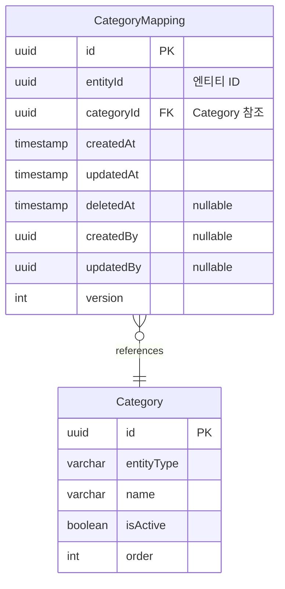

**설명**:
- 엔티티와 카테고리 간의 **다대다(Many-to-Many) 관계**를 정규화
- 하나의 엔티티는 여러 카테고리에 속할 수 있음
- 하나의 카테고리는 여러 엔티티를 포함할 수 있음

**유니크 제약조건**:
- `(entityId, categoryId)` 복합 유니크 키
- 같은 엔티티가 같은 카테고리를 중복으로 가질 수 없음

**예시 쿼리**:
```sql
-- 특정 공지사항의 모든 카테고리 조회
SELECT c.* FROM category c
JOIN category_mapping cm ON c.id = cm.category_id
WHERE cm.entity_id = 'announcement-uuid-123';

-- 특정 카테고리의 모든 엔티티 조회 (announcement만)
SELECT cm.entity_id FROM category_mapping cm
JOIN category c ON cm.category_id = c.id
WHERE c.id = 'category-uuid-456' AND c.entity_type = 'announcement';
```

---

## Core Domain 상세

### 1. 주주총회 (ShareholdersMeeting)

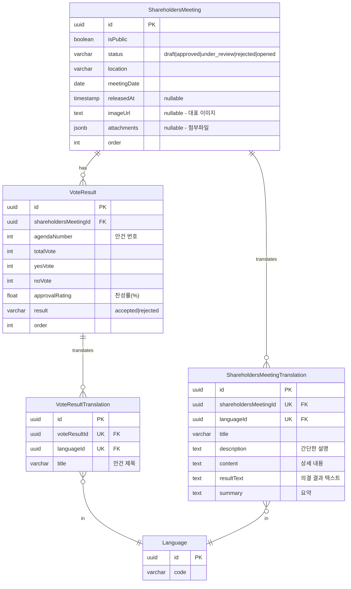

**특징**:
- **상태 관리**: ContentStatus enum 사용 (draft, approved, under_review, rejected, opened)
- **다국어 지원**: ShareholdersMeetingTranslation, VoteResultTranslation
- **의결 결과**: VoteResult 테이블로 여러 안건 관리
- **첨부파일**: 언어 독립적 (모든 언어에서 공유)

---

### 2. 전자공시 (ElectronicDisclosure)

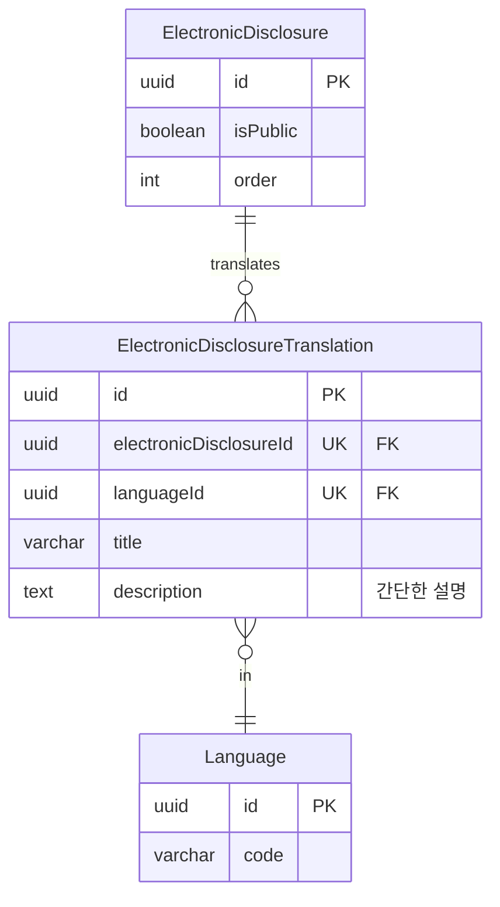

**특징**:
- **다국어 지원**: ElectronicDisclosureTranslation

---

### 3. IR (투자자 관계)

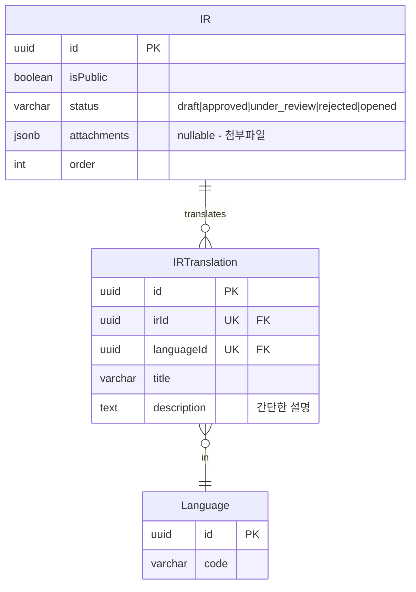

**특징**:
- **다국어 지원**: IRTranslation
- **첨부파일**: attachments JSONB 배열로 관리 (파일명으로 언어 구분 가능)

---

### 4. 브로슈어 (Brochure)

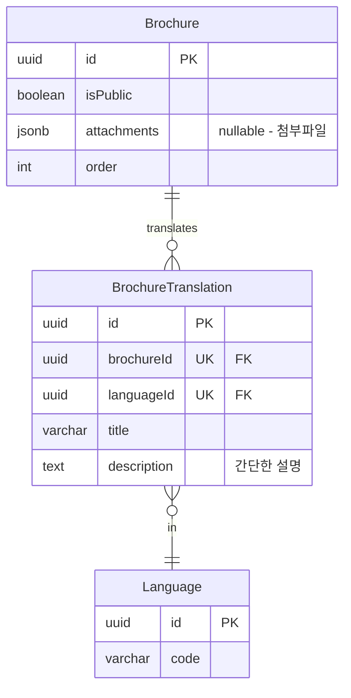

**특징**:
- **다국어 지원**: BrochureTranslation
- **첨부파일**: attachments JSONB 배열로 관리 (파일명으로 언어 구분 가능) 가능

---

### 5. 뉴스 (News)

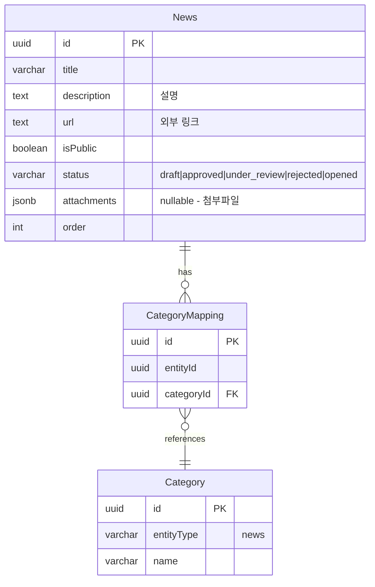

**특징**:
- **단일 언어**: 번역 테이블 없음
- **외부 링크**: url 필드로 뉴스 원문 연결
- **첨부파일**: JSONB 배열로 관리

---

### 6. 공지사항 (Announcement)

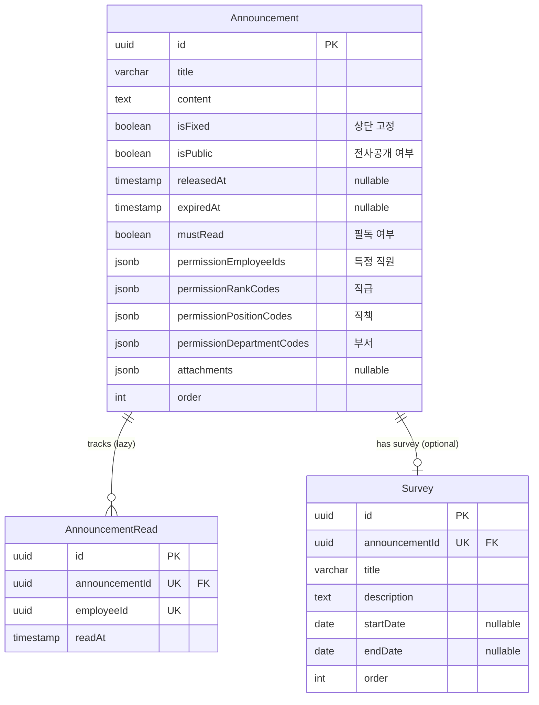

**특징**:
- **Lazy Creation**: 읽음 시점에 레코드 생성
- **세밀한 권한**: 특정 직원, 직급, 직책, 부서별 공개 설정
- **유니크 제약**: `(announcementId, employeeId)` - 중복 읽음 방지
- **설문조사 연결**: 공지사항에 설문조사를 선택적으로 연결 가능

**권한 로직** (OR 조건):
```typescript
function canAccess(announcement: Announcement, employee: Employee): boolean {
  if (announcement.isPublic) return true;

  return (
    announcement.permissionEmployeeIds.includes(employee.id) ||
    announcement.permissionRankCodes.includes(employee.rankCode) ||
    announcement.permissionPositionCodes.includes(employee.positionCode) ||
    announcement.permissionDepartmentCodes.includes(employee.departmentCode)
  );
}
```

**설문조사 제출 가능 조건**:
```typescript
function canSubmitSurvey(
  survey: Survey,
  announcement: Announcement,
  employee: Employee
): boolean {
  // 1. 공지사항이 공개 상태여야 함
  if (!announcement.isPublic) return false;
  
  // 2. 설문조사 마감일이 지나지 않았어야 함
  if (survey.endDate && new Date() > survey.endDate) return false;
  
  // 3. 권한 확인
  if (!canAccess(announcement, employee)) return false;
  
  return true;
}
```

---

## Sub Domain 상세

### 1. 메인 팝업 (MainPopup)

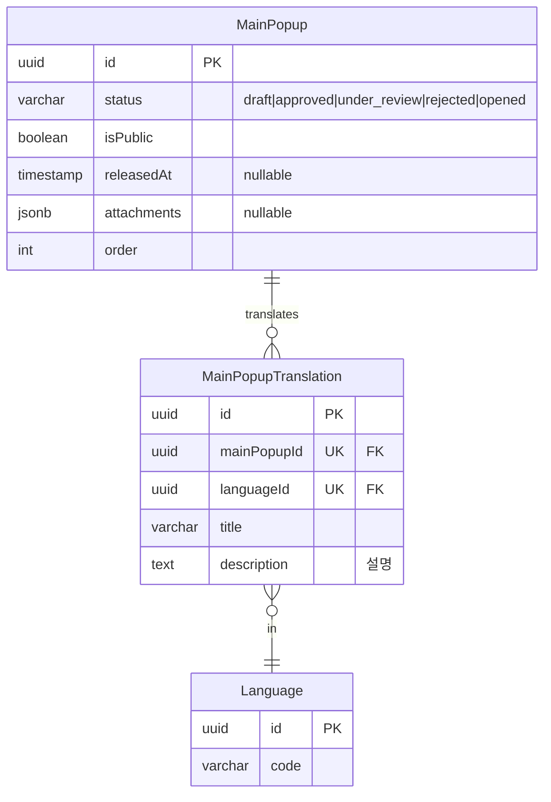

**특징**:
- **다국어 지원**: MainPopupTranslation
- **첨부파일**: attachments JSONB 배열로 관리 (이미지 포함, 파일명으로 언어 구분 가능)

---

### 2. 루미르 스토리 (LumirStory)

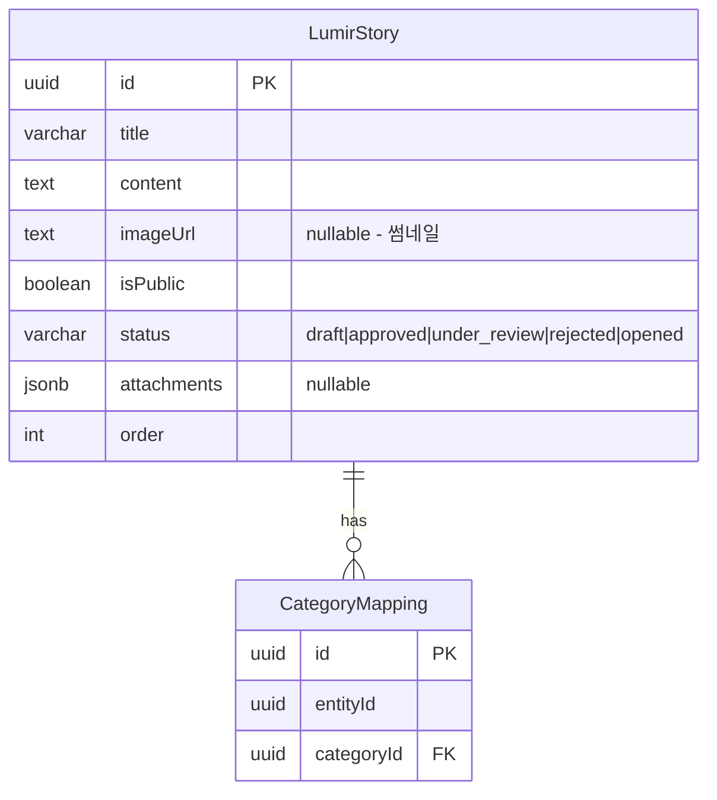

**특징**:
- **단일 언어**: 번역 테이블 없음
- **썸네일**: imageUrl 필드로 대표 이미지 관리

---

### 3. 비디오 갤러리 (VideoGallery)

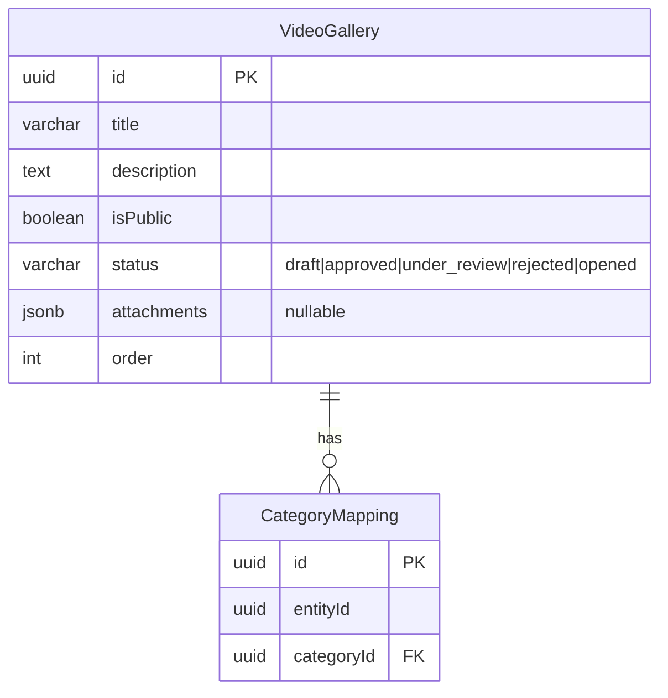

**특징**:
- **단일 언어**: 번역 테이블 없음
- **비디오 파일**: attachments JSONB 배열로 관리

---

### 4. 설문조사 (Survey)

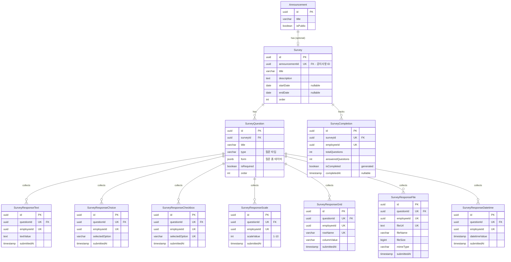

**특징**:
- **공지사항 종속**: Survey는 Announcement에 종속 (announcementId FK 필수)
- **상태 관리**: Announcement의 isPublic으로 제어 (Survey.status 제거)
- **권한 관리**: Announcement의 권한 설정 사용 (Survey.permissionEmployeeIds 제거)
- **타입별 응답 테이블**: 7개 테이블로 분리 (통계 쿼리 최적화)
- **질문 타입**: short_answer, paragraph, multiple_choice, dropdown, checkboxes, file_upload, datetime, linear_scale, grid_scale
- **완료 추적**: SurveyCompletion 테이블로 진행 상황 관리

**설문조사 제출 가능 조건**:
```typescript
function canSubmitSurvey(
  survey: Survey,
  announcement: Announcement,
  employee: Employee
): boolean {
  // 1. 공지사항이 공개 상태여야 함
  if (!announcement.isPublic) return false;
  
  // 2. 설문조사 마감일이 지나지 않았어야 함
  if (survey.endDate && new Date() > survey.endDate) return false;
  
  // 3. 권한 확인 (Announcement의 권한 사용)
  if (!canAccessAnnouncement(announcement, employee)) return false;
  
  return true;
}
```

**통계 쿼리 예시**:
```sql
-- 객관식 통계 (선택지별 응답 수)
SELECT 
  selected_option,
  COUNT(*) as count,
  ROUND(COUNT(*) * 100.0 / SUM(COUNT(*)) OVER (), 2) as percentage
FROM survey_response_choice
WHERE question_id = 'question-uuid'
GROUP BY selected_option
ORDER BY count DESC;

-- 척도 평균 (AVG 함수 직접 사용)
SELECT 
  AVG(scale_value) as average,
  STDDEV(scale_value) as std_dev,
  MIN(scale_value) as min_value,
  MAX(scale_value) as max_value
FROM survey_response_scale
WHERE question_id = 'question-uuid';
```

---

### 5. 교육 관리 (EducationManagement)

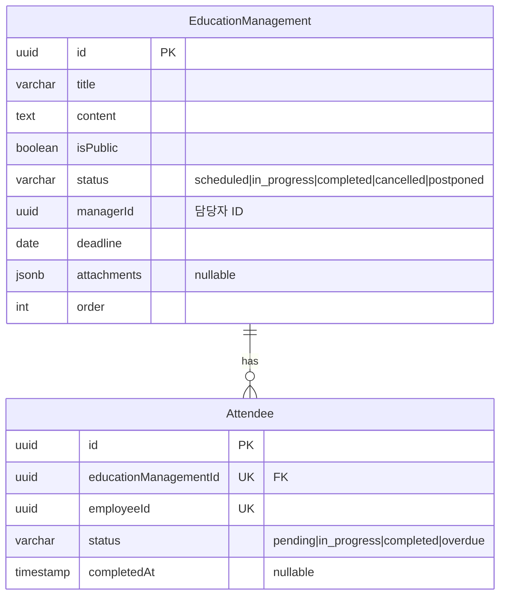

**특징**:
- **교육 상태 관리**: EducationStatus enum 사용
  - `scheduled`: 예정됨 (시작 전)
  - `in_progress`: 진행 중
  - `completed`: 완료됨
  - `cancelled`: 취소됨
  - `postponed`: 연기됨
- **수강 관리**: Attendee 테이블로 직원별 진행 상태 추적
- **담당자**: managerId로 교육 담당자 지정
- **유니크 제약**: `(educationManagementId, employeeId)` - 중복 등록 방지

**상태 전환 흐름**:
```
scheduled → in_progress → completed
    ↓            ↓
cancelled    postponed → scheduled
```

---

### 6. 위키 파일 시스템 (WikiFileSystem)

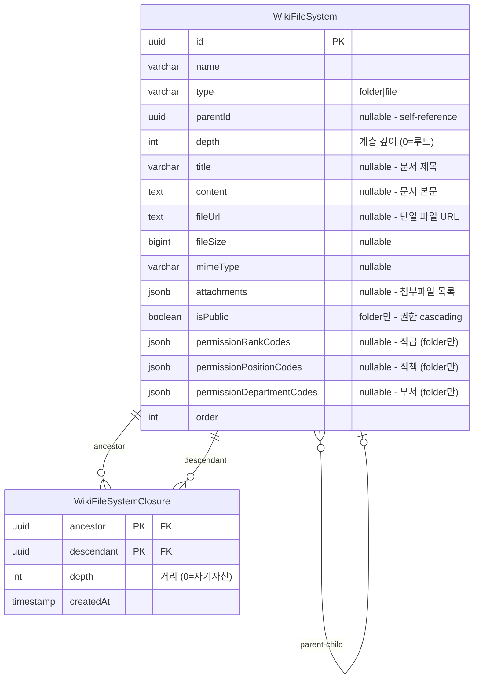

**특징**:
- **계층 구조**: parentId를 통한 자기 참조 (트리 구조)
- **Closure Table**: 모든 조상-자손 관계를 미리 저장하여 조회 성능 극대화
- **빈번한 이동 최적화**: 폴더/파일 이동 시에도 효율적인 업데이트
- **파일 타입**: folder (폴더) / file (파일)
- **파일 유형**:
  - **문서형**: title + content + attachments (텍스트 위주, 첨부파일 선택)
  - **첨부파일형**: fileUrl + fileSize + mimeType (파일만 업로드)
- **AWS S3**: 모든 파일은 S3에 업로드 후 URL 참조
- **권한 Cascading**: 
  - 권한은 **폴더만** 설정 가능 (isPublic, permissionRankCodes, permissionPositionCodes, permissionDepartmentCodes)
  - 파일의 권한은 **상위 폴더들의 권한을 cascading**하여 결정
  - 루트부터 현재 위치까지 모든 폴더 권한 체크, 가장 제한적인 권한 적용

**권한 로직** (Closure Table 활용 - Cascading):
```typescript
// 폴더 권한 체크
function canAccessFolder(folder: WikiFileSystem, employee: Employee): boolean {
  if (folder.type !== 'folder') {
    throw new Error('폴더만 권한 체크 가능');
  }
  
  if (folder.isPublic) return true;

  return (
    folder.permissionRankCodes?.includes(employee.rankCode) ||
    folder.permissionPositionCodes?.includes(employee.positionCode) ||
    folder.permissionDepartmentCodes?.includes(employee.departmentCode)
  );
}

// 계층적 권한 체크 (Closure Table 활용 - Cascading)
// 파일/폴더 모두 사용 가능
async function canAccessWiki(
  wikiId: string,
  employee: Employee
): Promise<boolean> {
  // Closure Table로 한 번의 쿼리로 모든 조상 폴더 조회
  const ancestorFolders = await db.query(`
    SELECT w.*
    FROM wiki_file_system w
    JOIN wiki_file_system_closure c ON w.id = c.ancestor
    WHERE c.descendant = $1
      AND w.type = 'folder'
      AND w.deleted_at IS NULL
    ORDER BY c.depth DESC
  `, [wikiId]);
  
  // 루트부터 순차적으로 권한 체크 (Cascading)
  for (const folder of ancestorFolders) {
    if (!canAccessFolder(folder, employee)) {
      return false; // 상위 폴더에 접근 불가하면 하위도 접근 불가
    }
  }
  
  return true;
}

// 폴더 이동 (순환 참조 방지)
async function moveFolder(
  folderId: string,
  newParentId: string | null
): Promise<void> {
  // 1. 순환 참조 체크 (Closure Table 활용)
  if (newParentId) {
    const isDescendant = await db.query(`
      SELECT 1 FROM wiki_file_system_closure
      WHERE ancestor = $1 AND descendant = $2
    `, [folderId, newParentId]);
    
    if (isDescendant.length > 0) {
      throw new Error('Cannot move folder to its own descendant');
    }
  }
  
  // 2. 이동 실행 (트리거가 자동으로 Closure 테이블 업데이트)
  await db.query(`
    UPDATE wiki_file_system
    SET parent_id = $1, updated_at = NOW()
    WHERE id = $2
  `, [newParentId, folderId]);
}
```

**⚠️ 중요: 계층적 권한 관리 (Cascading)**
- **권한은 폴더만 설정 가능**, 파일은 권한 필드 사용 안함
- **파일의 권한은 상위 폴더들의 권한을 cascading하여 결정**
- 상위 폴더가 더 제한적이면 하위 폴더/파일도 접근 불가
- 애플리케이션 레벨에서 처리 (데이터베이스 제약조건으로는 불가능)
- Closure Table을 활용하여 한 번의 쿼리로 모든 조상 폴더 조회 가능
- 폴더 이동 시 순환 참조 체크 필수

**쿼리 예시** (Closure Table 활용):
```sql
-- 1. 루트 폴더 조회
SELECT * FROM wiki_file_system 
WHERE parent_id IS NULL AND deleted_at IS NULL
ORDER BY "order";

-- 2. 특정 폴더의 직접 자식만 조회 (1 depth)
SELECT w.* 
FROM wiki_file_system w
JOIN wiki_file_system_closure c ON w.id = c.descendant
WHERE c.ancestor = 'folder-uuid' 
  AND c.depth = 1
  AND w.deleted_at IS NULL
ORDER BY w.type DESC, w."order";

-- 3. 특정 폴더의 모든 하위 항목 조회 (재귀, depth 포함)
SELECT w.*, c.depth
FROM wiki_file_system w
JOIN wiki_file_system_closure c ON w.id = c.descendant
WHERE c.ancestor = 'folder-uuid' 
  AND c.depth > 0
  AND w.deleted_at IS NULL
ORDER BY c.depth, w."order";

-- 4. 상위 경로 조회 (Breadcrumb)
SELECT w.*, c.depth
FROM wiki_file_system w
JOIN wiki_file_system_closure c ON w.id = c.ancestor
WHERE c.descendant = 'file-uuid'
  AND w.deleted_at IS NULL
ORDER BY c.depth DESC;

-- 5. 권한 체크용 조상 조회
SELECT w.*
FROM wiki_file_system w
JOIN wiki_file_system_closure c ON w.id = c.ancestor
WHERE c.descendant = 'file-uuid'
  AND w.deleted_at IS NULL
ORDER BY c.depth DESC;

-- 6. 특정 depth까지만 조회 (예: 3단계까지)
SELECT w.*, c.depth
FROM wiki_file_system w
JOIN wiki_file_system_closure c ON w.id = c.descendant
WHERE c.ancestor = 'folder-uuid' 
  AND c.depth > 0
  AND c.depth <= 3
  AND w.deleted_at IS NULL
ORDER BY c.depth, w."order";
```

**트리거 (Closure Table 자동 관리)**:
```sql
-- 1. 삽입 시 트리거
CREATE OR REPLACE FUNCTION maintain_closure_on_insert()
RETURNS TRIGGER AS $$
BEGIN
  -- 자기 자신 추가 (depth = 0)
  INSERT INTO wiki_file_system_closure (ancestor, descendant, depth)
  VALUES (NEW.id, NEW.id, 0);
  
  -- 부모의 모든 조상을 자신의 조상으로 추가
  IF NEW.parent_id IS NOT NULL THEN
    INSERT INTO wiki_file_system_closure (ancestor, descendant, depth)
    SELECT ancestor, NEW.id, depth + 1
    FROM wiki_file_system_closure
    WHERE descendant = NEW.parent_id;
    
    -- depth 필드 업데이트
    UPDATE wiki_file_system
    SET depth = (
      SELECT MAX(depth) FROM wiki_file_system_closure
      WHERE descendant = NEW.id AND ancestor != NEW.id
    ) + 1
    WHERE id = NEW.id;
  ELSE
    -- 루트 노드
    UPDATE wiki_file_system SET depth = 0 WHERE id = NEW.id;
  END IF;
  
  RETURN NEW;
END;
$$ LANGUAGE plpgsql;

CREATE TRIGGER trigger_closure_insert
AFTER INSERT ON wiki_file_system
FOR EACH ROW EXECUTE FUNCTION maintain_closure_on_insert();

-- 2. 이동(업데이트) 시 트리거
CREATE OR REPLACE FUNCTION maintain_closure_on_move()
RETURNS TRIGGER AS $$
BEGIN
  IF NEW.parent_id IS DISTINCT FROM OLD.parent_id THEN
    -- 기존 관계 제거 (자기 자신 제외)
    DELETE FROM wiki_file_system_closure
    WHERE descendant IN (
      SELECT descendant FROM wiki_file_system_closure WHERE ancestor = NEW.id
    )
    AND ancestor IN (
      SELECT ancestor FROM wiki_file_system_closure WHERE descendant = OLD.id
    )
    AND ancestor != descendant;
    
    -- 새로운 관계 추가
    IF NEW.parent_id IS NOT NULL THEN
      INSERT INTO wiki_file_system_closure (ancestor, descendant, depth)
      SELECT pa.ancestor, cd.descendant, pa.depth + cd.depth + 1
      FROM wiki_file_system_closure pa
      CROSS JOIN wiki_file_system_closure cd
      WHERE pa.descendant = NEW.parent_id
        AND cd.ancestor = NEW.id;
      
      -- depth 업데이트 (이동된 노드와 모든 하위 노드)
      UPDATE wiki_file_system w
      SET depth = c.max_depth
      FROM (
        SELECT 
          c1.descendant as id,
          MAX(c1.depth) - MIN(c2.depth) as max_depth
        FROM wiki_file_system_closure c1
        JOIN wiki_file_system_closure c2 ON c1.descendant = c2.descendant
        WHERE c2.ancestor = NEW.id
          AND c1.ancestor != c1.descendant
        GROUP BY c1.descendant
      ) c
      WHERE w.id = c.id;
    ELSE
      -- 루트로 이동
      UPDATE wiki_file_system SET depth = 0 WHERE id = NEW.id;
    END IF;
  END IF;
  
  RETURN NEW;
END;
$$ LANGUAGE plpgsql;

CREATE TRIGGER trigger_closure_move
AFTER UPDATE OF parent_id ON wiki_file_system
FOR EACH ROW EXECUTE FUNCTION maintain_closure_on_move();
```

**성능 특징**:
- ✅ **조회 성능**: O(1) - Closure Table에서 직접 조회
- ✅ **이동 성능**: O(N×M) - N: 이동되는 서브트리 크기, M: 새 부모의 조상 수
- ✅ **삽입 성능**: O(D) - D: 트리 깊이
- ✅ **삭제 성능**: O(1) - CASCADE로 자동 처리

---

**문서 생성일**: 2026년 1월 6일  
**최종 업데이트**: 2026년 1월 14일  
**버전**: v5.17
