# 엔티티 상세 문서

> 📚 **문서 네비게이션**
> - **[메인 문서로 돌아가기](er-diagram.md)** - 전체 시스템 개요
> - **[데이터베이스 구현 가이드](er-diagram-database.md)** - JSONB 구조, 인덱스, CHECK 제약조건

---

## 목차

- [Common Domain 상세](#common-domain-상세)
  - [Language (언어)](#1-언어-language)
  - [Category (카테고리)](#2-카테고리-category)
  - [CategoryMapping (카테고리 매핑)](#3-카테고리-매핑-categorymapping)
- [Core Domain 상세](#core-domain-상세)
  - [ShareholdersMeeting (주주총회)](#1-주주총회-shareholdersmeeting)
  - [ElectronicDisclosure (전자공시)](#2-전자공시-electronicdisclosure)
  - [IR (투자자 관계)](#3-ir-투자자-관계)
  - [Brochure (브로슈어)](#4-브로슈어-brochure)
  - [News (뉴스)](#5-뉴스-news)
  - [Announcement (공지사항)](#6-공지사항-announcement)
- [Sub Domain 상세](#sub-domain-상세)
  - [MainPopup (메인 팝업)](#1-메인-팝업-mainpopup)
  - [LumirStory (루미르 스토리)](#2-루미르-스토리-lumirstory)
  - [VideoGallery (비디오 갤러리)](#3-비디오-갤러리-videogallery)
  - [Survey (설문조사)](#4-설문조사-survey)
  - [EducationManagement (교육 관리)](#5-교육-관리-educationmanagement)
  - [WikiFileSystem (위키 파일 시스템)](#6-위키-파일-시스템-wikifilesystem)

---

## Common Domain 상세

### 1. 언어 (Language)

```mermaid
erDiagram
    Language {
        uuid id PK
        varchar code "ko|en|ja|zh"
        varchar name "예: 한국어, English"
        boolean isActive "활성화 여부"
        timestamp createdAt
        timestamp updatedAt
        timestamp deletedAt "nullable"
        uuid createdBy "nullable"
        uuid updatedBy "nullable"
        int version
    }
```

**설명**:
- 시스템에서 지원하는 언어 관리
- 다국어 번역 테이블에서 참조
- 관리자가 활성/비활성 제어 가능

**지원 언어**:
- `ko` - 한국어
- `en` - English (영어)
- `ja` - 日本語 (일본어)
- `zh` - 中文 (중국어)

---

### 2. 카테고리 (Category)

```mermaid
erDiagram
    Category {
        uuid id PK
        varchar entityType "도메인 구분"
        varchar name "카테고리 이름"
        text description "카테고리 설명"
        boolean isActive "활성화 여부"
        int order "정렬 순서"
        timestamp createdAt
        timestamp updatedAt
        timestamp deletedAt "nullable"
        uuid createdBy "nullable"
        uuid updatedBy "nullable"
        int version
    }
```

**설명**:
- 모든 도메인의 카테고리를 하나의 테이블로 통합 관리
- `entityType` 필드로 도메인 구분
- 동일한 구조를 공유하여 관리 효율성 향상

**지원 도메인**:
- `announcement`, `main_popup`, `shareholders_meeting`
- `electronic_disclosure`, `ir`, `brochure`
- `lumir_story`, `video_gallery`, `news`
- `survey`, `education_management`

**예시 데이터**:
```json
// Announcement 카테고리
{ "entityType": "announcement", "name": "인사", "isActive": true, "order": 1 }
{ "entityType": "announcement", "name": "복지", "isActive": true, "order": 2 }

// News 카테고리
{ "entityType": "news", "name": "언론보도", "isActive": true, "order": 1 }
{ "entityType": "news", "name": "수상", "isActive": true, "order": 2 }
```

---

### 3. 카테고리 매핑 (CategoryMapping)

```mermaid
erDiagram
    CategoryMapping {
        uuid id PK
        uuid entityId "엔티티 ID"
        uuid categoryId FK "Category 참조"
        timestamp createdAt
        timestamp updatedAt
        timestamp deletedAt "nullable"
        uuid createdBy "nullable"
        uuid updatedBy "nullable"
        int version
    }
    
    Category {
        uuid id PK
        varchar entityType
        varchar name
        boolean isActive
        int order
    }
    
    CategoryMapping }o--|| Category : "references"
```

**설명**:
- 엔티티와 카테고리 간의 **다대다(Many-to-Many) 관계**를 정규화
- 하나의 엔티티는 여러 카테고리에 속할 수 있음
- 하나의 카테고리는 여러 엔티티를 포함할 수 있음

**유니크 제약조건**:
- `(entityId, categoryId)` 복합 유니크 키
- 같은 엔티티가 같은 카테고리를 중복으로 가질 수 없음

**예시 쿼리**:
```sql
-- 특정 공지사항의 모든 카테고리 조회
SELECT c.* FROM category c
JOIN category_mapping cm ON c.id = cm.category_id
WHERE cm.entity_id = 'announcement-uuid-123';

-- 특정 카테고리의 모든 엔티티 조회 (announcement만)
SELECT cm.entity_id FROM category_mapping cm
JOIN category c ON cm.category_id = c.id
WHERE c.id = 'category-uuid-456' AND c.entity_type = 'announcement';
```

---

## Core Domain 상세

### 1. 주주총회 (ShareholdersMeeting)

```mermaid
erDiagram
    ShareholdersMeeting {
        uuid id PK
        boolean isPublic
        varchar location
        date meetingDate
        timestamp releasedAt "nullable"
        text imageUrl "nullable - 대표 이미지"
        jsonb attachments "nullable - 첨부파일"
        int order
    }
    
    VoteResult {
        uuid id PK
        uuid shareholdersMeetingId FK
        int agendaNumber "안건 번호"
        int totalVote
        int yesVote
        int noVote
        float approvalRating "찬성률(%)"
        varchar result "accepted|rejected"
        int order
    }
    
    VoteResultTranslation {
        uuid id PK
        uuid voteResultId UK "FK"
        uuid languageId UK "FK"
        varchar title "안건 제목"
    }
    
    ShareholdersMeetingTranslation {
        uuid id PK
        uuid shareholdersMeetingId UK "FK"
        uuid languageId UK "FK"
        varchar title
        text description "간단한 설명"
        text content "상세 내용"
        text resultText "의결 결과 텍스트"
        text summary "요약"
    }
    
    Language {
        uuid id PK
        varchar code
    }
    
    ShareholdersMeeting ||--o{ VoteResult : "has"
    VoteResult ||--o{ VoteResultTranslation : "translates"
    VoteResultTranslation }o--|| Language : "in"
    ShareholdersMeeting ||--o{ ShareholdersMeetingTranslation : "translates"
    ShareholdersMeetingTranslation }o--|| Language : "in"
```

**특징**:
- **다국어 지원**: ShareholdersMeetingTranslation, VoteResultTranslation
- **의결 결과**: VoteResult 테이블로 여러 안건 관리
- **첨부파일**: 언어 독립적 (모든 언어에서 공유)

---

### 2. 전자공시 (ElectronicDisclosure)

```mermaid
erDiagram
    ElectronicDisclosure {
        uuid id PK
        boolean isPublic
        varchar status "draft|approved|under_review|rejected|opened"
        int order
    }
    
    ElectronicDisclosureTranslation {
        uuid id PK
        uuid electronicDisclosureId UK "FK"
        uuid languageId UK "FK"
        varchar title
        text description "간단한 설명"
    }
    
    Language {
        uuid id PK
        varchar code
    }
    
    ElectronicDisclosure ||--o{ ElectronicDisclosureTranslation : "translates"
    ElectronicDisclosureTranslation }o--|| Language : "in"
```

**특징**:
- **다국어 지원**: ElectronicDisclosureTranslation
- **상태 관리**: ContentStatus enum 사용

---

### 3. IR (투자자 관계)

```mermaid
erDiagram
    IR {
        uuid id PK
        boolean isPublic
        varchar status "draft|approved|under_review|rejected|opened"
        int order
    }
    
    IRTranslation {
        uuid id PK
        uuid irId UK "FK"
        uuid languageId UK "FK"
        varchar title
        text description "간단한 설명"
        text fileUrl "nullable - IR 자료 파일(언어별)"
    }
    
    Language {
        uuid id PK
        varchar code
    }
    
    IR ||--o{ IRTranslation : "translates"
    IRTranslation }o--|| Language : "in"
```

**특징**:
- **다국어 지원**: IRTranslation
- **언어별 파일**: fileUrl이 번역 테이블에 있어 언어별 다른 파일 제공 가능

---

### 4. 브로슈어 (Brochure)

```mermaid
erDiagram
    Brochure {
        uuid id PK
        boolean isPublic
        varchar status "draft|approved|under_review|rejected|opened"
        int order
    }
    
    BrochureTranslation {
        uuid id PK
        uuid brochureId UK "FK"
        uuid languageId UK "FK"
        varchar title
        text description "간단한 설명"
        text fileUrl "nullable - 브로슈어 파일(언어별)"
    }
    
    Language {
        uuid id PK
        varchar code
    }
    
    Brochure ||--o{ BrochureTranslation : "translates"
    BrochureTranslation }o--|| Language : "in"
```

**특징**:
- **다국어 지원**: BrochureTranslation
- **언어별 파일**: fileUrl이 번역 테이블에 있어 언어별 다른 파일 제공 가능

---

### 5. 뉴스 (News)

```mermaid
erDiagram
    News {
        uuid id PK
        varchar title
        text description "설명"
        text url "외부 링크"
        boolean isPublic
        varchar status "draft|approved|under_review|rejected|opened"
        jsonb attachments "nullable - 첨부파일"
        int order
    }
    
    CategoryMapping {
        uuid id PK
        uuid entityId
        uuid categoryId FK
    }
    
    Category {
        uuid id PK
        varchar entityType "news"
        varchar name
    }
    
    News ||--o{ CategoryMapping : "has"
    CategoryMapping }o--|| Category : "references"
```

**특징**:
- **단일 언어**: 번역 테이블 없음
- **외부 링크**: url 필드로 뉴스 원문 연결
- **첨부파일**: JSONB 배열로 관리

---

### 6. 공지사항 (Announcement)

```mermaid
erDiagram
    Announcement {
        uuid id PK
        varchar title
        text content
        boolean isFixed "상단 고정"
        boolean isPublic "전사공개 여부"
        timestamp releasedAt "nullable"
        timestamp expiredAt "nullable"
        boolean mustRead "필독 여부"
        boolean requiresResponse "응답 필요"
        varchar status
        jsonb permissionEmployeeIds "특정 직원"
        jsonb permissionRankCodes "직급"
        jsonb permissionPositionCodes "직책"
        jsonb permissionDepartmentCodes "부서"
        jsonb attachments "nullable"
        int order
    }

    AnnouncementRead {
        uuid id PK
        uuid announcementId UK "FK"
        uuid employeeId UK
        timestamp readAt
    }

    AnnouncementResponse {
        uuid id PK
        uuid announcementId UK "FK"
        uuid employeeId UK
        text responseMessage
        timestamp submittedAt
    }

    Announcement ||--o{ AnnouncementRead : "tracks (lazy)"
    Announcement ||--o{ AnnouncementResponse : "collects (optional)"
```

**특징**:
- **Lazy Creation**: 읽음/응답 시점에 레코드 생성
- **세밀한 권한**: 특정 직원, 직급, 직책, 부서별 공개 설정
- **유니크 제약**: `(announcementId, employeeId)` - 중복 읽음/응답 방지

**권한 로직** (OR 조건):
```typescript
function canAccess(announcement: Announcement, employee: Employee): boolean {
  if (announcement.isPublic) return true;
  
  return (
    announcement.permissionEmployeeIds.includes(employee.id) ||
    announcement.permissionRankCodes.includes(employee.rankCode) ||
    announcement.permissionPositionCodes.includes(employee.positionCode) ||
    announcement.permissionDepartmentCodes.includes(employee.departmentCode)
  );
}
```

---

## Sub Domain 상세

### 1. 메인 팝업 (MainPopup)

```mermaid
erDiagram
    MainPopup {
        uuid id PK
        varchar status "draft|approved|under_review|rejected|opened"
        boolean isPublic
        timestamp releasedAt "nullable"
        jsonb attachments "nullable"
        int order
    }
    
    MainPopupTranslation {
        uuid id PK
        uuid mainPopupId UK "FK"
        uuid languageId UK "FK"
        varchar title
        text description "설명"
        text imageUrl "nullable - 팝업 이미지(언어별)"
    }
    
    Language {
        uuid id PK
        varchar code
    }
    
    MainPopup ||--o{ MainPopupTranslation : "translates"
    MainPopupTranslation }o--|| Language : "in"
```

**특징**:
- **다국어 지원**: MainPopupTranslation
- **언어별 이미지**: imageUrl이 번역 테이블에 있어 언어별 다른 이미지 제공

---

### 2. 루미르 스토리 (LumirStory)


**특징**:
- **단일 언어**: 번역 테이블 없음
- **썸네일**: imageUrl 필드로 대표 이미지 관리

---

### 3. 비디오 갤러리 (VideoGallery)


**특징**:
- **단일 언어**: 번역 테이블 없음
- **비디오 파일**: attachments JSONB 배열로 관리

---

### 4. 설문조사 (Survey)

```mermaid
erDiagram
    Survey {
        uuid id PK
        varchar title
        text description
        varchar status
        date startDate "nullable"
        date endDate "nullable"
        jsonb permissionEmployeeIds
        int order
    }
    
    SurveyQuestion {
        uuid id PK
        uuid surveyId FK
        varchar title
        varchar type "질문 타입"
        jsonb form "질문 폼 데이터"
        boolean isRequired
        int order
    }
    
    SurveyResponseText {
        uuid id PK
        uuid questionId UK "FK"
        uuid employeeId UK
        text textValue
        timestamp submittedAt
    }
    
    SurveyResponseChoice {
        uuid id PK
        uuid questionId UK "FK"
        uuid employeeId UK
        varchar selectedOption
        timestamp submittedAt
    }
    
    SurveyResponseCheckbox {
        uuid id PK
        uuid questionId UK "FK"
        uuid employeeId UK
        varchar selectedOption UK
        timestamp submittedAt
    }
    
    SurveyResponseScale {
        uuid id PK
        uuid questionId UK "FK"
        uuid employeeId UK
        int scaleValue "1-10"
        timestamp submittedAt
    }
    
    SurveyResponseGrid {
        uuid id PK
        uuid questionId UK "FK"
        uuid employeeId UK
        varchar rowName UK
        varchar columnValue
        timestamp submittedAt
    }
    
    SurveyResponseFile {
        uuid id PK
        uuid questionId UK "FK"
        uuid employeeId UK
        text fileUrl UK
        varchar fileName
        bigint fileSize
        varchar mimeType
        timestamp submittedAt
    }
    
    SurveyResponseDatetime {
        uuid id PK
        uuid questionId UK "FK"
        uuid employeeId UK
        timestamp datetimeValue
        timestamp submittedAt
    }
    
    SurveyCompletion {
        uuid id PK
        uuid surveyId UK "FK"
        uuid employeeId UK
        int totalQuestions
        int answeredQuestions
        boolean isCompleted "generated"
        timestamp completedAt "nullable"
    }
    
    Survey ||--o{ SurveyQuestion : "has"
    Survey ||--o{ SurveyCompletion : "tracks"
    SurveyQuestion ||--o{ SurveyResponseText : "collects"
    SurveyQuestion ||--o{ SurveyResponseChoice : "collects"
    SurveyQuestion ||--o{ SurveyResponseCheckbox : "collects"
    SurveyQuestion ||--o{ SurveyResponseScale : "collects"
    SurveyQuestion ||--o{ SurveyResponseGrid : "collects"
    SurveyQuestion ||--o{ SurveyResponseFile : "collects"
    SurveyQuestion ||--o{ SurveyResponseDatetime : "collects"
```

**특징**:
- **타입별 응답 테이블**: 7개 테이블로 분리 (통계 쿼리 최적화)
- **질문 타입**: short_answer, paragraph, multiple_choice, dropdown, checkboxes, file_upload, datetime, linear_scale, grid_scale
- **완료 추적**: SurveyCompletion 테이블로 진행 상황 관리

**통계 쿼리 예시**:
```sql
-- 객관식 통계 (선택지별 응답 수)
SELECT 
  selected_option,
  COUNT(*) as count,
  ROUND(COUNT(*) * 100.0 / SUM(COUNT(*)) OVER (), 2) as percentage
FROM survey_response_choice
WHERE question_id = 'question-uuid'
GROUP BY selected_option
ORDER BY count DESC;

-- 척도 평균 (AVG 함수 직접 사용)
SELECT 
  AVG(scale_value) as average,
  STDDEV(scale_value) as std_dev,
  MIN(scale_value) as min_value,
  MAX(scale_value) as max_value
FROM survey_response_scale
WHERE question_id = 'question-uuid';
```

---

### 5. 교육 관리 (EducationManagement)

```mermaid
erDiagram
    EducationManagement {
        uuid id PK
        varchar title
        text content
        boolean isPublic
        uuid managerId "담당자 ID"
        date deadline
        jsonb attachments "nullable"
        int order
    }
    
    Attendee {
        uuid id PK
        uuid educationManagementId UK "FK"
        uuid employeeId UK
        varchar status "pending|in_progress|completed|overdue"
        timestamp completedAt "nullable"
    }
    
    EducationManagement ||--o{ Attendee : "has"
```

**특징**:
- **수강 관리**: Attendee 테이블로 직원별 진행 상태 추적
- **담당자**: managerId로 교육 담당자 지정
- **유니크 제약**: `(educationManagementId, employeeId)` - 중복 등록 방지

---

### 6. 위키 파일 시스템 (WikiFileSystem)

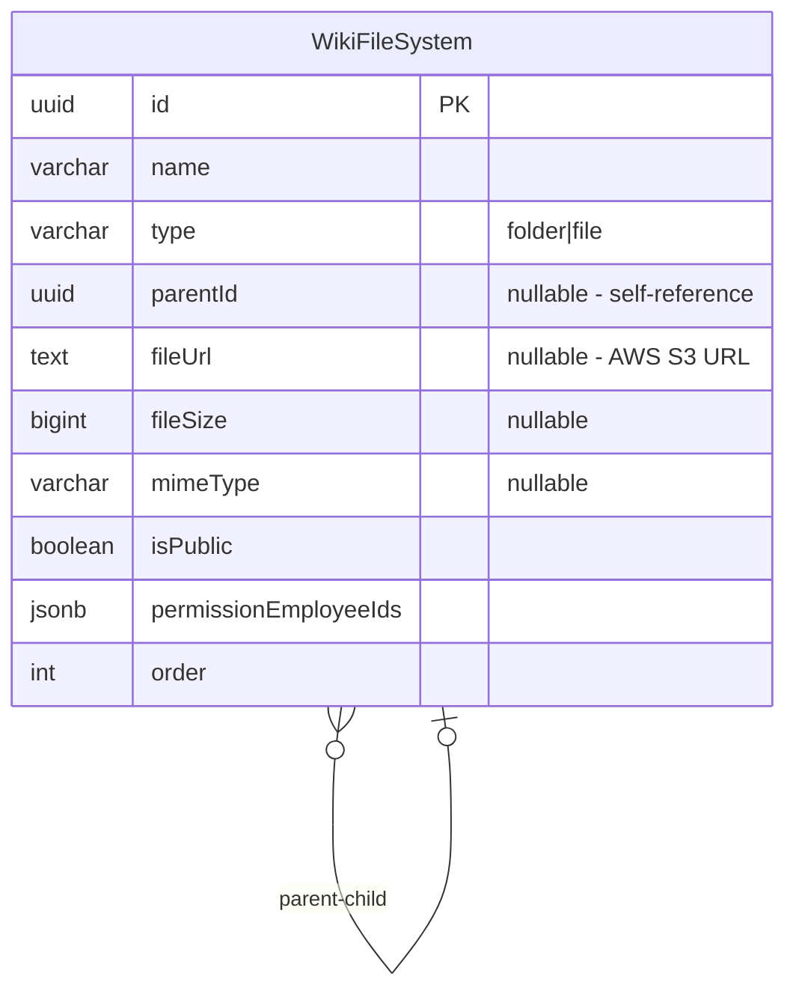

**특징**:
- **계층 구조**: parentId를 통한 자기 참조 (트리 구조)
- **파일 타입**: folder (폴더) / file (파일)
- **AWS S3**: 모든 파일은 S3에 업로드 후 URL 참조
- **권한 관리**: permissionEmployeeIds로 접근 제어

**쿼리 예시**:
```sql
-- 루트 폴더 조회
SELECT * FROM wiki_file_system 
WHERE parent_id IS NULL AND deleted_at IS NULL
ORDER BY "order";

-- 특정 폴더의 하위 항목 조회
SELECT * FROM wiki_file_system 
WHERE parent_id = 'folder-uuid' AND deleted_at IS NULL
ORDER BY type DESC, "order";  -- 폴더 먼저, 그 다음 파일

-- 파일 경로 추적 (재귀 쿼리)
WITH RECURSIVE path AS (
  SELECT id, name, parent_id, name as full_path
  FROM wiki_file_system
  WHERE id = 'file-uuid'
  
  UNION ALL
  
  SELECT w.id, w.name, w.parent_id, w.name || '/' || p.full_path
  FROM wiki_file_system w
  JOIN path p ON w.id = p.parent_id
)
SELECT full_path FROM path WHERE parent_id IS NULL;
```

---

**문서 생성일**: 2026년 1월 6일  
**최종 업데이트**: 2026년 1월 8일  
**버전**: v5.8
