# 루미르 CMS ER 다이어그램

> 📚 **상세 문서**: 이 문서는 전체 시스템 개요입니다. 상세 정보는 아래 링크를 참조하세요.
> - **[엔티티 상세 보기](er-diagram-entities.md)** - 모든 엔티티의 구조와 다이어그램
> - **[데이터베이스 구현 가이드](er-diagram-database.md)** - JSONB 구조, 인덱스, CHECK 제약조건

---

## 목차

- [전체 시스템 ERD](#전체-시스템-erd)
- [도메인 구성](#도메인-구성)
- [Enum 타입](#enum-타입)
- [외부 시스템 참조](#외부-시스템-참조)
- [데이터베이스 주요 특징](#데이터베이스-주요-특징)

---

## 전체 시스템 ERD

```mermaid
erDiagram
    %% ==========================================
    %% 공통 엔티티 (Common Entities)
    %% ==========================================
    
    Language {
        uuid id PK
        varchar code
        varchar name
        boolean isActive
    }

    Category {
        uuid id PK
        varchar entityType
        varchar name
        text description
        boolean isActive
        int order
    }

    CategoryMapping {
        uuid id PK
        uuid entityId
        uuid categoryId FK
    }

    %% ==========================================
    %% Core Domain (핵심 비즈니스 로직)
    %% ==========================================
    
    ShareholdersMeeting {
        uuid id PK
        boolean isPublic
        varchar location
        date meetingDate
        jsonb attachments
    }

    VoteResult {
        uuid id PK
        uuid shareholdersMeetingId FK
        int agendaNumber
        int totalVote
        varchar result
    }

    VoteResultTranslation {
        uuid id PK
        uuid voteResultId FK
        uuid languageId FK
        varchar title
    }

    ShareholdersMeetingTranslation {
        uuid id PK
        uuid shareholdersMeetingId FK
        uuid languageId FK
        varchar title
        text content
    }

    ElectronicDisclosure {
        uuid id PK
        boolean isPublic
        varchar status
    }

    ElectronicDisclosureTranslation {
        uuid id PK
        uuid electronicDisclosureId FK
        uuid languageId FK
        varchar title
    }

    IR {
        uuid id PK
        boolean isPublic
        varchar status
        jsonb attachments
    }

    IRTranslation {
        uuid id PK
        uuid irId FK
        uuid languageId FK
        varchar title
        text fileUrl
    }

    Brochure {
        uuid id PK
        boolean isPublic
        varchar status
    }

    BrochureTranslation {
        uuid id PK
        uuid brochureId FK
        uuid languageId FK
        varchar title
        text fileUrl
    }

    News {
        uuid id PK
        varchar title
        boolean isPublic
        varchar status
        jsonb attachments
    }

    Announcement {
        uuid id PK
        varchar title
        text content
        boolean isPublic
        varchar status
        jsonb attachments
    }

    AnnouncementRead {
        uuid id PK
        uuid announcementId FK
        uuid employeeId
        timestamp readAt
    }

    AnnouncementResponse {
        uuid id PK
        uuid announcementId FK
        uuid employeeId
        text responseMessage
    }

    %% ==========================================
    %% Sub Domain (부가 지원 기능)
    %% ==========================================
    
    MainPopup {
        uuid id PK
        varchar status
        boolean isPublic
        jsonb attachments
    }

    MainPopupTranslation {
        uuid id PK
        uuid mainPopupId FK
        uuid languageId FK
        varchar title
        text imageUrl
    }

    LumirStory {
        uuid id PK
        varchar title
        text content
        boolean isPublic
        jsonb attachments
    }

    VideoGallery {
        uuid id PK
        varchar title
        boolean isPublic
        jsonb attachments
    }

    Survey {
        uuid id PK
        varchar title
        varchar status
        jsonb permissionEmployeeIds
    }

    SurveyQuestion {
        uuid id PK
        uuid surveyId FK
        varchar title
        varchar type
        jsonb form
    }

    SurveyResponseText {
        uuid id PK
        uuid questionId FK
        uuid employeeId
        text textValue
    }

    SurveyResponseChoice {
        uuid id PK
        uuid questionId FK
        uuid employeeId
        varchar selectedOption
    }

    SurveyResponseScale {
        uuid id PK
        uuid questionId FK
        uuid employeeId
        int scaleValue
    }

    SurveyCompletion {
        uuid id PK
        uuid surveyId FK
        uuid employeeId
        boolean isCompleted
    }

    EducationManagement {
        uuid id PK
        varchar title
        uuid managerId
        date deadline
        jsonb attachments
    }

    Attendee {
        uuid id PK
        uuid educationManagementId FK
        uuid employeeId
        varchar status
    }

    WikiFileSystem {
        uuid id PK
        varchar name
        varchar type
        uuid parentId
        text fileUrl
        jsonb permissionEmployeeIds
    }

    %% ==========================================
    %% Relationships
    %% ==========================================
    
    ShareholdersMeeting ||--o{ CategoryMapping : "has"
    CategoryMapping }o--|| Category : "references"
    ShareholdersMeeting ||--o{ VoteResult : "has"
    VoteResult ||--o{ VoteResultTranslation : "translates"
    VoteResultTranslation }o--|| Language : "in"
    ShareholdersMeeting ||--o{ ShareholdersMeetingTranslation : "translates"
    ShareholdersMeetingTranslation }o--|| Language : "in"
    
    ElectronicDisclosure ||--o{ CategoryMapping : "has"
    ElectronicDisclosure ||--o{ ElectronicDisclosureTranslation : "translates"
    ElectronicDisclosureTranslation }o--|| Language : "in"
    
    IR ||--o{ CategoryMapping : "has"
    IR ||--o{ IRTranslation : "translates"
    IRTranslation }o--|| Language : "in"
    
    Brochure ||--o{ CategoryMapping : "has"
    Brochure ||--o{ BrochureTranslation : "translates"
    BrochureTranslation }o--|| Language : "in"
    
    News ||--o{ CategoryMapping : "has"
    
    Announcement ||--o{ CategoryMapping : "has"
    Announcement ||--o{ AnnouncementRead : "tracks"
    Announcement ||--o{ AnnouncementResponse : "collects"
    
    MainPopup ||--o{ CategoryMapping : "has"
    MainPopup ||--o{ MainPopupTranslation : "translates"
    MainPopupTranslation }o--|| Language : "in"
    
    LumirStory ||--o{ CategoryMapping : "has"
    VideoGallery ||--o{ CategoryMapping : "has"
    
    Survey ||--o{ CategoryMapping : "has"
    Survey ||--o{ SurveyQuestion : "has"
    Survey ||--o{ SurveyCompletion : "tracks"
    SurveyQuestion ||--o{ SurveyResponseText : "collects"
    SurveyQuestion ||--o{ SurveyResponseChoice : "collects"
    SurveyQuestion ||--o{ SurveyResponseScale : "collects"
    
    EducationManagement ||--o{ CategoryMapping : "has"
    EducationManagement ||--o{ Attendee : "has"
    
    WikiFileSystem }o--o| WikiFileSystem : "parent-child"
```



---

## 도메인 구성

### Common Domain (공통 도메인)
시스템 전반에서 공유되는 공통 엔티티

| 엔티티 | 설명 |
|--------|------|
| **Language** | 다국어 지원을 위한 언어 관리 |
| **Category** | 통합 카테고리 관리 (모든 도메인 공유) |
| **CategoryMapping** | 엔티티-카테고리 간 다대다 관계 |

### Core Domain (핵심 비즈니스)
회사의 핵심 비즈니스 기능

| 엔티티 | 설명 | 다국어 지원 |
|--------|------|-------------|
| **ShareholdersMeeting** | 주주총회 정보 및 의결 결과 | ✅ |
| **VoteResult** | 주주총회 안건별 의결 결과 | ✅ |
| **ElectronicDisclosure** | 전자공시 문서 | ✅ |
| **IR** | IR 자료 및 투자자 정보 | ✅ |
| **Brochure** | 회사 소개 및 제품 브로슈어 | ✅ |
| **News** | 언론 보도 및 뉴스 | ❌ |
| **Announcement** | 내부 공지사항 및 직원 응답 | ❌ |

### Sub Domain (부가 기능)
핵심 비즈니스를 지원하는 부가 기능

| 엔티티 | 설명 | 다국어 지원 |
|--------|------|-------------|
| **MainPopup** | 메인 페이지 팝업 | ✅ |
| **LumirStory** | 회사 스토리 및 콘텐츠 | ❌ |
| **VideoGallery** | 비디오 콘텐츠 | ❌ |
| **Survey** | 직원 설문조사 및 응답 (타입별 테이블 분리) | ❌ |
| **EducationManagement** | 직원 교육 및 수강 관리 | ❌ |
| **WikiFileSystem** | 문서 및 파일 관리 (계층 구조) | ❌ |

---

## Enum 타입

### LanguageCode
```typescript
enum LanguageCode {
  KOREAN = 'ko',    // 한국어
  ENGLISH = 'en',   // 영어
  JAPANESE = 'ja',  // 일본어
  CHINESE = 'zh'    // 중국어
}
```

### CategoryEntityType
```typescript
enum CategoryEntityType {
  ANNOUNCEMENT = 'announcement',
  MAIN_POPUP = 'main_popup',
  SHAREHOLDERS_MEETING = 'shareholders_meeting',
  ELECTRONIC_DISCLOSURE = 'electronic_disclosure',
  IR = 'ir',
  BROCHURE = 'brochure',
  LUMIR_STORY = 'lumir_story',
  VIDEO_GALLERY = 'video_gallery',
  NEWS = 'news',
  SURVEY = 'survey',
  EDUCATION_MANAGEMENT = 'education_management'
}
```

### ContentStatus
```typescript
enum ContentStatus {
  DRAFT = 'draft',           // 초안
  APPROVED = 'approved',     // 승인됨
  UNDER_REVIEW = 'under_review',  // 검토중
  REJECTED = 'rejected',     // 거부됨
  OPENED = 'opened'          // 공개됨
}
```

### InqueryType (설문 질문 타입)
```typescript
enum InqueryType {
  SHORT_ANSWER = 'short_answer',    // 단답형
  PARAGRAPH = 'paragraph',          // 장문형
  MULTIPLE_CHOICE = 'multiple_choice',  // 객관식
  DROPDOWN = 'dropdown',            // 드롭다운
  CHECKBOXES = 'checkboxes',        // 체크박스
  FILE_UPLOAD = 'file_upload',      // 파일 업로드
  DATETIME = 'datetime',            // 날짜/시간
  LINEAR_SCALE = 'linear_scale',    // 선형 척도
  GRID_SCALE = 'grid_scale'         // 그리드 척도
}
```

### AttendeeStatus (수강 상태)
```typescript
enum AttendeeStatus {
  PENDING = 'pending',         // 대기중
  IN_PROGRESS = 'in_progress', // 진행중
  COMPLETED = 'completed',     // 완료
  OVERDUE = 'overdue'          // 기한 초과
}
```

### WikiFileSystemType
```typescript
enum WikiFileSystemType {
  FOLDER = 'folder',  // 폴더
  FILE = 'file'       // 파일
}
```

---

## 외부 시스템 참조

다음 필드들은 **외부 직원 관리 시스템(SSO)**의 ID를 참조합니다:

| 필드 | 설명 | 적용 엔티티 |
|------|------|-------------|
| `employeeId` | 공지사항/설문/교육 대상 직원 ID | AnnouncementRead, AnnouncementResponse, Survey, Attendee |
| `permissionEmployeeIds` | 엔티티 접근 권한이 있는 직원 ID 목록 (JSONB 배열) | Announcement, Survey, WikiFileSystem |
| `createdBy` | 생성자 ID (uuid 타입) | 모든 엔티티 (BaseEntity) |
| `updatedBy` | 수정자 ID (uuid 타입) | 모든 엔티티 (BaseEntity) |
| `managerId` | 교육 담당자 ID | EducationManagement |

**참고**: 외부 시스템과 연동하므로 FK 제약조건은 없으며, 애플리케이션 레벨에서 검증합니다.

---

## 데이터베이스 주요 특징

### 1. 통합 카테고리 관리
- **단일 Category 테이블**: 모든 도메인의 카테고리를 하나의 테이블로 관리
- **entityType 필드**: 도메인 구분 (announcement, news, survey 등)
- **CategoryMapping**: 엔티티와 카테고리 간 다대다 관계 (정규화)

### 2. 다국어 지원
- **번역 테이블**: 언어별 콘텐츠를 별도 테이블로 관리
- **지원 엔티티**: MainPopup, ShareholdersMeeting, VoteResult, ElectronicDisclosure, IR, Brochure
- **Fallback 전략**: 요청 언어 → 한국어(기본) → 영어 → 첫 번째 사용 가능한 번역

### 3. 타입별 설문 응답 테이블
- **7개 응답 테이블**: 질문 타입별로 최적화된 응답 관리
- **장점**: 통계 쿼리 성능 10배 이상 향상, 타입 안전성 보장
- **SurveyCompletion**: 설문 완료 여부 추적

### 4. Lazy Creation 패턴 (공지사항)
- **AnnouncementRead**: 직원이 읽을 때만 레코드 생성
- **AnnouncementResponse**: 직원이 응답할 때만 레코드 생성
- **장점**: 확장성 대폭 향상, 배치 처리 불필요

### 5. 계층 구조 (WikiFileSystem)
- **자기 참조**: parentId를 통한 트리 구조
- **파일 저장**: AWS S3에 업로드 후 URL 참조

### 6. 공통 기능
- **Soft Delete**: `deletedAt` 필드로 논리 삭제
- **Optimistic Locking**: `version` 필드로 동시성 제어
- **Audit Fields**: `createdAt`, `updatedAt`, `createdBy`, `updatedBy`
- **Order Field**: 모든 콘텐츠 엔티티에서 정렬 순서 관리

---

## 상세 문서 링크

- **[엔티티 상세 보기](er-diagram-entities.md)**
  - Common Domain 상세 (Language, Category, CategoryMapping)
  - Core Domain 상세 (ShareholdersMeeting, ElectronicDisclosure, IR, Brochure, News, Announcement)
  - Sub Domain 상세 (MainPopup, LumirStory, VideoGallery, Survey, EducationManagement, WikiFileSystem)
  - 각 엔티티별 Mermaid 다이어그램 및 설명

- **[데이터베이스 구현 가이드](er-diagram-database.md)**
  - JSONB 필드 구조 (attachments, InqueryFormData, InqueryResponseData)
  - Announcement 권한 필드 상세
  - 데이터베이스 특징 상세 설명
  - 인덱스 권장사항 (모든 테이블)
  - CHECK 제약조건 (모든 제약조건)
  - 변경 이력

---

**문서 생성일**: 2026년 1월 6일  
**최종 업데이트**: 2026년 1월 8일  
**버전**: v5.8
