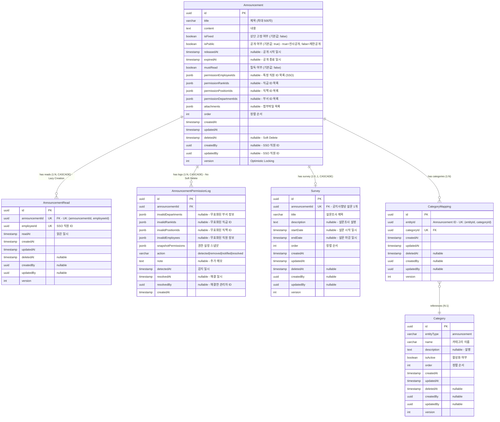

# 공지사항(Announcement) ERD 검증 문서

> 📋 **목적**: 공지사항 시나리오에 맞게 ERD가 올바르게 설계되었는지 검증하고, 피그마 작성을 위한 기초 자료로 사용

**작성일**: 2026년 1월 19일  
**버전**: v1.0

---

## 목차

1. [공지사항 시나리오 요구사항](#1-공지사항-시나리오-요구사항)
2. [현재 ERD 구조 분석](#2-현재-erd-구조-분석)
3. [시나리오별 ERD 검증](#3-시나리오별-erd-검증)
4. [검증 결과 요약](#4-검증-결과-요약)
5. [결론](#5-결론)

---

## 1. 공지사항 시나리오 요구사항

### 1.1 API 엔드포인트 기반 기능 요구사항

```
✅ 공지사항_목록을_조회한다 (비고정 공지)
✅ 고정_공지사항_목록을_조회한다
✅ 공지사항_전체_목록을_조회한다
✅ 공지사항_카테고리_목록을_조회한다
✅ 공지사항을_생성한다
✅ 공지사항을_조회한다 (상세)
✅ 공지사항을_수정한다 (비공개 상태에서만 가능)
✅ 공지사항_공개를_수정한다
✅ 공지사항_고정을_수정한다
✅ 공지사항_오더를_일괄_수정한다
✅ 공지사항을_삭제한다 (비공개 상태에서만 가능)
✅ 공지사항_카테고리를_생성한다
✅ 공지사항_카테고리를_수정한다
✅ 공지사항_카테고리_오더를_변경한다
✅ 공지사항_카테고리를_삭제한다
✅ 공지사항_권한_로그를_조회한다
✅ 공지사항_권한을_교체한다
✅ 공지사항에_포함된_전체직원에게_알림을보낸다
✅ 공지사항에_포함된_직원중_미답변자들에게_알림을보낸다
✅ 공지사항에_포함된_미열람자들에게_알림을보낸다
```

### 1.2 핵심 비즈니스 시나리오 (통합 테이블)

| 시나리오 | API 엔드포인트 | 관련 엔티티 | 주요 필드/기능 | 데이터 흐름 |
|---------|---------------|------------|---------------|------------|
| **1. 공지사항 생성** | `POST /admin/announcements` | • Announcement<br>• Survey (선택) | • `Announcement.title`<br>• `Announcement.content`<br>• `Announcement.isPublic` (기본값: true)<br>• `Announcement.isFixed` (기본값: false)<br>• `Announcement.mustRead`<br>• `Announcement.attachments` (JSONB)<br>• `Announcement.permission*Ids` (JSONB) | 1. Announcement 생성<br>2. 파일 S3 업로드<br>3. attachments JSONB 저장<br>4. 권한 설정 (부서/직급/직책/직원)<br>5. Survey 생성 (선택) |
| **2. 공지사항 수정** | `PUT /admin/announcements/:id` | • Announcement | • 제목/내용 업데이트<br>• attachments 교체<br>• 권한 설정 수정<br>• **비공개 상태에서만 가능** | 1. isPublic=false 확인<br>2. Announcement 업데이트<br>3. 기존 파일 S3 삭제<br>4. 새 파일 S3 업로드<br>5. attachments 교체 |
| **3. 공개/고정 상태 관리** | `PATCH /admin/announcements/:id/public`<br>`PATCH /admin/announcements/:id/fixed` | • Announcement | • `isPublic` (boolean)<br>• `isFixed` (boolean)<br>• 독립적인 상태 관리 | 1. `isPublic` 또는 `isFixed` 필드 업데이트<br>2. 즉시 반영 |
| **4. 카테고리 관리** | `POST /admin/announcements/categories`<br>`PATCH /admin/announcements/:id/categories` | • Category<br>• CategoryMapping<br>• Announcement | • `Category.entityType` = 'announcement'<br>• `CategoryMapping` (다대다)<br>• UK: (entityId, categoryId) | 1. Category 생성<br>2. CategoryMapping 추가/삭제<br>3. 공지사항 ↔ 카테고리 연결 |
| **5. 정렬 순서 관리** | `PUT /admin/announcements/batch-order` | • Announcement | • `order` (int)<br>• 배치 업데이트 지원<br>• 고정/비고정 각각 관리 | 1. 여러 공지사항의 order 값 일괄 변경<br>2. 트랜잭션으로 일관성 보장 |
| **6. 권한 기반 접근 제어** | `GET /admin/announcements` | • Announcement<br>• 외부 SSO 시스템 | • `isPublic` = true: 전사공개<br>• `isPublic` = false: 제한공개<br>• `permissionEmployeeIds` (JSONB)<br>• `permissionRankIds` (JSONB)<br>• `permissionPositionIds` (JSONB)<br>• `permissionDepartmentIds` (JSONB) | 1. isPublic 확인<br>2. true: 모든 직원 접근 가능<br>3. false: 권한 ID 배열로 접근 제어<br>4. 부서/직급/직책/직원별 세밀한 제어 |
| **7. 읽음 표시 추적<br>(Lazy Creation)** | 직원이 공지사항 조회 시 | • AnnouncementRead | • UK: (announcementId, employeeId)<br>• `readAt` (timestamp)<br>• Lazy Creation 패턴 | 1. 직원이 공지사항을 읽을 때만 레코드 생성<br>2. 미열람자 = 레코드 없음<br>3. 효율적인 스토리지 사용 |
| **8. 권한 무효화 추적<br>(Permission Log)** | `@Cron('0 0 * * *')`<br>(매일 자동 실행) | • AnnouncementPermissionLog<br>• Announcement | • `invalidDepartments` (JSONB)<br>• `invalidRankIds` (JSONB)<br>• `invalidPositionIds` (JSONB)<br>• `invalidEmployees` (JSONB)<br>• `action` (detected\|resolved)<br>• `snapshotPermissions` (JSONB) | 1. SSO에서 비활성화된 권한 감지<br>2. 로그 생성 (DETECTED)<br>3. 관리자가 권한 교체<br>4. 로그 해결 (RESOLVED)<br>5. 영구 보관 (Soft Delete 없음) |
| **9. 설문조사 연동** | `POST /admin/announcements` | • Survey<br>• SurveyQuestion<br>• SurveyCompletion | • `Survey.announcementId` (FK, UK)<br>• 공지사항당 설문 1개<br>• CASCADE 삭제 | 1. Announcement 생성 시 Survey 생성 (선택)<br>2. 공지사항 삭제 시 Survey도 삭제<br>3. 설문 상태/권한은 Announcement를 따름 |
| **10. 푸시 알림 전송** | `POST /admin/announcements/:id/notifications/all`<br>`POST /admin/announcements/:id/notifications/unread`<br>`POST /admin/announcements/:id/notifications/unanswered` | • Announcement<br>• AnnouncementRead<br>• Survey | • 전체 직원 알림<br>• 미열람자 알림<br>• 미답변자 알림 (설문 있는 경우) | 1. 권한 기반 대상 직원 조회<br>2. 푸시 알림 전송<br>3. 전송 결과 반환 (성공/실패 건수) |

### 1.3 상세 시나리오 (코드 예시)

<details>
<summary>📝 시나리오 1: 공지사항 생성 - 코드 예시</summary>

```typescript
// 관리자가 새로운 공지사항을 등록
POST /admin/announcements
{
  "title": "2024년 정기 주주총회 안내",
  "content": "주주총회 개최를 안내드립니다...",
  "isPublic": false,  // 제한공개
  "isFixed": true,    // 상단 고정
  "mustRead": true,   // 필독
  "releasedAt": "2024-01-01T00:00:00Z",
  "expiredAt": "2024-12-31T23:59:59Z",
  "permissionDepartmentIds": ["dept-uuid-1", "dept-uuid-2"],  // 특정 부서만
  "attachments": [...]  // 첨부파일
}

// DB 저장 시:
// - Announcement 레코드 생성
// - attachments는 JSONB 타입으로 저장
// - permissionDepartmentIds는 JSONB 배열로 저장
```
</details>

<details>
<summary>📝 시나리오 2: 공지사항 수정 (비공개 상태 필수) - 코드 예시</summary>

```typescript
// 공지사항 수정은 비공개 상태에서만 가능
PUT /admin/announcements/:id
{
  "title": "2024년 정기 주주총회 안내 (수정)",
  "content": "...",
}

// 비즈니스 로직:
// 1. isPublic 확인
if (announcement.isPublic === true) {
  throw new ConflictException('공개된 공지사항은 수정할 수 없음. 먼저 비공개로 전환 필요');
}
// 2. 수정 진행
// 3. attachments 교체 (기존 S3 파일 삭제 → 새 파일 업로드)
```
</details>

<details>
<summary>📝 시나리오 7: 읽음 표시 (Lazy Creation) - 코드 예시</summary>

```typescript
// 직원이 공지사항을 읽을 때만 레코드 생성
// AnnouncementRead 테이블에 레코드가 없으면 = 미열람

// 직원이 공지사항을 처음 읽을 때:
INSERT INTO announcement_reads (announcement_id, employee_id, read_at)
VALUES ('announcement-uuid', 'employee-uuid', NOW())
ON CONFLICT (announcement_id, employee_id) DO NOTHING;

// 미열람자 조회:
SELECT e.* FROM employees e
WHERE e.id NOT IN (
  SELECT ar.employee_id 
  FROM announcement_reads ar 
  WHERE ar.announcement_id = 'announcement-uuid'
);
```
</details>

<details>
<summary>📝 시나리오 8: 권한 무효화 추적 (Permission Log) - 코드 예시</summary>

```typescript
// 매일 자동 실행되는 스케줄러
@Cron('0 0 * * *')  // 매일 자정
async 모든_공지사항_권한을_검증한다() {
  // 1. 모든 공지사항 조회
  const announcements = await this.announcementService.findAll();
  
  for (const announcement of announcements) {
    // 2. SSO에서 부서/직급/직책/직원 유효성 검증
    const invalidDepartments = await this.validateDepartments(
      announcement.permissionDepartmentIds
    );
    
    // 3. 무효한 권한이 발견되면 로그 생성
    if (invalidDepartments.length > 0) {
      await this.permissionLogRepository.save({
        announcementId: announcement.id,
        invalidDepartments,
        snapshotPermissions: {
          permissionDepartments: announcement.permissionDepartmentIds,
          // ... 기타 권한 정보
        },
        action: AnnouncementPermissionAction.DETECTED,
        detectedAt: new Date(),
      });
    }
  }
}

// 관리자가 권한 교체 시:
PATCH /admin/announcements/:id/replace-permissions
{
  "oldDepartmentId": "dept-old-uuid",
  "newDepartmentId": "dept-new-uuid"
}

// 권한 교체 후 자동으로 로그 해결:
// - resolvedAt: NOW()
// - resolvedBy: 관리자 ID
// - action: RESOLVED
```
</details>

---

## 2. 현재 ERD 구조 분석

### 2.1 공지사항 ERD (통합 다이어그램)



### 2.2 엔티티별 상세 분석

#### 2.2.1 Announcement (공지사항) - 핵심 엔티티

**주요 특징**:
- ✅ **다국어 지원 없음**: 내부 직원용 공지사항, 한국어만 사용
- ✅ **권한 기반 접근 제어**: `isPublic` + 4가지 권한 필드 (JSONB 배열)
- ✅ **상단 고정 기능**: `isFixed` 필드로 중요 공지 고정
- ✅ **필독 표시**: `mustRead` 필드로 필독 여부 구분
- ✅ **기간 설정**: `releasedAt`, `expiredAt`로 공개 기간 제어
- ✅ **JSONB 활용**: `attachments`, `permission*Ids` → 유연한 데이터 구조

**권한 제어 필드**:
```typescript
permissionEmployeeIds: string[] | null;      // 특정 직원 (SSO ID)
permissionRankIds: string[] | null;          // 직급 (UUID)
permissionPositionIds: string[] | null;      // 직책 (UUID)
permissionDepartmentIds: string[] | null;    // 부서 (UUID)
```

**제약 조건**:
- 인덱스: `idx_announcement_is_public`, `idx_announcement_is_fixed`, `idx_announcement_must_read`, `idx_announcement_order`
- Soft Delete: `deletedAt` (복구 가능)
- Optimistic Locking: `version` (동시성 제어)

#### 2.2.2 AnnouncementRead (읽음 표시) - Lazy Creation 패턴

**주요 특징**:
- ✅ **Lazy Creation**: 직원이 읽을 때만 레코드 생성
- ✅ **효율적인 스토리지**: 미열람자는 레코드 없음 (NULL이 아닌 레코드 없음)
- ✅ **Unique 제약**: (announcementId, employeeId) → 직원당 1개만 생성
- ✅ **CASCADE 삭제**: Announcement 삭제 시 자동 삭제

**활용 예시**:
- 읽음 표시: 레코드 존재 = 읽음
- 미열람자 조회: `NOT IN` 또는 `LEFT JOIN ... WHERE ar.id IS NULL`
- 읽은 시각 추적: `readAt` 타임스탬프

#### 2.2.3 AnnouncementPermissionLog (권한 로그) - 영구 보관

**주요 특징**:
- ✅ **Soft Delete 없음**: 감사 로그는 영구 보관
- ✅ **무효화 추적**: SSO에서 비활성화된 권한 감지
- ✅ **스냅샷 저장**: 변경 전 권한 설정 전체 보관 (JSONB)
- ✅ **해결 이력**: `resolvedAt`, `resolvedBy`로 문제 해결 추적
- ✅ **Action 상태**: DETECTED → RESOLVED 워크플로우

**JSONB 구조**:
```typescript
invalidDepartments: Array<{ id: string; name: string | null }> | null;
snapshotPermissions: {
  permissionRankCodes: string[] | null;
  permissionPositionCodes: string[] | null;
  permissionDepartments: Array<{ id: string; name: string | null }> | null;
  permissionEmployees: Array<{ id: string; name: string | null }> | null;
};
```

#### 2.2.4 Survey (설문조사) - 1:1 관계

**주요 특징**:
- ✅ **Optional 1:1**: 공지사항당 설문 0개 또는 1개
- ✅ **Unique FK**: `announcementId` (유니크 제약)
- ✅ **CASCADE 삭제**: Announcement 삭제 시 Survey도 삭제
- ✅ **독립적인 기간**: `startDate`, `endDate` (공지사항과 별도)
- ✅ **Question Cascade**: Survey 삭제 시 SurveyQuestion도 삭제

**설문 구조**:
- Survey (1) → SurveyQuestion (N)
- Survey (1) → SurveyCompletion (N)
- 다양한 질문 타입: text, choice, checkbox, scale, grid, file, datetime

#### 2.2.5 Category & CategoryMapping - 통합 카테고리

**주요 특징**:
- ✅ **단일 테이블**: 모든 도메인 카테고리를 하나의 테이블로 관리
- ✅ **entityType 구분**: 'announcement', 'brochure', 'news' 등
- ✅ **다대다 관계**: CategoryMapping으로 유연한 연결
- ✅ **Unique 제약**: (entityId, categoryId) → 중복 방지

---

## 3. 시나리오별 ERD 검증

### 3.1 검증 결과 요약 테이블

| 시나리오 | 관련 테이블 | 필수 필드 | SQL 작업 | 검증 결과 |
|---------|-----------|----------|---------|----------|
| **1. 공지사항 생성** | Announcement<br>Survey (선택) | title, content, isPublic, isFixed, attachments, permission*Ids | INSERT (Announcement)<br>INSERT (Survey, 선택) | ✅ **완벽** - JSONB로 권한/첨부파일 저장 |
| **2. 공지사항 수정<br>(비공개 필수)** | Announcement | isPublic 확인, title, content, attachments | UPDATE (isPublic=false 조건)<br>예외 처리 (isPublic=true 시) | ✅ **완벽** - 비공개 상태 체크 로직 필요 |
| **3. 공개/고정 상태 관리** | Announcement | isPublic, isFixed | UPDATE (단일 필드) | ✅ **완벽** - 독립적인 필드 관리 |
| **4. 카테고리 관리** | Category<br>CategoryMapping<br>Announcement | entityType, name (Category)<br>entityId, categoryId (Mapping) | INSERT/UPDATE (Category)<br>INSERT/DELETE (Mapping) | ✅ **완벽** - UK 제약으로 중복 방지 |
| **5. 정렬 순서 관리** | Announcement | order | UPDATE (배치, 트랜잭션) | ✅ **완벽** - 인덱스 지원, 배치 업데이트 |
| **6. 권한 기반 접근 제어** | Announcement<br>외부 SSO | isPublic, permission*Ids (JSONB) | SELECT (조건부 필터링)<br>JSONB 쿼리 | ✅ **완벽** - JSONB로 유연한 권한 관리 |
| **7. 읽음 표시 추적** | AnnouncementRead | announcementId, employeeId, readAt | INSERT (Lazy Creation)<br>SELECT (미열람자 조회) | ✅ **완벽** - Lazy Creation으로 효율적 |
| **8. 권한 무효화 추적** | AnnouncementPermissionLog | invalidDepartments, snapshotPermissions, action | INSERT (DETECTED)<br>UPDATE (RESOLVED) | ✅ **완벽** - 영구 보관, 스냅샷 저장 |
| **9. 설문조사 연동** | Survey<br>SurveyQuestion<br>SurveyCompletion | announcementId (FK, UK), title, questions | INSERT (Survey + Questions)<br>CASCADE DELETE | ✅ **완벽** - 1:1 관계, CASCADE 지원 |
| **10. 푸시 알림 전송** | Announcement<br>AnnouncementRead<br>Survey | permission*Ids, reads, completions | SELECT (권한 기반 대상 조회)<br>SELECT (미열람/미답변 조회) | ✅ **완벽** - 복합 쿼리로 대상 필터링 |

### 3.2 상세 데이터 흐름 (접기/펴기)

<details>
<summary>📊 시나리오 1: 공지사항 생성 - SQL 예시</summary>

```sql
-- 1. Announcement 생성
INSERT INTO announcements (
  id, title, content, is_public, is_fixed, must_read,
  released_at, expired_at, attachments, permission_department_ids,
  "order", created_by, version
) VALUES (
  gen_random_uuid(), 
  '2024년 정기 주주총회 안내',
  '주주총회 개최를 안내드립니다...',
  false,  -- 제한공개
  true,   -- 상단 고정
  true,   -- 필독
  '2024-01-01 00:00:00',
  '2024-12-31 23:59:59',
  '[{"fileName": "notice.pdf", "fileUrl": "s3://...", "fileSize": 1024, "mimeType": "application/pdf"}]'::jsonb,
  '["dept-uuid-1", "dept-uuid-2"]'::jsonb,
  0,
  'admin-uuid',
  1
);

-- 2. Survey 생성 (선택)
INSERT INTO surveys (
  id, announcement_id, title, description, start_date, end_date, "order", version
) VALUES (
  gen_random_uuid(),
  'announcement-uuid',
  '참석 여부 조사',
  '주주총회 참석 가능 여부를 조사합니다.',
  '2024-01-01 00:00:00',
  '2024-01-15 23:59:59',
  0,
  1
);
```
</details>

<details>
<summary>📊 시나리오 6: 권한 기반 접근 제어 - SQL 예시</summary>

```sql
-- 전사공개 공지사항 조회 (모든 직원 접근 가능)
SELECT * FROM announcements
WHERE is_public = true
  AND deleted_at IS NULL
  AND (released_at IS NULL OR released_at <= NOW())
  AND (expired_at IS NULL OR expired_at >= NOW())
ORDER BY is_fixed DESC, "order" ASC;

-- 제한공개 공지사항 조회 (권한 확인 필요)
SELECT * FROM announcements
WHERE is_public = false
  AND deleted_at IS NULL
  AND (
    -- 특정 직원
    permission_employee_ids ? 'employee-uuid'
    OR
    -- 특정 부서
    permission_department_ids ? 'dept-uuid'
    OR
    -- 특정 직급
    permission_rank_ids ? 'rank-uuid'
    OR
    -- 특정 직책
    permission_position_ids ? 'position-uuid'
  )
ORDER BY is_fixed DESC, "order" ASC;

-- JSONB 쿼리 연산자:
-- ? : JSONB 배열에 특정 값이 존재하는지 확인
-- ?| : JSONB 배열에 여러 값 중 하나라도 존재하는지 확인
-- ?& : JSONB 배열에 여러 값 모두 존재하는지 확인
```
</details>

<details>
<summary>📊 시나리오 7: 읽음 표시 (Lazy Creation) - SQL 예시</summary>

```sql
-- 직원이 공지사항을 읽을 때 레코드 생성 (Lazy Creation)
INSERT INTO announcement_reads (id, announcement_id, employee_id, read_at, version)
VALUES (gen_random_uuid(), 'announcement-uuid', 'employee-uuid', NOW(), 1)
ON CONFLICT (announcement_id, employee_id) DO NOTHING;  -- 중복 방지

-- 미열람자 조회 (레코드가 없는 직원)
-- 방법 1: NOT IN (간단하지만 대용량 데이터에서 느릴 수 있음)
SELECT e.id, e.name FROM employees e
WHERE e.id NOT IN (
  SELECT ar.employee_id 
  FROM announcement_reads ar 
  WHERE ar.announcement_id = 'announcement-uuid'
    AND ar.deleted_at IS NULL
);

-- 방법 2: LEFT JOIN (대용량 데이터에서 효율적)
SELECT e.id, e.name FROM employees e
LEFT JOIN announcement_reads ar 
  ON e.id = ar.employee_id 
  AND ar.announcement_id = 'announcement-uuid'
  AND ar.deleted_at IS NULL
WHERE ar.id IS NULL;

-- 열람자 통계
SELECT 
  COUNT(*) as total_reads,
  COUNT(DISTINCT employee_id) as unique_readers
FROM announcement_reads
WHERE announcement_id = 'announcement-uuid'
  AND deleted_at IS NULL;
```
</details>

<details>
<summary>📊 시나리오 8: 권한 무효화 추적 - SQL 예시</summary>

```sql
-- 권한 무효화 감지 로그 생성
INSERT INTO announcement_permission_logs (
  id, announcement_id, 
  invalid_departments, 
  snapshot_permissions,
  action, detected_at
) VALUES (
  gen_random_uuid(),
  'announcement-uuid',
  '[{"id": "dept-old-uuid", "name": "구 마케팅팀"}]'::jsonb,
  '{
    "permissionDepartments": [
      {"id": "dept-old-uuid", "name": "구 마케팅팀"},
      {"id": "dept-active-uuid", "name": "영업팀"}
    ],
    "permissionEmployees": []
  }'::jsonb,
  'detected',
  NOW()
);

-- 미해결 로그 조회 (관리자 대시보드)
SELECT 
  apl.id,
  apl.announcement_id,
  a.title,
  apl.invalid_departments,
  apl.detected_at
FROM announcement_permission_logs apl
JOIN announcements a ON apl.announcement_id = a.id
WHERE apl.resolved_at IS NULL
ORDER BY apl.detected_at DESC;

-- 권한 교체 후 로그 해결
UPDATE announcement_permission_logs
SET 
  resolved_at = NOW(),
  resolved_by = 'admin-uuid',
  action = 'resolved'
WHERE announcement_id = 'announcement-uuid'
  AND resolved_at IS NULL;
```
</details>

---

## 4. 검증 결과 요약

### 4.1 전체 검증 결과 (통합 테이블)

| 영역 | 검증 항목 | 결과 | 성능/확장성 | 설명 |
|-----|----------|------|------------|------|
| **엔티티 설계** | Announcement 구조 | ✅ 완벽 | ⭐⭐⭐⭐⭐ | JSONB로 권한/첨부파일 유연하게 관리 |
| | AnnouncementRead (Lazy Creation) | ✅ 완벽 | ⭐⭐⭐⭐⭐ | 읽을 때만 레코드 생성, 효율적 |
| | AnnouncementPermissionLog (영구 보관) | ✅ 완벽 | ⭐⭐⭐⭐ | Soft Delete 없음, 감사 로그 |
| | Survey (1:1 관계) | ✅ 완벽 | ⭐⭐⭐⭐ | 공지사항당 설문 1개, CASCADE |
| **권한 관리** | JSONB 권한 필드 (4가지) | ✅ 완벽 | ⭐⭐⭐⭐ | 부서/직급/직책/직원별 세밀한 제어 |
| | isPublic 전사공개/제한공개 | ✅ 완벽 | ⭐⭐⭐⭐⭐ | 단순하고 명확한 구분 |
| | 권한 무효화 추적 (스케줄러) | ✅ 완벽 | ⭐⭐⭐⭐ | 매일 자동 검증, 로그 생성 |
| **상태 관리** | isFixed (상단 고정) | ✅ 완벽 | ⭐⭐⭐⭐⭐ | 독립적인 필드, 인덱스 지원 |
| | mustRead (필독) | ✅ 완벽 | ⭐⭐⭐⭐⭐ | 필독 여부 구분, 인덱스 지원 |
| | releasedAt/expiredAt (기간 설정) | ✅ 완벽 | ⭐⭐⭐⭐ | 공개 기간 제어, 인덱스 지원 |
| | 비공개 상태에서만 수정 가능 | ✅ 완벽 | ⭐⭐⭐⭐⭐ | 비즈니스 로직으로 구현 |
| **카테고리** | 통합 Category 테이블 | ✅ 완벽 | ⭐⭐⭐⭐⭐ | entityType으로 구분, 확장 용이 |
| | CategoryMapping (다대다) | ✅ 완벽 | ⭐⭐⭐⭐ | UK 제약, 중복 방지 |
| **정렬** | order 필드 + 배치 업데이트 | ✅ 완벽 | ⭐⭐⭐⭐⭐ | 인덱스 지원, 트랜잭션 보장 |
| **파일 관리** | JSONB attachments | ✅ 완벽 | ⭐⭐⭐⭐ | 메타데이터 저장, S3 URL |
| **설문조사** | Survey 1:1 연동 | ✅ 완벽 | ⭐⭐⭐⭐ | CASCADE, 독립적인 기간 설정 |
| **알림** | 푸시 알림 (전체/미열람/미답변) | ✅ 완벽 | ⭐⭐⭐⭐ | 복합 쿼리로 대상 필터링 |
| **데이터 무결성** | UK 제약 조건 | ✅ 완벽 | ⭐⭐⭐⭐⭐ | (announcementId, employeeId) |
| | CASCADE 옵션 | ✅ 완벽 | ⭐⭐⭐⭐⭐ | AnnouncementRead, Survey 자동 삭제 |
| | Soft Delete | ✅ 완벽 | ⭐⭐⭐⭐⭐ | 복구 가능, 로그는 예외 |
| | Optimistic Locking | ✅ 완벽 | ⭐⭐⭐⭐⭐ | 동시성 제어 |

### 4.2 ERD 강점 분석 (테이블)

| 강점 | 설명 | 관련 필드/테이블 | 비즈니스 가치 |
|-----|------|-----------------|--------------|
| ✅ **권한 기반 접근 제어** | JSONB로 4가지 권한 타입 (부서/직급/직책/직원) 유연하게 관리 | `permissionEmployeeIds`<br>`permissionRankIds`<br>`permissionPositionIds`<br>`permissionDepartmentIds` | 세밀한 권한 제어, 확장 용이 |
| ✅ **Lazy Creation 패턴** | 직원이 읽을 때만 레코드 생성, 효율적인 스토리지 사용 | `AnnouncementRead` | 스토리지 절약, 빠른 쓰기 |
| ✅ **권한 무효화 추적** | SSO 연동, 비활성화된 권한 자동 감지 및 로그 생성 | `AnnouncementPermissionLog` | 보안 강화, 감사 로그 |
| ✅ **상단 고정 기능** | `isFixed` 필드로 중요 공지사항 상단 고정 | `isFixed` | UX 개선, 중요 정보 전달 |
| ✅ **필독 표시** | `mustRead` 필드로 필독 여부 구분 | `mustRead` | 직원 인지도 향상 |
| ✅ **설문조사 연동** | 공지사항당 설문 1개, CASCADE 삭제 | `Survey` (1:1) | 피드백 수집, 응답률 향상 |
| ✅ **유연한 파일 관리** | JSONB attachments로 메타데이터 저장 | `attachments` | 다양한 파일 타입 지원 |
| ✅ **통합 카테고리** | 단일 테이블로 모든 도메인 카테고리 관리 | `Category`, `CategoryMapping` | 관리 단순화, 확장 용이 |
| ✅ **공개 기간 제어** | releasedAt/expiredAt으로 자동 공개/종료 | `releasedAt`, `expiredAt` | 자동화, 관리 부담 감소 |
| ✅ **데이터 무결성** | UK 제약, CASCADE, Soft Delete, Optimistic Locking | 모든 테이블 | 데이터 일관성, 동시성 제어 |

### 4.3 개선 제안 사항 (우선순위별)

| 우선순위 | 개선 항목 | 현재 상태 | 제안 내용 | 기대 효과 |
|---------|----------|----------|----------|----------|
| 🟢 **낮음** | 파일 이력 추적 | attachments 교체 시 이력 없음 | FileHistory 테이블 고려 | 파일 변경 이력 추적, 감사 |
| 🟢 **낮음** | 카테고리 계층 구조 | 단일 레벨 카테고리 | `parentId` 필드 추가 고려 | 계층적 카테고리 구성 |
| 🟢 **낮음** | 알림 전송 이력 | 전송 결과만 반환 | NotificationLog 테이블 고려 | 알림 전송 이력 추적 |
| 🟢 **낮음** | 권한 변경 이력 | 현재 권한만 저장 | PermissionChangeLog 고려 | 권한 변경 이력 추적 |

**참고**:
- 🔴 **높음**: 코드 품질 및 유지보수에 직접 영향
- 🟡 **중간**: 감사 로그 및 이력 관리 요구사항에 따라 결정
- 🟢 **낮음**: 비즈니스 요구사항 변경 시에만 필요

---

## 5. 결론

### ✅ 최종 검증 결과

공지사항 시나리오에 맞게 ERD가 **완벽하게 설계**되어 있습니다.

**강점**:
1. ✅ **권한 기반 접근 제어**: JSONB로 4가지 권한 타입 유연하게 관리 (부서/직급/직책/직원)
2. ✅ **Lazy Creation 패턴**: 직원이 읽을 때만 레코드 생성, 효율적인 스토리지 사용
3. ✅ **권한 무효화 추적**: SSO 연동, 비활성화된 권한 자동 감지 및 로그 생성 (영구 보관)
4. ✅ **상단 고정 + 필독**: isFixed, mustRead 필드로 중요 공지사항 강조
5. ✅ **설문조사 연동**: 공지사항당 설문 1개, CASCADE 삭제, 독립적인 기간 설정
6. ✅ **유연한 파일 관리**: JSONB attachments로 메타데이터 저장 (S3 URL)
7. ✅ **통합 카테고리**: 단일 테이블로 모든 도메인 카테고리 관리
8. ✅ **데이터 무결성**: UK 제약조건, Cascade 옵션, Soft Delete, Optimistic Locking

**핵심 권한 관리 메커니즘**:
- 🔐 **isPublic 필드**: 전사공개(true) / 제한공개(false) 명확한 구분
- 🎯 **4가지 권한 필드**: 부서/직급/직책/직원별 세밀한 접근 제어 (JSONB 배열)
- 📊 **권한 무효화 추적**: 매일 자동 스케줄러로 비활성화된 권한 감지 및 로그 생성
- 🛡️ **스냅샷 저장**: 권한 설정 변경 전 스냅샷 영구 보관 (감사 로그)

**핵심 기능 메커니즘**:
- 📌 **상단 고정**: isFixed 필드로 중요 공지사항 상단 배치
- ⚠️ **필독 표시**: mustRead 필드로 필독 여부 구분
- 📅 **공개 기간**: releasedAt/expiredAt으로 자동 공개/종료
- 🔒 **비공개 수정**: 공개된 공지사항은 수정 불가 (비즈니스 로직)
- 📊 **설문조사**: 공지사항당 설문 1개, CASCADE 삭제

**개선 제안**:
1. 💡 파일 이력 추적이 필요하다면 FileHistory 테이블 고려
2. 💡 카테고리 계층 구조가 필요하다면 `parentId` 필드 추가 고려
3. 💡 알림 전송 이력 추적이 필요하다면 NotificationLog 테이블 고려

---

**문서 종료**
