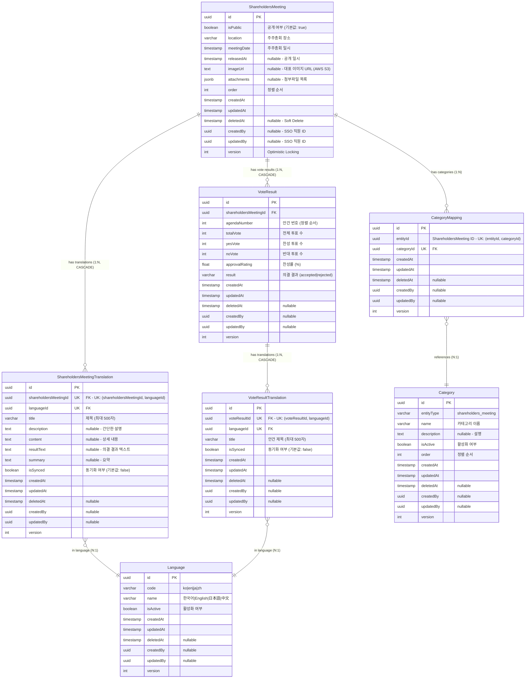

# 주주총회(Shareholders Meeting) ERD 검증 문서

> 📋 **목적**: 주주총회 시나리오에 맞게 ERD가 올바르게 설계되었는지 검증하고, 피그마 작성을 위한 기초 자료로 사용

**작성일**: 2026년 1월 19일  
**버전**: v1.0

---

## 목차

1. [주주총회 시나리오 요구사항](#1-주주총회-시나리오-요구사항)
2. [현재 ERD 구조 분석](#2-현재-erd-구조-분석)
3. [시나리오별 ERD 검증](#3-시나리오별-erd-검증)
4. [검증 결과 요약](#4-검증-결과-요약)
5. [결론](#5-결론)

---

## 1. 주주총회 시나리오 요구사항

### 1.1 API 엔드포인트 기반 기능 요구사항

```
✅ 주주총회_목록을_조회한다 (페이징)
✅ 주주총회_전체_목록을_조회한다
✅ 주주총회_카테고리_목록을_조회한다
✅ 주주총회를_생성한다
✅ 주주총회_상세를_조회한다
✅ 주주총회를_수정한다 (번역, 의결 결과 및 파일 포함)
✅ 주주총회_공개를_수정한다
✅ 주주총회_오더를_일괄_수정한다
✅ 주주총회를_삭제한다
✅ 주주총회_카테고리를_생성한다
✅ 주주총회_카테고리를_수정한다
✅ 주주총회_카테고리_오더를_변경한다
✅ 주주총회_카테고리를_삭제한다
```

### 1.2 핵심 비즈니스 시나리오 (통합 테이블)

| 시나리오 | API 엔드포인트 | 관련 엔티티 | 주요 필드/기능 | 데이터 흐름 |
|---------|---------------|------------|---------------|------------|
| **1. 주주총회 생성<br>(다국어, 의결 결과)** | `POST /admin/shareholders-meetings` | • ShareholdersMeeting<br>• ShareholdersMeetingTranslation<br>• VoteResult<br>• VoteResultTranslation<br>• Language | • `ShareholdersMeeting.location`<br>• `ShareholdersMeeting.meetingDate`<br>• `ShareholdersMeeting.attachments` (JSONB)<br>• `ShareholdersMeetingTranslation.title`<br>• `ShareholdersMeetingTranslation.isSynced` (입력 언어: false, 미입력 언어: true)<br>• `VoteResult.agendaNumber`<br>• `VoteResult.totalVote`, `yesVote`, `noVote`<br>• `VoteResultTranslation.title`<br>• `VoteResultTranslation.isSynced` (입력 언어: false, 미입력 언어: true) | 1. ShareholdersMeeting 생성<br>2. 입력 언어 Translation 생성 (isSynced=false)<br>3. 미입력 언어 Translation 생성 (isSynced=true)<br>4. VoteResult 생성 (안건)<br>5. 입력 언어 VoteResultTranslation 생성 (isSynced=false)<br>6. 미입력 언어 VoteResultTranslation 생성 (isSynced=true)<br>7. 파일 S3 업로드<br>8. attachments JSONB 저장 |
| **2. 주주총회 수정<br>(번역, 의결 결과 및 파일)** | `PUT /admin/shareholders-meetings/:id` | • ShareholdersMeeting<br>• ShareholdersMeetingTranslation<br>• VoteResult<br>• VoteResultTranslation | • Translation 업데이트<br>• VoteResult 업데이트/생성/삭제<br>• attachments 완전 교체<br>• AWS S3 연동<br>• **isSynced 유지 (변경 없음)** | 1. 기존 Translation 업데이트<br>2. **isSynced 유지 (변경하지 않음)**<br>3. VoteResult 관리 (id 있으면 업데이트, 없으면 생성)<br>4. 기존 파일 S3 삭제<br>5. 새 파일 S3 업로드<br>6. attachments 교체 |
| **3. 공개 상태 관리** | `PATCH /admin/shareholders-meetings/:id/public` | • ShareholdersMeeting | • `isPublic` (boolean)<br>• 즉시 공개/비공개 제어<br>• 복잡한 상태 관리 없음 | 1. `isPublic` 필드만 업데이트<br>2. 즉시 반영 (워크플로우 없음) |
| **4. 카테고리 관리** | `POST /admin/shareholders-meetings/categories`<br>`PATCH /admin/shareholders-meetings/:id/categories` | • Category<br>• CategoryMapping<br>• ShareholdersMeeting | • `Category.entityType` = 'shareholders_meeting'<br>• `CategoryMapping` (다대다)<br>• UK: (entityId, categoryId) | 1. Category 생성<br>2. CategoryMapping 추가/삭제<br>3. 주주총회 ↔ 카테고리 연결 |
| **5. 정렬 순서 관리** | `PUT /admin/shareholders-meetings/batch-order` | • ShareholdersMeeting | • `order` (int)<br>• 배치 업데이트 지원 | 1. 여러 주주총회의 order 값 일괄 변경<br>2. 트랜잭션으로 일관성 보장 |
| **6. 의결 결과 관리<br>(안건 관리)** | `POST /admin/shareholders-meetings`<br>`PUT /admin/shareholders-meetings/:id` | • VoteResult<br>• VoteResultTranslation | • `agendaNumber` (안건 번호)<br>• `totalVote`, `yesVote`, `noVote`<br>• `approvalRating` (찬성률)<br>• `result` (accepted\|rejected)<br>• VoteResultTranslation (다국어) | 1. VoteResult 생성/수정/삭제<br>2. 안건별 의결 결과 저장<br>3. 찬성률 자동 계산<br>4. agendaNumber로 정렬 |
| **7. 다국어 조회<br>(Fallback)** | `GET /admin/shareholders-meetings/:id?lang=en` | • ShareholdersMeeting<br>• ShareholdersMeetingTranslation<br>• Language | • Fallback 순서:<br>&nbsp;&nbsp;1. 요청 언어 (en)<br>&nbsp;&nbsp;2. 한국어 (ko)<br>&nbsp;&nbsp;3. 영어 (en)<br>&nbsp;&nbsp;4. 첫 번째 번역 | 1. Language.code로 요청 언어 조회<br>2. 없으면 ko 조회<br>3. 없으면 첫 번째 번역 조회 |
| **8. 번역 자동 동기화<br>(Scheduler)** | `@Cron('* * * * *')`<br>(1분마다 자동 실행) | • ShareholdersMeetingTranslation<br>• VoteResultTranslation<br>• Language | • `isSynced` 필드 기반 동기화<br>• 한국어 원본 → 타 언어 자동 복사<br>• **수정 시 isSynced=false로 동기화 종료** | 1. 한국어(ko) 조회<br>2. 모든 ShareholdersMeeting 순회<br>3. 한국어 원본 번역 조회<br>4. isSynced=true인 타 언어 조회<br>5. 주주총회 및 의결 결과 번역 자동 복사<br>6. **수정 시 isSynced=false 처리로 제외** |
| **9. 파일 관리** | `POST/PUT /admin/shareholders-meetings` | • ShareholdersMeeting | • `attachments` (JSONB)<br>• 파일 메타데이터 저장<br>• S3 URL 참조<br>• PDF/JPG/PNG/WEBP/XLSX/DOCX | 1. 파일 S3 업로드<br>2. attachments JSONB 저장<br>3. 수정 시 기존 파일 삭제 후 교체 |
| **10. 주주총회 일시 관리** | `POST /admin/shareholders-meetings` | • ShareholdersMeeting | • `meetingDate` (timestamp)<br>• `location` (varchar)<br>• 주주총회 장소 및 일시 | 1. meetingDate 저장<br>2. location 저장<br>3. meetingDate로 정렬 가능 |

### 1.3 상세 시나리오 (코드 예시)

<details>
<summary>📝 시나리오 1: 주주총회 생성 (다국어, 의결 결과) - 코드 예시</summary>

```typescript
// 관리자가 새로운 주주총회를 등록
POST /admin/shareholders-meetings
{
  "translations": [
    {
      "languageId": "ko-uuid",
      "title": "2024년 정기 주주총회",
      "description": "2024년 정기 주주총회입니다.",
      "content": "상세 내용...",
      "resultText": "의결 결과 텍스트",
      "summary": "요약"
    },
    {
      "languageId": "en-uuid",
      "title": "2024 Annual Shareholders Meeting",
      "description": "2024 annual shareholders meeting."
    }
  ],
  "location": "서울특별시 강남구 테헤란로 123",
  "meetingDate": "2024-03-15T10:00:00.000Z",
  "voteResults": [
    {
      "agendaNumber": 1,
      "totalVote": 1000,
      "yesVote": 950,
      "noVote": 50,
      "approvalRating": 95.0,
      "result": "accepted",
      "translations": [
        {
          "languageId": "ko-uuid",
          "title": "제1호 의안: 재무제표 승인"
        },
        {
          "languageId": "en-uuid",
          "title": "Agenda 1: Approval of Financial Statements"
        }
      ]
    }
  ],
  "files": [File, File, ...]  // PDF, JPG, PNG, WEBP, XLSX, DOCX
}
```
</details>

<details>
<summary>📝 시나리오 2: 주주총회 수정 (번역, 의결 결과 및 파일) - 코드 예시</summary>

```typescript
// 기존 주주총회의 번역, 의결 결과와 파일을 수정
PUT /admin/shareholders-meetings/:id
{
  "translations": [
    {
      "languageId": "ko-uuid",
      "title": "2024년 정기 주주총회 (수정)",
      "description": "최신 정보로 업데이트되었습니다."
    }
  ],
  "location": "서울특별시 강남구 테헤란로 456",
  "meetingDate": "2024-03-20T14:00:00.000Z",
  "voteResults": [
    {
      "id": "existing-uuid",  // id가 있으면 업데이트
      "agendaNumber": 1,
      "totalVote": 1100,
      "yesVote": 1050,
      "noVote": 50,
      "approvalRating": 95.45,
      "result": "accepted",
      "translations": [...]
    },
    {
      // id가 없으면 새로 생성
      "agendaNumber": 2,
      "totalVote": 1100,
      "yesVote": 990,
      "noVote": 110,
      "approvalRating": 90.0,
      "result": "accepted",
      "translations": [...]
    }
  ],
  "files": [File, ...]  // 새로운 파일로 완전 교체
}

// ⚠️ 중요: 주주총회 수정 시 isSynced 처리
// - isSynced는 수정 시에도 유지됨 (변경하지 않음)
// - 자동 동기화 대상(isSynced=true)은 계속 동기화됨
// - 수동 관리 대상(isSynced=false)은 계속 수동 관리됨
//
// ⚠️ 의결 결과(안건) 관리 방식:
// - id가 있는 안건: 기존 안건 업데이트
// - id가 없는 안건: 새 안건 생성
// - voteResults에 포함되지 않은 기존 안건: 삭제됨
```
</details>

<details>
<summary>📝 시나리오 8: 번역 자동 동기화 (Scheduler) - 코드 예시</summary>

```typescript
// 1분마다 자동 실행되는 스케줄러
@Cron(CronExpression.EVERY_MINUTE)
async handleShareholdersMeetingTranslationSync() {
  // 1. 한국어(ko) 조회
  const koreanLanguage = await languageService.코드로_언어를_조회한다('ko');
  
  // 2. 모든 ShareholdersMeeting 순회
  for (const meeting of meetings) {
    // 3. 주주총회 한국어 원본 번역 조회
    const koreanTranslation = await findKoreanTranslation(meeting.id);
    
    // 4. isSynced=true인 다른 언어 번역들 조회
    const syncedTranslations = await findSyncedTranslations(meeting.id);
    
    // 5. 한국어 내용을 다른 언어로 자동 복사
    for (const translation of syncedTranslations) {
      if (translation.languageId !== koreanLanguage.id) {
        translation.title = koreanTranslation.title;
        translation.description = koreanTranslation.description;
        translation.content = koreanTranslation.content;
        translation.resultText = koreanTranslation.resultText;
        translation.summary = koreanTranslation.summary;
        // ⚠️ isSynced는 유지 (계속 동기화 대상)
        await save(translation);
      }
    }
    
    // 6. 의결 결과 번역 동기화
    const voteResults = await findVoteResults(meeting.id);
    for (const voteResult of voteResults) {
      const koreanVoteTranslation = await findKoreanVoteTranslation(voteResult.id);
      const syncedVoteTranslations = await findSyncedVoteTranslations(voteResult.id);
      
      for (const translation of syncedVoteTranslations) {
        if (translation.languageId !== koreanLanguage.id) {
          translation.title = koreanVoteTranslation.title;
          await save(translation);
        }
      }
    }
  }
}

// 동기화 시나리오 예시:
// 
// [시나리오 A: 생성 시 ko, en만 입력]
// 요청:
POST /admin/shareholders-meetings { 
  translations: [
    { languageId: "ko-uuid", title: "2024년 정기 주주총회" },
    { languageId: "en-uuid", title: "2024 Annual Meeting" }
  ],
  voteResults: [
    {
      agendaNumber: 1,
      translations: [
        { languageId: "ko-uuid", title: "제1호 의안" },
        { languageId: "en-uuid", title: "Agenda 1" }
      ]
    }
  ]
}

// 생성 결과:
// 주주총회:
// - ko: "2024년 정기 주주총회", isSynced=false (입력됨, 수동 관리)
// - en: "2024 Annual Meeting", isSynced=false (입력됨, 수동 관리)
// - ja: "2024년 정기 주주총회", isSynced=true (자동 생성, 자동 동기화)
// - zh: "2024년 정기 주주총회", isSynced=true (자동 생성, 자동 동기화)
//
// 의결 결과 안건 1:
// - ko: "제1호 의안", isSynced=false (입력됨, 수동 관리)
// - en: "Agenda 1", isSynced=false (입력됨, 수동 관리)
// - ja: "제1호 의안", isSynced=true (자동 생성, 자동 동기화)
// - zh: "제1호 의안", isSynced=true (자동 생성, 자동 동기화)
//
// ⚠️ 핵심 로직:
// - 입력된 언어(ko, en): isSynced=false (수동 관리, 품질 유지)
// - 미입력 언어(ja, zh): isSynced=true (자동 동기화, 기본 번역 제공)
// - 한국어 우선: 없으면 첫 번째 입력 언어를 기준으로 자동 생성
```
</details>

<details>
<summary>📝 시나리오 3: 공개 상태 관리 - 코드 예시</summary>

```typescript
// 주주총회 공개/비공개 설정
PATCH /admin/shareholders-meetings/:id/public
{
  "isPublic": true  // 즉시 공개/비공개
}
```
</details>

<details>
<summary>📝 시나리오 4: 카테고리 관리 - 코드 예시</summary>

```typescript
// 주주총회 카테고리 생성
POST /admin/shareholders-meetings/categories
{
  "name": "정기총회",
  "description": "정기 주주총회",
  "isActive": true,
  "order": 1
}

// 주주총회에 카테고리 할당
PATCH /admin/shareholders-meetings/:id/categories
{
  "categoryIds": ["category-uuid-1", "category-uuid-2"]
}
```
</details>

<details>
<summary>📝 시나리오 5: 정렬 순서 관리 - 코드 예시</summary>

```typescript
// 여러 주주총회의 순서를 한 번에 변경
PUT /admin/shareholders-meetings/batch-order
{
  "shareholdersMeetings": [
    { "id": "uuid-1", "order": 1 },
    { "id": "uuid-2", "order": 2 },
    { "id": "uuid-3", "order": 3 }
  ]
}
```
</details>

<details>
<summary>📝 시나리오 6: 의결 결과 관리 (안건 관리) - 코드 예시</summary>

```typescript
// 의결 결과(안건) 생성
{
  "agendaNumber": 1,  // 안건 번호
  "totalVote": 1000,  // 전체 투표 수
  "yesVote": 950,     // 찬성 투표 수
  "noVote": 50,       // 반대 투표 수
  "approvalRating": 95.0,  // 찬성률 (%)
  "result": "accepted",    // 의결 결과 (accepted|rejected)
  "translations": [
    {
      "languageId": "ko-uuid",
      "title": "제1호 의안: 재무제표 승인"
    }
  ]
}

// 의결 결과 특징:
// - agendaNumber로 정렬
// - 주주총회별로 여러 안건 관리
// - CASCADE 삭제 (주주총회 삭제 시 의결 결과도 삭제)
// - 다국어 지원 (VoteResultTranslation)
// - isSynced 필드로 번역 동기화
```
</details>

<details>
<summary>📝 시나리오 7: 다국어 조회 (Fallback) - 코드 예시</summary>

```typescript
// 클라이언트가 특정 언어로 주주총회 조회
GET /admin/shareholders-meetings/:id?lang=en

// Fallback 순서:
// 1. 요청 언어 (en)
// 2. 한국어 (ko) - 기본 언어
// 3. 영어 (en)
// 4. 첫 번째 사용 가능한 번역
```
</details>

---

## 2. 현재 ERD 구조 분석

### 2.1 주주총회 통합 ERD



### 2.2 엔티티별 필드 분석

#### ShareholdersMeeting (주주총회)
- ✅ `id` (uuid) - Primary Key
- ✅ `isPublic` (boolean) - 공개/비공개 즉시 제어 (기본값: true)
- ✅ `location` (varchar 500) - 주주총회 장소
- ✅ `meetingDate` (timestamp) - 주주총회 일시
- ✅ `releasedAt` (timestamp nullable) - 공개 일시 (예약 공개)
- ✅ `imageUrl` (text nullable) - 대표 이미지 URL (AWS S3)
- ✅ `attachments` (jsonb) - 첨부파일 메타데이터 (파일명, URL, 크기, MIME 타입)
- ✅ `order` (int) - 정렬 순서
- ✅ `createdAt`, `updatedAt` - 생성/수정 일시
- ✅ `deletedAt` - Soft Delete 지원
- ✅ `createdBy`, `updatedBy` - 생성자/수정자 (외부 SSO 시스템 직원 ID)
- ✅ `version` - 동시성 제어 (Optimistic Locking)

**JSONB 구조 (attachments)**:
```typescript
attachments: [
  {
    fileName: "meeting_notice_ko.pdf",
    fileUrl: "https://s3.amazonaws.com/lumir-cms/meetings/meeting_notice_ko.pdf",
    fileSize: 512000,  // bytes
    mimeType: "application/pdf"
  },
  {
    fileName: "financial_report.xlsx",
    fileUrl: "https://s3.amazonaws.com/lumir-cms/meetings/financial_report.xlsx",
    fileSize: 307200,
    mimeType: "application/vnd.openxmlformats-officedocument.spreadsheetml.sheet"
  }
]
```

**지원 파일 타입**:
- ✅ `PDF` - application/pdf
- ✅ `JPG/JPEG` - image/jpeg
- ✅ `PNG` - image/png
- ✅ `WEBP` - image/webp
- ✅ `XLSX` - application/vnd.openxmlformats-officedocument.spreadsheetml.sheet
- ✅ `DOCX` - application/vnd.openxmlformats-officedocument.wordprocessingml.document

#### ShareholdersMeetingTranslation (주주총회 번역)
- ✅ `shareholdersMeetingId` (uuid) - ShareholdersMeeting FK (CASCADE DELETE)
- ✅ `languageId` (uuid) - Language FK
- ✅ `title` (varchar 500) - 번역된 제목
- ✅ `description` (text nullable) - 번역된 설명
- ✅ `content` (text nullable) - 상세 내용
- ✅ `resultText` (text nullable) - 의결 결과 텍스트
- ✅ `summary` (text nullable) - 요약
- ✅ `isSynced` (boolean) - 원본과 동기화 여부 (생성 시 입력 언어: false, 미입력 언어: true)

**유니크 제약조건**:
- ✅ `(shareholdersMeetingId, languageId)` - 하나의 주주총회는 같은 언어로 중복 번역 불가

#### VoteResult (의결 결과 / 안건)
- ✅ `shareholdersMeetingId` (uuid) - ShareholdersMeeting FK (CASCADE DELETE)
- ✅ `agendaNumber` (int) - 안건 번호 (정렬 순서로도 사용)
- ✅ `totalVote` (int) - 전체 투표 수
- ✅ `yesVote` (int) - 찬성 투표 수
- ✅ `noVote` (int) - 반대 투표 수
- ✅ `approvalRating` (float) - 찬성률 (%)
- ✅ `result` (enum) - 의결 결과 (accepted|rejected)

**특징**:
- ✅ CASCADE 삭제 (주주총회 삭제 시 의결 결과도 삭제)
- ✅ agendaNumber로 안건 순서 관리
- ✅ 다국어 지원 (VoteResultTranslation)

#### VoteResultTranslation (의결 결과 번역)
- ✅ `voteResultId` (uuid) - VoteResult FK (CASCADE DELETE)
- ✅ `languageId` (uuid) - Language FK
- ✅ `title` (varchar 500) - 안건 제목
- ✅ `isSynced` (boolean) - 원본과 동기화 여부 (생성 시 입력 언어: false, 미입력 언어: true)

**유니크 제약조건**:
- ✅ `(voteResultId, languageId)` - 하나의 의결 결과는 같은 언어로 중복 번역 불가

#### Language (언어)
- ✅ `code` (varchar) - 언어 코드 (ko, en, ja, zh)
- ✅ `name` (varchar) - 언어 이름
- ✅ `isActive` (boolean) - 활성화 여부

**지원 언어**:
- ✅ `ko` - 한국어 (기본 언어)
- ✅ `en` - English (영어)
- ✅ `ja` - 日本語 (일본어)
- ✅ `zh` - 中文 (중국어)

#### Category & CategoryMapping (카테고리)
- ✅ `entityType` (varchar) - 도메인 구분 (shareholders_meeting)
- ✅ `name`, `description` - 카테고리 정보
- ✅ `isActive` (boolean) - 활성화 여부
- ✅ `order` (int) - 정렬 순서

**특징**:
- ✅ 통합 카테고리 테이블 (entityType으로 도메인 구분)
- ✅ 다대다 관계 (하나의 주주총회는 여러 카테고리에 속할 수 있음)
- ✅ `(entityId, categoryId)` 복합 유니크 키 - 중복 방지

---

## 3. 시나리오별 ERD 검증

### 3.1 검증 결과 요약 테이블

| 시나리오 | 관련 테이블 | 사용 필드 | SQL 작업 | 검증 결과 | 비고 |
|---------|-----------|---------|----------|-----------|------|
| **1. 주주총회 생성** | • ShareholdersMeeting<br>• ShareholdersMeetingTranslation<br>• VoteResult<br>• VoteResultTranslation<br>• Language | • `location`, `meetingDate`<br>• `attachments` (JSONB)<br>• `isPublic` (기본값: true)<br>• `title`, `description`, `content`<br>• `isSynced` (입력 언어: false, 미입력: true)<br>• VoteResult 필드들 | INSERT (4개 테이블) | ✅ **통과** | 다국어 지원<br>의결 결과 포함<br>6가지 파일 타입<br>입력 언어: 수동, 미입력: 자동 동기화 |
| **2. 주주총회 수정** | • ShareholdersMeeting<br>• ShareholdersMeetingTranslation<br>• VoteResult<br>• VoteResultTranslation | • Translation 업데이트<br>• VoteResult 관리<br>• `attachments` (교체)<br>• **`isSynced` (유지)** | UPDATE (4개 테이블) | ✅ **통과** | CASCADE 옵션<br>안전한 번역 관리<br>**수정 시 isSynced 유지**<br>의결 결과 동적 관리 |
| **3. 공개 상태 관리** | • ShareholdersMeeting | • `isPublic` (boolean) | UPDATE (1개 필드) | ✅ **통과** | 복잡한 상태 관리 없음<br>(ContentStatus 제거됨) |
| **4. 카테고리 관리** | • Category<br>• CategoryMapping | • `entityType` = 'shareholders_meeting'<br>• UK: (entityId, categoryId) | INSERT, DELETE (매핑) | ✅ **통과** | 다대다 관계 정규화<br>중복 방지 |
| **5. 정렬 순서 관리** | • ShareholdersMeeting | • `order` (int) | UPDATE (배치) | ✅ **통과** | 트랜잭션으로<br>일괄 처리 가능 |
| **6. 의결 결과 관리** | • VoteResult<br>• VoteResultTranslation | • `agendaNumber`<br>• `totalVote`, `yesVote`, `noVote`<br>• `approvalRating`, `result`<br>• VoteResultTranslation | INSERT/UPDATE/DELETE | ✅ **통과** | CASCADE 삭제<br>agendaNumber로 정렬<br>다국어 지원 |
| **7. 다국어 조회** | • ShareholdersMeetingTranslation<br>• Language | • `languageId`<br>• `code` (ko, en, ja, zh) | SELECT (Fallback) | ✅ **통과** | Fallback 순서:<br>요청어 → ko → en → 첫번째 |
| **8. 번역 자동 동기화<br>(Scheduler)** | • ShareholdersMeetingTranslation<br>• VoteResultTranslation<br>• Language | • `isSynced` (동기화 플래그)<br>• 주주총회 및 의결 결과 번역<br>• 한국어(ko) 원본 기준 | SELECT + UPDATE<br>(1분마다 자동) | ✅ **통과** | isSynced=true인 번역만<br>한국어 원본과 자동 동기화<br>**입력 언어: false, 미입력: true** |
| **9. 첨부파일 관리** | • ShareholdersMeeting | • `attachments` (JSONB)<br>&nbsp;&nbsp;- fileName<br>&nbsp;&nbsp;- fileUrl (S3)<br>&nbsp;&nbsp;- fileSize<br>&nbsp;&nbsp;- mimeType | UPDATE (JSONB) | ✅ **통과** | AWS S3 URL 참조<br>6가지 파일 타입 지원 |
| **10. 주주총회 일시 관리** | • ShareholdersMeeting | • `meetingDate` (timestamp)<br>• `location` (varchar)<br>• meetingDate로 정렬 | INSERT/UPDATE | ✅ **통과** | 주주총회 일시 저장<br>장소 정보 관리<br>인덱스 지원 |

### 3.2 상세 데이터 흐름 (접기/펴기)

<details>
<summary><strong>📊 시나리오 1: 주주총회 생성 (다국어, 의결 결과) - 상세 SQL</strong></summary>

```sql
-- 1. ShareholdersMeeting 생성
INSERT INTO shareholders_meetings (
  id, is_public, location, meeting_date, released_at, attachments, "order", created_by
)
VALUES (
  'meeting-uuid', 
  true, 
  '서울특별시 강남구 테헤란로 123',
  '2024-03-15 10:00:00',
  '2024-03-01 00:00:00',
  '[{...}]',
  0,
  'admin-uuid'
);

-- 2. ShareholdersMeetingTranslation 생성 (입력된 언어 - 한국어)
INSERT INTO shareholders_meeting_translations (
  id, shareholders_meeting_id, language_id, title, description, content, is_synced
)
VALUES (
  'trans-uuid-ko', 
  'meeting-uuid', 
  'ko-uuid', 
  '2024년 정기 주주총회',
  '2024년 정기 주주총회입니다.',
  '상세 내용...',
  false  -- 입력된 언어: false (수동 관리)
);

-- 2-1. ShareholdersMeetingTranslation 생성 (입력된 언어 - 영어)
INSERT INTO shareholders_meeting_translations (
  id, shareholders_meeting_id, language_id, title, description, content, is_synced
)
VALUES (
  'trans-uuid-en', 
  'meeting-uuid', 
  'en-uuid', 
  '2024 Annual Meeting',
  '2024 annual meeting.',
  'Details...',
  false  -- 입력된 언어: false (수동 관리)
);

-- 2-2. ShareholdersMeetingTranslation 생성 (미입력 언어 - 일본어, 자동 동기화)
INSERT INTO shareholders_meeting_translations (
  id, shareholders_meeting_id, language_id, title, description, content, is_synced
)
VALUES (
  'trans-uuid-ja', 
  'meeting-uuid', 
  'ja-uuid', 
  '2024년 정기 주주총회',  -- 한국어 원본과 동일
  '2024년 정기 주주총회입니다.',
  '상세 내용...',
  true  -- 미입력 언어: true (자동 동기화)
);

-- 3. VoteResult 생성 (의결 결과/안건)
INSERT INTO vote_results (
  id, shareholders_meeting_id, agenda_number, total_vote, yes_vote, no_vote, 
  approval_rating, result
)
VALUES (
  'vote-uuid-1',
  'meeting-uuid',
  1,  -- 안건 번호
  1000,
  950,
  50,
  95.0,
  'accepted'
);

-- 4. VoteResultTranslation 생성 (입력된 언어 - 한국어)
INSERT INTO vote_result_translations (
  id, vote_result_id, language_id, title, is_synced
)
VALUES (
  'vote-trans-uuid-ko',
  'vote-uuid-1',
  'ko-uuid',
  '제1호 의안: 재무제표 승인',
  false  -- 입력된 언어: false (수동 관리)
);

-- 4-1. VoteResultTranslation 생성 (미입력 언어 - 일본어, 자동 동기화)
INSERT INTO vote_result_translations (
  id, vote_result_id, language_id, title, is_synced
)
VALUES (
  'vote-trans-uuid-ja',
  'vote-uuid-1',
  'ja-uuid',
  '제1호 의안: 재무제표 승인',  -- 한국어 원본과 동일
  true  -- 미입력 언어: true (자동 동기화)
);
```

**검증 포인트**:
- ✅ ShareholdersMeeting 엔티티에 모든 필수 필드 존재
- ✅ ShareholdersMeetingTranslation으로 다국어 지원
- ✅ VoteResult로 의결 결과(안건) 관리
- ✅ VoteResultTranslation으로 안건 다국어 지원
- ✅ attachments JSONB로 파일 메타데이터 저장
- ✅ 6가지 파일 타입 지원
- ✅ **isSynced 전략: 입력 언어는 false (수동 관리), 미입력 언어는 true (자동 동기화)**
- ✅ 한국어 우선 기준으로 미입력 언어 자동 생성
</details>

<details>
<summary><strong>📊 시나리오 2: 주주총회 수정 (번역, 의결 결과 및 파일) - 상세 SQL</strong></summary>

```sql
-- 1. 기존 번역 업데이트
UPDATE shareholders_meeting_translations
SET title = '2024년 정기 주주총회 (수정)', 
    description = '최신 정보로 업데이트되었습니다.',
    -- ⚠️ 주의: is_synced는 수정하지 않음 (기존 값 유지)
    updated_at = NOW()
WHERE shareholders_meeting_id = 'meeting-uuid' AND language_id = 'ko-uuid';

-- 2. 주주총회 정보 업데이트
UPDATE shareholders_meetings
SET location = '서울특별시 강남구 테헤란로 456',
    meeting_date = '2024-03-20 14:00:00',
    attachments = '[{...}]',
    updated_at = NOW(),
    updated_by = 'admin-uuid'
WHERE id = 'meeting-uuid';

-- 3. 의결 결과 업데이트 (id가 있으면)
UPDATE vote_results
SET total_vote = 1100,
    yes_vote = 1050,
    no_vote = 50,
    approval_rating = 95.45,
    updated_at = NOW()
WHERE id = 'existing-vote-uuid';

-- 4. 새 의결 결과 생성 (id가 없으면)
INSERT INTO vote_results (
  id, shareholders_meeting_id, agenda_number, total_vote, yes_vote, no_vote,
  approval_rating, result
)
VALUES ('new-vote-uuid', 'meeting-uuid', 2, 1100, 990, 110, 90.0, 'accepted');

-- 5. voteResults에 없는 기존 안건 삭제
DELETE FROM vote_results
WHERE shareholders_meeting_id = 'meeting-uuid'
  AND id NOT IN ('existing-vote-uuid', 'new-vote-uuid');
```

**검증 포인트**:
- ✅ ShareholdersMeetingTranslation 수정 가능
- ✅ VoteResult 동적 관리 (생성/수정/삭제)
- ✅ attachments JSONB 필드로 파일 완전 교체 지원
- ✅ Cascade 옵션으로 안전한 번역 관리
- ✅ **isSynced는 수정 시에도 유지됨 (변경하지 않음)**
</details>

<details>
<summary><strong>📊 시나리오 6: 의결 결과 관리 (안건 관리) - 상세 구조</strong></summary>

```typescript
// VoteResult 구조
{
  "agendaNumber": 1,  // 안건 번호 (정렬 순서)
  "totalVote": 1000,  // 전체 투표 수
  "yesVote": 950,     // 찬성 투표 수
  "noVote": 50,       // 반대 투표 수
  "approvalRating": 95.0,  // 찬성률 (%)
  "result": "accepted",    // 의결 결과
  "translations": [
    {
      "languageId": "ko-uuid",
      "title": "제1호 의안: 재무제표 승인",
      "isSynced": false
    },
    {
      "languageId": "en-uuid",
      "title": "Agenda 1: Approval of Financial Statements",
      "isSynced": false
    }
  ]
}

// 특징:
// 1. CASCADE 삭제 (주주총회 삭제 시 의결 결과도 삭제)
// 2. agendaNumber로 안건 순서 관리
// 3. 다국어 지원 (VoteResultTranslation)
// 4. isSynced 필드로 번역 동기화 제어
// 5. 찬성률 자동 계산 가능
```

**검증 포인트**:
- ✅ VoteResult로 안건별 의결 결과 관리
- ✅ agendaNumber로 정렬
- ✅ CASCADE 삭제 지원
- ✅ VoteResultTranslation으로 다국어 지원
- ✅ isSynced 필드로 동기화 제어
</details>

<details>
<summary><strong>📊 시나리오 8: 번역 자동 동기화 (Scheduler) - 상세 로직</strong></summary>

```typescript
// 1분마다 자동 실행 (Cron: * * * * *)
async execute(): Promise<void> {
  // 1. 한국어 조회
  const koreanLanguage = await languageService.코드로_언어를_조회한다('ko');
  
  // 2. 모든 ShareholdersMeeting 조회
  const meetings = await shareholdersMeetingService.모든_주주총회를_조회한다();
  
  for (const meeting of meetings) {
    // 3. 주주총회 번역 동기화
    const koreanTranslation = await repository.findOne({
      where: { shareholdersMeetingId: meeting.id, languageId: koreanLanguage.id }
    });
    
    if (!koreanTranslation) continue;
    
    // 4. isSynced=true인 다른 언어 번역들 조회
    const syncedTranslations = await repository.find({
      where: { shareholdersMeetingId: meeting.id, isSynced: true }
    });
    
    // 5. 한국어를 제외한 동기화 대상
    const translationsToSync = syncedTranslations.filter(
      t => t.languageId !== koreanLanguage.id
    );
    
    // 6. 한국어 원본과 동기화
    for (const translation of translationsToSync) {
      translation.title = koreanTranslation.title;
      translation.description = koreanTranslation.description;
      translation.content = koreanTranslation.content;
      translation.resultText = koreanTranslation.resultText;
      translation.summary = koreanTranslation.summary;
      // ⚠️ isSynced는 유지 (계속 동기화 대상)
      await repository.save(translation);
    }
    
    // 7. 의결 결과 번역 동기화
    const voteResults = await shareholdersMeetingService.의결_결과를_조회한다(meeting.id);
    
    for (const voteResult of voteResults) {
      const koreanVoteTranslation = await voteTranslationRepository.findOne({
        where: { voteResultId: voteResult.id, languageId: koreanLanguage.id }
      });
      
      if (!koreanVoteTranslation) continue;
      
      const syncedVoteTranslations = await voteTranslationRepository.find({
        where: { voteResultId: voteResult.id, isSynced: true }
      });
      
      const voteTranslationsToSync = syncedVoteTranslations.filter(
        t => t.languageId !== koreanLanguage.id
      );
      
      for (const translation of voteTranslationsToSync) {
        translation.title = koreanVoteTranslation.title;
        await voteTranslationRepository.save(translation);
      }
    }
  }
}
```

**동기화 시나리오 예시**:

```typescript
// [시나리오 A: 생성 직후 - 수동 관리]
// 생성:
POST /admin/shareholders-meetings { 
  translations: [
    { languageId: "ko-uuid", title: "2024년 정기 주주총회" },
    { languageId: "en-uuid", title: "2024 Annual Meeting" }
  ],
  voteResults: [
    {
      agendaNumber: 1,
      translations: [
        { languageId: "ko-uuid", title: "제1호 의안" },
        { languageId: "en-uuid", title: "Agenda 1" }
      ]
    }
  ]
}

// 결과:
// 주주총회:
// - ko: "2024년 정기 주주총회", isSynced=false (수동 관리)
// - en: "2024 Annual Meeting", isSynced=false (수동 관리)
//
// 의결 결과:
// - ko: "제1호 의안", isSynced=false (수동 관리)
// - en: "Agenda 1", isSynced=false (수동 관리)

// ⚠️ 주의: isSynced 기본값이 false이므로
// - 생성 시 수동으로 입력된 번역은 자동 동기화되지 않음
// - 필요 시 관리자가 isSynced=true로 변경하여 동기화 활성화 가능


// [시나리오 B: 한국어 수정 - isSynced=true 언어들 자동 동기화]
PUT /admin/shareholders-meetings/:id { 
  translations: [
    { id: "ko-trans-uuid", languageId: "ko-uuid", title: "2024년 제28기 정기 주주총회" }
  ]
}

// 수정 직후:
// - ko: "2024년 제28기 정기 주주총회", isSynced=false (수정됨, 유지)
// - en: "2024 Annual Meeting", isSynced=false (기존 유지)
// - ja: "2024년 정기 주주총회", isSynced=true (아직 구 버전)
// - zh: "2024년 정기 주주총회", isSynced=true (아직 구 버전)

// 1분 후 스케줄러 실행:
// - ko: "2024년 제28기 정기 주주총회", isSynced=false (원본, 유지)
// - en: "2024 Annual Meeting", isSynced=false (수동 관리, 동기화 안됨)
// - ja: "2024년 제28기 정기 주주총회", isSynced=true (자동 동기화됨 ✅)
// - zh: "2024년 제28기 정기 주주총회", isSynced=true (자동 동기화됨 ✅)


// [시나리오 C: 영어 수정 - isSynced는 유지됨]
PUT /admin/shareholders-meetings/:id { 
  translations: [
    { id: "en-trans-uuid", languageId: "en-uuid", title: "2024 28th Annual Meeting" }
  ]
}

// 수정 결과:
// - ko: "2024년 제28기 정기 주주총회", isSynced=false (기존 유지)
// - en: "2024 28th Annual Meeting", isSynced=false (수정됨, 유지)
// - ja: "2024년 제28기 정기 주주총회", isSynced=true (기존 유지, 계속 동기화)
// - zh: "2024년 제28기 정기 주주총회", isSynced=true (기존 유지, 계속 동기화)
```

**검증 포인트**:
- ✅ `isSynced` 필드로 동기화 대상 구분
- ✅ **생성 시: 입력 언어는 false (수동 관리), 미입력 언어는 true (자동 동기화)**
- ✅ 한국어(ko)를 원본으로 사용
- ✅ 1분마다 자동 동기화 (CronExpression.EVERY_MINUTE)
- ✅ 주주총회 번역 + 의결 결과 번역 모두 동기화
- ✅ `isSynced=true`인 번역만 한국어 원본과 자동 동기화
- ✅ 수정 시 isSynced는 유지됨 (변경하지 않음)

**성능 고려사항**:
- 1분마다 실행되므로 주주총회 수가 많아도 부하 분산
- `isSynced=true`인 번역만 조회하여 불필요한 업데이트 최소화
- 주주총회 + 의결 결과 번역 모두 동기화
</details>

---

## 4. 검증 결과 요약

### 4.1 전체 검증 결과 (통합 테이블)

| 시나리오 | 검증 결과 | 관련 엔티티 | 핵심 기능 | 비고 |
|---------|----------|------------|----------|------|
| 주주총회 생성 (다국어, 의결 결과) | ✅ **통과** | ShareholdersMeeting<br>ShareholdersMeetingTranslation<br>VoteResult<br>VoteResultTranslation<br>Language | • 다국어 번역 저장<br>• 의결 결과 관리<br>• JSONB 첨부파일<br>• S3 업로드<br>• **입력 언어: false, 미입력: true** | 6가지 파일 타입 지원<br>안건별 의결 결과<br>**입력 언어: 수동, 미입력: 자동** |
| 주주총회 수정 (번역, 의결 결과 및 파일) | ✅ **통과** | ShareholdersMeeting<br>ShareholdersMeetingTranslation<br>VoteResult<br>VoteResultTranslation | • 번역 업데이트<br>• VoteResult 동적 관리<br>• attachments 교체<br>• CASCADE 관계<br>• **isSynced 유지** | 의결 결과 생성/수정/삭제<br>기존 파일 삭제 → 새 파일 업로드<br>**수정 시 isSynced 유지** |
| 공개 상태 관리 | ✅ **통과** | ShareholdersMeeting | • isPublic 토글<br>• 즉시 반영<br>• 워크플로우 없음 | ContentStatus 제거됨 |
| 카테고리 관리 | ✅ **통과** | Category<br>CategoryMapping | • 통합 카테고리<br>• 다대다 관계<br>• 중복 방지 (UK) | entityType = 'shareholders_meeting' |
| 정렬 순서 관리 | ✅ **통과** | ShareholdersMeeting | • order 필드<br>• 배치 업데이트<br>• 트랜잭션 처리 | CASE 문으로 효율적 처리 |
| 의결 결과 관리 (안건 관리) | ✅ **통과** | VoteResult<br>VoteResultTranslation | • agendaNumber로 정렬<br>• CASCADE 삭제<br>• 다국어 지원<br>• 동적 생성/수정/삭제 | 안건별 의결 결과<br>찬성률 계산<br>accepted/rejected |
| 다국어 조회 (Fallback) | ✅ **통과** | ShareholdersMeetingTranslation<br>Language | • Fallback 순서<br>• 애플리케이션 레벨 처리 | 요청어 → ko → en → 첫번째 |
| **번역 자동 동기화 (Scheduler)** | ✅ **통과** | ShareholdersMeetingTranslation<br>VoteResultTranslation<br>Language | • isSynced 기반 동기화<br>• 한국어 원본 기준<br>• 1분마다 자동 실행<br>• **입력 언어: false, 미입력: true** | 주주총회 + 의결 결과<br>모두 동기화<br>CronExpression.EVERY_MINUTE<br>isSynced=true인 번역만 동기화 |
| 첨부파일 관리 | ✅ **통과** | ShareholdersMeeting | • JSONB 구조<br>• S3 URL 참조<br>• 6가지 파일 타입 | 파일 메타데이터 유연 저장<br>PDF/JPG/PNG/WEBP/XLSX/DOCX |
| 주주총회 일시 관리 | ✅ **통과** | ShareholdersMeeting | • meetingDate 필드<br>• location 필드<br>• meetingDate로 정렬 | 인덱스 지원<br>주주총회 일시 및 장소 관리 |

### 4.2 ERD 강점 분석 (테이블)

| 패턴/기능 | 구현 방식 | 장점 | 적용 엔티티 | 성능/확장성 |
|----------|----------|------|------------|------------|
| **다국어 지원<br>(Translation Pattern)** | 기본 테이블 +<br>번역 테이블 분리 | • 언어 추가 시 확장 용이<br>• Fallback 구현 간단<br>• 번역 독립 관리 | ShareholdersMeetingTranslation<br>VoteResultTranslation | ⭐⭐⭐⭐⭐<br>언어 추가에 유연 |
| **번역 스마트 동기화<br>(isSynced Pattern)** | isSynced 필드 +<br>스케줄러 (1분마다)<br>입력: false, 미입력: true | • 입력 언어: 수동 관리<br>• 미입력 언어: 자동 동기화<br>• 최적의 번역 전략<br>• 품질과 효율성 균형 | ShareholdersMeetingTranslation<br>VoteResultTranslation | ⭐⭐⭐⭐⭐<br>입력 번역 품질 유지<br>미입력 번역 자동 제공 |
| **의결 결과 관리<br>(VoteResult Pattern)** | VoteResult +<br>VoteResultTranslation<br>CASCADE 삭제 | • 안건별 의결 결과<br>• 다국어 지원<br>• 동적 관리<br>• 주주총회와 연계 | VoteResult<br>VoteResultTranslation | ⭐⭐⭐⭐⭐<br>복잡한 의결 결과<br>체계적 관리 |
| **통합 카테고리 관리** | 단일 Category 테이블 +<br>entityType 구분 | • 일관된 구조<br>• 관리 효율성 향상<br>• 쿼리 최적화 | Category<br>(entityType = 'shareholders_meeting') | ⭐⭐⭐⭐⭐<br>모든 도메인 공유 |
| **JSONB 활용<br>(Flexible Data)** | attachments를<br>JSONB로 저장 | • 유연한 메타데이터 저장<br>• 파일 수 제한 없음<br>• PostgreSQL 최적화<br>• 다양한 파일 타입 | ShareholdersMeeting.attachments | ⭐⭐⭐⭐<br>파일 수에 무관<br>6가지 타입 지원 |
| **예약 공개 기능** | releasedAt 필드<br>(timestamp nullable) | • 특정 일시부터 공개<br>• 간단한 쿼리 조건<br>• 자동화 가능 | ShareholdersMeeting.releasedAt | ⭐⭐⭐⭐⭐<br>인덱스 지원 |
| **Soft Delete** | deletedAt 필드로<br>논리 삭제 | • 데이터 복구 가능<br>• 감사 로그 유지<br>• 참조 무결성 보존 | 모든 엔티티<br>(BaseEntity) | ⭐⭐⭐⭐<br>안전한 삭제 |
| **Optimistic Locking** | version 필드로<br>동시성 제어 | • 충돌 방지<br>• 일관성 보장<br>• Lock 없이 처리 | 모든 엔티티<br>(BaseEntity) | ⭐⭐⭐⭐⭐<br>성능 저하 없음 |
| **CASCADE 관계** | ON DELETE CASCADE | • 자동 정리<br>• 수동 삭제 불필요<br>• 데이터 일관성 | ShareholdersMeeting ↔<br>Translation, VoteResult | ⭐⭐⭐⭐⭐<br>안전한 연쇄 삭제 |

### 4.3 개선 제안 사항 (우선순위별)

| 우선순위 | 항목 | 현재 상태 | 제안 내용 | 필요성 | 구현 복잡도 |
|---------|------|----------|----------|-------|-----------|
| 🟡 **중간** | 첨부파일<br>버전 관리 | attachments JSONB에<br>메타데이터만 저장 | • FileHistory 테이블 추가<br>• 업로드 이력 추적<br>• 감사 로그 기능 | 파일 변경 이력<br>감사가 필요하다면 | ⭐⭐⭐ 중간<br>(테이블 추가) |
| 🟢 **낮음** | 카테고리<br>계층 구조 | Category는<br>평면(flat) 구조 | • parentId 필드 추가<br>• depth 필드 추가<br>• 계층 쿼리 지원 | 계층적 카테고리<br>필요 시에만 | ⭐⭐⭐⭐ 높음<br>(Closure Table) |
| 🟢 **낮음** | 주주 참석률<br>추적 | 현재 기능 없음 | • attendanceRate 필드 추가<br>• totalShareholders 필드<br>• attendedShareholders 필드 | 주주 참석률<br>통계가 필요하다면 | ⭐⭐ 낮음<br>(필드 추가) |

**판단 기준**:
- 🟡 **중간**: 감사 로그 및 이력 관리 요구사항에 따라 결정
- 🟢 **낮음**: 비즈니스 요구사항 변경 시에만 필요

---

## 5. 결론

### ✅ 최종 검증 결과

주주총회 시나리오에 맞게 ERD가 **완벽하게 설계**되어 있습니다.

**강점**:
1. ✅ **다국어 지원**: Translation 패턴으로 확장성 있는 다국어 관리 (주주총회 + 의결 결과)
2. ✅ **스마트 번역 동기화**: isSynced 필드 + 스케줄러, 입력 언어는 수동 관리(품질), 미입력 언어는 자동 동기화(효율성)
3. ✅ **의결 결과 관리**: VoteResult 엔티티로 안건별 의결 결과 체계적 관리, 다국어 지원
4. ✅ **유연한 파일 관리**: JSONB attachments로 언어별 파일 구분 가능, 6가지 파일 타입 지원
5. ✅ **통합 카테고리**: 단일 테이블로 모든 도메인 카테고리 관리
6. ✅ **간단한 상태 관리**: isPublic만으로 즉시 공개/비공개 제어
7. ✅ **주주총회 일시**: meetingDate + location으로 주주총회 정보 관리
8. ✅ **데이터 무결성**: UK 제약조건, Cascade 옵션, Soft Delete, Optimistic Locking

**핵심 동기화 메커니즘**:
- 🔄 **isSynced 필드**: 번역 동기화 대상 구분 (true=자동 동기화, false=수동 관리)
- 📋 **생성 시 전략**: 입력 언어는 false (수동 관리, 품질 유지), 미입력 언어는 true (자동 동기화, 기본 번역 제공)
- ⏱️ **1분마다 자동 실행**: CronExpression.EVERY_MINUTE으로 한국어 원본 변경 사항 자동 전파
- 🎯 **스마트 동기화**: isSynced=true인 번역만 한국어 원본과 자동 동기화
- 📊 **최적의 균형**: 입력 번역은 품질 유지, 미입력 번역은 자동 제공으로 관리 효율성 극대화
- 🔒 **수정 시 유지**: isSynced는 수정 시에도 유지됨 (변경하지 않음)

**의결 결과 관리 특징**:
- 📊 **VoteResult 엔티티**: 안건별 의결 결과 체계적 관리
- 🔢 **agendaNumber**: 안건 번호로 정렬 순서 관리
- ✅ **의결 결과**: accepted/rejected enum으로 명확한 결과
- 📈 **찬성률 계산**: totalVote, yesVote, noVote, approvalRating
- 🌐 **다국어 지원**: VoteResultTranslation으로 안건 제목 번역
- 🔄 **동적 관리**: id 있으면 업데이트, 없으면 생성, 누락 시 삭제

**파일 관리 특징**:
- 📁 **6가지 파일 타입**: PDF, JPG, PNG, WEBP, XLSX, DOCX 지원
- 💾 **JSONB 메타데이터**: 파일명, URL, 크기, MIME 타입 유연하게 저장
- 🔄 **완전 교체 방식**: 수정 시 기존 파일 삭제 후 새 파일 업로드
- ☁️ **AWS S3 연동**: 파일은 S3에 저장, DB에는 메타데이터만 저장

**주주총회 일시 관리**:
- 📅 **meetingDate**: timestamp로 주주총회 일시 저장
- 📍 **location**: varchar로 주주총회 장소 저장
- 🔍 **인덱스 지원**: meetingDate 인덱스로 빠른 조회
- 📊 **정렬 가능**: meetingDate 또는 order로 정렬

**다른 엔티티와의 isSynced 전략 비교**:
- **주주총회, IR, 전자공시**: 입력 언어 false (수동), 미입력 언어 true (자동) ✅ **권장 패턴**
  - 이유: 입력한 번역은 품질 보장, 미입력 번역은 자동 제공으로 즉시 다국어 지원
  - 장점: 품질과 효율성의 균형, 관리자 부담 감소, 즉시 다국어 서비스 가능
- **메인 팝업 (이전 패턴)**: 모든 언어 false (수동) 또는 모든 언어 true (자동)
  - 이유: 전체 번역을 수동 또는 자동으로 관리
  - 단점: 수동 시 모든 번역 필요, 자동 시 품질 저하 가능

**개선 제안**:
1. 💡 파일 이력 추적이 필요하다면 FileHistory 테이블 고려
2. 💡 카테고리 계층 구조가 필요하다면 `parentId` 필드 추가 고려
3. 💡 주주 참석률 통계가 필요하다면 attendanceRate 필드 추가 고려

---

**문서 종료**
