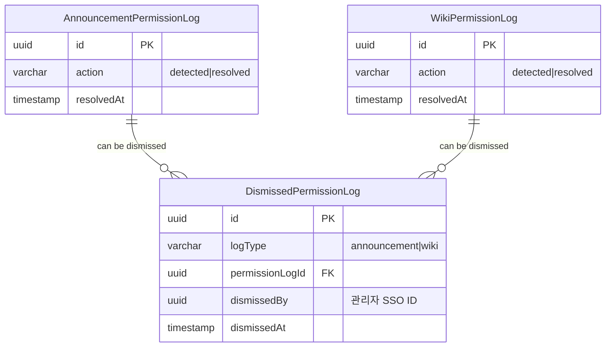

# 권한 로그 모달 제어 정책 (Permission Log Modal Control Policy)

## 📋 목차

1. [정책 개요](#1-정책-개요)
2. [핵심 개념](#2-핵심-개념)
3. [데이터 모델](#3-데이터-모델)
4. [API 명세](#4-api-명세)
5. [사용 시나리오](#5-사용-시나리오)
6. [레이어별 구현 가이드](#6-레이어별-구현-가이드)
7. [테스트 전략](#7-테스트-전략)
8. [주의사항 및 제약](#8-주의사항-및-제약)

---

## 1. 정책 개요

### 1.1 목적

본 정책은 권한 로그 모달의 표시를 관리자별로 제어하여, 각 관리자가 독립적으로 알림을 관리할 수 있도록 하기 위해 수립되었습니다.

### 1.2 핵심 원칙

```
📌 각 관리자는 독립적으로 "다시 보지 않기" 설정 가능
📌 무시 설정은 모달 표시에만 영향 (관리 페이지는 영향 없음)
📌 무시된 로그도 관리 페이지에서 조회 및 처리 가능
📌 다중 관리자 환경 완벽 지원
📌 배치 처리로 효율적인 UX 제공
```

### 1.3 적용 범위

이 정책은 권한 로그가 있는 모든 도메인에 적용됩니다.

**적용 대상**:
- Announcement (공지사항) - `AnnouncementPermissionLog`
- WikiFileSystem (위키) - `WikiPermissionLog`

---

## 2. 핵심 개념

### 2.1 권한 로그 타입

```typescript
enum DismissedPermissionLogType {
  ANNOUNCEMENT = 'announcement',  // 공지사항 권한 로그
  WIKI = 'wiki'                  // 위키 권한 로그
}
```

### 2.2 로그 상태

| 상태 | 조건 | 모달 표시 | 관리 페이지 표시 |
|------|------|-----------|------------------|
| **미해결 (Unresolved)** | `resolvedAt IS NULL` AND `action = 'detected'` | ✅ 표시 (미무시 시) | ✅ 표시 |
| **무시됨 (Dismissed)** | DismissedPermissionLog 레코드 존재 | ❌ 숨김 | ✅ 표시 |
| **해결됨 (Resolved)** | `resolvedAt IS NOT NULL` AND `action = 'resolved'` | ❌ 숨김 | ✅ 표시 |

### 2.3 주요 용어

- **Permission Log**: 비활성화된 권한을 추적하는 로그 (AnnouncementPermissionLog, WikiPermissionLog)
- **Dismissed Log**: 관리자가 "다시 보지 않기"를 설정한 기록 (DismissedPermissionLog)
- **Unread Log**: 미해결이면서 관리자가 무시하지 않은 로그 (모달 표시 대상)

---

## 3. 데이터 모델

### 3.1 DismissedPermissionLog 엔티티

```typescript
@Entity('dismissed_permission_logs')
export class DismissedPermissionLog {
  @PrimaryGeneratedColumn('uuid')
  id: string;

  @Column({ type: 'enum', enum: DismissedPermissionLogType })
  logType: DismissedPermissionLogType;  // 'announcement' | 'wiki'

  @Column({ type: 'uuid' })
  permissionLogId: string;  // AnnouncementPermissionLog.id 또는 WikiPermissionLog.id

  @Column({ type: 'uuid' })
  dismissedBy: string;  // 무시한 관리자 ID (SSO)

  @CreateDateColumn()
  dismissedAt: Date;  // 무시한 일시 (자동 생성)
}
```

**특징**:
- ❌ Soft Delete 없음 (영구 보관)
- ❌ updatedAt 없음 (수정 불가)
- ❌ version 없음 (낙관적 잠금 불필요)

### 3.2 인덱스

```sql
-- 로그 타입 및 권한 로그 ID 조합 조회
CREATE INDEX idx_dismissed_permission_log_type_id
ON dismissed_permission_logs(log_type, permission_log_id);

-- 무시한 관리자별 조회
CREATE INDEX idx_dismissed_permission_log_dismissed_by
ON dismissed_permission_logs(dismissed_by);

-- 중복 방지 UNIQUE 제약
CREATE UNIQUE INDEX idx_dismissed_permission_log_unique
ON dismissed_permission_logs(log_type, permission_log_id, dismissed_by);
```

### 3.3 관계도

**간소화된 관계 중심 다이어그램** (핵심 필드만 표시)



> **참고**: 이 다이어그램은 "다시 보지 않기" 기능과 직접 관련된 필드만 표시한 간소화 버전입니다. 
> 전체 필드 정보는 [ERD 메인 문서](../erd/er-diagram.md)를 참조하세요.

---

## 4. API 명세

### 4.1 공지사항 권한 로그 API

#### 4.1.1 전체 로그 조회

```typescript
GET /api/admin/announcements/permission-logs?resolved={true|false}

Query Parameters:
  resolved: boolean (optional)
    - true: 해결된 로그만 조회 (resolvedAt IS NOT NULL)
    - false: 미해결 로그만 조회 (resolvedAt IS NULL)
    - 미지정: 모든 로그 조회

Response:
  Array<AnnouncementPermissionLog>
```

**특징**: 무시 설정과 무관하게 모든 로그 반환

#### 4.1.2 미열람 로그 조회 (모달용)

```typescript
GET /api/admin/announcements/permission-logs/unread

Response:
  Array<AnnouncementPermissionLog>  // 무시하지 않은 미해결 로그만
```

**필터링 로직**:
```sql
WHERE action = 'detected'
  AND resolved_at IS NULL
  AND NOT EXISTS (
    SELECT 1 FROM dismissed_permission_logs
    WHERE permission_log_id = announcement_permission_logs.id
      AND log_type = 'announcement'
      AND dismissed_by = :currentAdminId
  )
```

#### 4.1.3 권한 로그 무시 (배치)

```typescript
PATCH /api/admin/announcements/permission-logs/dismiss

Body:
  {
    logIds: string[]  // UUID 배열 (최소 1개 이상)
  }

Response:
  {
    success: true,
    message: "3개의 권한 로그를 무시 처리했습니다.",
    dismissed: 3,         // 새로 무시한 로그 수
    alreadyDismissed: 1,  // 이미 무시된 로그 수
    notFound: 0           // 존재하지 않는 로그 수
  }

Status Codes:
  - 200: 처리 완료
  - 400: 잘못된 요청 (빈 배열, 잘못된 UUID 등)
```

### 4.2 위키 권한 로그 API

위키 API는 공지사항과 동일한 구조이며, 엔드포인트만 다릅니다:

- `GET /api/admin/wiki/permission-logs?resolved={true|false}`
- `GET /api/admin/wiki/permission-logs/unread`
- `PATCH /api/admin/wiki/permission-logs/dismiss`

---

## 5. 사용 시나리오

### 5.1 기본 시나리오

#### 시나리오 1: 단일 로그 무시

```typescript
// 1. 관리자 로그인 → 모달에 미해결 권한 로그 표시
GET /api/admin/announcements/permission-logs/unread
// Response: [{ id: 'log-1', ... }, { id: 'log-2', ... }]

// 2. 관리자가 log-1을 "다시 보지 않기" 클릭
PATCH /api/admin/announcements/permission-logs/dismiss
Body: { logIds: ['log-1'] }

// Response:
{
  success: true,
  message: "1개의 권한 로그를 무시 처리했습니다.",
  dismissed: 1,
  alreadyDismissed: 0,
  notFound: 0
}

// 3. 다음 로그인 시 log-1은 모달에 표시 안 됨
GET /api/admin/announcements/permission-logs/unread
// Response: [{ id: 'log-2', ... }]  // log-1 제외

// 4. 관리 페이지에서는 여전히 log-1 조회 가능
GET /api/admin/announcements/permission-logs
// Response: [{ id: 'log-1', ... }, { id: 'log-2', ... }]  // 모든 로그
```

#### 시나리오 2: 여러 로그 일괄 무시

```typescript
// 1. 모달에 3개의 미해결 로그 표시
GET /api/admin/announcements/permission-logs/unread
// Response: [{ id: 'log-1' }, { id: 'log-2' }, { id: 'log-3' }]

// 2. 관리자가 "모두 다시 보지 않기" 클릭
PATCH /api/admin/announcements/permission-logs/dismiss
Body: { logIds: ['log-1', 'log-2', 'log-3'] }

// Response:
{
  success: true,
  message: "3개의 권한 로그를 무시 처리했습니다.",
  dismissed: 3,
  alreadyDismissed: 0,
  notFound: 0
}

// 3. 다음 로그인 시 모달 비활성화 (모든 로그 무시됨)
GET /api/admin/announcements/permission-logs/unread
// Response: []
```

### 5.2 다중 관리자 시나리오

```typescript
// 시나리오: 권한 로그 #1이 감지됨

// === 관리자 A의 액션 ===
// 1. 관리자 A 로그인
GET /api/admin/announcements/permission-logs/unread
// Response: [{ id: 'log-1', ... }]  // log-1 표시

// 2. 관리자 A가 "다시 보지 않기" 클릭
PATCH /api/admin/announcements/permission-logs/dismiss
Body: { logIds: ['log-1'] }

// DB 저장:
// dismissed_permission_logs 테이블에 레코드 추가
// { logType: 'announcement', permissionLogId: 'log-1', dismissedBy: 'admin-A-id' }

// 3. 관리자 A 재로그인 → 모달에 표시 안 됨
GET /api/admin/announcements/permission-logs/unread
// Response: []  // log-1 제외됨


// === 관리자 B의 액션 (독립적) ===
// 1. 관리자 B 로그인 (관리자 A와 독립적)
GET /api/admin/announcements/permission-logs/unread
// Response: [{ id: 'log-1', ... }]  // log-1 여전히 표시

// 2. 관리자 B도 "다시 보지 않기" 클릭 (선택)
PATCH /api/admin/announcements/permission-logs/dismiss
Body: { logIds: ['log-1'] }

// DB 저장:
// dismissed_permission_logs 테이블에 레코드 추가
// { logType: 'announcement', permissionLogId: 'log-1', dismissedBy: 'admin-B-id' }


// === 모든 관리자 ===
// 관리 페이지에서는 모든 관리자가 log-1 조회 및 처리 가능
GET /api/admin/announcements/permission-logs
// Response: [{ id: 'log-1', ... }]  // 무시 설정과 무관하게 표시
```

### 5.3 중복 처리 시나리오

```typescript
// 1. 이미 무시한 로그를 다시 무시 시도
PATCH /api/admin/announcements/permission-logs/dismiss
Body: { logIds: ['log-1'] }

// 첫 번째 요청:
{
  dismissed: 1,
  alreadyDismissed: 0,
  notFound: 0
}

// 두 번째 요청 (중복):
{
  dismissed: 0,
  alreadyDismissed: 1,  // 이미 무시된 로그로 카운트
  notFound: 0
}

// DB: UNIQUE 제약으로 중복 레코드 생성 안 됨
```

### 5.4 혼합 처리 시나리오

```typescript
// 유효한 로그 + 이미 무시한 로그 + 존재하지 않는 로그 혼합
PATCH /api/admin/announcements/permission-logs/dismiss
Body: {
  logIds: [
    'valid-log-1',      // 유효한 로그
    'already-dismissed', // 이미 무시한 로그
    'non-existent'      // 존재하지 않는 로그
  ]
}

Response:
{
  success: true,
  message: "1개의 권한 로그를 무시 처리했습니다.",
  dismissed: 1,         // valid-log-1
  alreadyDismissed: 1,  // already-dismissed
  notFound: 1           // non-existent
}
```

---

## 6. 레이어별 구현 가이드

### 6.1 컨트롤러 레이어 (Interface)

#### 6.1.1 미열람 로그 조회

```typescript
@Get('permission-logs/unread')
async 공지사항_미열람_권한_로그를_조회한다(
  @CurrentUser() user: AuthenticatedUser,
) {
  // 1. 미해결 로그 조회 (detected 상태)
  const unresolvedLogs = await this.permissionLogRepository.find({
    where: {
      action: AnnouncementPermissionAction.DETECTED,
      resolvedAt: IsNull(),
    },
    order: { detectedAt: 'DESC' },
    relations: ['announcement'],
  });

  // 2. dismissed된 로그 ID 조회
  const dismissedLogs = await this.dismissedLogRepository.find({
    where: {
      logType: DismissedPermissionLogType.ANNOUNCEMENT,
      dismissedBy: user.id,
    },
  });

  const dismissedLogIds = new Set(
    dismissedLogs.map((log) => log.permissionLogId),
  );

  // 3. dismissed되지 않은 로그만 반환
  return unresolvedLogs.filter((log) => !dismissedLogIds.has(log.id));
}
```

#### 6.1.2 배치 무시 처리

```typescript
@Patch('permission-logs/dismiss')
async 공지사항_권한_로그를_무시한다(
  @Body() dto: DismissPermissionLogsDto,
  @CurrentUser() user: AuthenticatedUser,
) {
  let dismissedCount = 0;
  let alreadyDismissedCount = 0;
  let notFoundCount = 0;

  for (const logId of dto.logIds) {
    // 1. 권한 로그 존재 확인
    const permissionLog = await this.permissionLogRepository.findOne({
      where: { id: logId },
    });

    if (!permissionLog) {
      notFoundCount++;
      continue;
    }

    // 2. 이미 dismissed 되었는지 확인
    const existing = await this.dismissedLogRepository.findOne({
      where: {
        logType: DismissedPermissionLogType.ANNOUNCEMENT,
        permissionLogId: logId,
        dismissedBy: user.id,
      },
    });

    if (existing) {
      alreadyDismissedCount++;
      continue;
    }

    // 3. Dismissed 로그 생성
    await this.dismissedLogRepository.save({
      logType: DismissedPermissionLogType.ANNOUNCEMENT,
      permissionLogId: logId,
      dismissedBy: user.id,
    });

    dismissedCount++;
  }

  return {
    success: true,
    message: `${dismissedCount}개의 권한 로그를 무시 처리했습니다.`,
    dismissed: dismissedCount,
    alreadyDismissed: alreadyDismissedCount,
    notFound: notFoundCount,
  };
}
```

### 6.2 DTO 레이어

```typescript
// dismiss-permission-logs.dto.ts
import { ApiProperty } from '@nestjs/swagger';
import { IsArray, IsUUID, ArrayNotEmpty } from 'class-validator';

export class DismissPermissionLogsDto {
  @ApiProperty({
    description: '무시할 권한 로그 ID 목록',
    type: [String],
    example: [
      '550e8400-e29b-41d4-a716-446655440000',
      '550e8400-e29b-41d4-a716-446655440001',
    ],
  })
  @IsArray()
  @ArrayNotEmpty({ message: '최소 1개 이상의 로그 ID가 필요합니다.' })
  @IsUUID('4', { each: true, message: '유효한 UUID 형식이어야 합니다.' })
  logIds: string[];
}
```

### 6.3 엔티티 레이어

```typescript
// dismissed-permission-log.entity.ts
import {
  Entity,
  PrimaryGeneratedColumn,
  Column,
  CreateDateColumn,
  Index,
} from 'typeorm';

@Entity('dismissed_permission_logs')
@Index('idx_dismissed_permission_log_type_id', ['logType', 'permissionLogId'])
@Index('idx_dismissed_permission_log_dismissed_by', ['dismissedBy'])
export class DismissedPermissionLog {
  @PrimaryGeneratedColumn('uuid')
  id: string;

  @Column({ type: 'enum', enum: DismissedPermissionLogType })
  logType: DismissedPermissionLogType;

  @Column({ type: 'uuid' })
  permissionLogId: string;

  @Column({ type: 'uuid' })
  dismissedBy: string;

  @CreateDateColumn()
  dismissedAt: Date;
}
```

```typescript
// dismissed-permission-log.types.ts
export enum DismissedPermissionLogType {
  ANNOUNCEMENT = 'announcement',
  WIKI = 'wiki',
}
```

### 6.4 모듈 설정

```typescript
// dismissed-permission-log.module.ts
import { Module } from '@nestjs/common';
import { TypeOrmModule } from '@nestjs/typeorm';
import { DismissedPermissionLog } from './dismissed-permission-log.entity';

@Module({
  imports: [TypeOrmModule.forFeature([DismissedPermissionLog])],
  exports: [TypeOrmModule],
})
export class DismissedPermissionLogModule {}
```

```typescript
// common-domain.module.ts
import { Module } from '@nestjs/common';
import { DismissedPermissionLogModule } from './dismissed-permission-log/dismissed-permission-log.module';

@Module({
  imports: [DismissedPermissionLogModule],
  exports: [DismissedPermissionLogModule],
})
export class CommonDomainModule {}
```

```typescript
// announcement.module.ts (또는 wiki.module.ts)
import { Module } from '@nestjs/common';
import { TypeOrmModule } from '@nestjs/typeorm';
import { DismissedPermissionLog } from '@domain/common/dismissed-permission-log/dismissed-permission-log.entity';

@Module({
  imports: [
    TypeOrmModule.forFeature([
      AnnouncementPermissionLog,
      DismissedPermissionLog,  // 추가
    ]),
  ],
  // ...
})
export class AnnouncementModule {}
```

---

## 7. 테스트 전략

### 7.1 E2E 테스트

#### 7.1.1 기본 기능 테스트

```typescript
describe('다시 보지 않기 기능', () => {
  it('권한 로그를 무시 처리할 수 있어야 한다', async () => {
    // Given - 권한 로그 생성
    const announcement = await createAnnouncement();
    const log = await createPermissionLog(announcement.id);

    // When - 무시 처리
    const response = await request(app)
      .patch('/admin/announcements/permission-logs/dismiss')
      .send({ logIds: [log.id] })
      .expect(200);

    // Then
    expect(response.body).toMatchObject({
      success: true,
      dismissed: 1,
      alreadyDismissed: 0,
      notFound: 0,
    });
  });

  it('무시 처리한 로그는 미열람 조회에서 제외되어야 한다', async () => {
    // Given
    const log = await createPermissionLog();

    // When - 무시 처리
    await request(app)
      .patch('/admin/announcements/permission-logs/dismiss')
      .send({ logIds: [log.id] })
      .expect(200);

    // Then - 미열람 조회
    const unreadResponse = await request(app)
      .get('/admin/announcements/permission-logs/unread')
      .expect(200);

    const unreadIds = unreadResponse.body.map((l: any) => l.id);
    expect(unreadIds).not.toContain(log.id);
  });

  it('무시 처리한 로그도 전체 조회에서는 보여야 한다', async () => {
    // Given
    const log = await createPermissionLog();

    // When - 무시 처리
    await request(app)
      .patch('/admin/announcements/permission-logs/dismiss')
      .send({ logIds: [log.id] })
      .expect(200);

    // Then - 전체 조회
    const allLogsResponse = await request(app)
      .get('/admin/announcements/permission-logs')
      .expect(200);

    const allIds = allLogsResponse.body.map((l: any) => l.id);
    expect(allIds).toContain(log.id);
  });
});
```

#### 7.1.2 배치 처리 테스트

```typescript
describe('배치 무시 처리', () => {
  it('여러 권한 로그를 한 번에 무시 처리할 수 있어야 한다', async () => {
    // Given - 3개 로그 생성
    const logIds = await createMultiplePermissionLogs(3);

    // When - 배치 무시 처리
    const response = await request(app)
      .patch('/admin/announcements/permission-logs/dismiss')
      .send({ logIds })
      .expect(200);

    // Then
    expect(response.body).toMatchObject({
      dismissed: 3,
      alreadyDismissed: 0,
      notFound: 0,
    });
  });

  it('혼합 상황을 올바르게 처리해야 한다', async () => {
    // Given - 유효한 로그 1개 + 이미 무시한 로그 1개
    const validLog = await createPermissionLog();
    const dismissedLog = await createAndDismissPermissionLog();

    // When
    const response = await request(app)
      .patch('/admin/announcements/permission-logs/dismiss')
      .send({ logIds: [validLog.id, dismissedLog.id] })
      .expect(200);

    // Then
    expect(response.body).toMatchObject({
      dismissed: 1,
      alreadyDismissed: 1,
      notFound: 0,
    });
  });
});
```

#### 7.1.3 검증 테스트

```typescript
describe('입력 검증', () => {
  it('빈 배열로 요청하면 400 에러가 발생해야 한다', async () => {
    await request(app)
      .patch('/admin/announcements/permission-logs/dismiss')
      .send({ logIds: [] })
      .expect(400);
  });

  it('잘못된 UUID 형식이 포함된 경우 400 에러가 발생해야 한다', async () => {
    await request(app)
      .patch('/admin/announcements/permission-logs/dismiss')
      .send({ logIds: ['invalid-uuid'] })
      .expect(400);
  });

  it('존재하지 않는 로그 ID는 스킵되어야 한다', async () => {
    const fakeIds = [
      '00000000-0000-4000-8000-000000000001',
      '00000000-0000-4000-8000-000000000002',
    ];

    const response = await request(app)
      .patch('/admin/announcements/permission-logs/dismiss')
      .send({ logIds: fakeIds })
      .expect(200);

    expect(response.body.notFound).toBe(2);
  });
});
```

### 7.2 테스트 커버리지 목표

| 레이어 | 커버리지 목표 | 테스트 유형 |
|--------|--------------|-------------|
| Controller | 100% | E2E 테스트 |
| DTO Validation | 100% | E2E 테스트 |
| Database Constraints | 100% | E2E 테스트 |

---

## 8. 주의사항 및 제약

### 8.1 데이터 무결성

#### 8.1.1 UNIQUE 제약조건

```sql
-- 동일한 관리자가 동일한 로그를 중복 무시 방지
CREATE UNIQUE INDEX idx_dismissed_permission_log_unique
ON dismissed_permission_logs(log_type, permission_log_id, dismissed_by);
```

**효과**:
- 관리자가 같은 로그를 여러 번 무시해도 DB에 1개 레코드만 존재
- 중복 요청 시 `alreadyDismissed` 카운터만 증가

#### 8.1.2 영구 보관 정책

```typescript
// ❌ Soft Delete 없음
// ❌ UPDATE 로직 없음
// ❌ DELETE 로직 없음
```

**이유**:
- 관리자의 무시 설정은 감사 기록의 일부
- 영구 보관하여 추적 가능성 확보
- 무시 취소 기능 없음 (재무시로 처리)

### 8.2 성능 최적화

#### 8.2.1 인덱스 활용

```sql
-- 미열람 로그 조회 시 사용
-- dismissed_by 인덱스 활용하여 빠른 필터링
SELECT dpl.* 
FROM dismissed_permission_logs dpl
WHERE dpl.dismissed_by = :currentAdminId
  AND dpl.log_type = 'announcement';
```

#### 8.2.2 배치 크기 제한 (권장)

```typescript
// 프론트엔드에서 한 번에 전송하는 logIds 수 제한 권장
const MAX_BATCH_SIZE = 100;  // 한 번에 최대 100개
```

### 8.3 보안 고려사항

#### 8.3.1 관리자 인증

```typescript
// @CurrentUser() 데코레이터로 관리자 ID 자동 주입
// JWT 토큰에서 추출된 관리자 ID 사용
async 공지사항_권한_로그를_무시한다(
  @Body() dto: DismissPermissionLogsDto,
  @CurrentUser() user: AuthenticatedUser,  // ← 인증된 관리자
) {
  // user.id를 dismissedBy로 사용
  // 다른 관리자의 무시 설정을 변경할 수 없음
}
```

#### 8.3.2 권한 검증

- 권한 로그 조회/무시는 관리자만 가능
- 일반 사용자는 접근 불가
- `@ApiBearerAuth()` 데코레이터로 JWT 인증 필수

### 8.4 제약사항

#### 8.4.1 무시 취소 불가

현재 구현에서는 무시 취소 기능이 없습니다.

**이유**:
- 무시는 "다시 보지 않기" 의도
- 재무시 필요 시 관리 페이지에서 처리 가능
- 단순한 UX 유지

**대안**:
```typescript
// 관리 페이지에서 로그 조회 및 처리
GET /api/admin/announcements/permission-logs
// → 무시 설정과 무관하게 모든 로그 표시
```

#### 8.4.2 자동 삭제 없음

DismissedPermissionLog는 영구 보관되며 자동 삭제되지 않습니다.

**관리 방법**:
```sql
-- 해결된 로그의 무시 레코드 정리 (필요 시)
DELETE FROM dismissed_permission_logs
WHERE permission_log_id IN (
  SELECT id FROM announcement_permission_logs
  WHERE resolved_at IS NOT NULL
    AND resolved_at < NOW() - INTERVAL '1 year'
);
```

### 8.5 모니터링

#### 8.5.1 주요 메트릭

```typescript
// 무시된 로그 통계
SELECT 
  log_type,
  COUNT(*) as total_dismissed,
  COUNT(DISTINCT dismissed_by) as unique_admins
FROM dismissed_permission_logs
GROUP BY log_type;

// 관리자별 무시 건수
SELECT 
  dismissed_by,
  COUNT(*) as dismissed_count
FROM dismissed_permission_logs
WHERE log_type = 'announcement'
GROUP BY dismissed_by
ORDER BY dismissed_count DESC;
```

---

## 9. 변경 이력

### v1.0 (2026-01-20)

**최초 작성**:
- 권한 로그 모달 제어 정책 수립
- DismissedPermissionLog 엔티티 설계
- 배치 처리 API 명세
- 다중 관리자 지원 시나리오
- E2E 테스트 전략 수립

**주요 결정사항**:
- 영구 보관 정책 채택 (Soft Delete 제외)
- 배치 처리 방식 채택 (단일 → 배치로 변경)
- PATCH 메서드 사용 (POST → PATCH로 변경)
- 관리자별 독립적 무시 설정 지원

---

## 참고 문서

- [ERD 메인 문서](../erd/er-diagram.md)
- [권한 스케줄러 가이드](../scheduler/permission-scheduler-guide.md)
- [공개 상태 관리 정책](./public-state-management-policy.md)
