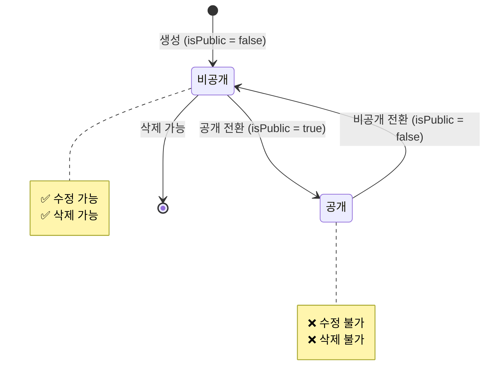

# 공개 상태 관리 정책 (Public State Management Policy)

## 📋 목차

1. [정책 개요](#1-정책-개요)
2. [공개 상태 정의](#2-공개-상태-정의)
3. [상태 전환 규칙](#3-상태-전환-규칙)
4. [수정/삭제 제한 정책](#4-수정삭제-제한-정책)
5. [레이어별 구현 가이드](#5-레이어별-구현-가이드)
6. [예외 케이스](#6-예외-케이스)
7. [에러 처리](#7-에러-처리)
8. [테스트 전략](#8-테스트-전략)
9. [적용 대상 엔티티](#9-적용-대상-엔티티)

---

## 1. 정책 개요

### 1.1 목적

본 정책은 공개된 콘텐츠의 무분별한 수정 및 삭제를 방지하여 데이터 일관성과 사용자 경험을 보호하기 위해 수립되었습니다.

### 1.2 핵심 원칙

```
📌 공개 상태(isPublic = true)에서는 수정 및 삭제 불가
📌 비공개 상태(isPublic = false)로 전환 후 수정 가능
📌 삭제는 항상 비공개 상태에서만 가능
📌 releasedAt, expiredAt은 통계용이며 공개 상태 판단에 영향 없음
```

### 1.3 적용 범위

이 정책은 `isPublic` 속성을 가진 모든 엔티티에 적용됩니다.

**적용 대상**:
- Announcement (공지사항)
- News (뉴스)
- MainPopup (메인 팝업)
- LumirStory (루미르 스토리)
- VideoGallery (비디오 갤러리)
- WikiFileSystem (위키)
- Brochure (브로슈어)
- IR (IR 자료)
- ElectronicDisclosure (전자공시)
- ShareholdersMeeting (주주총회)

---

## 2. 공개 상태 정의

### 2.0 실제 데이터베이스 필드

실제 엔티티에는 다음 필드가 존재합니다:

```typescript
{
  isPublic: boolean;      // 공개 여부 (실제 필드) - 공개 상태 판단의 유일한 기준
  releasedAt: Date | null; // 공개 시작 일시 (통계용, 공개 상태 판단에는 사용 안함)
  expiredAt: Date | null;  // 공개 종료 일시 (통계용, 공개 상태 판단에는 사용 안함)
}
```

**중요**: 
- **공개 상태 판단은 `isPublic` 필드만 사용합니다.**
- `releasedAt`과 `expiredAt`은 통계/분석 목적으로만 사용되며, 공개 상태 판단에는 영향을 주지 않습니다.
- `isPublic = true`이면 `releasedAt`이 미래여도 무조건 공개 상태입니다.

### 2.1 상태 분류

| 상태 | 조건 | 설명 | 수정 가능 | 삭제 가능 |
|------|------|------|-----------|-----------|
| **비공개** | `isPublic = false` | 일반 사용자에게 노출되지 않음 | ✅ 가능 | ✅ 가능 |
| **공개** | `isPublic = true` | 일반 사용자에게 노출됨 (releasedAt과 무관) | ❌ 불가능 | ❌ 불가능 |

### 2.2 상태 판별 로직

```typescript
  /**
   * 현재 공개 상태인지 확인
   * 
   * 공개 상태 판단은 isPublic 필드만 사용합니다.
   * releasedAt과 expiredAt은 통계용이므로 공개 상태 판단에 영향을 주지 않습니다.
   */
  function is현재_공개_상태(entity: { isPublic: boolean }): boolean {
    // isPublic만 확인 (releasedAt, expiredAt은 무시)
    return entity.isPublic;
  }

/**
 * 수정 가능한지 확인
 */
function is수정_가능(entity: { isPublic: boolean }): boolean {
  // 비공개 상태만 수정 가능
  return !entity.isPublic;
}

/**
 * 삭제 가능한지 확인
 */
function is삭제_가능(entity: { isPublic: boolean }): boolean {
  // 비공개 상태만 삭제 가능
  return !entity.isPublic;
}
```

---

## 3. 상태 전환 규칙

### 3.1 상태 전환 다이어그램

**참고**: 공개 상태는 `isPublic` 필드만으로 결정됩니다. `releasedAt`과 `expiredAt`은 통계용이므로 상태 전환에 영향을 주지 않습니다.



### 3.2 허용되는 상태 전환

| 현재 상태 | 다음 상태 | 허용 여부 | 조건 |
|-----------|-----------|-----------|------|
| 비공개 | 공개 | ✅ 허용 | `isPublic = true` 설정 |
| 공개 | 비공개 | ✅ 허용 | `isPublic = false` 설정 |

### 3.3 상태 전환 시 주의사항

**1. 공개 → 비공개 전환**
- 이미 사용자들이 본 콘텐츠를 숨기는 것이므로 신중해야 함
- 감사 로그 기록 필요
- 알림 발송 고려

**2. 비공개 → 공개 전환**
- 콘텐츠 검증 필요 (필수 필드, 첨부파일 등)
- 권한 설정 확인
- `releasedAt`은 통계용이므로 자동 기록하지 않음 (필요시 수동 설정)

---

## 4. 수정/삭제 제한 정책

### 4.1 수정 제한 규칙

**원칙**: 공개된 콘텐츠는 수정할 수 없습니다.

**이유**:
1. **데이터 일관성**: 사용자가 본 정보와 다른 내용으로 변경되는 것 방지
2. **감사 추적**: 공개된 정보의 변경 이력 추적 필요
3. **법적 요구사항**: 공시 자료 등은 수정 이력 보존 필요

**예외**:
- `isPublic = false`로 전환 후 수정 가능
- 긴급한 오타 수정이 필요한 경우 → 별도 승인 프로세스 필요 (정책 범위 외)

**허용되는 작업** (공개 상태에서도 가능):
- 조회수 증가
- 읽음 상태 기록 (Lazy Creation)
- 권한 로그 기록
- 통계 데이터 수집

### 4.2 삭제 제한 규칙

**원칙**: 비공개 상태에서만 삭제할 수 있습니다.

**이유**:
1. **데이터 무결성**: 공개된 콘텐츠를 참조하는 다른 데이터 보호
2. **사용자 경험**: 사용자가 본 콘텐츠가 갑자기 사라지는 것 방지
3. **감사 요구사항**: 공개된 이력 보존

**삭제 절차**:
```
1. isPublic = false로 전환 (비공개 전환)
   ↓
2. 일정 기간 대기 (예: 7일) - 선택적
   ↓
3. Soft Delete 수행 (deletedAt 기록)
   ↓
4. Hard Delete는 별도 정책에 따라 수행 (보통 90일 후)
```

### 4.3 부분 수정 허용 필드

공개 상태에서도 수정 가능한 필드 (화이트리스트 방식):

| 엔티티 | 허용 필드 | 사유 |
|--------|-----------|------|
| Announcement | `order` | 정렬 순서 변경은 콘텐츠 내용과 무관 |
| Announcement | `isFixed` | 상단 고정 여부는 콘텐츠 내용과 무관 |
| Announcement | `releasedAt` | 통계용 필드, 공개 상태에 영향 없음 |
| Announcement | `expiredAt` | 통계용 필드, 공개 상태에 영향 없음 |
| MainPopup | `order` | 정렬 순서 변경 |
| All | `updatedAt` | 시스템 자동 갱신 |

**주의**: 이 필드들도 감사 로그에 기록되어야 합니다.

---

## 5. 레이어별 구현 가이드

### 5.1 Domain Layer (도메인 계층)

**Domain Service에서 검증 로직 구현**

```typescript
// src/domain/core/announcement/announcement.service.ts
import { ConflictException, NotFoundException } from '@nestjs/common';

@Injectable()
export class AnnouncementService {
  /**
   * 공지사항 수정 가능 여부 검증
   */
  private 수정_가능_여부를_검증한다(announcement: Announcement): void {
    // 1. 삭제된 엔티티 체크
    if (announcement.deletedAt) {
      throw new ConflictException('삭제된 공지사항은 수정할 수 없습니다');
    }

    // 2. 공개 상태 체크
    if (this.is현재_공개_상태(announcement)) {
      throw new ConflictException(
        '공개된 공지사항은 수정할 수 없습니다. 먼저 비공개로 전환해주세요.'
      );
    }
  }

  /**
   * 공지사항 삭제 가능 여부 검증
   */
  private 삭제_가능_여부를_검증한다(announcement: Announcement): void {
    // 1. 이미 삭제된 엔티티 체크
    if (announcement.deletedAt) {
      throw new ConflictException('이미 삭제된 공지사항입니다');
    }

    // 2. 공개 상태 체크
    if (announcement.isPublic) {
      throw new ConflictException(
        '공개된 공지사항은 삭제할 수 없습니다. 먼저 비공개로 전환해주세요.'
      );
    }
  }

  /**
   * 현재 공개 상태인지 확인
   * 
   * 공개 상태 판단은 isPublic 필드만 사용합니다.
   * releasedAt과 expiredAt은 통계용이므로 공개 상태 판단에 영향을 주지 않습니다.
   */
  private is현재_공개_상태(announcement: Announcement): boolean {
    // isPublic만 확인 (releasedAt, expiredAt은 무시)
    return announcement.isPublic;
  }

  /**
   * 공지사항 수정
   */
  async 공지사항을_수정한다(
    id: string,
    data: Partial<Announcement>,
  ): Promise<Announcement> {
    const announcement = await this.ID로_공지사항을_조회한다(id);

    // 수정 가능 여부 검증
    this.수정_가능_여부를_검증한다(announcement);

    // 공개 상태 전환 제외 필드만 수정 (화이트리스트)
    const allowedFields = [
      'title',
      'content',
      'mustRead',
      'permissionEmployeeIds',
      'permissionRankIds',
      'permissionPositionIds',
      'permissionDepartmentIds',
      'attachments',
      'releasedAt',
      'expiredAt',
    ];

    const filteredData = Object.keys(data)
      .filter(key => allowedFields.includes(key))
      .reduce((obj, key) => {
        obj[key] = data[key];
        return obj;
      }, {});

    Object.assign(announcement, filteredData);
    return await this.announcementRepository.save(announcement);
  }

  /**
   * 공지사항 공개 상태 전환 (별도 메서드)
   */
  async 공지사항_공개_상태를_변경한다(
    id: string,
    isPublic: boolean,
    userId: string,
  ): Promise<Announcement> {
    const announcement = await this.ID로_공지사항을_조회한다(id);

    // 비공개 → 공개 전환 시 검증
    if (isPublic && !announcement.isPublic) {
      this.공개_전환_가능_여부를_검증한다(announcement);
    }

    announcement.isPublic = isPublic;

    // 감사 로그 기록은 Context Layer에서 처리
    return await this.announcementRepository.save(announcement);
  }

  /**
   * 공개 전환 가능 여부 검증
   */
  private 공개_전환_가능_여부를_검증한다(announcement: Announcement): void {
    // 필수 필드 검증
    if (!announcement.title || !announcement.content) {
      throw new ConflictException('제목과 내용은 필수입니다');
    }

    // 권한 설정 검증
    if (
      !announcement.isPublic &&
      !announcement.permissionEmployeeIds?.length &&
      !announcement.permissionRankIds?.length &&
      !announcement.permissionPositionIds?.length &&
      !announcement.permissionDepartmentIds?.length
    ) {
      // 전사 공개가 아니면 최소 하나의 권한 설정 필요
      // (이 검증은 프로젝트 정책에 따라 조정)
    }
  }

  /**
   * 공지사항 삭제 (Soft Delete)
   */
  async 공지사항을_삭제한다(id: string): Promise<void> {
    const announcement = await this.ID로_공지사항을_조회한다(id);

    // 삭제 가능 여부 검증
    this.삭제_가능_여부를_검증한다(announcement);

    // Soft Delete
    await this.announcementRepository.softDelete(id);
  }

  /**
   * 정렬 순서 변경 (공개 상태에서도 가능)
   */
  async 정렬_순서를_변경한다(id: string, order: number): Promise<Announcement> {
    const announcement = await this.ID로_공지사항을_조회한다(id);

    announcement.order = order;
    return await this.announcementRepository.save(announcement);
  }

  /**
   * 고정 여부 변경 (공개 상태에서도 가능)
   */
  async 고정_여부를_변경한다(id: string, isFixed: boolean): Promise<Announcement> {
    const announcement = await this.ID로_공지사항을_조회한다(id);

    announcement.isFixed = isFixed;
    return await this.announcementRepository.save(announcement);
  }
}
```

### 5.2 Context Layer (컨텍스트 계층)

**Command Handler에서 Domain Service 호출**

```typescript
// src/context/announcement-context/handlers/commands/update-announcement.handler.ts
export class UpdateAnnouncementCommand {
  constructor(
    public readonly id: string,
    public readonly data: UpdateAnnouncementDto,
    public readonly userId: string,
  ) {}
}

@CommandHandler(UpdateAnnouncementCommand)
export class UpdateAnnouncementHandler 
  implements ICommandHandler<UpdateAnnouncementCommand> {
  
  constructor(
    private readonly announcementService: AnnouncementService,
  ) {}

  async execute(command: UpdateAnnouncementCommand): Promise<UpdateAnnouncementResult> {
    // Domain Service 호출 (검증 로직 포함)
    const announcement = await this.announcementService.공지사항을_수정한다(
      command.id,
      command.data,
    );

    return { announcement };
  }
}
```

**공개 상태 전환 전용 Handler**

```typescript
// src/context/announcement-context/handlers/commands/update-announcement-public.handler.ts
export class UpdateAnnouncementPublicCommand {
  constructor(
    public readonly id: string,
    public readonly isPublic: boolean,
    public readonly userId: string,
  ) {}
}

@CommandHandler(UpdateAnnouncementPublicCommand)
export class UpdateAnnouncementPublicHandler 
  implements ICommandHandler<UpdateAnnouncementPublicCommand> {
  
  constructor(
    private readonly announcementService: AnnouncementService,
    private readonly permissionLogService: AnnouncementPermissionLogService,
  ) {}

  async execute(command: UpdateAnnouncementPublicCommand): Promise<UpdateAnnouncementPublicResult> {
    // 1. 공개 상태 전환
    const announcement = await this.announcementService.공지사항_공개_상태를_변경한다(
      command.id,
      command.isPublic,
      command.userId,
    );

    // 2. 감사 로그 기록
    await this.permissionLogService.로그를_기록한다({
      announcementId: command.id,
      action: command.isPublic ? 'PUBLISH' : 'UNPUBLISH',
      performedBy: command.userId,
      performedAt: new Date(),
    });

    return { announcement };
  }
}
```

### 5.3 Business Layer (비즈니스 계층)

**Business Service에서 Context 조율**

```typescript
// src/business/announcement-business/announcement-business.service.ts
@Injectable()
export class AnnouncementBusinessService {
  constructor(
    private readonly announcementContextService: AnnouncementContextService,
    private readonly notificationService: NotificationService, // 외부 알림 서비스
  ) {}

  /**
   * 공지사항 수정
   */
  async 공지사항_수정(
    id: string,
    dto: UpdateAnnouncementDto,
    userId: string,
  ): Promise<UpdateAnnouncementResult> {
    // Context Service 호출 (검증은 Domain Layer에서 수행)
    return await this.announcementContextService.공지사항을_수정한다(id, dto, userId);
  }

  /**
   * 공지사항 공개 상태 전환
   */
  async 공지사항_공개_상태_변경(
    id: string,
    isPublic: boolean,
    userId: string,
  ): Promise<UpdateAnnouncementPublicResult> {
    // 1. 공개 상태 전환
    const result = await this.announcementContextService.공지사항_공개_상태를_변경한다(
      id,
      isPublic,
      userId,
    );

    // 2. 공개 전환 시 알림 발송 (외부 시스템 연동)
    if (isPublic) {
      await this.notificationService.공지사항_공개_알림_발송(result.announcement);
    }

    return result;
  }

  /**
   * 공지사항 삭제
   */
  async 공지사항_삭제(id: string, userId: string): Promise<void> {
    // Context Service 호출 (검증은 Domain Layer에서 수행)
    await this.announcementContextService.공지사항을_삭제한다(id);

    // 삭제 완료 로그 기록 (외부 감사 시스템)
    await this.auditService.삭제_로그_기록(
      'ANNOUNCEMENT',
      id,
      userId,
    );
  }
}
```

### 5.4 Interface Layer (인터페이스 계층)

**Controller에서 Business Service 호출**

```typescript
// src/interface/admin/announcement/announcement.controller.ts
@Controller('admin/announcements')
@ApiTags('공지사항 관리')
export class AnnouncementController {
  constructor(
    private readonly announcementBusinessService: AnnouncementBusinessService,
  ) {}

  @Patch(':id')
  @ApiOperation({ summary: '공지사항 수정' })
  @ApiResponse({ status: 200, description: '수정 성공' })
  @ApiResponse({ status: 404, description: '공지사항을 찾을 수 없음' })
  @ApiResponse({ status: 409, description: '공개된 공지사항은 수정할 수 없음' })
  async update(
    @Param('id') id: string,
    @Body() dto: UpdateAnnouncementDto,
    @CurrentUser() user: AuthenticatedUser,
  ) {
    try {
      const result = await this.announcementBusinessService.공지사항_수정(
        id,
        dto,
        user.id,
      );

      return {
        success: true,
        data: result,
      };
    } catch (error) {
      if (error instanceof ConflictException) {
        throw new ConflictException(error.message);
      }
      throw error;
    }
  }

  @Patch(':id/public')
  @ApiOperation({ summary: '공지사항 공개 상태 전환' })
  @ApiBody({ schema: { properties: { isPublic: { type: 'boolean' } } } })
  async updatePublic(
    @Param('id') id: string,
    @Body('isPublic') isPublic: boolean,
    @CurrentUser() user: AuthenticatedUser,
  ) {
    const result = await this.announcementBusinessService.공지사항_공개_상태_변경(
      id,
      isPublic,
      user.id,
    );

    return {
      success: true,
      message: isPublic ? '공개로 전환되었습니다' : '비공개로 전환되었습니다',
      data: result,
    };
  }

  @Delete(':id')
  @ApiOperation({ summary: '공지사항 삭제' })
  @ApiResponse({ status: 200, description: '삭제 성공' })
  @ApiResponse({ status: 409, description: '공개된 공지사항은 삭제할 수 없음' })
  async delete(
    @Param('id') id: string,
    @CurrentUser() user: AuthenticatedUser,
  ) {
    await this.announcementBusinessService.공지사항_삭제(id, user.id);

    return {
      success: true,
      message: '공지사항이 삭제되었습니다',
    };
  }
}
```

---

## 6. 예외 케이스

### 6.1 긴급 수정 필요 시

**상황**: 공개된 콘텐츠에 치명적인 오타나 잘못된 정보가 있는 경우

**해결 방법**:

**방법 1: 비공개 전환 후 수정 (권장)**
```
1. 비공개로 전환 (isPublic = false)
2. 수정 수행
3. 다시 공개 (isPublic = true)
4. 감사 로그에 사유 기록
```

**방법 2: 긴급 수정 플래그 사용 (선택적)**
```typescript
/**
 * 긴급 수정 (승인 필요)
 */
async 긴급_수정(
  id: string,
  data: Partial<Announcement>,
  userId: string,
  approvalToken: string, // 승인 토큰
  reason: string, // 사유
): Promise<Announcement> {
  // 1. 승인 토큰 검증
  await this.validateApprovalToken(approvalToken);

  // 2. 공개 상태에서도 수정
  const announcement = await this.ID로_공지사항을_조회한다(id);
  Object.assign(announcement, data);

  // 3. 긴급 수정 로그 기록
  await this.emergencyLogService.긴급_수정_로그_기록({
    entityType: 'ANNOUNCEMENT',
    entityId: id,
    performedBy: userId,
    reason,
    changes: data,
    approvalToken,
  });

  return await this.announcementRepository.save(announcement);
}
```

### 6.2 관리자 권한 오버라이드

특정 권한을 가진 관리자는 공개 상태에서도 수정 가능하도록 설정할 수 있습니다.

```typescript
/**
 * 관리자 권한으로 수정 (감사 로그 필수)
 */
async 관리자_권한_수정(
  id: string,
  data: Partial<Announcement>,
  userId: string,
): Promise<Announcement> {
  // 1. 슈퍼 관리자 권한 확인
  const hasPermission = await this.checkSuperAdminPermission(userId);
  if (!hasPermission) {
    throw new ForbiddenException('권한이 없습니다');
  }

  // 2. 수정 수행
  const announcement = await this.ID로_공지사항을_조회한다(id);
  Object.assign(announcement, data);

  // 3. 감사 로그 기록
  await this.auditLogService.관리자_수정_로그_기록({
    entityType: 'ANNOUNCEMENT',
    entityId: id,
    performedBy: userId,
    changes: data,
    timestamp: new Date(),
  });

  return await this.announcementRepository.save(announcement);
}
```

### 6.3 일괄 공개 상태 전환

여러 콘텐츠를 한 번에 공개/비공개로 전환하는 경우

```typescript
/**
 * 일괄 공개 상태 전환
 */
async 일괄_공개_상태_변경(
  ids: string[],
  isPublic: boolean,
  userId: string,
): Promise<BatchUpdateResult> {
  const results = {
    success: [],
    failed: [],
  };

  for (const id of ids) {
    try {
      await this.공지사항_공개_상태를_변경한다(id, isPublic, userId);
      results.success.push(id);
    } catch (error) {
      results.failed.push({ id, reason: error.message });
    }
  }

  return results;
}
```

---

## 7. 에러 처리

### 7.1 에러 타입 정의

```typescript
// src/common/exceptions/public-state.exception.ts

/**
 * 공개 상태 수정 불가 예외
 */
export class CannotModifyPublicEntityException extends ConflictException {
  constructor(entityType: string, entityId: string) {
    super(
      `공개된 ${entityType}은 수정할 수 없습니다. ` +
      `먼저 비공개로 전환해주세요. (ID: ${entityId})`
    );
  }
}

/**
 * 공개 상태 삭제 불가 예외
 */
export class CannotDeletePublicEntityException extends ConflictException {
  constructor(entityType: string, entityId: string) {
    super(
      `공개된 ${entityType}은 삭제할 수 없습니다. ` +
      `먼저 비공개로 전환해주세요. (ID: ${entityId})`
    );
  }
}

/**
 * 공개 전환 불가 예외
 */
export class CannotPublishEntityException extends ConflictException {
  constructor(entityType: string, entityId: string, reason: string) {
    super(
      `${entityType}을 공개할 수 없습니다. ` +
      `사유: ${reason} (ID: ${entityId})`
    );
  }
}
```

### 7.2 에러 응답 형식

```json
{
  "statusCode": 409,
  "message": "공개된 공지사항은 수정할 수 없습니다. 먼저 비공개로 전환해주세요.",
  "error": "Conflict",
  "timestamp": "2026-01-16T10:30:00.000Z",
  "path": "/admin/announcements/uuid-123"
}
```

### 7.3 프론트엔드 가이드

**추천 사용자 경험**:

```typescript
// 프론트엔드 예시 (React)
async function handleUpdate(id: string, data: UpdateDto) {
  try {
    await api.updateAnnouncement(id, data);
    toast.success('수정되었습니다');
  } catch (error) {
    if (error.status === 409 && error.message.includes('공개된')) {
      // 비공개 전환 제안
      const confirmed = confirm(
        '공개된 공지사항은 수정할 수 없습니다. ' +
        '비공개로 전환한 후 수정하시겠습니까?'
      );
      
      if (confirmed) {
        await api.updateAnnouncementPublic(id, false);
        await api.updateAnnouncement(id, data);
        toast.success('비공개로 전환 후 수정되었습니다');
      }
    } else {
      toast.error(error.message);
    }
  }
}
```

---

## 8. 테스트 전략

### 8.1 Unit Test (Domain Layer)

```typescript
// test/domain/core/announcement/announcement.service.spec.ts
describe('AnnouncementService - 공개 상태 관리', () => {
  let service: AnnouncementService;
  let repository: MockType<Repository<Announcement>>;

  describe('공지사항을_수정한다', () => {
    it('비공개 상태에서는 수정 가능해야 한다', async () => {
      const announcement = createMockAnnouncement({ isPublic: false });
      repository.findOne.mockResolvedValue(announcement);
      repository.save.mockResolvedValue(announcement);

      const result = await service.공지사항을_수정한다('id', { title: 'New Title' });

      expect(result.title).toBe('New Title');
    });

    it('공개 상태에서는 수정할 수 없어야 한다', async () => {
      const announcement = createMockAnnouncement({ isPublic: true });
      repository.findOne.mockResolvedValue(announcement);

      await expect(
        service.공지사항을_수정한다('id', { title: 'New Title' })
      ).rejects.toThrow(ConflictException);
    });

    it('공개 상태(releasedAt이 미래여도)에서는 수정할 수 없어야 한다', async () => {
      // releasedAt은 통계용이므로 공개 상태 판단에 영향 없음
      const futureDate = new Date(Date.now() + 86400000); // 1일 후
      const announcement = createMockAnnouncement({
        isPublic: true,
        releasedAt: futureDate, // 통계용, 공개 상태 판단에는 영향 없음
      });
      repository.findOne.mockResolvedValue(announcement);

      await expect(
        service.공지사항을_수정한다('id', { title: 'New Title' })
      ).rejects.toThrow(ConflictException);
    });

    it('공개 상태(expiredAt이 과거여도)에서는 수정할 수 없어야 한다', async () => {
      // expiredAt은 통계용이므로 공개 상태 판단에 영향 없음
      const pastDate = new Date(Date.now() - 86400000); // 1일 전
      const announcement = createMockAnnouncement({
        isPublic: true,
        expiredAt: pastDate, // 통계용, 공개 상태 판단에는 영향 없음
      });
      repository.findOne.mockResolvedValue(announcement);

      await expect(
        service.공지사항을_수정한다('id', { title: 'New Title' })
      ).rejects.toThrow(ConflictException);
    });
  });

  describe('공지사항을_삭제한다', () => {
    it('비공개 상태에서는 삭제 가능해야 한다', async () => {
      const announcement = createMockAnnouncement({ isPublic: false });
      repository.findOne.mockResolvedValue(announcement);
      repository.softDelete.mockResolvedValue({ affected: 1 });

      await expect(
        service.공지사항을_삭제한다('id')
      ).resolves.not.toThrow();
    });

    it('공개 상태에서는 삭제할 수 없어야 한다', async () => {
      const announcement = createMockAnnouncement({ isPublic: true });
      repository.findOne.mockResolvedValue(announcement);

      await expect(
        service.공지사항을_삭제한다('id')
      ).rejects.toThrow(ConflictException);
    });
  });

  describe('공지사항_공개_상태를_변경한다', () => {
    it('비공개 → 공개 전환이 가능해야 한다', async () => {
      const announcement = createMockAnnouncement({ isPublic: false });
      repository.findOne.mockResolvedValue(announcement);
      repository.save.mockResolvedValue({ ...announcement, isPublic: true });

      const result = await service.공지사항_공개_상태를_변경한다('id', true, 'userId');

      expect(result.isPublic).toBe(true);
    });

    it('공개 → 비공개 전환이 가능해야 한다', async () => {
      const announcement = createMockAnnouncement({ isPublic: true });
      repository.findOne.mockResolvedValue(announcement);
      repository.save.mockResolvedValue({ ...announcement, isPublic: false });

      const result = await service.공지사항_공개_상태를_변경한다('id', false, 'userId');

      expect(result.isPublic).toBe(false);
    });
  });
});
```

### 8.2 Integration Test (Context Layer)

```typescript
// test/context/announcement-context/announcement-context.service.spec.ts
describe('AnnouncementContextService - 공개 상태 관리', () => {
  let contextService: AnnouncementContextService;
  let commandBus: CommandBus;

  it('공개된 공지사항 수정 시 예외가 발생해야 한다', async () => {
    const announcement = createMockAnnouncement({ isPublic: true });
    mockRepository.findOne.mockResolvedValue(announcement);

    await expect(
      contextService.공지사항을_수정한다('id', { title: 'New' }, 'userId')
    ).rejects.toThrow(ConflictException);
  });
});
```

### 8.3 E2E Test (API Test)

```typescript
// test/interface/admin/announcement/update-announcement.e2e-spec.ts
describe('PATCH /admin/announcements/:id (E2E)', () => {
  it('비공개 공지사항은 수정 가능해야 한다', async () => {
    const announcement = await createTestAnnouncement({ isPublic: false });

    const response = await request(app.getHttpServer())
      .patch(`/admin/announcements/${announcement.id}`)
      .set('Authorization', `Bearer ${adminToken}`)
      .send({ title: 'Updated Title' })
      .expect(200);

    expect(response.body.data.announcement.title).toBe('Updated Title');
  });

  it('공개 공지사항은 수정할 수 없어야 한다', async () => {
    const announcement = await createTestAnnouncement({ isPublic: true });

    await request(app.getHttpServer())
      .patch(`/admin/announcements/${announcement.id}`)
      .set('Authorization', `Bearer ${adminToken}`)
      .send({ title: 'Updated Title' })
      .expect(409);
  });

  it('공개 → 비공개 전환 후 수정이 가능해야 한다', async () => {
    const announcement = await createTestAnnouncement({ isPublic: true });

    // 1. 비공개 전환
    await request(app.getHttpServer())
      .patch(`/admin/announcements/${announcement.id}/public`)
      .set('Authorization', `Bearer ${adminToken}`)
      .send({ isPublic: false })
      .expect(200);

    // 2. 수정
    const response = await request(app.getHttpServer())
      .patch(`/admin/announcements/${announcement.id}`)
      .set('Authorization', `Bearer ${adminToken}`)
      .send({ title: 'Updated Title' })
      .expect(200);

    expect(response.body.data.announcement.title).toBe('Updated Title');
  });
});
```

---

## 9. 적용 대상 엔티티

### 9.1 적용 대상 목록

| 엔티티 | 경로 | `isPublic` 필드 | `releasedAt` 필드 | 우선순위 |
|--------|------|----------------|-------------------|----------|
| **Announcement** | `domain/core/announcement` | ✅ | ✅ | 🔥 높음 |
| **News** | `domain/core/news` | ✅ | ✅ | 🔥 높음 |
| **LumirStory** | `domain/sub/lumir-story` | ✅ | ❌ | 🔥 높음 |
| **MainPopup** | `domain/sub/main-popup` | ✅ | ✅ | 🔥 높음 |
| **VideoGallery** | `domain/sub/video-gallery` | ✅ | ❌ | ⚠️ 중간 |
| **WikiFileSystem** | `domain/sub/wiki-file-system` | ✅ | ❌ | ⚠️ 중간 |
| **Brochure** | `domain/core/brochure` | ✅ | ❌ | 💡 낮음 |
| **IR** | `domain/core/ir` | ✅ | ❌ | 💡 낮음 |
| **ElectronicDisclosure** | `domain/core/electronic-disclosure` | ✅ | ❌ | 💡 낮음 |
| **ShareholdersMeeting** | `domain/core/shareholders-meeting` | ✅ | ❌ | 💡 낮음 |

### 9.2 우선순위별 구현 계획

**1단계 (높음 🔥)**: 사용자가 직접 작성하는 콘텐츠
- Announcement
- News
- LumirStory
- MainPopup

**2단계 (중간 ⚠️)**: 파일 시스템 및 미디어
- VideoGallery
- WikiFileSystem

**3단계 (낮음 💡)**: 외부 연동 또는 정적 콘텐츠
- Brochure
- IR
- ElectronicDisclosure
- ShareholdersMeeting

### 9.3 엔티티별 특이사항

**Announcement (공지사항)**
- `releasedAt`, `expiredAt` 필드 고려
- 필독 공지(`mustRead`) 처리
- 권한 설정 복잡

**News (뉴스)**
- `releasedAt` 필드 고려
- 외부 뉴스 연동 시 수정 제한 더 엄격

**WikiFileSystem (위키)**
- 폴더/파일 구조 고려
- 부모-자식 관계에서 부모가 공개면 자식도 공개
- Closure Table 구조 고려

**Brochure, IR, ElectronicDisclosure (투자 자료)**
- 법적 요구사항으로 수정/삭제 더 엄격
- 이력 보존 필수

---

## 10. 마이그레이션 가이드

### 10.1 기존 코드 마이그레이션

**현재 상태**: 공개 상태와 관계없이 수정/삭제 가능

**목표 상태**: 비공개 상태에서만 수정/삭제 가능

**마이그레이션 단계**:

```
1. Domain Layer에 검증 로직 추가
   ↓
2. 테스트 코드 작성 및 검증
   ↓
3. Context Layer 업데이트
   ↓
4. 통합 테스트 수행
   ↓
5. E2E 테스트 수행
   ↓
6. 배포 및 모니터링
```

### 10.2 하위 호환성 유지

기존 API 엔드포인트를 유지하면서 새로운 정책을 적용하는 방법:

```typescript
/**
 * 기존 엔드포인트 (하위 호환)
 */
@Patch(':id')
async update(@Param('id') id: string, @Body() dto: UpdateDto) {
  // 새로운 검증 로직 적용
  // 에러 발생 시 명확한 메시지 반환
  return await this.businessService.공지사항_수정(id, dto, user.id);
}

/**
 * 강제 수정 엔드포인트 (신규, 관리자 전용)
 */
@Patch(':id/force')
@RequirePermission('SUPER_ADMIN')
async forceUpdate(@Param('id') id: string, @Body() dto: UpdateDto) {
  // 공개 상태에서도 수정 가능 (감사 로그 기록)
  return await this.businessService.관리자_권한_수정(id, dto, user.id);
}
```

### 10.3 롤백 계획

정책 적용 후 문제 발생 시 롤백 방법:

```typescript
// Feature Flag 사용
const ENABLE_PUBLIC_STATE_VALIDATION = process.env.ENABLE_PUBLIC_STATE_VALIDATION === 'true';

private 수정_가능_여부를_검증한다(announcement: Announcement): void {
  if (!ENABLE_PUBLIC_STATE_VALIDATION) {
    return; // 검증 비활성화
  }

  // 검증 로직...
}
```

---

## 11. 모니터링 및 감사

### 11.1 감사 로그 기록

모든 공개 상태 전환 및 예외 수정은 감사 로그에 기록되어야 합니다.

```typescript
interface PublicStateAuditLog {
  entityType: string; // 'ANNOUNCEMENT', 'NEWS', etc.
  entityId: string;
  action: 'PUBLISH' | 'UNPUBLISH' | 'MODIFY_PUBLIC' | 'DELETE_ATTEMPT';
  performedBy: string; // 사용자 ID
  performedAt: Date;
  beforeState: {
    isPublic: boolean;
    releasedAt?: Date;
  };
  afterState: {
    isPublic: boolean;
    releasedAt?: Date;
  };
  reason?: string; // 긴급 수정 사유 등
  ipAddress?: string;
}
```

### 11.2 메트릭 수집

```typescript
// 공개 상태 전환 횟수
metrics.increment('public_state.publish', { entityType: 'ANNOUNCEMENT' });
metrics.increment('public_state.unpublish', { entityType: 'ANNOUNCEMENT' });

// 수정/삭제 시도 실패 횟수 (정책 위반)
metrics.increment('public_state.modify_rejected', { entityType: 'ANNOUNCEMENT' });
metrics.increment('public_state.delete_rejected', { entityType: 'ANNOUNCEMENT' });

// 긴급 수정 횟수
metrics.increment('public_state.emergency_modify', { entityType: 'ANNOUNCEMENT' });
```

### 11.3 알림 설정

```typescript
// 공개 상태에서 수정 시도 시 알림
if (isPublic && attemptedModify) {
  await slackService.sendAlert({
    channel: '#cms-audit',
    message: `공개 상태 수정 시도 감지: ${entityType} ${entityId} by ${userId}`,
    severity: 'warning',
  });
}

// 긴급 수정 발생 시 알림
if (emergencyModify) {
  await slackService.sendAlert({
    channel: '#cms-emergency',
    message: `긴급 수정 발생: ${entityType} ${entityId} by ${userId} - Reason: ${reason}`,
    severity: 'critical',
  });
}
```

---

## 12. FAQ

**Q1. 공개된 공지사항의 오타를 발견했는데 어떻게 수정하나요?**

A: 비공개로 전환한 후 수정하고 다시 공개해야 합니다. 긴급한 경우 슈퍼 관리자 권한으로 직접 수정할 수 있습니다.

**Q2. `releasedAt`이 미래인데 `isPublic = true`면 수정할 수 있나요?**

A: 아니요, `releasedAt`은 통계용 필드이며 공개 상태 판단에는 사용되지 않습니다. `isPublic = true`이면 무조건 공개 상태이므로 수정할 수 없습니다.

**Q3. `expiredAt`이 지났는데 `isPublic = true`면 수정할 수 있나요?**

A: 아니요, `expiredAt`은 통계용 필드이며 공개 상태 판단에는 사용되지 않습니다. `isPublic = true`이면 무조건 공개 상태이므로 수정할 수 없습니다.

**Q4. 정렬 순서(`order`)나 고정 여부(`isFixed`)는 공개 상태에서도 변경 가능한가요?**

A: 예, 이 필드들은 콘텐츠 내용과 무관하므로 공개 상태에서도 변경 가능합니다.

**Q5. 일괄 삭제 시 일부만 비공개 상태라면 어떻게 되나요?**

A: 비공개 상태인 것만 삭제되고, 공개 상태인 것은 실패 목록에 포함됩니다.

**Q6. 공개 → 비공개 전환 시 사용자들이 이미 본 콘텐츠는 어떻게 되나요?**

A: 비공개로 전환되면 즉시 사용자들에게 노출되지 않습니다. 읽음 기록(`reads`)은 유지됩니다.

**Q7. 이 정책을 특정 엔티티에만 적용할 수 있나요?**

A: 예, Feature Flag나 환경 변수를 사용하여 엔티티별로 활성화/비활성화할 수 있습니다.

---

## 13. 참고 자료

### 관련 문서
- [데이터 상태 흐름](../state-flow/data-state-flow.md)
- [Announcement Context 흐름](../state-flow/context-flows/announcement-context-flow.md)
- [News Context 흐름](../state-flow/context-flows/ir-news-context-flow.md)
- [ER 다이어그램](../erd/er-diagram.md)

### 외부 참고
- [State Machine Pattern](https://refactoring.guru/design-patterns/state)
- [Audit Logging Best Practices](https://owasp.org/www-community/Logging_Cheat_Sheet)

---

**문서 생성일**: 2026년 1월 16일  
**버전**: v1.0  
**작성자**: Development Team  
**검토자**: Architecture Team
