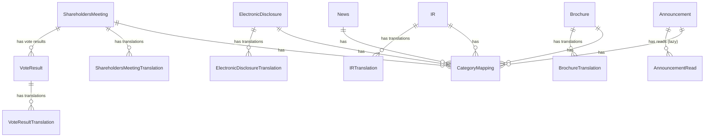

# Core Domain (핵심 비즈니스 도메인)

## 📋 개요

회사의 핵심 비즈니스 기능을 담당하는 도메인입니다.
투자자 관계(IR), 주주총회, 전자공시, 브로슈어, 뉴스, 공지사항 등 회사 운영의 핵심이 되는 엔티티를 관리합니다.

## 🎯 책임

- 투자자 관계 관리 (IR, 전자공시, 주주총회)
- 회사 정보 발행 (브로슈어, 뉴스)
- 내부 커뮤니케이션 (공지사항)

## 📦 포함된 엔티티

### 1. ShareholdersMeeting (주주총회)
- 주주총회 정보 및 의결 결과 관리
- **다국어 지원**: ✅ (ShareholdersMeetingTranslation)
- **관련 엔티티**: VoteResult, VoteResultTranslation

#### VoteResult (의결 결과)
- 주주총회 안건별 의결 결과
- **다국어 지원**: ✅ (VoteResultTranslation)

### 2. ElectronicDisclosure (전자공시)
- 법적 전자공시 문서 관리
- **다국어 지원**: ✅ (ElectronicDisclosureTranslation)

### 3. IR (투자자 정보)
- IR 자료 및 투자자 정보
- **다국어 지원**: ✅ (IRTranslation)

### 4. Brochure (브로슈어)
- 회사 소개 및 제품 브로슈어
- **다국어 지원**: ✅ (BrochureTranslation)

### 5. News (뉴스)
- 언론 보도 및 뉴스
- **다국어 지원**: ❌

### 6. Announcement (공지사항)
- 내부 공지사항 및 직원 응답 관리
- **다국어 지원**: ❌
- **관련 엔티티**: AnnouncementRead

#### AnnouncementRead (읽음 표시)
- Lazy Creation 패턴: 직원이 읽을 때만 레코드 생성

## 🔗 의존성

### 내부 의존성
- ✅ Common Domain (Language, Category, CategoryMapping)

### 외부 의존성
- Infrastructure Layer (Database, Config)

### 의존 받는 도메인
- ✅ Sub Domain

## 📊 Enum 타입

### ContentStatus (콘텐츠 상태)
```typescript
enum ContentStatus {
  DRAFT = 'draft',              // 초안
  APPROVED = 'approved',        // 승인됨
  UNDER_REVIEW = 'under_review', // 검토중
  REJECTED = 'rejected',        // 거부됨
  OPENED = 'opened'             // 공개됨
}
```

**사용 엔티티**: ShareholdersMeeting, ElectronicDisclosure, IR, Brochure, News, Announcement

### VoteResultType (의결 결과)
```typescript
enum VoteResultType {
  ACCEPTED = 'accepted',   // 가결
  REJECTED = 'rejected'    // 부결
}
```

## 📐 ERD 요약



## 🏗️ 디렉토리 구조

```
core/
├── entities/                                    # 엔티티 정의
│   ├── shareholders-meeting/
│   │   ├── shareholders-meeting.entity.ts
│   │   ├── shareholders-meeting-translation.entity.ts
│   │   ├── vote-result.entity.ts
│   │   └── vote-result-translation.entity.ts
│   ├── electronic-disclosure/
│   │   ├── electronic-disclosure.entity.ts
│   │   └── electronic-disclosure-translation.entity.ts
│   ├── ir/
│   │   ├── ir.entity.ts
│   │   └── ir-translation.entity.ts
│   ├── brochure/
│   │   ├── brochure.entity.ts
│   │   └── brochure-translation.entity.ts
│   ├── news/
│   │   └── news.entity.ts
│   └── announcement/
│       ├── announcement.entity.ts
│       └── announcement-read.entity.ts
├── enums/                                       # Enum 타입
│   ├── content-status.enum.ts
│   └── vote-result-type.enum.ts
├── index.ts                                    # 핵심 도메인 내보내기
└── README.md                                   # 이 파일
```

## ✅ 주요 특징

### 1. 다국어 지원
- **Translation 테이블**: 언어별 콘텐츠를 별도 테이블로 관리
- **Fallback 전략**: 요청 언어 → 한국어(기본) → 영어 → 첫 번째 사용 가능한 번역

### 2. 통합 카테고리 관리
- **CategoryMapping**: 엔티티와 카테고리 간 다대다 관계
- **유연한 구조**: 하나의 엔티티에 여러 카테고리 할당 가능

### 3. Lazy Creation 패턴 (Announcement)
- **AnnouncementRead**: 직원이 읽을 때만 레코드 생성
- **장점**: 확장성 대폭 향상, 배치 처리 불필요

### 4. 권한 관리 (Announcement)
- `permissionEmployeeIds`: 특정 직원 ID 목록
- `permissionRankIds`: 직급 ID 목록 (UUID)
- `permissionPositionIds`: 직책 ID 목록 (UUID)
- `permissionDepartmentIds`: 부서 ID 목록 (UUID)

### 5. 공통 필드
- **Soft Delete**: `deletedAt` 필드로 논리 삭제
- **Optimistic Locking**: `version` 필드로 동시성 제어
- **Audit Fields**: `createdAt`, `updatedAt`, `createdBy`, `updatedBy`
- **Order Field**: 정렬 순서 관리

## 📝 의존성 규칙

```
✅ Core Domain → Common Domain (O)
❌ Core Domain → Sub Domain (X)
✅ Core Domain ← Sub Domain (O)
```

### 예시
```typescript
// ✅ 올바른 의존성 (Core → Common)
import { Language } from '@domain/common';
import { Category } from '@domain/common';

// ❌ 잘못된 의존성 (Core → Sub)
import { Survey } from '@domain/sub'; // 불가능!

// ✅ Sub Domain에서 Core 참조는 가능
// (survey.entity.ts에서)
import { Announcement } from '@domain/core'; // 가능
```

---

**문서 생성일**: 2026년 1월 8일
